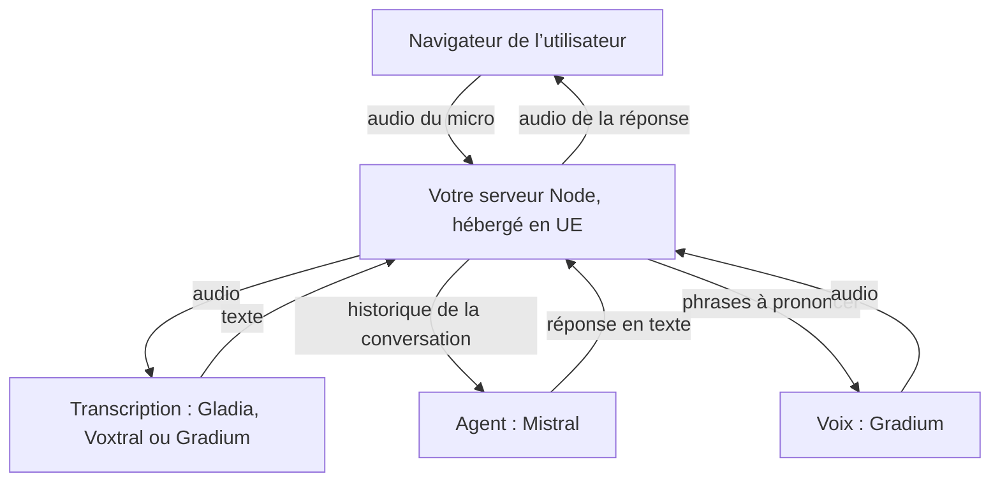
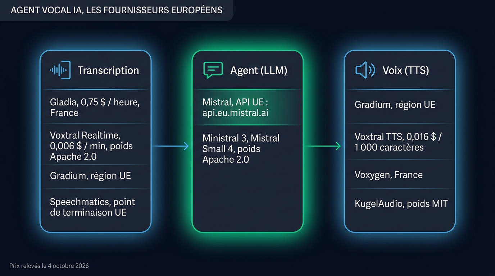
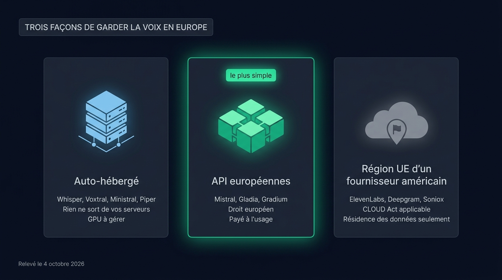

Un agent vocal IA souverain garde en Europe les trois flux d’une conversation : la voix de l’utilisateur, le texte qu’en tire la transcription et la réponse que prononce la synthèse vocale. En octobre 2026, trois entreprises françaises couvrent toute la chaîne. [Mistral](https://mistral.ai) écrit les réponses, [Gladia](https://www.gladia.io) ou Voxtral, le modèle de transcription de Mistral, transcrivent la voix de l’utilisateur, et [Gradium](https://gradium.ai) prononce les réponses. Vous pouvez aussi tout héberger chez vous avec des modèles open source. Cet article compare les deux voies, donne le code TypeScript de chacune et liste ce que la souveraineté ne règle pas toute seule.

Les prix et les faits cités ici ont été relevés le 4 octobre 2026 sur les sites des fournisseurs.

## Où passent les données d’un agent vocal

Un agent vocal IA est un programme qui tient une conversation à l’oral : il écoute, comprend, répond et parle, en temps réel. Dans sa forme la plus courante, il enchaîne trois modèles à chaque tour de parole :

- la transcription (speech to text, STT) reçoit l’audio du micro et rend du texte
- le modèle de langage (LLM) lit ce texte avec l’historique de la conversation et écrit la réponse
- la synthèse vocale (text to speech, TTS) transforme la réponse en audio

Chacun de ces trois fournisseurs voit donc une partie de la conversation. Le STT entend la voix, le LLM lit tout l’échange, et le TTS reçoit chaque phrase que l’agent prononce. Si l’un d’eux relève du droit américain, le [CLOUD Act](https://fr.wikipedia.org/wiki/CLOUD_Act) de 2018 permet aux autorités des États-Unis de lui demander ces données, même quand elles sont stockées en Europe. Une région européenne chez un fournisseur américain change l’endroit où tournent les serveurs, mais l’entreprise qui les exploite reste soumise à cette loi.

Le cadre juridique des transferts vers les États-Unis tient aujourd’hui, mais il reste fragile. Le Tribunal de l’Union européenne a validé le Data Privacy Framework le 3 septembre 2025 dans l’affaire Latombe. Le requérant a fait appel devant la Cour de justice, qui ne s’était toujours pas prononcée en juillet 2026. Ses deux prédécesseurs, Safe Harbor et le Privacy Shield, ont été annulés par cette même Cour.

La voix compte comme une donnée personnelle. Elle devient une donnée biométrique au sens du RGPD quand on s’en sert pour reconnaître une personne, ce que la CNIL rappelle dans son [livre blanc sur les assistants vocaux](https://www.cnil.fr/sites/default/files/atoms/files/cnil_livre-blanc-assistants-vocaux.pdf). Un agent qui transcrit et répond traite des données personnelles. Un agent qui identifie l’appelant à sa voix traite des données sensibles.



Votre propre serveur fait partie de la chaîne. Il reçoit tout l’audio, il envoie l’historique au LLM, et il stocke souvent les transcriptions. S’il tourne chez un cloud américain, la conversation repasse sous le droit américain malgré vos fournisseurs européens.

## Les fournisseurs européens, brique par brique

Le marché européen de la voix compte d’autres acteurs que Mistral, Gladia et Gradium. Nous détaillons ces trois-là parce que [Micdrop](/), la bibliothèque TypeScript open source de nos exemples de code, les intègre : vous pouvez lancer ces exemples tels quels. Les autres sont présentés plus brièvement, avec ce qui les distingue.

### La transcription : Gladia, Voxtral, Gradium et Speechmatics

Gladia est une entreprise parisienne fondée en 2022, rachetée par le groupe OVHcloud le 31 juillet 2026. Son API temps réel reconnaît plus de 100 langues, passe de l’une à l’autre au milieu d’un appel et accepte un vocabulaire personnalisé. Elle coûte 0,75 $ de l’heure sur l’offre Starter et descend à 0,25 $ de l’heure avec le volume. L’infrastructure est en France par défaut, avec une région américaine que vous choisissez appel par appel.

Lisez les conditions de l’offre Starter avant d’y faire passer des conversations réelles. Gladia peut y utiliser les données pour entraîner ses modèles, ce qu’elle exclut sur les offres Growth et Enterprise.

Voxtral Realtime est le modèle de transcription en streaming de Mistral, sorti en février 2026. Il coûte 0,006 $ la minute et reconnaît 13 langues, dont le français. Mistral publie ses poids sous licence Apache 2.0, ce qui permet de commencer sur l’API puis de faire tourner le même modèle sur vos propres GPU. Sur le benchmark FLEURS en français, Mistral mesure 6,42 % d’erreurs par mot avec 480 ms de délai, et 5,23 % avec 2,4 s. Ces chiffres sont ceux de Mistral lui-même, à confirmer par une évaluation indépendante.

Gradium, la startup parisienne issue du laboratoire Kyutai, propose aussi une transcription temps réel, sur sa région européenne par défaut. En lui confiant à la fois la transcription et la voix, vous signez un contrat de moins.

[Speechmatics](https://www.speechmatics.com), une entreprise britannique de Cambridge, propose un point de terminaison temps réel en Europe et un déploiement sur vos serveurs. Elle relève du droit britannique, hors de l’Union, donc vérifiez le cadre de transfert avec votre juriste.

Nous avons mesuré les [temps de réponse et les taux d’erreur de Voxtral et de Gladia](/blog/gpt-4o-transcribe-vs-gemini-vs-voxtral) face aux modèles d’OpenAI et de Google.

### Le LLM : Mistral, en API ou en poids ouverts

Mistral propose à la fois des modèles de pointe en API et leurs poids sous licence libre. Mistral Large 3 et la famille Ministral 3 (3, 8 et 14 milliards de paramètres) sont publiés sous Apache 2.0, comme Mistral Small 4, sorti en mars 2026. Pour un agent vocal, un modèle de taille moyenne suffit souvent, parce que le temps avant le premier mot compte davantage que la profondeur du raisonnement.

Avec Mistral, le lieu de l’inférence dépend du point de terminaison que vous appelez. Sur son point de terminaison global, `api.mistral.ai`, Mistral ne s’engage sur aucun lieu d’exécution. Le point de terminaison `api.eu.mistral.ai` garantit des centres de données dans l’Union ou l’AELE, pour un tarif majoré de 10 %. Mistral accorde aussi, sur demande, une option sans conservation des données (zero data retention) aux comptes en paiement à l’usage.

L’autre grand acteur européen des LLM, l’allemand Aleph Alpha, a abandonné ses propres modèles pour une plateforme d’entreprise, puis l’éditeur canadien Cohere a annoncé en avril 2026 qu’il le rachetait.

### La voix : Gradium, Voxtral TTS, Voxygen et KugelAudio

Gradium a levé 70 millions de dollars en décembre 2025, puis porté ce tour à 100 millions en juillet 2026. Son TTS propose des voix en français, anglais, allemand, espagnol et portugais, le clonage de voix et un streaming par WebSocket. Sa région européenne garde l’inférence et les données du compte dans l’Union. L’option sans conservation des données est disponible sur toutes les offres payantes depuis septembre 2026. Gradium a aussi ouvert un bureau dans la baie de San Francisco, donc vérifiez dans votre contrat quelle entité traite vos données.

Vous pouvez [régler la synthèse vocale française de Gradium](/blog/gradium-text-to-speech-souverain) et lui prévoir un secours en cas de panne.

Mistral vend aussi une synthèse vocale depuis mars 2026, Voxtral TTS, à 0,016 $ les 1 000 caractères et en neuf langues dont le français. Ses poids sont publiés sous licence CC BY-NC 4.0, qui interdit l’usage commercial. Pour un produit, passez donc par l’API.

[Voxygen](https://www.voxygen.fr) est une entreprise issue d’Orange Labs, créée en 2011 près de Lannion. Elle fait de la synthèse vocale française et propose un déploiement sur site. [KugelAudio](https://huggingface.co/kugelaudio/kugelaudio-0-open), une équipe allemande liée au Hasso-Plattner-Institut, publie un modèle TTS ouvert de 7 milliards de paramètres sous licence MIT, dans 24 langues européennes.

{/* IMAGE regen: api.py image, infographic, 1600x900. Scene: "A clean map of a voice pipeline, three tall rounded columns side by side on the dark background, connected left to right by thin luminous arrows. All labels in French, rendered exactly as written, with every accent. A heading strip at the top left reads: AGENT VOCAL IA, LES FOURNISSEURS EUROPÉENS. Column 1, glyph of a sound wave entering a box, title: Transcription. Inside, four rows: Gladia, 0,75 $ / heure, France / Voxtral Realtime, 0,006 $ / min, poids Apache 2.0 / Gradium, région UE / Speechmatics, point de terminaison UE. Column 2, glyph of a text bubble, title: Agent (LLM). Inside, two rows: Mistral, API UE : api.eu.mistral.ai / Ministral 3, Mistral Small 4, poids Apache 2.0. This middle column glows emerald and is the focal point. Column 3, glyph of a speaker, title: Voix (TTS). Inside, four rows: Gradium, région UE / Voxtral TTS, 0,016 $ / 1 000 caractères / Voxygen, France / KugelAudio, poids MIT. Columns 1 and 3 use sky blue accents, softer than column 2. Footer line at the bottom left in small text: Prix relevés le 4 octobre 2026. Flat vector geometric rendering, straight-on frontal view, even spacing, generous dark margins, all typography perfectly legible."
    Regenerate if a price, a licence or a provider changes. Last data sync: 2026-10-04. */}


## Le code d’une stack 100 % européenne en TypeScript

Micdrop est une bibliothèque TypeScript open source, sous licence MIT, pour les conversations vocales temps réel avec une IA. Elle gère le micro, la lecture audio, la détection de parole et les interruptions dans le navigateur. Sur votre serveur Node, elle orchestre le STT, l’agent et le TTS. Elle tourne chez vous avec vos propres clés d’API. Chaque fournisseur s’installe comme un package npm, donc vous ajoutez seulement ceux que vous utilisez.

```bash
npm install @micdrop/server @micdrop/web @micdrop/ai-sdk @ai-sdk/mistral @micdrop/gladia @micdrop/gradium
```

Le serveur ci-dessous garde chaque appel en Europe. L’intégration Mistral de Micdrop appelle le point de terminaison global de Mistral, alors l’agent passe ici par `@micdrop/ai-sdk`. Ce package accepte n’importe quel modèle du [Vercel AI SDK](https://ai-sdk.dev), dont un modèle Mistral configuré sur `api.eu.mistral.ai`.

```typescript
import { createMistral } from '@ai-sdk/mistral'
import { AiSdkAgent } from '@micdrop/ai-sdk'
import { GladiaSTT } from '@micdrop/gladia'
import { GradiumTTS } from '@micdrop/gradium'
import { MicdropServer } from '@micdrop/server'
import { WebSocketServer } from 'ws'

// Point de terminaison européen de Mistral, inférence garantie dans l'UE
const mistralEu = createMistral({
  apiKey: process.env.MISTRAL_API_KEY,
  baseURL: 'https://api.eu.mistral.ai/v1',
})

const wss = new WebSocketServer({ port: 8081 })

wss.on('connection', (socket) => {
  new MicdropServer(socket, {
    firstMessage: 'Bonjour, que puis-je faire pour vous ?',

    agent: new AiSdkAgent({
      model: mistralEu('mistral-small-latest'),
      systemPrompt:
        'Tu es un assistant vocal. Réponds en français, en phrases courtes.',
    }),

    // Gladia traite l'audio en France par défaut
    stt: new GladiaSTT({
      apiKey: process.env.GLADIA_API_KEY || '',
      settings: {
        language_config: { languages: ['fr'] },
        endpointing: 0.5, // Secondes de silence avant de clore une phrase
      },
    }),

    tts: new GradiumTTS({
      apiKey: process.env.GRADIUM_API_KEY || '',
      voiceId: process.env.GRADIUM_VOICE_ID || '',
      region: 'eu',
    }),
  })
})
```

Avec son réglage par défaut, Gladia clôt une phrase après 50 ms de silence. Dans nos essais, « je voudrais décaler mon rendez-vous de mardi à jeudi, dix-sept heures trente » arrivait coupée à la virgule. Avec une demi-seconde, la phrase arrive entière.

Dans le navigateur, une ligne démarre l’appel :

```typescript
import { Micdrop } from '@micdrop/web'

Micdrop.start({ url: 'wss://voix.votre-domaine.fr' })
```

Pour transcrire avec Voxtral, remplacez `GladiaSTT` par `MistralSTT`, l’une des [intégrations Mistral de Micdrop](/docs/ai-integration/sovereign-voice-ai).

### Un secours qui reste en Europe

Tout fournisseur tombe en panne un jour. Micdrop fournit `FallbackSTT`, `FallbackTTS` et un agent de secours, qui basculent sur un second fournisseur quand le premier échoue après ses tentatives. Pour garder la souveraineté ces jours-là, le secours doit lui aussi être européen.

```typescript
import { FallbackSTT } from '@micdrop/server'
import { GladiaSTT } from '@micdrop/gladia'
import { GradiumSTT } from '@micdrop/gradium'

const stt = new FallbackSTT({
  factories: [
    () =>
      new GladiaSTT({
        apiKey: process.env.GLADIA_API_KEY || '',
        maxRetry: 2, // Échoue vite pour basculer sur le secours
      }),
    () =>
      new GradiumSTT({
        apiKey: process.env.GRADIUM_API_KEY || '',
        language: 'fr',
        region: 'eu',
      }),
  ],
})
```

La voix a moins d’options européennes que la transcription. Pour prendre Voxtral TTS en secours de Gradium, écrivez une [intégration TTS personnalisée](/docs/ai-integration/custom-integrations/custom-tts), puisque Micdrop ne l’intègre pas encore. Pendant une bascule de transcription, Micdrop [garde l’audio reçu et le rejoue au fournisseur suivant](/docs/ai-integration/fallback-strategies/stt-fallback).

## La voie open source, auto-hébergée sur votre serveur

Les API européennes gardent les données en Europe, chez un tiers. Certains projets veulent qu’aucun audio ne quitte leurs propres machines, pour un hôpital, une administration ou une salle de réunion fermée. Les trois briques existent en open source, avec une contrepartie : la qualité en français et la latence dépendent alors de votre matériel.

### Un logiciel de reconnaissance vocale open source en français

Whisper, le modèle d’OpenAI publié sous licence MIT, tourne sur un simple processeur et fonctionne hors ligne une fois téléchargé. Ses versions génériques se trompent souvent en français. Sur nos cinq phrases de test, le modèle `small` faisait 22 % d’erreurs par mot. Une version de `whisper-small` affinée sur le corpus français Common Voice descend à 2 % sur ces mêmes phrases, en 1,1 s environ sur un ordinateur portable. Cinq phrases restent un petit échantillon, mais l’écart est net. La documentation sur la [transcription locale avec Whisper](/docs/ai-integration/local-models/speech-to-text) indique quel modèle choisir selon la langue de l’appel. Nous avons aussi mesuré Parakeet, Moonshine et Vosk pour la [transcription locale dans Node](/blog/local-speech-to-text-node).

Voxtral Realtime, avec ses poids sous Apache 2.0, fait la même transcription que l’API de Mistral, sur votre propre GPU. Cette famille de modèles est trop lourde pour un processeur. Sur le processeur de notre machine de test, Voxtral Mini 3B, le modèle de transcription précédent de Mistral, mettait environ 16,6 s par phrase, 35 fois plus que Whisper `base`. Kyutai publie `stt-1b-en_fr`, un modèle de transcription en streaming pour l’anglais et le français, sous licence CC-BY 4.0. Il tourne en Python ou via le serveur Rust de Kyutai, auquel votre serveur Node parle par WebSocket.

### Un agent conversationnel open source

Ollama sert un modèle ouvert sur votre machine avec le protocole d’OpenAI, ce qui suffit à `@micdrop/ai-sdk`. Pour un [LLM local branché sur Micdrop](/docs/ai-integration/local-models/agent), nous recommandons Qwen3 4B Instruct, qui parle français, tient en 2,5 Go et écrit le premier mot en 145 ms environ sur la machine de test. Ministral 3, publié en Apache 2.0 depuis décembre 2025, est l’alternative française à essayer, que nous n’avons pas encore mesurée.

### Une voix française en local

Piper fait parler un serveur sans GPU, avec une voix française comme `fr_FR-siwis-medium`, un petit modèle de quelques dizaines de mégaoctets. Qwen3-TTS, le modèle ouvert d’Alibaba sous Apache 2.0, parle français avec une voix plus naturelle et [s’intègre aussi à Micdrop](/docs/ai-integration/provided-integrations/qwen-tts), mais il lui faut un GPU. Kyutai TTS, qui parle anglais et français, et le modèle ouvert de KugelAudio demandent eux aussi un GPU et un environnement Python. En local, Voxtral TTS sonne mieux que toutes les autres voix que nous avons essayées, mais sur notre machine de test il met plus de temps à générer une phrase qu’à la prononcer. Sa licence interdit en plus l’usage commercial.

Le serveur entièrement local tient en quelques lignes :

```typescript
import { createOpenAI } from '@ai-sdk/openai'
import { AiSdkAgent } from '@micdrop/ai-sdk'
import { PiperTTS } from '@micdrop/piper'
import { MicdropServer } from '@micdrop/server'
import { WhisperSTT } from '@micdrop/whisper'

// Ollama sert le protocole OpenAI sur /v1
const ollama = createOpenAI({
  baseURL: 'http://localhost:11434/v1',
  apiKey: 'ollama', // Inutilisée, le SDK en exige une
})

new MicdropServer(socket, {
  agent: new AiSdkAgent({
    model: ollama.chat('qwen3:4b-instruct'),
    systemPrompt: 'Tu es un assistant vocal. Réponds en français.',
    providerOptions: { openai: { reasoningEffort: 'none' } },
  }),
  stt: new WhisperSTT({ model: 'french', language: 'fr' }),
  tts: new PiperTTS({ modelPath: './voices/fr_FR-siwis-medium.onnx' }),
})
```

Kyutai propose aussi Unmute, sous licence MIT, qui assemble sa transcription, un LLM de votre choix et sa synthèse vocale dans une application Python complète.

## Les frameworks open source pour orchestrer l’agent

Entre le micro, les trois modèles et le haut-parleur, il faut encore du code qui fait circuler l’audio et gère les interruptions. Quatre projets open source font ce travail et se déploient sur un serveur européen :

- [Pipecat](https://github.com/pipecat-ai/pipecat), le framework Python de Daily sous licence BSD, avec un très grand choix de fournisseurs et la téléphonie
- [LiveKit Agents](https://github.com/livekit/agents), sous Apache 2.0, en Python et en Node, adossé au serveur WebRTC de LiveKit, que l’on auto-héberge
- [Dograh](https://github.com/dograh-hq/dograh), une plateforme auto-hébergeable sous licence BSD, avec un éditeur visuel de scénarios et la téléphonie, construite sur Pipecat
- Micdrop, en TypeScript de bout en bout, pour une conversation vocale dans une application web

Nous avons comparé ces quatre projets et neuf autres [frameworks d’agents vocaux open source](/blog/open-source-voice-agent-frameworks) sur la licence, le langage et le transport.

Micdrop vous épargne l’écriture du client et du serveur temps réel, c’est-à-dire la capture du micro, la détection de parole, la coupure de la voix quand l’utilisateur reprend la parole, la reprise d’une conversation après une coupure réseau et la bascule entre fournisseurs. Une plateforme hébergée comme Vapi fait ce travail contre des frais de plateforme de 0,05 $ la minute (tarif d’août 2026), en plus des factures des modèles, et fait tourner l’agent sur ses propres serveurs. Avec Micdrop, en revanche, l’hébergement, le tableau de bord et l’historique des appels restent à votre charge. Des produits comme [Raconte](https://raconte.ai), construit par le mainteneur de Micdrop, et [Cibli](https://cibli.fr) le font tourner en production.

## Trois façons de garder la voix en Europe

| Critère | API européennes | Modèles auto-hébergés | Fournisseur américain avec région UE |
|---|---|---|---|
| Où tournent les modèles | Chez Mistral, Gladia, Gradium, en Europe | Sur vos serveurs | Dans un centre de données européen du fournisseur |
| Droit applicable au fournisseur | Droit européen | Le vôtre | Droit américain, CLOUD Act compris |
| Qualité en français | Meilleure disponible | Correcte avec un modèle affiné | Meilleure disponible |
| Matériel à gérer | Votre serveur Node | Serveur Node, plus GPU pour Voxtral ou un gros LLM | Votre serveur Node |
| Coût | Par minute, par caractère ou par jeton | Le prix de vos machines | Par minute, souvent sur une offre Enterprise |
| Exemples | Gladia, Voxtral, Mistral, Gradium | Whisper, Voxtral, Ministral, Piper | ElevenLabs (Enterprise), Deepgram, Soniox |

La région européenne d’un fournisseur américain fixe l’endroit où les données sont traitées, mais l’entreprise qui les traite reste américaine. ElevenLabs réserve sa résidence européenne à l’offre Enterprise. Deepgram ouvre un point de terminaison européen sans surcoût depuis décembre 2025. Soniox, une entreprise californienne, propose elle aussi une région européenne. Les trois restent soumis au CLOUD Act.

Pour la plupart des produits, les API européennes donnent le meilleur rapport entre qualité et effort. L’auto-hébergement se justifie quand aucun audio ne doit sortir de votre réseau, ou quand le volume rend vos propres GPU moins chers que la facture à la minute.

{/* IMAGE regen: api.py image, infographic, 1600x900. Scene: "Three side by side vertical cards on the dark background, each one a route to keep a voice agent in Europe. All labels in French, rendered exactly as written, with every accent. A heading strip at the top left reads: TROIS FAÇONS DE GARDER LA VOIX EN EUROPE. Card 1, glyph of three connected cloud blocks, title: API européennes, three short lines under it: Mistral, Gladia, Gradium / Droit européen / Payé à l’usage. This card glows emerald and is the focal point, with a small emerald badge at its top reading: le plus simple. Card 2, glyph of a server rack, title: Auto-hébergé, three short lines: Whisper, Voxtral, Ministral, Piper / Rien ne sort de vos serveurs / GPU à gérer. Sky blue accents. Card 3, glyph of a cloud with a small flag-free location pin, drawn dimmer than the other two, title: Région UE d’un fournisseur américain, three short lines: ElevenLabs, Deepgram, Soniox / CLOUD Act applicable / Résidence des données seulement. Muted grey accents. Footer line at the bottom left in small text: Relevé le 4 octobre 2026. Flat vector geometric rendering, straight-on frontal view, even spacing, generous dark margins, all typography perfectly legible."
    Regenerate if a provider changes its hosting or its legal status. Last data sync: 2026-10-04. */}


## Les points qui restent à votre charge

Des fournisseurs européens rendent une architecture souveraine possible, mais la conformité dépend de votre déploiement. Ces quatre points vous reviennent :

- Hébergez votre serveur chez un acteur européen comme OVHcloud, Scaleway ou 3DS Outscale. Un service public qui traite des données sensibles vise souvent une offre qualifiée SecNumCloud par l’Agence nationale de la sécurité des systèmes d’information (ANSSI), comme celles d’OVHcloud, d’Outscale ou de S3NS.
- Pour des données de santé, passez par un hébergeur certifié HDS (hébergeur de données de santé), obligatoire dès que vous les hébergez pour le compte d’un tiers. L’exigence vaut pour votre serveur comme pour les sous-traitants qui reçoivent l’audio.
- Signez un accord de sous-traitance (DPA) avec chaque fournisseur, demandez la liste de ses propres sous-traitants et activez l’option sans conservation des données quand elle existe.
- Fixez une durée de conservation pour ce que vous stockez. Les transcriptions et les enregistrements que garde votre application sont souvent plus sensibles que ce qui transite chez les fournisseurs.

## Questions fréquentes

<FaqList>
  <FaqItem question="Qu’est-ce qu’un agent vocal IA ?">
    Un agent vocal IA est un programme qui tient une conversation à l’oral en temps réel. Il
    transcrit la voix de l’utilisateur, fait écrire une réponse par un modèle de langage, puis la
    prononce avec une synthèse vocale. Les modèles speech to speech, comme l’API Realtime
    d’OpenAI, font les trois étapes dans un seul modèle.
  </FaqItem>
  <FaqItem question="Voxtral est-il open source ?">
    Mistral publie les poids de Voxtral Realtime, son modèle de transcription en streaming, sous
    licence Apache 2.0, qui autorise l’usage commercial. Les poids de Voxtral TTS, sa synthèse
    vocale, sont sous licence CC BY-NC 4.0, qui l’interdit. Les deux restent disponibles par l’API
    de Mistral.
  </FaqItem>
  <FaqItem question="Quel logiciel de reconnaissance vocale open source choisir en français ?">
    Whisper, sous licence MIT, est le plus simple à installer. Prenez une version affinée sur le
    français, qui fait nettement moins d’erreurs que les versions génériques. Voxtral Realtime, sous
    Apache 2.0, transcrit en streaming pendant que l’utilisateur parle, mais il demande un GPU. Kyutai STT
    couvre le français et l’anglais en streaming, sous licence CC-BY 4.0.
  </FaqItem>
  <FaqItem question="Un LLM souverain, c’est quoi ?">
    Un LLM souverain est un modèle de langage exploité par une entreprise qui relève du droit
    européen, ou dont vous faites tourner les poids sur vos propres serveurs. Mistral remplit les
    deux conditions. Sur son API, choisissez le point de terminaison api.eu.mistral.ai pour que
    l’inférence reste dans l’Union.
  </FaqItem>
  <FaqItem question="Combien coûte un agent vocal IA européen ?">
    Chaque brique est facturée séparément. En octobre 2026, la transcription coûte 0,006 $ la
    minute avec Voxtral Realtime ou 0,75 $ de l’heure avec Gladia sur l’offre Starter. Voxtral TTS
    coûte 0,016 $ les 1 000 caractères. Gradium vend des crédits mensuels à partir de 13 $. Le LLM
    se paie au jeton, avec 10 % de plus sur le point de terminaison européen de Mistral. Micdrop est
    gratuit, sous licence MIT.
  </FaqItem>
</FaqList>

## Monter votre premier agent vocal souverain

Mistral, Gladia et Gradium couvrent les trois briques d’un agent vocal IA avec des entreprises françaises. Whisper, Voxtral, un modèle ouvert et Piper font la même chose sur vos propres machines. Avec les API, choisissez la région de chaque fournisseur et un secours européen. Dans les deux cas, hébergez votre serveur chez un acteur européen. Pour brancher cette stack dans votre application web, suivez la [mise en place d’une IA vocale souveraine avec Micdrop](/docs/ai-integration/sovereign-voice-ai), ou [lancez un premier appel vocal en cinq minutes](/docs/getting-started) avant de remplacer les fournisseurs un par un.
