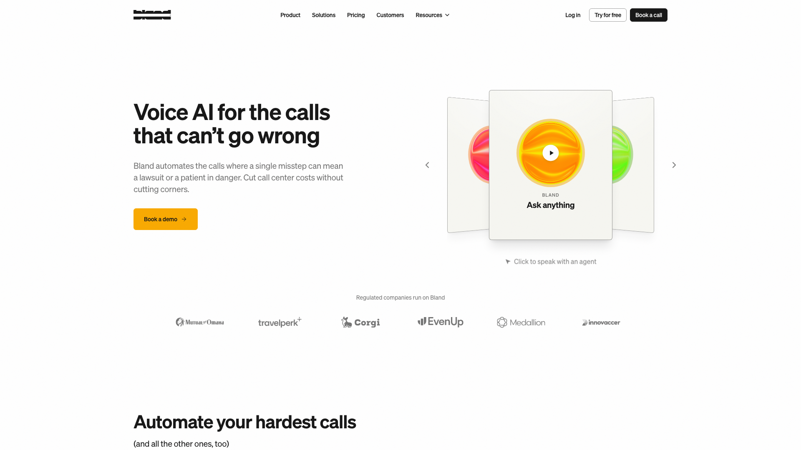
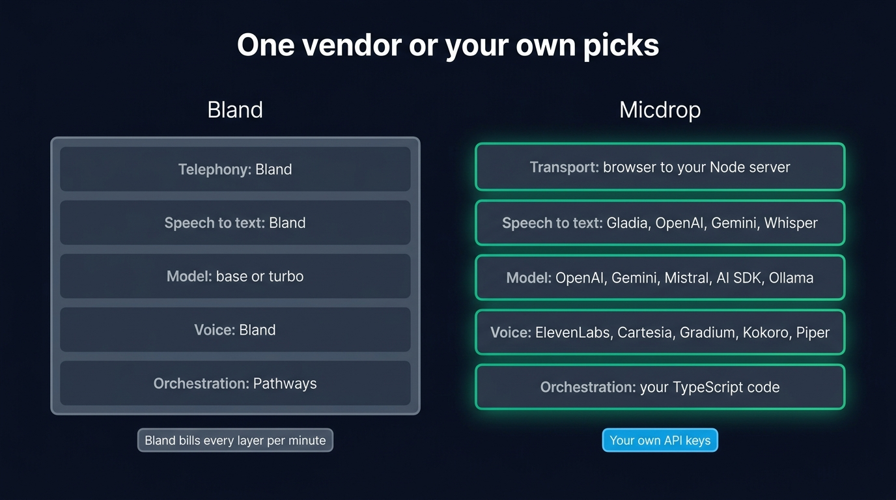
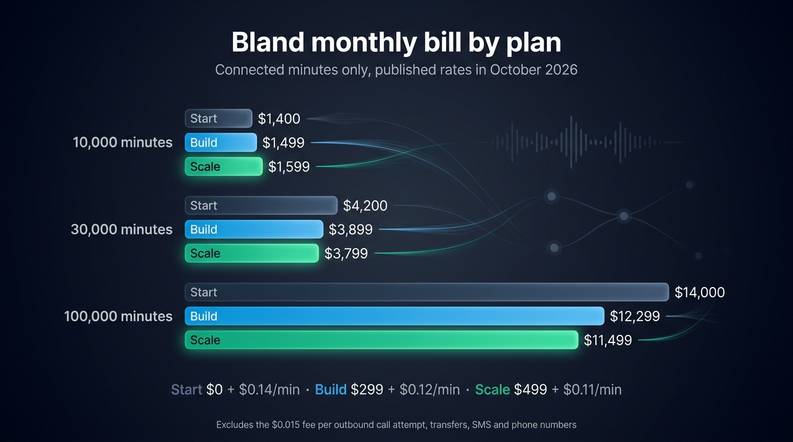

Teams look for a Bland AI alternative when they want to choose the models behind their voice agent. [Bland](https://www.bland.ai) runs every layer itself, its own speech-to-text, its own language model, its own voice and its own telephony, and bills the whole call at $0.11 to $0.14 a minute. The bundle suits a regulated call center well. A team adding a voice mode to a web application usually wants the opposite: its own OpenAI or Gemini key, the ElevenLabs voice its designers picked, a tool that reads its own database, and a bill that follows usage.

[Micdrop](/) is an open source TypeScript library for real-time voice conversations with AI. It leaves those choices to you. `@micdrop/web` runs in the browser, `@micdrop/server` runs in your Node process, and the server calls the speech-to-text, model and voice providers you configure, on your own keys. Bland is the right choice when your product answers phone calls at volume. If voice is a screen in an app you already deploy, Micdrop lets you assemble the stack yourself.



## What Bland does well

Bland sells voice AI "for the calls that can't go wrong" to regulated companies: insurers, lenders, healthcare. Mutual of Omaha and TravelPerk sit among the logos on its homepage. The Idaho Housing and Finance Association reports saving $750,000 a year by replacing its phone menu with a Bland agent. The company came out of Y Combinator and had raised $65 million by its Series B in February 2025.

Owning the whole stack is a real strength for those buyers. No outside AI provider processes the call, so the data processing agreement names one company. Enterprise customers can run Bland in their own cloud or on premises, pin release versions and roll out changes gradually. Its documentation lists SOC 2 Type II, HIPAA, PCI DSS and GDPR, to which the homepage adds FedRAMP and ISO 27001.

The product goes far beyond a voice loop. Conversational Pathways is a node-based flow builder with regression tests and model-graded evaluations. Agents remember callers across calls and text messages, run batch campaigns from a CSV, transfer to a human, and answer by SMS, RCS or iMessage with the same logic. A forward deployed engineering team builds each enterprise customer's first agent with them. An assistant called Norm also drafts agents from a description.

A library leaves all of that to you. Before choosing, list the parts your product needs and check how many of them a library covers.

## Why teams look for a Bland AI alternative

### You run on Bland's models, in two sizes

The `model` setting of a Bland agent takes two values, `base` and `turbo`. Bland names no underlying model. Its public API offers no way to bring your own model or your own provider key. The faster option comes with limits: `turbo` drops transfers, phone menu navigation and custom tools.

For a phone agent reading a script, that rarely matters. For a product team, it means the model is the one decision you cannot make. You stay on Bland's model when a newer frontier model ships, when you would like the reasoning-heavy turns on a larger model and the small talk on a cheaper one, and when your company already has an agreement with another model vendor. The same goes for the voice. Bland sells its own speech engine to other platforms and clones voices well. Every Bland agent speaks with that engine.

### The price per minute now depends on your plan

Until December 5, 2025, Bland charged a flat $0.09 a minute. It now bills by plan: $0.14 a minute on the free Start plan, $0.12 on Build at $299 a month, and $0.11 on Scale at $499 a month. Since June 2025, every outbound call attempt also costs $0.015, answered or not. A transfer adds $0.03 to $0.05 a minute on a Bland number. The rate covers speech, the model and telephony, so the bill is easy to read.

The same bundle makes the bill hard to lower. A cheaper voice provider or a smaller model changes nothing, because the bill has no line item to swap. Bland sets the minute rate, which is the only lever left.

### The entry plan caps calls per day

Start allows 10 concurrent calls and 100 calls a day. Build raises that to 50 concurrent calls and 2,000 a day, Scale to 100 concurrent calls and 5,000 a day. For an outbound campaign you plan the volume, so you pick the plan. For a voice feature in a product, your users decide when they talk, so a successful launch on the free plan stops answering at the hundred and first call of the day.

### Your custom logic is an HTTP request Bland sends

When the agent needs your data, Bland calls you. A custom tool is an endpoint, a method, headers and a JSON body with variables that Bland fills during the call, plus a sentence the agent says while it waits. Webhook nodes do the same inside a pathway. Since April 2026, a code node also runs short JavaScript in a sandbox on Bland's side.

That covers a lot of cases, but it keeps your logic outside your application. Every lookup crosses the internet twice, the endpoint has to be public and authenticated with secrets stored on Bland, and the agent knows about your user only what you pass in the call's variables.

### In the browser, the audio goes to Bland

Bland reaches the web two ways. A widget loads from Bland's domain and costs $0.01 per agent message. The Web Agent SDK, `@blandsdk/client` with a `useWebchat` React hook, has your server mint a single-use token, then the browser connects straight to Bland. Your server steps out of the conversation once the token is issued, so transcripts come back through webhooks or the API.

## How Micdrop gives you the choice back

### One TypeScript codebase from the microphone to the model

`@micdrop/web` handles the microphone, the speaker, voice activity detection and the WebSocket in the browser. `@micdrop/react` adds hooks such as `useMicdropState`. `@micdrop/react-native` runs the same call on a phone. `@micdrop/server` runs the conversation in your Node process. The packages share their types, so the message the server sends is the one the client expects, checked when you build rather than during a call.

The WebSocket arrives at a server you already run, inside your authentication. The client sends parameters when it connects. [`waitForParams`](/docs/server/auth-and-parameters) validates them before the conversation starts, so the user's session is loaded where every other request loads it. Most open source voice frameworks are written in Python. A TypeScript team that picks one, [Pipecat for instance](/blog/alternative-to-pipecat), ends up running voice as a second service next to its Node backend.

### You pick every provider, and change one in a constructor

Micdrop ships [integrations](/docs/ai-integration) for OpenAI, Google Gemini, Mistral, ElevenLabs, Cartesia, Gladia, Gradium and the Vercel AI SDK. The model, the transcription and the voice are three separate objects, so each one comes from the provider that suits it:

```typescript
import { MicdropServer } from '@micdrop/server'
import { GeminiAgent } from '@micdrop/gemini'
import { GladiaSTT } from '@micdrop/gladia'
import { ElevenLabsTTS } from '@micdrop/elevenlabs'

new MicdropServer(socket, {
  firstMessage: 'Hi! What can I help you with?',
  agent: new GeminiAgent({
    apiKey: process.env.GEMINI_API_KEY || '',
    systemPrompt: 'You are the support assistant of our app.',
  }),
  stt: new GladiaSTT({ apiKey: process.env.GLADIA_API_KEY || '' }),
  tts: new ElevenLabsTTS({
    apiKey: process.env.ELEVENLABS_API_KEY || '',
    voiceId: process.env.ELEVENLABS_VOICE_ID || '',
  }),
})
```

To move to OpenAI's model, replace `GeminiAgent` with `OpenaiAgent`. The browser code stays the same. The AI SDK integration gives access to every model the Vercel AI SDK supports, Anthropic included. A call can also run on a [speech-to-speech model](/docs/server/realtime), OpenAI Realtime or Gemini Live, passed as one `realtime` option in place of the three providers.

Each layer can have a second provider too. `FallbackTTS` and its counterparts for [speech-to-text](/docs/ai-integration/fallback-strategies/stt-fallback) and the agent move to the next provider when the first one stops answering, so the user hears a short pause instead of a dropped call. When Micdrop lacks a provider, write a class for it: `Agent`, `STT` and `TTS` are abstract classes you can [extend with a custom integration](/docs/ai-integration/custom-integrations/custom-agent).

### You pay each provider directly, on your own keys

Micdrop is MIT licensed and installs from npm in one command. Your server capacity sets the only limit on calls. Your audio goes from your server to the providers you configured, each of which bills you for what it did: the model by the token, the voice by the character, the transcription by the second of audio.

You can lower each line of the bill separately: a cheaper voice lowers the voice line, a smaller model on simple turns lowers the model line, and silence costs nothing at the model. A provider that raises its price can be replaced in one constructor. On ElevenLabs, for instance, the voice costs about [$0.04 per minute of agent speech](/blog/elevenlabs-api-pricing-voice-agent) on its fastest model.

### Keep the call on your own machines

Bland's strongest argument is that no third-party AI touches a call. Micdrop reaches the same result on hardware you control, with [local models](/docs/ai-integration/local-models): Whisper for the transcription, Kokoro, Piper, Pocket TTS or Qwen3-TTS for the voice, and any model served by Ollama, LM Studio or llama.cpp for the agent.

```typescript
import { createOpenAI } from '@ai-sdk/openai'
import { AiSdkAgent } from '@micdrop/ai-sdk'
import { KokoroTTS } from '@micdrop/kokoro'
import { MicdropServer } from '@micdrop/server'
import { WhisperSTT } from '@micdrop/whisper'

const ollama = createOpenAI({
  baseURL: 'http://localhost:11434/v1',
  apiKey: 'ollama',
})

new MicdropServer(socket, {
  agent: new AiSdkAgent({
    model: ollama.chat('qwen3:4b-instruct'),
    systemPrompt: 'You are a helpful voice assistant.',
  }),
  stt: new WhisperSTT({ model: 'base', language: 'en' }),
  tts: new KokoroTTS({ voice: 'britishFemale' }),
})
```

A European stack is the middle ground between US providers and your own machines. Mistral for the model, Gladia for the transcription and Gradium for the voice keep the conversation inside the EU, and you can [set up that sovereign stack](/docs/ai-integration/sovereign-voice-ai) by swapping the three providers. Micdrop makes these architectures possible, while the compliance of your deployment rests with you and your providers.

{/* IMAGE regen: api.py image, infographic, 1600x900. Scene: "Title at the top in a modern clean bold sans-serif: \"One vendor or your own picks\" Two vertical columns side by side, each a stack of five horizontal layer cards, same row order in both columns. Left column header: \"Bland\". All five cards are fused into one solid dark slate block with a single muted grey border, each card reading: \"Telephony: Bland\" \"Speech to text: Bland\" \"Model: base or turbo\" \"Voice: Bland\" \"Orchestration: Pathways\" Right column header: \"Micdrop\". Five separate cards with small gaps between them, each with an emerald border, reading: \"Transport: browser to your Node server\" \"Speech to text: Gladia, OpenAI, Gemini, Whisper\" \"Model: OpenAI, Gemini, Mistral, AI SDK, Ollama\" \"Voice: ElevenLabs, Cartesia, Gradium, Kokoro, Piper\" \"Orchestration: your TypeScript code\" Under the right column, a small sky blue tag: \"Your own API keys\". Under the left column, a small grey tag: \"Bland bills every layer per minute\". Wide 16:9 layout, flat vector style, generous spacing."
    Regenerate if Micdrop adds or drops a provider integration. Last data sync: 2026-10-09. */}


### Tools are functions next to your database

A Micdrop [tool](/docs/server/tools) is a function with a Zod schema, registered on the agent and executed in your Node process:

```typescript
import { z } from 'zod'

agent.addTool({
  name: 'get_order_status',
  description: 'Get the status of one of the user’s orders',
  inputSchema: z.object({ orderId: z.string() }),
  execute: async ({ orderId }) => {
    const order = await db.order.findFirst({
      where: { id: orderId, userId: session.userId },
    })
    return order ? { status: order.status } : { error: 'Order not found' }
  },
})
```

The query uses the session you loaded when the call started, so the agent can only read that user's orders, with no public endpoint and no secret stored elsewhere. Tool calls also reach the browser as entries in the conversation, so you can show what the assistant is doing or ask the user to confirm it.

### Turn detection, noise filtering and resume come built in

[Voice activity detection](/docs/client/vad) runs in the browser, so audio travels only while someone speaks. [Semantic turn detection](/docs/server/semantic-turn-detection) checks whether the sentence is finished before the assistant answers, [noise filtering](/docs/server/noise-filtering) drops the coughs and the "uh" before they reach the model, and [conversation resume](/docs/server/resume-conversation) restores the agent after a dropped connection. To keep the transcript, listen to one event and [save each message](/docs/server/save-messages) in your own tables.

Products already run on Micdrop. [Raconte.ai](https://raconte.ai), built by Micdrop's maintainer, conducts voice interviews. [Cibli](https://cibli.fr), a recruitment platform where candidates answer out loud, comes from a separate team. Both ship the browser and server packages together.

## Bland AI vs Micdrop, side by side

Bland published these prices and limits in October 2026. Check its pricing page before you set a budget.

| | Bland | Micdrop |
|---|---|---|
| **What it is** | Hosted voice AI platform, closed source | MIT library on npm |
| **Where the conversation runs** | Bland's infrastructure, or your cloud on Enterprise | Your Node process |
| **Speech to text, model, voice** | Bland's own, model set to `base` or `turbo` | Any integrated provider, a local model or your own class |
| **Your own provider keys** | Not offered on the public API | Required, every provider bills you directly |
| **Price** | $0.11 to $0.14 a minute, plus $0.015 per outbound attempt | Provider usage, nothing on top |
| **Caps** | 10 concurrent and 100 calls a day on Start, up to 100 and 5,000 on Scale | Your server capacity |
| **Custom logic** | HTTP tools, webhooks, sandboxed JavaScript nodes | TypeScript functions in your process |
| **Agent authoring** | Pathways flow builder, prompts, Norm assistant | Code in your repository |
| **Browser** | Widget at $0.01 per message, or `@blandsdk/client` connecting to Bland | `@micdrop/web`, `@micdrop/react`, connecting to your server |
| **Phone numbers, SMS, batch calls** | Yes, with transfers and memory across channels | Not covered |
| **Compliance** | SOC 2 Type II, HIPAA, PCI DSS, GDPR per its docs | Set by your hosting and your providers |
| **Support** | Forward deployed engineers on Enterprise | GitHub issues, one maintainer |

Support matters as much as the price. Bland has a team that builds your first agent with you. Micdrop is a young project with one maintainer.

## What each option costs

Bland's Start plan costs nothing per month and opens with a small free credit, then bills $0.14 a minute. Build adds $299 a month for $0.12 a minute and Scale adds $499 for $0.11, so Build costs less than Start from about 15,000 minutes a month, and Scale costs less than Build from about 20,000. The public pricing page shows Start, Build and Enterprise, and Scale appears in the billing documentation. Phone numbers, SMS at $0.02 a message, transfers and the per-attempt fee come on top.

| Minutes a month | Start | Build | Scale |
|---|---|---|---|
| 10,000 | $1,400 | $1,499 | $1,599 |
| 30,000 | $4,200 | $3,899 | $3,799 |
| 100,000 | $14,000 | $12,299 | $11,499 |

{/* IMAGE regen: api.py image, infographic, 1600x900. Scene: "Title at the top in a modern clean bold sans-serif: \"Bland monthly bill by plan\" Subtitle: \"Connected minutes only, published rates in October 2026\" A grouped horizontal bar chart with three groups of minutes per month, each group with three bars (Start, Build, Scale). Start bars in muted slate grey, Build bars in sky blue, Scale bars in emerald. Each bar carries its exact label at its end: Group \"10,000 minutes\": Start $1,400 Build $1,499 Scale $1,599 Group \"30,000 minutes\": Start $4,200 Build $3,899 Scale $3,799 Group \"100,000 minutes\": Start $14,000 Build $12,299 Scale $11,499 Legend line under the chart: \"Start $0 + $0.14/min · Build $299 + $0.12/min · Scale $499 + $0.11/min\" Footnote at the bottom in small text: \"Excludes the $0.015 fee per outbound call attempt, transfers, SMS and phone numbers\" Wide 16:9 layout, generous spacing, bars proportional to their values."
    Regenerate if Bland changes its plan fees or minute rates. Last data sync: 2026-10-09. */}


Micdrop costs nothing to install. You pay the transcription, the model and the voice at each provider's list price, plus the server that already runs your app. The total depends on the stack you assemble, from a frontier model with a premium voice to local models whose only cost is the machine.

At a few hundred minutes a month, Bland's bill stays small, so the engineering time a pipeline of your own takes costs more than you would save. At tens of thousands of minutes, the bundled rate is worth comparing with your own provider prices, a comparison you can make only when you choose the providers.

## Who should choose which

**Choose Bland** when your product is phone calls. Inbound lines, outbound campaigns, transfers to an agent, SMS follow-ups and memory across channels are what it does. Rebuilding them would take a team. Choose it when a regulated buyer wants SOC 2 and a signed BAA now, when you would rather have Bland's engineers build the first agent, when people outside engineering edit the flows, or when you want one company accountable for every layer of the call.

**Choose Micdrop** when voice is a feature of a web or mobile app you already deploy. The signals are a TypeScript backend, an agent that needs the user's session and your database on every turn, a model or a voice you have already chosen, provider agreements you want to keep, or a requirement to run everything on your own machines.

If you are evaluating and have not built anything yet, start by asking whether the agent needs a phone number. An agent that must answer one points to a platform, where Bland's free plan is a quick way to test a script with real callers. An agent that lives in a browser tab points to a library, where starting early saves you a migration later. If you start on Bland and suspect you will leave, keep your prompts and your tool logic in your own repository, so that the move is mostly rewiring.

Some teams need neither. If you have settled on one model vendor and only need a voice loop, [a realtime API from that vendor](/blog/openai-realtime-api-vs-pipeline) has fewer moving parts. Micdrop can still run it behind its client when you want the microphone and turn-taking handled. If your backend is Python and you need telephony, look at Pipecat and LiveKit Agents, and compare them with the other [open source voice agent frameworks](/blog/open-source-voice-agent-frameworks).

## What adopting Micdrop involves

### Starting fresh

You can [get a first call working in about five minutes](/docs/getting-started): install the browser and server packages, give `MicdropServer` a model, a transcription and a voice, and open a WebSocket. The only accounts you create are with the providers.

Wiring it into a real application, with your authentication, your session and your interface around it, takes hours rather than days. What takes longer is what Bland provided and you now build: storing transcripts, a call history for your support team, analytics, and alerts when a provider degrades. You write those on top of the database and the logging you already run.

### Coming from Bland

No import tool exists, so you rebuild the agent by hand. Most of what you wrote on Bland is prompt text and business logic, which carries over.

A prompt-based agent moves into the `systemPrompt` of the agent class. A pathway takes more thought, since Micdrop has no node graph. Each node becomes either instructions in the prompt or a condition around the tools you expose. A long pathway often shrinks once its branches become plain `if` statements. Your Pathways regression tests become tests in your own suite, where `MockAgent` runs a conversation without calling a model.

Each custom tool becomes a function registered with `addTool`. The body you were serving behind a public endpoint moves into the function. The endpoint, its secrets and the variables you passed through the call go away. Webhook and code nodes follow the same path.

Bland's voices and clones stay on Bland, so you pick a new voice from ElevenLabs, Cartesia or Gradium, or clone one with consent on ElevenLabs or locally with Pocket TTS. In the browser, `@micdrop/web` replaces `@blandsdk/client`. `Micdrop.start({ url })` points at your own server instead of a token minted for Bland.

Anything answering a phone number stays on Bland. A product doing both keeps Bland for the calls and moves the in-app conversation. Put the new version behind a feature flag, and keep the Bland agent live until the traffic has moved.

## Frequently asked questions

<FaqList>
  <FaqItem question="Is there an open source alternative to Bland AI?">
    Yes, several. Dograh is the closest to the product itself: BSD 2-Clause, self-hosted with Docker, with a visual workflow builder, telephony and your own provider keys. Pipecat (BSD 2-Clause, Python), LiveKit Agents (Apache 2.0, Python and Node) and Bolna (MIT) are code-first frameworks that handle phone calls and leave the dashboard to you. Micdrop (MIT, TypeScript) covers a voice conversation between a browser and your own Node server. With any of them, you choose the models and you operate what Bland operated for you.
  </FaqItem>
  <FaqItem question="What are the best alternatives to Bland AI?">
    It depends on whether you want another hosted platform or code you run. Among hosted platforms, Vapi lets you use your own key for every provider and charges a $0.05 platform fee a minute, Retell AI has the deepest contact center integrations, and Synthflow sells enterprise contracts. These platforms differ a lot on [price per minute and data location](/blog/top-ai-voice-agent-platforms). Among self-hosted options, Pipecat and LiveKit Agents are the largest frameworks, Dograh is a complete platform you host, and Micdrop adds voice to a TypeScript web app.
  </FaqItem>
  <FaqItem question="Is Bland AI free?">
    Bland's Start plan has no monthly fee, but every minute costs $0.14 and each outbound call attempt $0.015, with a small free credit when you sign up. The plan allows 10 concurrent calls and 100 calls a day. Open source libraries such as Micdrop are free to install. You pay the speech, model and voice providers you choose.
  </FaqItem>
  <FaqItem question="How much does Bland AI cost?">
    In October 2026, Bland charges $0.14 a minute on Start with no monthly fee, $0.12 on Build at $299 a month and $0.11 on Scale at $499 a month, with speech, the model and telephony included. Each outbound call attempt adds $0.015, transfers add $0.03 to $0.05 a minute, and SMS cost $0.02 a message. Enterprise is a custom contract. Before December 5, 2025 the rate was a flat $0.09 a minute.
  </FaqItem>
  <FaqItem question="What LLM does Bland AI use?">
    Bland uses its own models and does not name the underlying model. An agent offers two settings, `base` and `turbo`. The faster `turbo` cannot transfer calls, navigate phone menus or call custom tools. Bland's public API offers no option to bring your own model or provider key. Frameworks such as Micdrop, Pipecat or LiveKit Agents let you pick any model, including one you run locally.
  </FaqItem>
  <FaqItem question="Is Bland AI any good?">
    For phone automation in regulated industries, yes. Bland is backed by Y Combinator, publishes customer results such as $750,000 a year saved by the Idaho Housing and Finance Association, and lists SOC 2 Type II, HIPAA and PCI DSS. Its G2 rating is high on a small number of reviews, with the learning curve of Pathways as the usual criticism. Measurements published by competing platforms put its response time between 700 and 1,500 ms in real calls, while Bland advertises under 400 ms. The main limit for developers is the lack of model choice.
  </FaqItem>
  <FaqItem question="Should I start a new project on Bland or on an open source framework?">
    Decide by the channel. If the agent answers or makes phone calls, Bland's free plan lets you test a script with real callers in a day. Once you want your own models, move to an open source framework with telephony. If the agent lives in a web or mobile app, starting on a library such as Micdrop keeps the conversation in your own server from the first version, which saves a migration later.
  </FaqItem>
  <FaqItem question="Does Micdrop support phone calls?">
    No. Micdrop connects a browser or a React Native app to your Node server over a WebSocket, with no SIP or phone network layer. For an agent that answers a phone number, use a platform such as Bland, Vapi or Retell AI, or a framework with telephony such as Pipecat or LiveKit Agents.
  </FaqItem>
</FaqList>

---

Bland and Micdrop serve different jobs. Bland runs the whole call on its own models, answers phone numbers, sends the SMS and builds the first agent with you, for one rate per minute. If your product is phone calls in a regulated industry, that bundle saves you a team.

[Micdrop](/) fits a voice mode inside a product you already run. You pick the transcription, the model and the voice, pay each provider on your own keys, and keep the conversation in your Node server next to the user's session. You can [have a first call running in five minutes](/docs/getting-started).
