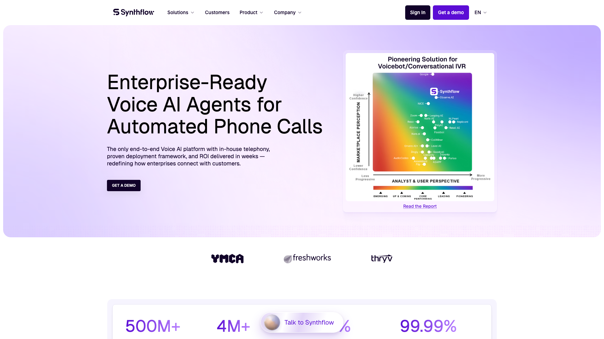
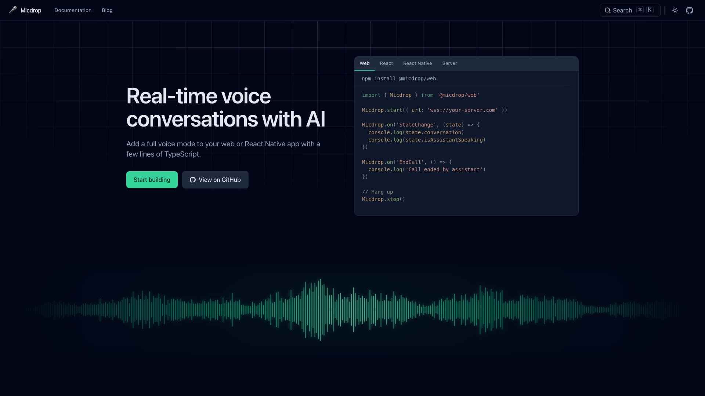
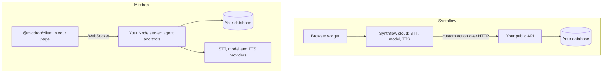

[Synthflow](https://synthflow.ai) used to be the voice agent platform you could try on a credit card. Today its pricing page lists a single plan, an enterprise contract starting at $30,000 a year, and the older Pro, Growth and Agency plans are closed to new subscriptions. Teams that want voice inside a web application and want to start this week need an alternative they can install, such as an open source library.

[Micdrop](/) is an open source TypeScript library for real-time voice conversations with AI. `@micdrop/client` handles the browser and `@micdrop/server` handles Node, both under the MIT licence, and together they run the speech-to-text, model and text-to-speech loop inside a server you already deploy. If your product makes phone calls at contact centre scale, Synthflow is built for you. If voice is a feature of a web app and your backend speaks TypeScript, start with Micdrop.



## What Synthflow does well

Synthflow is a Berlin company backed by Accel, which led its $20M Series A in June 2025. Its homepage claims more than 500 million calls handled and 99.99% uptime, with the YMCA, Freshworks and Thryv as named customers. It runs its own telephony, accepts your Twilio account or your SIP trunk, and connects to PBX and contact centre systems such as 3CX, 8x8, Aircall and Genesys.

The product is broad. You build an agent in the Flow Designer, a node graph with branches, call transfers, real-time booking and subflows, or as a single prompt in the Prompt Builder. A knowledge base takes PDFs, URLs and site crawls. More than 200 integrations cover Salesforce, HubSpot, Zendesk, Cal.com, GoHighLevel, Zapier and Make. The Test Center runs simulated calls before a release, the analytics dashboard keeps every call afterwards, and agencies get white-label workspaces with subaccounts and their own pricing. Synthflow lists SOC 2, HIPAA with a BAA, GDPR and ISO 27001, and new accounts choose a US or an EU region. A library offers none of these features, so check which of them your product actually needs before you compare anything else.

On Trustpilot, Synthflow scores 4.1 out of 5 over 215 reviews in October 2026, and the positive ones keep coming back to how easy the builder is.

## Why teams look for a Synthflow alternative

### The entry price is a $30,000 annual contract

Synthflow's pricing page says enterprise contracts start at $30,000 a year, scoped on call volume, concurrency, telephony setup, integrations, security needs and launch support. It lists no per-minute rate, no trial and no self-serve plan in October 2026. Before Synthflow moved to enterprise contracts, third-party reviews put pay-as-you-go usage at roughly $0.15 to $0.24 a minute, with five concurrent calls included and $20 a month for each extra one.

For a call centre replacing human agents, $30,000 a year is a modest line. For a product team that wants to find out whether its users will talk to a voice mode at all, it means a sales cycle and a budget approval before the first real conversation. A prototype that used to cost a few dollars of minutes now starts with a sales call.

### You build the agent in Synthflow's dashboard

Synthflow agents are built in its dashboard, as a Flow Designer graph or a Prompt Builder prompt, and you edit them through the API, a JSON import or Synthflow's MCP server. Your own code takes part in the call through custom actions, which Synthflow documents as HTTP requests the agent runs before or during a call, and through webhooks after it.

That suits a team where operations people own the script. For a developer team, it splits the agent across two places. The conversation logic sits in Synthflow's graph, the business logic sits behind public HTTP endpoints you have to host and secure, and every lookup during a call goes out to the platform and back to you. Your pull requests and tests cover the business logic only.

### In the browser, you get a widget or a protocol

Synthflow's web options are the embeddable voice widget and a WebSocket media integration. The widget drops Synthflow's interface into your page. The media integration has your backend request a session with your API key, after which the browser streams RTP audio in Opus or G.711. You write the microphone capture, encoding, decoding and playback yourself, since the docs offer no npm package for them.

So a voice mode that should look like the rest of your product either carries someone else's interface or starts with an audio pipeline you write yourself.

### You choose models from Synthflow's list

The model list covers OpenAI models plus Synthflow's own LLM, and you can bring your own OpenAI key. Transcription runs on Deepgram or Synthflow's speech-to-text, and voices come from providers such as ElevenLabs. Mistral for European hosting, Gemini for price and a model you fine-tuned all sit outside that list.

### Reviewers complain about support and billing

The one-star reviews on Trustpilot come back to slow support, dropped calls and billing. One reviewer writes that support "takes over 24 hours to respond", another that their bot was "suddenly just disconnecting calls", and a third says they kept being billed months after cancelling. Synthflow now scopes launch support into its enterprise contracts, which may answer some of this. When the conversation runs on your own server, you can at least open the logs yourself.

## How Micdrop handles voice in your own app



### You start with npm install

Micdrop is a set of npm packages under the MIT licence. All it takes is an API key from each provider you pick. Your server sends the audio straight to those providers, which each bill what they processed: the model in tokens, the voice in characters, transcription in audio duration. At ten times the traffic, you pay ten times the provider usage and nothing on top. You can [have a first voice call running in about five minutes](/docs/getting-started).

### Your agent is TypeScript in your repository

The agent is a class in your Node process, its prompt is a string in your code, and its [tools](/docs/server/tools) are functions with a Zod schema that run next to your database connection:

```typescript
import { z } from 'zod'
import { OpenaiAgent } from '@micdrop/openai'

const agent = new OpenaiAgent({
  apiKey: process.env.OPENAI_API_KEY || '',
  systemPrompt: `You book appointments for ${user.firstName}.`,
})

agent.addTool({
  name: 'list_free_slots',
  description: 'List the free appointment slots for a given day',
  inputSchema: z.object({
    date: z.string().describe('Day to check, as YYYY-MM-DD'),
  }),
  execute: async ({ date }) => db.slots.findFree(user.id, date),
})
```

That function replaces a Synthflow custom action. It runs inside your authenticated session, so it already knows who is calling and needs neither a public endpoint nor an API key to check. The branches of a flow graph become `if` statements and prompt instructions, reviewed in the same pull request as the rest of the feature and covered by the same tests.



### The browser side ships as a package

`@micdrop/client` captures the microphone, plays the assistant's audio, runs [voice activity detection in the browser](/docs/client/vad) and handles interruptions. With `@micdrop/react`, hooks such as `useMicdropState`, `useMicVolume` and `useSpeakerVolume` give your components the call state and live audio levels, so the voice mode uses your own design system. A React Native package covers mobile apps with the same server. Both sides are TypeScript and share their types, so a change in the protocol breaks the build before it can reach a live call.

### You pick every provider, and a backup

[Provider integrations](/docs/ai-integration) ship for OpenAI, Google Gemini, Mistral, ElevenLabs, Cartesia, Gladia, Gradium and the Vercel AI SDK, plus local engines such as Whisper and Kokoro. Moving from one to another means changing a constructor. A call can also run on a speech-to-speech model, OpenAI Realtime or Gemini Live, with the same browser code. `FallbackTTS` and its speech-to-text and agent counterparts switch to a second provider when the first one fails mid-call. Combining Mistral, Gladia and Gradium keeps the whole conversation in Europe. The compliance of that deployment is then up to you and those providers.

### Turn-taking is code you can read

[Semantic turn detection](/docs/server/semantic-turn-detection) asks a model whether the user finished their sentence instead of counting milliseconds of silence. [Noise filtering](/docs/server/noise-filtering) drops the "uh" before it triggers a model call, and [conversation resume](/docs/server/resume-conversation) restores the agent after a dropped connection. When a turn goes wrong, you set a breakpoint in your own process and replay it.

Products already run on Micdrop. [Raconte.ai](https://raconte.ai), built by Micdrop's maintainer, conducts voice interviews. [Cibli](https://cibli.fr), a recruitment platform where candidates answer out loud, is built by a separate team.

## Synthflow vs Micdrop, feature by feature

Synthflow's terms below date from October 2026. Check its pricing page before you plan a budget, since the offer changed this year.

| | Synthflow | Micdrop |
|---|---|---|
| **What it is** | Hosted enterprise voice AI platform | MIT library on npm |
| **Where the conversation runs** | Synthflow's cloud, US or EU region | Your Node server |
| **Entry price** | Enterprise contract from $30,000 a year | Free, plus your provider bills |
| **Agent authoring** | Flow Designer or Prompt Builder | TypeScript in your repository |
| **Custom logic** | HTTP custom actions and webhooks | Tool functions with Zod schemas |
| **Browser integration** | Voice widget or raw WebSocket RTP protocol | `@micdrop/client`, React and React Native packages |
| **Models and voices** | OpenAI models, Synthflow LLM, Deepgram, ElevenLabs | Any supported provider, or your own class |
| **Phone numbers, SIP, contact centres** | Yes, with its own telephony | Not covered |
| **Dashboard, call history, analytics** | Included | Events and hooks, you build the UI |
| **Testing** | Test Center with simulated calls | Your test suite |
| **Compliance** | SOC 2, HIPAA with BAA, GDPR, ISO 27001 | Depends on your hosting and providers |
| **Support** | Managed launch support on contract | GitHub issues, one maintainer |

Weigh support as heavily as price. Synthflow sells support with its contracts, while one person maintains Micdrop, a young project.

## What each option costs

With Synthflow, the bill is a negotiated annual contract from $30,000, sized on your call volume, concurrency, telephony and security needs. It covers the platform, the telephony and the launch support in one invoice.

With Micdrop, the library costs nothing. You pay transcription, the model and the voice at list price, directly to each provider, plus the share of your server that runs the calls. A voice feature with a few hundred conversations a month costs what those minutes cost at the providers you chose, and you can measure it on your first day of traffic.

A large contact centre usually comes out ahead on the contract. At hundreds of thousands of minutes, with phone numbers, compliance audits and an on-call rotation to staff, doing that work in house costs more engineering time than a year of Synthflow.

## Who should choose which

**Choose Synthflow** when your product is phone calls. Inbound support lines, outbound campaigns, transfers to human agents and integration with Genesys or 8x8 are its core. It also has the certifications a procurement team asks for. Choose it when the people editing the agent work in operations rather than in your codebase, when you need a vendor that provides an EU region and signs a BAA, or when you resell voice agents to clients through a white-label workspace.

**Choose Micdrop** when voice is a screen inside a web or mobile app you already run. It fits best when your backend is Node, when the agent reads your database on every turn, when the voice mode has to match your design, or when you want to ship a first version before anyone signs a contract.

If you are evaluating and have not built anything yet, start with Micdrop when the conversation happens in your app, because it is free to try and keeps your prompt and tools in your repository from day one. Start with a hosted platform when it happens on a phone line. Among those, [Vapi adds a published platform fee to the providers you pay with your own keys](/blog/alternative-to-vapi) and [Retell AI bills per minute with self-serve credits](/blog/alternative-to-retell-ai), so both let you test before a contract. If your backend is Python and you need telephony, look at Pipecat and LiveKit Agents among the [other open source voice agent frameworks](/blog/open-source-voice-agent-frameworks).

## What adopting Micdrop involves

### Starting fresh

Install `@micdrop/client` and `@micdrop/server`, give `MicdropServer` an agent, a speech-to-text provider and a voice, and open a WebSocket from the page. Wiring that into an existing application with your authentication and your UI takes hours rather than days.

Most of the extra time goes into what Synthflow included and you now write yourself: storing transcripts, a call history for whoever reviews conversations, and a dashboard with the metrics you care about. Micdrop emits an event for each message, so [saving messages to your database](/docs/server/save-messages) takes a listener and a table.

### Coming from Synthflow

You rebuild the agent by hand, though most of it carries over as text and logic.

- A Prompt Builder agent moves into the `systemPrompt` of the agent class almost unchanged.
- A Flow Designer graph becomes code. Each Conversation node turns into prompt instructions, each Branch node into a condition, and the result is usually shorter than the graph.
- Each custom action becomes a tool function. The HTTP call to your own API disappears, because the function can query your database directly.
- The post-call webhook becomes a listener on Micdrop's message events.
- The voice widget becomes your own component on top of `@micdrop/client`.
- Your ElevenLabs voice and your OpenAI prompts transfer as they are, with your own keys.

Phone numbers stay where they are. Micdrop covers the conversation in the browser, so a product doing both can keep a telephony platform for calls and move the in-app voice mode. Run the Synthflow widget and your Micdrop voice mode side by side behind a feature flag until the traffic has moved.

{/* IMAGE regen: api.py image, infographic, 1600x900. Scene: "A clean migration checklist titled \"Moving from Synthflow to Micdrop\" in a modern clean bold sans-serif. Six rows, each a pair of rounded cards joined by an emerald arrow pointing right: the left card is muted slate, the right card has an emerald outline. Rows, left card then right card: \"Prompt Builder agent\" to \"systemPrompt in your agent class\"; \"Flow Designer graph\" to \"Prompt instructions and if statements\"; \"Custom actions over HTTP\" to \"Tool functions with Zod schemas\"; \"Post-call webhook\" to \"Message events saved to your database\"; \"Voice widget\" to \"Your UI on @micdrop/client\"; \"Phone numbers\" to \"Keep them on a telephony platform\". The last right card uses a sky blue outline instead of emerald. Generous spacing, flat vector style, no icons with text inside." Last data sync: 2026-10-05. */}


## Frequently asked questions

<FaqList>
  <FaqItem question="Is there an open source alternative to Synthflow?">
    Yes, several. Dograh is the closest to the product itself: BSD 2-Clause, self-hosted with Docker, with a visual workflow builder, telephony and your own provider keys. Pipecat (BSD 2-Clause, Python), LiveKit Agents (Apache 2.0, Python and Node) and Bolna (MIT) are code-first frameworks that replace the orchestration and leave the dashboard to you. Micdrop (MIT, TypeScript) covers a voice conversation between a browser and your own Node server. With any of them, you run what Synthflow ran for you.
  </FaqItem>
  <FaqItem question="Is Synthflow free?">
    Synthflow charges every new customer through an enterprise contract, starting at $30,000 a year in October 2026. The older self-serve plans are closed to new subscriptions. The open source frameworks are free to install, and you pay your speech and model providers plus your servers.
  </FaqItem>
  <FaqItem question="How much does Synthflow cost?">
    Synthflow's enterprise contracts start at $30,000 a year in October 2026, priced on call volume, concurrency, telephony setup, integrations, security needs and launch support. It publishes no per-minute rate. Third-party reviews put its earlier pay-as-you-go usage at roughly $0.15 to $0.24 a minute, with extra concurrent calls at $20 a month each, but those plans are closed to new customers.
  </FaqItem>
  <FaqItem question="What is Synthflow used for?">
    Synthflow builds AI phone agents for inbound and outbound calls: customer support lines, appointment booking, lead qualification and call routing. Businesses configure them in a no-code builder and connect them to their phone system, their CRM and their calendar.
  </FaqItem>
  <FaqItem question="What is the difference between Synthflow and Vapi?">
    Synthflow is a no-code platform sold on enterprise contracts, where agents are built in a flow designer by operations or business teams. Vapi is an API-first platform for developers, billed per minute with a $0.05 platform fee on top of the providers you connect with your own keys. Both run the call on their own infrastructure and handle phone numbers. Micdrop differs from both, since it is a library that runs the conversation in your own server.
  </FaqItem>
  <FaqItem question="Should I start a new voice project on Synthflow or on an open source library?">
    Start on Synthflow when the conversation happens on a phone line and you have budget for an annual contract, since it gives you telephony, a dashboard and compliance on day one. Start on an open source library when the conversation is a voice mode inside your web app. You can try it this week for the price of your provider minutes, and the prompt and tools stay in your repository if the feature grows.
  </FaqItem>
  <FaqItem question="Does Micdrop support phone calls?">
    Micdrop handles voice in browsers and React Native apps only, connected to your Node server over a WebSocket, without a SIP or phone number layer. For an agent that answers a phone number, use a hosted platform like Synthflow or Vapi, or a framework with telephony support like Pipecat or LiveKit Agents.
  </FaqItem>
</FaqList>

---

Synthflow and Micdrop solve different problems. Synthflow runs phone agents for enterprises, with its own telephony, a no-code builder, analytics and the certifications a procurement team expects, and it charges an annual contract for all of it. If your product is phone calls and that budget exists, it is a strong choice.

[Micdrop](/) fits the team adding a voice mode to a web app it already runs. The agent is TypeScript in your repository, the browser side is a package, the conversation runs on your server, and the only bills come from your providers. You can [start building your first voice call](/docs/getting-started) today.
