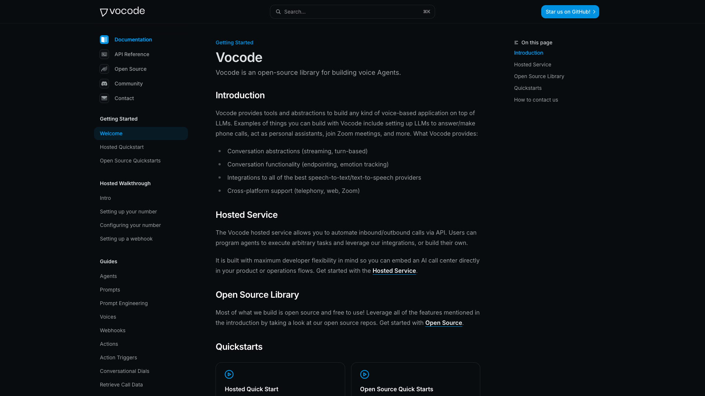
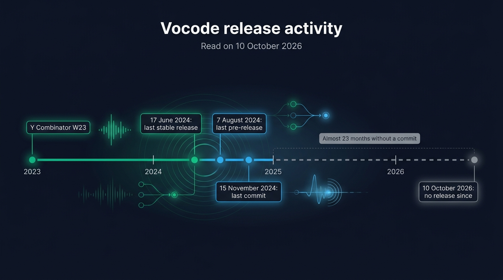
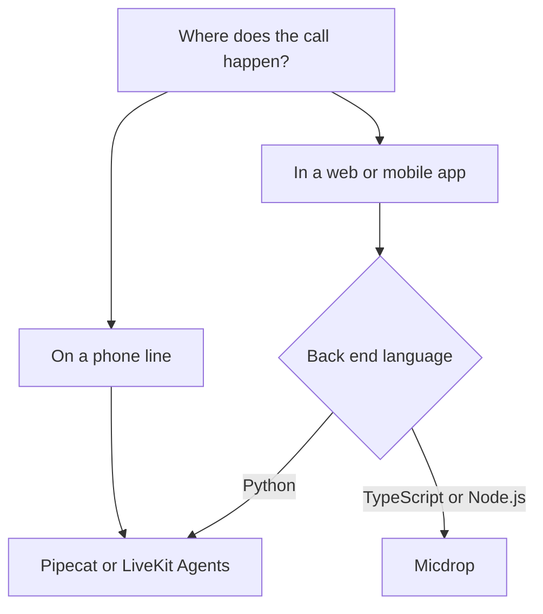

Teams look for a Vocode alternative for one main reason: its releases have stopped. [Vocode](https://github.com/vocodedev/vocode-core) is an open source Python library for building voice agents on top of language models, whose last stable release dates from June 2024. The right replacement depends on where your calls happen. For phone calls, [Pipecat](https://pipecat.ai) and [LiveKit Agents](https://livekit.io) are the maintained frameworks closest to it. For a voice conversation inside a web application, [Micdrop](/) is an open source TypeScript library that runs the whole call in the browser and in your Node server.

We compare Micdrop and Vocode on language, transport, telephony, integrations and cost, as both stood on 10 October 2026. We then explain what moving a Vocode project to Micdrop involves, and when another framework fits better.



## What is Vocode?

Vocode is an MIT-licensed Python library that connects a speech-to-text service, a language model and a text-to-speech service into a real-time voice conversation. The company behind it went through Y Combinator in winter 2023. The `vocode-core` repository has about 3,800 stars and 650 forks on GitHub.

It deserves that audience. Vocode was one of the first open source projects to make a streaming voice agent approachable, with design choices that still hold up today.

- `StreamingConversation` takes a transcriber, an agent and a synthesizer, each of which you can swap without touching the other two.
- The telephony server answers and places phone calls through Twilio or Vonage, on FastAPI, with call transfers, keypad tones and a way to dial into a Zoom meeting.
- The catalogue covers eight transcription services and eleven voice services, among them Deepgram, AssemblyAI, Azure, ElevenLabs, Cartesia, Play.ht and Rime.
- Agents run on OpenAI, Anthropic, Groq, Vertex AI or a LangChain chain.
- The same conversation runs in a browser through a React hook and a Python WebSocket route, or over WebRTC through a LiveKit integration.

A Python team building a phone agent in 2023 or 2024 had good reasons to pick it.

## Why teams look for a Vocode alternative

### Vocode has shipped no release since 2024

The last stable version of the `vocode` package was published on PyPI on 17 June 2024. Three pre-releases followed, the last one on 7 August 2024. The last commit to `vocode-core` dates from 15 November 2024. In the README, the project is still "actively looking for community maintainers".

The `vocode.dev` domain redirects to the GitHub organisation. Y Combinator lists Vocode as acquired. The documentation is still online and still describes a hosted service, but the dashboard and API addresses it points to no longer resolve.

The repository is neither archived nor marked deprecated, so Vocode still appears in lists of voice frameworks. Its documentation also looks current when you first open it.

{/* IMAGE regen: api.py image, infographic, 1600x900. Scene: "Title at the top in a modern clean bold sans-serif: \"Vocode release activity\" Subtitle: \"Read on 10 October 2026\" A single horizontal timeline running left to right across the image, from 2023 to 2026, with year ticks labelled \"2023\" \"2024\" \"2025\" \"2026\". Four markers on the timeline, each a dot with a short label card above or below it: at early 2023 an emerald dot labelled \"Y Combinator W23\"; at mid 2024 an emerald dot labelled \"17 June 2024: last stable release\"; slightly after it a sky blue dot labelled \"7 August 2024: last pre-release\"; at late 2024 a sky blue dot labelled \"15 November 2024: last commit\". From the last commit marker to the right end of the timeline, the line turns into a dashed muted grey segment spanning all of 2025 and 2026 up to a final grey marker labelled \"10 October 2026: no release since\". Above the dashed segment, a small grey tag: \"Almost 23 months without a commit\". Wide 16:9 layout, flat vector style, generous spacing."
    Regenerate if vocode-core receives a new commit or release. Last data sync: 2026-10-10. */}


### Vocode's provider code dates from 2024

A voice library mostly connects other companies' APIs, which change every few months. Vocode pins the OpenAI, Anthropic and ElevenLabs SDKs at their mid-2024 versions. To use a model, a voice or a streaming endpoint released since then, you write a patch and maintain it in a fork.

Speech-to-speech models are the clearest example. OpenAI Realtime and Gemini Live answer in audio from a single model, without a separate transcription and voice step. Vocode's agent list has no class for either.

### Turn-taking relies on silence and punctuation

Vocode decides the user has finished speaking after a silence, after a silence that follows a punctuation mark, or with Deepgram's endpointing when Deepgram is the transcriber. Interruptions have two settings, low and high. According to its own documentation, making interruptions work well "may need" a fork of Vocode that overrides the default behaviour.

Maintained frameworks now ship models that analyse the intonation of the voice, or ask the language model whether the sentence is complete, so the agent waits through a pause in the middle of a thought.

### A web app needs a second service in Python

Running Vocode in a browser takes two pieces of code. The front end installs the `vocode` npm package and calls a `useConversation` hook. The back end is a FastAPI application that exposes a WebSocket route. You deploy it beside your own server.

For a team whose product runs on Node, that means a second runtime, a second deployment and a second set of dependencies. The npm package was last published in August 2023, so the code that runs in your users' browsers is older than the Python library.

### Tools work with one agent class

Vocode calls tools "actions". According to its documentation, support for actions is limited to `ChatGPTAgent`, so an agent on Anthropic or Groq can talk but cannot call your code.

## How Micdrop approaches a voice agent differently

Micdrop is an MIT-licensed set of TypeScript packages for real-time voice conversations with AI, built for one case: a voice mode inside a web or mobile application you already ship. It is maintained, with packages published on npm from the public [repository](https://github.com/Godefroy/micdrop).


### One TypeScript codebase from the microphone to the model

The browser package records the microphone, detects speech and plays the answer. The server package runs in your Node process and calls the providers. Both are TypeScript, so the voice code is in the same repository, the same deployment and the same language as the rest of your app.

A complete server fits in one file:

```typescript
import { MicdropServer } from '@micdrop/server'
import { OpenaiAgent } from '@micdrop/openai'
import { GladiaSTT } from '@micdrop/gladia'
import { ElevenLabsTTS } from '@micdrop/elevenlabs'
import { WebSocketServer } from 'ws'

const wss = new WebSocketServer({ port: 8081 })

wss.on('connection', (socket) => {
  new MicdropServer(socket, {
    firstMessage: 'How can I help you today?',
    agent: new OpenaiAgent({
      apiKey: process.env.OPENAI_API_KEY,
      systemPrompt: 'You are a helpful assistant',
    }),
    stt: new GladiaSTT({ apiKey: process.env.GLADIA_API_KEY }),
    tts: new ElevenLabsTTS({
      apiKey: process.env.ELEVENLABS_API_KEY,
      voiceId: process.env.ELEVENLABS_VOICE_ID,
    }),
  })
})
```

The browser starts the call with one function:

```typescript
import { Micdrop } from '@micdrop/web'

Micdrop.start({ url: 'ws://localhost:8081' })
```

The socket is an ordinary WebSocket, so you add the route to your existing [Fastify](/docs/server/with-fastify) or [NestJS](/docs/server/with-nestjs) server, behind the authentication you already have.

### Speech detection runs in the browser

Micdrop detects speech on the user's device, with a [voice activity detection](/docs/client/vad) model that runs in the browser. Audio leaves the machine only while the user is talking, so the call uses little bandwidth and your transcription provider receives only speech.

[React hooks](/docs/client/react-hooks) expose every state of the call, so your interface can show who is speaking:

```typescript
import { Micdrop } from '@micdrop/web'
import { useMicdropState } from '@micdrop/react'

function VoiceChat() {
  const state = useMicdropState()
  const handleStart = () => Micdrop.start({ url: 'ws://localhost:8081/' })

  return (
    <button onClick={handleStart}>
      {state.isAssistantSpeaking ? 'Speaking' : 'Start'}
    </button>
  )
}
```

A [React Native client](/docs/react-native) runs the same call on a phone, against the same server.

### Turn-taking based on intonation and on the meaning of the sentence

Two checks are available on top of silence. The first is Smart Turn, a small open model that Micdrop runs [in the browser as a turn detector](/docs/client/turn-detection) to analyse the intonation of the last seconds of speech. The second is [semantic turn detection](/docs/server/semantic-turn-detection), a server option that asks the language model already in the pipeline whether the transcript is a complete thought.

Another option, [noise filtering](/docs/server/noise-filtering), drops "uh", "hmm" and throat clearing from the transcript before they reach the model. Each of these is a line of configuration. You can combine [several ways to detect the end of a turn](/blog/end-of-turn-detection-voice-agents) in one call.

### Tools on every agent, with typed parameters

A Micdrop [tool](/docs/server/tools) is a function with a Zod schema, registered on the agent and executed in your Node process, next to your database and your session:

```typescript
import { z } from 'zod'

agent.addTool({
  name: 'set_user_info',
  description: 'Save user information to the database',
  inputSchema: z.object({
    city: z.string().describe('City'),
    jobTitle: z.string().describe('Job title').nullable(),
  }),
  execute: ({ city, jobTitle }) => {
    return { success: true, message: 'User information saved' }
  },
})
```

`addTool` belongs to the base agent class, so every agent accepts tools: the OpenAI, Gemini and Mistral agents, and the [AI SDK agent](/docs/ai-integration/provided-integrations/ai-sdk), which works with Anthropic and any other model the Vercel AI SDK supports.

### Current models, a second provider and local engines

The integrations are updated as providers release new models. A call can run on a pipeline of speech-to-text, model and voice, or on a single [speech-to-speech model](/docs/server/realtime), OpenAI Realtime or Gemini Live, with the same browser code.

- A [fallback](/docs/ai-integration/fallback-strategies/tts-fallback) wraps two providers for the voice, the transcription or the agent, and replays the buffered text on the second when the first one fails.
- [Local models](/docs/ai-integration/local-models) such as Whisper, Kokoro and Piper run the transcription and the voice on your own machine.
- Mistral, Gladia and Gradium together make [a pipeline hosted in Europe](/docs/ai-integration/sovereign-voice-ai).

Products such as [Raconte](https://raconte.ai), which runs voice interviews led by an AI, and [Cibli](https://cibli.fr), a recruitment platform where candidates answer out loud, run Micdrop in production. Raconte is built by Micdrop's own maintainer.

## Vocode vs Micdrop, side by side

This comparison comes from each project's repository and documentation, as they stood on 10 October 2026.

| Aspect | Vocode | Micdrop |
|--------|--------|---------|
| **Server language** | Python | TypeScript on Node.js |
| **Browser client** | `vocode` npm package, one React hook | `@micdrop/web`, with speech detection, devices and call state |
| **React** | `useConversation` hook | `@micdrop/react` hooks |
| **Mobile** | None of its own | `@micdrop/react-native` |
| **Transport** | WebSocket, or WebRTC through LiveKit | WebSocket |
| **Telephony** | Twilio and Vonage, inbound and outbound | None |
| **Zoom dial-in, call transfer** | Yes | No |
| **Speech-to-text integrations** | 8, among them Deepgram, AssemblyAI and Azure | Gladia, OpenAI, Gemini, Mistral, Gradium, Whisper |
| **Voice integrations** | 11, among them Azure, Play.ht and Rime | ElevenLabs, Cartesia, Gradium, OpenAI, Gemini, Kokoro, Piper, Pocket TTS, Qwen3-TTS |
| **Models** | OpenAI, Anthropic, Groq, Vertex AI, LangChain | OpenAI, Gemini, Mistral, any Vercel AI SDK model |
| **Speech-to-speech models** | None | OpenAI Realtime, Gemini Live |
| **End of turn** | Silence, punctuation, Deepgram endpointing | Silence, Smart Turn, a check by the model |
| **Tool calling** | `ChatGPTAgent` only | Every agent, with Zod schemas |
| **Provider fallback** | Yours to write | `FallbackSTT`, `FallbackTTS`, `FallbackAgent` |
| **Managed hosting** | Discontinued | None |
| **Licence** | MIT | MIT |
| **Last commit** | 15 November 2024 | Active |
| **Maintained by** | Looking for community maintainers | One maintainer |

Vocode has a wider catalogue of transcription and voice services: Micdrop integrates neither Deepgram nor Azure. You can add a provider missing from Micdrop's list by implementing the [speech-to-text](/docs/ai-integration/custom-integrations/custom-stt) or [text-to-speech](/docs/ai-integration/custom-integrations/custom-tts) interface.

## What Vocode and Micdrop cost

Both libraries are free under the MIT licence and run on your own provider keys. A minute of conversation costs only what your transcription, model and voice providers charge, plus the server that runs the code.

Vocode used to sell a hosted API for phone calls. Its documentation still describes that service, but its dashboard and API addresses no longer resolve, so you can no longer subscribe to it.

The difference is who does the maintenance. With Vocode, you do it: every provider API change since 2024 is a patch you write, test and keep in your fork for as long as your product runs. Micdrop's updates come with its package releases.

## Who should choose which

**Stay on Vocode** when it already runs in production, its pinned providers still do what you need, and your team is comfortable owning a fork. The code is MIT and readable. A phone agent that works today will keep working until a provider retires the API version it calls.

**Choose Pipecat or LiveKit Agents** when the calls arrive over a phone line, or when your back end is in Python. They are the maintained frameworks closest to Vocode. Pipecat ships telephony serializers for Twilio, Telnyx, Plivo and Vonage, while LiveKit has its own SIP gateway. Micdrop has no telephony, so it is the wrong pick for a call centre.

**Choose Micdrop** when voice is a feature of a web or mobile application and your team writes TypeScript. The signals are a Node back end, a React front end, an agent that needs the user's session and your database on every turn, and a team that wants to keep a single deployment. Micdrop is written by one maintainer rather than a funded team, so weigh that limit too.

If you are evaluating rather than migrating, start on a maintained project in every case. A new product started on Vocode has more than two years of provider changes to catch up on from the first day.



## What adopting Micdrop involves

### Starting fresh

You can [get a first call working in about five minutes](/docs/getting-started): install the browser and server packages, give `MicdropServer` a model, a transcription and a voice, and open a WebSocket. The only accounts you create are with the providers.

Wiring it into a real application, with your authentication, your session and your interface around it, takes hours rather than days. Like the Vocode library, Micdrop stores no transcripts and has no dashboard. You build call history and analytics yourself, from the [message events](/docs/server/save-messages) the agent emits.

### Coming from Vocode

The server changes language, so moving from Vocode means rewriting it by hand. The rewrite is short for a web conversation, because both libraries assemble a transcription, an agent and a voice.

{/* IMAGE regen: api.py image, infographic, 1600x900. Scene: "Title at the top in a modern clean bold sans-serif: \"From Vocode to Micdrop\" Two columns of seven rows, each row a pair of cards joined by a thin arrow pointing from left to right. Left column header: \"Vocode (Python)\" with muted slate grey cards. Right column header: \"Micdrop (TypeScript)\" with emerald bordered cards. Rows, exactly as written: Row 1: \"StreamingConversation\" → \"MicdropServer\" Row 2: \"Transcriber\" → \"stt\" Row 3: \"ChatGPTAgent\" → \"agent\" Row 4: \"Synthesizer\" → \"tts\" Row 5: \"BaseAction\" → \"addTool\" Row 6: \"ConversationRouter\" → \"your WebSocket route\" Row 7: \"useConversation\" → \"Micdrop.start\" Below the two columns, one wide muted grey card with a sky blue border, reading: \"TelephonyServer: no Micdrop equivalent\" Wide 16:9 layout, flat vector style, monospace font for the card labels, generous spacing."
    Regenerate if Micdrop renames a server option or a client method. Last data sync: 2026-10-10. */}


- `StreamingConversation` becomes `MicdropServer`. Its transcriber, agent and synthesizer become the `stt`, `agent` and `tts` options.
- The `prompt_preamble` moves to `systemPrompt`, and the `initial_message` to `firstMessage`.
- Each action becomes a function registered with `addTool`. The parameters you described in a docstring become a Zod schema.
- An events manager that collected the transcript becomes a listener on the agent's `Message` event.
- The FastAPI application built on `ConversationRouter` goes away. The WebSocket route moves into your Node server.
- In the browser, `@micdrop/web` replaces the `vocode` package. `useMicdropState` replaces the status returned by `useConversation`.

Check your providers before you start. Both libraries support Gladia, ElevenLabs, Cartesia and OpenAI, and Micdrop reaches Anthropic through its AI SDK agent. With Deepgram or an Azure voice, you either change provider or write a custom integration.

The code that answers a phone number stays on Vocode, or moves to Pipecat or LiveKit Agents. A product with both a phone agent and an in-app conversation can keep its phone agent on Vocode and move only the in-app conversation. Put the Micdrop version behind a feature flag and keep the Vocode service running until the traffic has moved.

## Frequently asked questions

<FaqList>
  <FaqItem question="What is Vocode?">
    Vocode is an open source Python library, under the MIT licence, for building voice agents on top of language models. It connects a speech-to-text service, a language model and a text-to-speech service into a real-time conversation, and deploys that conversation to phone calls through Twilio or Vonage, to Zoom meetings or to a web page. The company behind it went through Y Combinator in winter 2023. The code is on GitHub in the vocodedev/vocode-core repository. Vocode is unrelated to the vocoder audio effect, despite the similar name.
  </FaqItem>
  <FaqItem question="Is Vocode still maintained?">
    Vocode's last commit dates from 15 November 2024 and its last stable release from 17 June 2024. The vocode.dev domain redirects to the GitHub organisation, Y Combinator lists the company as acquired, and the project is looking for community maintainers according to its README. The repository is neither archived nor marked deprecated, so it can look active at first glance. Anyone adopting it in 2026 maintains it themselves.
  </FaqItem>
  <FaqItem question="Is there an open source alternative to Vocode?">
    Yes, several open source projects can replace Vocode. Pipecat, under BSD 2-Clause, and LiveKit Agents, under Apache 2.0, are the maintained frameworks closest to Vocode, both with telephony and a Python server. Dograh is a self-hosted platform with a visual workflow builder. Jambonz is a telecom stack in Node. Micdrop, under MIT, covers voice conversations inside a TypeScript web or mobile app. All of them appear in our comparison of [open source voice agent frameworks](/blog/open-source-voice-agent-frameworks).
  </FaqItem>
  <FaqItem question="Is Vocode free?">
    Vocode is free. The library is MIT-licensed, so you pay only the speech-to-text, model, text-to-speech and telephony providers it calls on your own keys. The hosted API that Vocode used to sell is still described in its documentation, but its dashboard and API addresses no longer resolve. Micdrop is free too, under the same licence, so you pay only [the providers you pick](/docs/ai-integration).
  </FaqItem>
  <FaqItem question="Can I use Vocode with TypeScript or Node.js?">
    Vocode supports TypeScript on the client side only. Its npm package gives a React app a hook that connects to a Vocode back end, a Python FastAPI service you deploy beside your Node server. The npm package was last published in August 2023. Micdrop's browser client is in TypeScript, like its server, which runs in [the Node process you already run](/docs/server).
  </FaqItem>
  <FaqItem question="Should I start on Vocode or on Micdrop?">
    Start on a maintained project. For a new voice feature inside a web or mobile app written in TypeScript, start on Micdrop. For a phone agent or a Python back end, start on Pipecat or LiveKit Agents. Vocode is worth reading as a reference implementation, and worth keeping when it already runs in production and still meets your needs.
  </FaqItem>
  <FaqItem question="Does Micdrop handle phone calls like Vocode?">
    Micdrop has no telephony. It runs a conversation between a browser or a React Native app and your Node server, over a WebSocket. Vocode answers and places phone calls through Twilio and Vonage. That part of a Vocode project moves to Pipecat, LiveKit Agents or Jambonz.
  </FaqItem>
</FaqList>

## Getting started

```bash
npm install @micdrop/web @micdrop/server @micdrop/openai @micdrop/gladia @micdrop/elevenlabs
```

You can [run a first voice call in about five minutes](/docs/getting-started), then swap in [the providers your project needs](/docs/ai-integration).

If a Python framework is still on your shortlist, we ran the same comparison for [Micdrop and Pipecat](/blog/alternative-to-pipecat) and for [Micdrop and LiveKit Agents](/blog/alternative-to-livekit-agents).

---

Vocode showed early that an open source voice agent could be simple to assemble. For its phone features, Pipecat and LiveKit Agents are the maintained successors. If your team writes TypeScript and the conversation happens inside a web application, Micdrop keeps the whole call in one language and one deployment, with providers you choose and code that is still updated.
