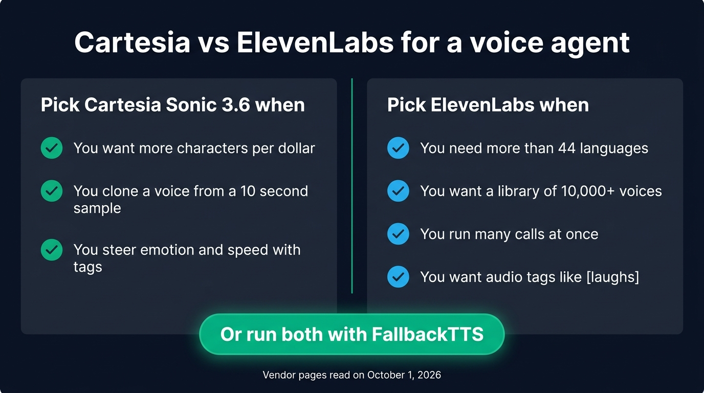
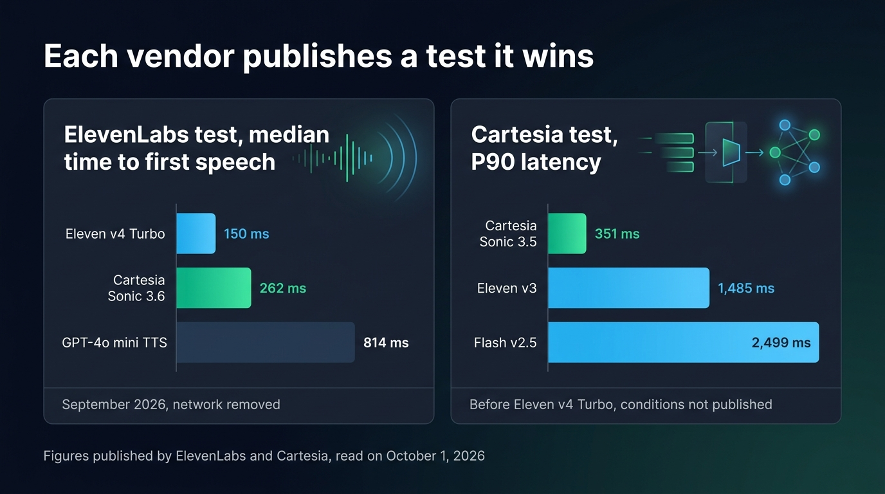
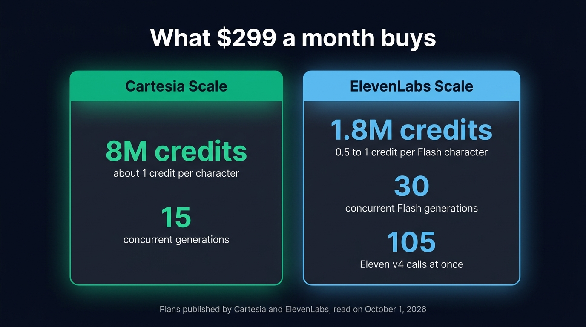

Cartesia and ElevenLabs both sell a streaming text to speech API fast enough for a real-time voice agent. Which one to pick depends on what limits your agent. Pick Cartesia Sonic 3.6 for more characters at the same monthly price and voice cloning from a 10 second sample. Pick ElevenLabs when you need more languages, a bigger voice library, more calls at once on the same budget, or the audio tags of Eleven v4 Turbo. Latency matters less than it seems. Each vendor publishes a benchmark it wins. Even in the ElevenLabs test, Sonic 3.6 and v4 Turbo both start speaking in under 300 ms.

This comparison covers the models a voice agent actually uses: Cartesia Sonic 3.6 on one side, ElevenLabs Flash v2.5 and Eleven v4 Turbo on the other. Every price and limit below was read on the vendors' pages on October 1, 2026, unless another date is given. OpenAI, Gemini, Gradium and local models are compared with the other [alternatives to ElevenLabs for a TypeScript voice agent](/blog/elevenlabs-alternatives-typescript).

## The short answer

| | Cartesia Sonic 3.6 | ElevenLabs Flash v2.5 | ElevenLabs Eleven v4 Turbo |
| --- | --- | --- | --- |
| Model ID | `sonic-3.6` | `eleven_flash_v2_5` | `eleven_v4_turbo` |
| Published latency | Under 90 ms | About 75 ms of inference | About 100 ms of inference, 150 ms to first speech |
| Languages | 44 | 32 | 90+ |
| Expressive control | Emotion, speed and volume tags | Voice settings only | Audio tags such as `[laughs]` |
| Instant voice cloning | From 10 seconds of audio | 1 to 2 minutes recommended | 1 to 2 minutes recommended |
| Concurrency on the $299 plan | 15 generations | 30 generations | 105 calls |
| WebSocket | One connection, one context per answer | Text to Speech WebSocket | Text to Dialogue WebSocket, one session per call |

Cartesia's model list changed this summer. Sonic 3.6 came out on August 27, 2026, and Cartesia stops serving `sonic-turbo` and `sonic-2` after October 20, 2026. An agent still configured with `modelId: 'sonic-turbo'` has to move to `sonic-3.6` before that date. The Sonic 3.6 docs say it is backwards compatible with Sonic 3.5.

{/* IMAGE regen: api.py image, infographic, 1600x900. Scene: "Two columns side by side on a dark surface, separated by a thin vertical line. Left column header in a modern clean bold sans-serif: 'Pick Cartesia Sonic 3.6 when'. Under it, three short rows, each with a small emerald check mark: 'You want more characters per dollar', 'You clone a voice from a 10 second sample', 'You steer emotion and speed with tags'. Right column header in a modern clean bold sans-serif: 'Pick ElevenLabs when'. Under it, four short rows, each with a small sky blue check mark: 'You need more than 44 languages', 'You want a library of 10,000+ voices', 'You run many calls at once', 'You want audio tags like [laughs]'. At the bottom, centered across both columns, one emerald pill-shaped banner reading 'Or run both with FallbackTTS'. Title at the top: 'Cartesia vs ElevenLabs for a voice agent'. Small footer text: 'Vendor pages read on October 1, 2026'. Flat vector style, generous spacing."
    Infographic only: regenerate if a vendor changes its languages, cloning or plan limits. Last data sync: 2026-10-01. */}


## Both vendors publish a latency test they win

ElevenLabs gives Flash v2.5 about 75 ms of inference and v4 Turbo about 100 ms, network excluded, on its [models page](https://elevenlabs.io/docs/overview/models). When it announced Eleven v4, ElevenLabs [compared the time to first speech of v4 Turbo with Cartesia and OpenAI](https://elevenlabs.io/blog/eleven-v4). It puts v4 Turbo at a median of about 150 ms, against 262 ms for Cartesia Sonic 3.6 and 814 ms for OpenAI's GPT-4o mini TTS. ElevenLabs ran that test in September 2026, with identical scripts and default settings, and removed the network latency for every system.

Cartesia tells the opposite story. It promises a [Sonic latency under 90 ms](https://cartesia.ai/sonic) and gives a [P90 latency of 351 ms for Sonic 3.5](https://cartesia.ai/vs/cartesia-vs-elevenlabs), against 2,499 ms for Flash v2.5 and 1,485 ms for Eleven v3. Cartesia published that comparison before v4 Turbo and does not say how it ran the test.

The two tests measure different things. ElevenLabs reports a median without the network, while Cartesia reports the 90th percentile, the slow calls a user remembers. Each vendor picked the measure it wins on. Neither figure is what your user hears. Your user also waits for the trip between your server and the vendor, plus the vendor's queue at that moment.

{/* IMAGE regen: api.py image, infographic, 1600x900. Scene: "Two panels side by side on a dark surface, each a small horizontal bar chart with labels on the left and values at the end of each bar. Left panel title in a modern clean bold sans-serif: 'ElevenLabs test, median time to first speech'. Bars: 'Eleven v4 Turbo' value '150 ms' in sky blue, 'Cartesia Sonic 3.6' value '262 ms' in emerald, 'GPT-4o mini TTS' value '814 ms' in muted slate. Left panel footer: 'September 2026, network removed'. Right panel title: 'Cartesia test, P90 latency'. Bars: 'Cartesia Sonic 3.5' value '351 ms' in emerald, 'Eleven v3' value '1,485 ms' in sky blue, 'Flash v2.5' value '2,499 ms' in sky blue. Right panel footer: 'Before Eleven v4 Turbo, conditions not published'. Bar lengths strictly proportional to the values within each panel, the longest value filling the panel width: in the left panel, '150 ms' is the shortest bar at about one fifth of the width, '262 ms' about one third, '814 ms' the full width. In the right panel, '351 ms' is the shortest bar at about one seventh of the width, '1,485 ms' about three fifths, '2,499 ms' the full width. Main title at the top: 'Each vendor publishes a test it wins'. Small footer text: 'Figures published by ElevenLabs and Cartesia, read on October 1, 2026'. Flat vector style, generous spacing."
    Infographic only: regenerate if either vendor publishes a new benchmark. Last data sync: 2026-10-01. */}


Our own figures cover ElevenLabs only. On launch day, we [streamed Eleven v4 Turbo in a voice agent](/blog/eleven-v4-turbo-voice-agent) and heard the first audio 138 ms after the first word, with the text sent word by word and a flush at the end of every sentence.

{/* TODO ANECDOTE: measure Sonic 3.6 with the same word-by-word test (one word every 30 ms, pcm 16 kHz, same machine) and give the time to first audio next to the 138 ms of v4 Turbo. */}

Latency also matters when the user interrupts. On Cartesia, the client cancels the answer with one message on the open connection. Eleven v4 Turbo has no message to stop a synthesis, so the client closes the connection and opens a new one, which took about 90 ms in our tests. On Flash v2.5, the client keeps the connection, flushes it and throws away the audio of the old answer.

## Voices, languages and cloning

ElevenLabs has more voices, and more languages on v4 Turbo. Eleven v4 Turbo speaks more than 90 languages and Flash v2.5 speaks 32, against 44 for Sonic 3.6. The [ElevenLabs voice library](https://elevenlabs.io/docs/overview/capabilities/voices) holds more than 10,000 voices shared by its community. Cartesia does not publish the size of its own.

Cartesia is ahead on cloning. Its [instant clone](https://docs.cartesia.ai/build-with-cartesia/capability-guides/clone-voices) starts from 10 seconds of audio. A sample of up to 60 seconds helps Sonic 3.6 keep the accent. ElevenLabs recommends one to two minutes of audio for an instant clone, and 30 minutes or more for a professional clone, which needs a Creator plan or above. Cartesia offers professional clones from its $49 Startup plan.

The two vendors give the voice its emotion in different ways:

- Eleven v4 Turbo performs [audio tags written by the LLM](/blog/elevenlabs-audio-tags-voice-agent), such as `[laughs]`, `[whispers]` or `[sighs]`, along with sound effects and free directions like `[strong French accent]`.
- Sonic 3.6 reads [emotion, speed and volume tags](https://docs.cartesia.ai/build-with-cartesia/sonic-3/volume-speed-emotion) inside the text, such as `<emotion value="calm"/>` or `<speed ratio="1.2"/>`, plus `[laughter]` for a laugh. It knows more than 60 emotions, but only applies them in English. Cartesia names eight voices that respond best to emotions, including Leo, Maya and Tessa.
- Flash v2.5 reads both kinds of tag out loud. Its voice settings, such as stability and speed, apply to the whole call.

With v4 Turbo and Sonic 3.6 alike, the LLM writes the tags, so list the ones it may use in its system prompt, and remove them from the text you show on screen.

## Price and concurrency per plan

Cartesia bills about one credit per character, so its plans work out between $37 and $50 per million characters. ElevenLabs charges [$40 per million characters](https://elevenlabs.io/pricing/api) for Flash v2.5 when you pay as you go on its API, close to Cartesia. Eleven v4 Turbo costs $11 per million until October 12, 2026, then $40. The ElevenLabs subscription plans cost more per character.

Each plan includes a number of credits and a concurrency limit:

| Cartesia plan and monthly price | Cartesia credits | Cartesia concurrency | ElevenLabs plan and monthly price | ElevenLabs credits | Flash concurrency | v4 calls at once |
| --- | --- | --- | --- | --- | --- | --- |
| Pro, $5 | 100,000 | 3 | Starter, $6 | 30,000 | 6 | 21 |
| Startup, $49 | 1,250,000 | 5 | Pro, $99 | 600,000 | 20 | 70 |
| Scale, $299 | 8,000,000 | 15 | Scale, $299 | 1,800,000 | 30 | 105 |

ElevenLabs charges between 0.5 and 1 credit per Flash character. At $299 a month, ElevenLabs Scale therefore covers 1.8 to 3.6 million Flash characters, between $83 and $166 per million. Cartesia Scale includes more than twice as many characters. In exchange, ElevenLabs Scale runs 30 Flash generations at once, against 15 on Cartesia Scale. The v4 figures come from the session limits ElevenLabs published on September 29, 2026.

The vendors also count concurrency differently. Cartesia [counts each open context](https://docs.cartesia.ai/use-the-api/concurrency-limits-and-timeouts). Micdrop opens one context per answer, so a slot stays busy for one answer rather than a whole call. On Flash, ElevenLabs counts the time spent generating audio, so a slot stays busy for one answer there as well. On v4 Turbo, each call holds one dialogue session from its first second to its last, silences included. A voice agent with 20 live calls rarely generates 15 answers at the same instant, so Cartesia's 15 slots go further than the number suggests. Size your plan on your peak of simultaneous answers, measured on real traffic.

{/* IMAGE regen: api.py image, infographic, 1600x900. Scene: "A comparison of two plans that both cost '$299 a month', shown as two cards side by side on a dark surface. Left card with an emerald accent, header 'Cartesia Scale'. Inside, two large figures stacked: '8M credits' with the small caption 'about 1 credit per character', and '15' with the small caption 'concurrent generations'. Right card with a sky blue accent, header 'ElevenLabs Scale'. Inside, three large figures stacked: '1.8M credits' with the small caption '0.5 to 1 credit per Flash character', '30' with the small caption 'concurrent Flash generations', and '105' with the small caption 'Eleven v4 calls at once'. Title at the top in a modern clean bold sans-serif: 'What $299 a month buys'. Small footer text: 'Plans published by Cartesia and ElevenLabs, read on October 1, 2026'. Flat vector style, generous spacing."
    Infographic only: regenerate if either vendor changes its Scale plan. Last data sync: 2026-10-01. */}


## Streaming from Node

Both vendors stream over a WebSocket, with protocols that share almost nothing:

- Cartesia uses one connection, `wss://api.cartesia.ai/tts/websocket`, for every answer. Each answer gets a `context_id`, the text goes in with `continue: true`, and the last message sets `continue: false`. Cartesia closes a connection after 5 minutes without a message.
- ElevenLabs Flash v2.5 streams over the Text to Speech WebSocket, with the voice in the URL, a keep-alive while the user speaks, and a flush at the end of the answer.
- Eleven v4 Turbo streams over the Text to Dialogue WebSocket, which takes the voice in its first message and answers in snake case. It needs a flush at the end of every sentence and a new connection at every interruption.

[Micdrop](/), an open source TypeScript library for real-time voice conversations with AI, wraps both vendors behind the same `TTS` interface. `CartesiaTTS` manages the contexts, sends the cancel message and reconnects with the unspoken text. `ElevenLabsTTS` picks the WebSocket from the model ID, so `modelId: 'eleven_v4_turbo'` is enough to move from Flash to v4 Turbo. Both emit 16 kHz PCM audio, which the browser client plays. Read the engine from an environment variable to compare them on real calls:

```typescript
import { CartesiaTTS } from '@micdrop/cartesia'
import { ElevenLabsTTS } from '@micdrop/elevenlabs'
import { OpenaiAgent, OpenaiSTT } from '@micdrop/openai'
import { MicdropServer } from '@micdrop/server'

const tts =
  process.env.TTS_PROVIDER === 'cartesia'
    ? new CartesiaTTS({
        apiKey: process.env.CARTESIA_API_KEY || '',
        modelId: 'sonic-3.6',
        voiceId: process.env.CARTESIA_VOICE_ID || '',
        language: 'en',
      })
    : new ElevenLabsTTS({
        apiKey: process.env.ELEVENLABS_API_KEY || '',
        voiceId: process.env.ELEVENLABS_VOICE_ID || '',
        modelId: 'eleven_flash_v2_5',
      })

new MicdropServer(socket, {
  agent: new OpenaiAgent({
    apiKey: process.env.OPENAI_API_KEY || '',
    systemPrompt: 'You are a helpful assistant. Your answers are spoken out loud.',
  }),
  stt: new OpenaiSTT({ apiKey: process.env.OPENAI_API_KEY || '' }),
  tts,
})
```

Without Micdrop, you have two ways to put these engines in a voice agent. The first is to write the clients yourself. Micdrop's Cartesia client is about 300 lines of TypeScript and each of its two ElevenLabs clients about 400, most of them spent on interruptions, reconnections and keep-alives. You would also write the browser side: the microphone, speech detection and a playback that stops when the user talks. The second is to rent a hosted platform. [ElevenLabs Agents](https://elevenlabs.io/pricing/agents) charged $0.08 a minute on September 24, 2026, with the LLM billed on top.

Micdrop is MIT licensed and runs on your server with your own API keys, so you only pay each vendor's price per character. In exchange, you host the server and build the call history and the dashboard a platform would give you. Products such as [Raconte](https://raconte.ai) and [Cibli](https://cibli.fr) run on its browser and server packages. Raconte, built by Micdrop's maintainer, runs voice interviews led by an AI. Cibli is a recruiting platform where candidates answer by voice. Pipecat and LiveKit Agents integrate both vendors too, in Python.

## Using both with FallbackTTS

You don't have to choose for good. [`FallbackTTS`](/docs/ai-integration/fallback-strategies/tts-fallback) takes a list of engines, speaks through the first, and switches to the next one when it fails after its retries. It keeps a copy of the text it sent, so the second engine speaks the words the first never got to say. The caller hears the voice change in the middle of an answer, which is better than silence.

```typescript
import { CartesiaTTS } from '@micdrop/cartesia'
import { ElevenLabsTTS } from '@micdrop/elevenlabs'
import { FallbackTTS } from '@micdrop/server'

const tts = new FallbackTTS({
  factories: [
    () =>
      new CartesiaTTS({
        apiKey: process.env.CARTESIA_API_KEY || '',
        modelId: 'sonic-3.6',
        voiceId: process.env.CARTESIA_VOICE_ID || '',
        maxRetry: 2, // Give up early so the switch happens fast
      }),
    () =>
      new ElevenLabsTTS({
        apiKey: process.env.ELEVENLABS_API_KEY || '',
        voiceId: process.env.ELEVENLABS_VOICE_ID || '',
        modelId: 'eleven_flash_v2_5',
      }),
  ],
})
```

Put the engine whose strength you want on every call first. With Cartesia first, you get its larger character allowance. When Cartesia fails, ElevenLabs Flash takes over with its 30 slots on the Scale plan. With Eleven v4 Turbo first, you get its audio tags and keep Cartesia for when v4 Turbo fails. In that case, [strip the audio tags from the text you send Cartesia](/blog/elevenlabs-audio-tags-voice-agent), or its voice says "laughs" in the middle of a sentence. The same goes for Cartesia's emotion tags when Flash backs up Sonic.

Keep `maxRetry` low on the first engine. The default of three retries, one second apart, leaves the call silent for three seconds before the switch begins.

## Frequently asked questions

<FaqList>
  <FaqItem question="Is Cartesia faster than ElevenLabs?">
    It depends on whose test you read. Cartesia gives Sonic a latency under 90
    ms and measures Flash v2.5 far slower at the 90th percentile. ElevenLabs
    measures Eleven v4 Turbo at a median of about 150 ms to first speech,
    against 262 ms for Sonic 3.6, network removed. Each vendor picked the
    measure it wins on, so measure the two from the region you deploy in, on
    the sentences your agent says.
  </FaqItem>
  <FaqItem question="Is Cartesia cheaper than ElevenLabs?">
    On the subscription plans, yes. At $299 a month, Cartesia Scale includes 8
    million credits, about 8 million characters, against 1.8 million credits for
    ElevenLabs Scale, which buy 1.8 to 3.6 million Flash characters. In
    exchange, ElevenLabs Scale runs 30 Flash generations at once, against 15
    on Cartesia Scale. When you pay as you go, ElevenLabs charges $40 per
    million Flash v2.5 characters, close to the $37 to $50 per million of the
    Cartesia plans.
  </FaqItem>
  <FaqItem question="Which Cartesia voice is considered the best?">
    Cartesia names eight voices that respond best to its emotion controls:
    Leo, Jace, Kyle, Gavin, Maya, Tessa, Dana and Marian. For a voice
    agent, pick one of them if you plan to use emotion tags, then listen to it
    on your agent's own sentences.
  </FaqItem>
  <FaqItem question="Is the Cartesia API free?">
    Cartesia has a free plan with 20,000 credits a month and two concurrent
    requests, enough to try a few voices. The paid plans start at $5 a month for
    100,000 credits and three concurrent requests.
  </FaqItem>
  <FaqItem question="What is the best alternative to ElevenLabs?">
    For a real-time voice agent, Cartesia is the closest alternative: a hosted
    streaming API built for a fast first word, with subscription plans that
    include more characters per dollar. Other engines suit other needs, such as Gradium for audio
    generated in Europe or local engines with no bill at all. We compare them with the
    other [alternatives to ElevenLabs for a TypeScript voice
    agent](/blog/elevenlabs-alternatives-typescript).
  </FaqItem>
  <FaqItem question="Can I use Cartesia and ElevenLabs in the same voice agent?">
    Yes. In Micdrop, both implement the same `TTS` interface, so you can pick
    one per call from an environment variable, or list both in `FallbackTTS`
    so the second takes over when the first fails mid-answer.
  </FaqItem>
</FaqList>

---

Cartesia Sonic 3.6 gives you more characters for the same monthly price and a voice cloned from 10 seconds of audio. ElevenLabs gives you more languages, more voices, more calls at once on the same plan and the audio tags of v4 Turbo. On latency, trust a measure taken from your own region over either vendor's benchmark.

[Micdrop](/) runs both behind one interface, on your server with your own keys, so the choice stays reversible. Pick one engine and put the other behind it as [a text to speech fallback](/docs/ai-integration/fallback-strategies/tts-fallback). You can [run a first voice call in about five minutes](/docs/getting-started).
