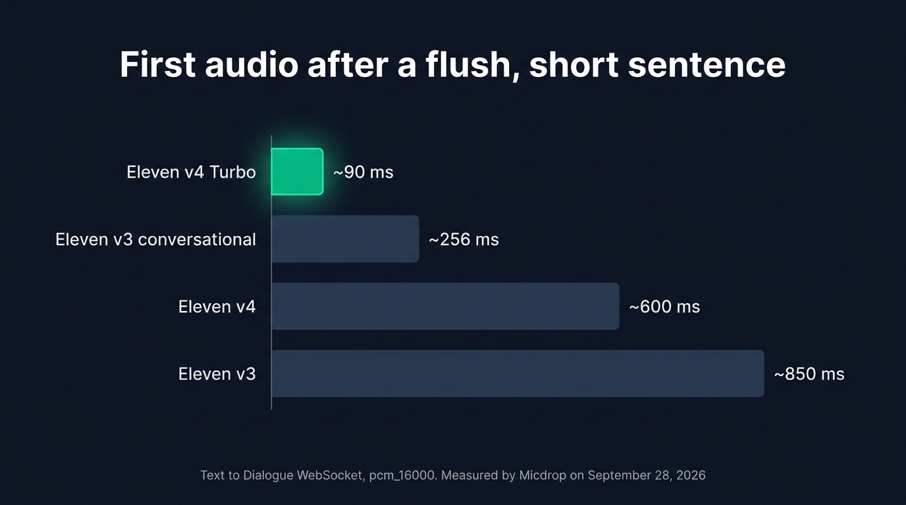
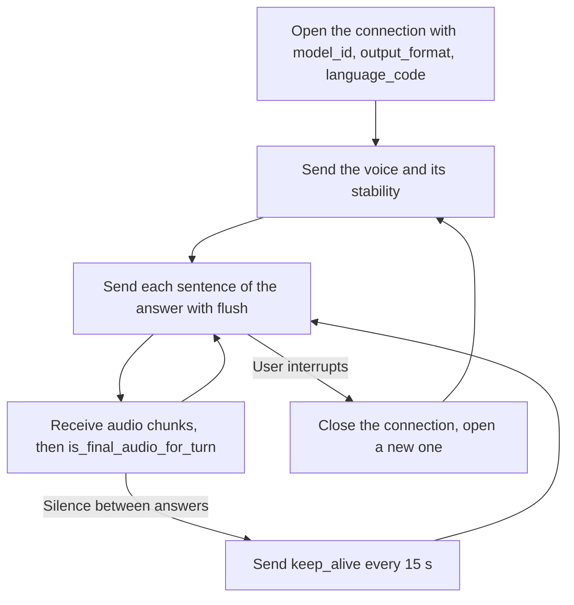
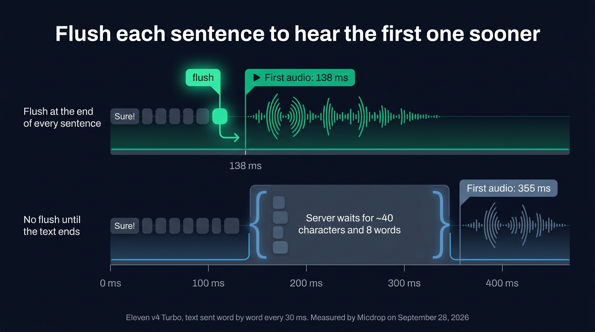
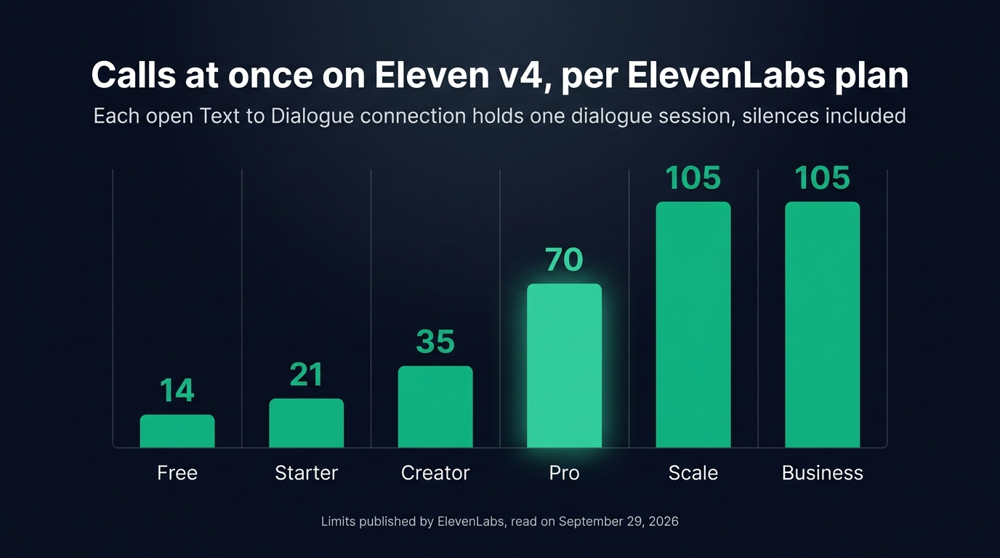

Eleven v4 and Eleven v4 Turbo are the text to speech models ElevenLabs released on September 28, 2026, under the model IDs `eleven_v4` and `eleven_v4_turbo`. Both speak more than 90 languages and act out audio tags such as `[laughs]` or `[whispers]`. For a voice agent, pick v4 Turbo: ElevenLabs gives it a median inference latency of about 100 ms, and in our tests it started speaking a short sentence in about 90 ms, where v4 took about 600 ms. Keep v4 for narration and characters. Getting v4 Turbo to stream takes more than a new model ID, though, because the WebSocket most integrations use refuses it.

We plugged v4 Turbo into a TypeScript voice agent the day it came out, through [Micdrop](/), an open source TypeScript library for real-time voice conversations with AI. This review covers what we found along the way: the error the Text to Speech WebSocket returns, the protocol of the Text to Dialogue WebSocket that replaces it, the latency we measured, and how interruptions, dialogue sessions, pronunciation and pricing work on v4.

## What Eleven v4 and v4 Turbo are

ElevenLabs ships the fourth generation of its expressive voice in two models. [Eleven v4](https://elevenlabs.io/v4) aims for the best voice, and takes up to 10,000 characters in a single generation. Eleven v4 Turbo trades some of the voice quality for speed. ElevenLabs puts its median inference latency at about 100 ms and its median time to first speech at about 150 ms, both measured without the network.

Both models share the rest:

- more than 90 languages, against more than 70 for Eleven v3
- audio tags, which the voice performs instead of reading them
- instant voice cloning from 10 seconds of audio
- better support for pronunciation written in IPA

v4 lacks a few features older models had. SSML `<break>` tags are disabled, and the style and speed settings are gone. Stability is the only voice setting v4 reads. A lower value gives the voice a broader emotional range. In our tests, the API accepted up to 10 voices on one Text to Dialogue connection with v4, and a single one with v4 Turbo. A voice agent speaks with one voice, so the limit only matters for a multi-character story.

## Eleven v4 vs v3 for a voice agent

Eleven v3 introduced audio tags, but it was slow for a conversation, so ElevenLabs added `eleven_v3_conversational` and gives it a latency of about 280 ms. Eleven v4 Turbo takes the place of both in a voice agent: it performs the same tags, covers more languages and starts speaking sooner. v3 still works, on the same WebSocket as v4.

| Model                    | Model ID                   | WebSocket        | Languages | First audio after a flush, measured | Audio tags | Best for                            |
| ------------------------ | -------------------------- | ---------------- | --------- | ----------------------------------- | ---------- | ----------------------------------- |
| Eleven v4 Turbo          | `eleven_v4_turbo`          | Text to Dialogue | 90+       | ~90 ms                              | Performed  | Expressive voice agents             |
| Eleven v4                | `eleven_v4`                | Text to Dialogue | 90+       | ~600 ms                             | Performed  | Narration, several characters       |
| Eleven v3 conversational | `eleven_v3_conversational` | Text to Dialogue | 70+       | ~256 ms                             | Performed  | Existing v3 agents                  |
| Eleven v3                | `eleven_v3`                | Text to Dialogue | 70+       | ~850 ms                             | Performed  | Existing v3 narration               |
| Flash v2.5               | `eleven_flash_v2_5`        | Text to Speech   | 32        | Not measured                        | Read out   | The lowest latency, about 75 ms     |
| Multilingual v2          | `eleven_multilingual_v2`   | Text to Speech   | 29        | Not measured                        | Read out   | Long narration with a stable voice  |

We measured the first audio on September 28, 2026, on a short sentence sent with a flush, in 16 kHz PCM. The 75 ms of Flash v2.5 is the figure ElevenLabs gives without the network, so add the round trip between your server and ElevenLabs.

The v3 and v4 models differ from the v2 models in the same ways. Flash v2.5 and Multilingual v2 stream over the Text to Speech WebSocket, cover 32 and 29 languages, and read a tag like `[laughs]` out loud. The v3 and v4 models stream over the Text to Dialogue WebSocket, cover 70 languages or more, and act the tags out. Flash v2.5 still answers the fastest, which makes it the choice for an agent that has no use for tags.

{/* IMAGE regen: api.py image, infographic, 1600x900. Scene: "A horizontal bar chart on a dark surface, four bars read from top to bottom, each with its label on the left and its value at the end of the bar. Bar 1 labelled 'Eleven v4 Turbo', value '~90 ms', the shortest bar, filled in bright emerald. Bar 2 labelled 'Eleven v3 conversational', value '~256 ms', muted slate. Bar 3 labelled 'Eleven v4', value '~600 ms', muted slate. Bar 4 labelled 'Eleven v3', value '~850 ms', the longest bar, muted slate. Bar lengths proportional to the values. Title at the top in a modern clean bold sans-serif: 'First audio after a flush, short sentence'. Small footer text: 'Text to Dialogue WebSocket, pcm_16000. Measured by Micdrop on September 28, 2026'. Generous spacing, flat vector style."
    Infographic only: regenerate if the latency measurement is redone. Last data sync: 2026-09-28. */}


## Why the Text to Speech WebSocket rejects v4

Most voice agent integrations stream ElevenLabs over the Text to Speech WebSocket, `wss://api.elevenlabs.io/v1/text-to-speech/{voice_id}/stream-input`. Pass it `model_id=eleven_v4_turbo` and the handshake fails with an HTTP 400 `unsupported_model`, carrying this message:

```text
Model 'eleven_v4_turbo' is not supported on the text-to-speech websocket endpoint. Use the text-to-dialogue websocket endpoint instead.
```

The same happens with `eleven_v4` and the v3 models. They stream over the Text to Dialogue WebSocket, `wss://api.elevenlabs.io/v1/text-to-dialogue/stream-input`, built for conversations between several voices. Its reference page still says the model ID must start with `eleven_v3`, but the endpoint accepted `eleven_v4_turbo` in our tests.

The protocol differs from the Text to Speech one in several places:

- The voice moves from the URL to the messages. The first message lists the voices of the connection, then each input names its voice.
- Text goes in an `inputs` array of `{ text, voice_id, new_turn }` objects. `new_turn` resets the prosody between two answers.
- `flush: true` makes the server generate the text it holds, `keep_alive: true` keeps an idle connection open, and `close_socket: true` ends it.
- The server answers in snake case, with `is_final_audio_for_turn` after each flush and `is_final` at the end, where the Text to Speech WebSocket used camel case.
- `language_code`, `model_id` and `output_format` go in the query string.

Here is a minimal client with the `ws` package:

```typescript
import WebSocket from 'ws'

const voiceId = process.env.ELEVENLABS_VOICE_ID!
const params = new URLSearchParams({
  model_id: 'eleven_v4_turbo',
  output_format: 'pcm_16000',
  language_code: 'en',
})

const socket = new WebSocket(
  `wss://api.elevenlabs.io/v1/text-to-dialogue/stream-input?${params}`,
  { headers: { 'xi-api-key': process.env.ELEVENLABS_API_KEY! } }
)

socket.on('open', () => {
  // The first message registers the voice. v4 only reads the stability.
  socket.send(
    JSON.stringify({ voices: [voiceId], voice_settings: { stability: 0.5 } })
  )
  // Flush at the end of the sentence so its audio starts right away
  socket.send(
    JSON.stringify({ inputs: [{ text: 'Sure! ', voice_id: voiceId }], flush: true })
  )
})

socket.on('message', (data) => {
  const message = JSON.parse(data.toString())
  if (message.audio) playPcm(Buffer.from(message.audio, 'base64'))
  if (message.is_final_audio_for_turn) console.log('Sentence spoken')
  if (message.error) console.error(message.error, message.message)
})
```

A call follows this sequence on one connection:



## Latency in a streamed pipeline

A voice agent starts speaking while the LLM is still writing the answer, a few words at a time. We reproduced that on September 28, 2026: our test sent the text to v4 Turbo word by word, one word every 30 ms, and asked for 16 kHz PCM.

The Text to Dialogue WebSocket holds text back until it has about 40 characters and 8 words. An answer that opens on "Sure!" waits for the words of the next sentence. With no flush before the end of the text, the first audio came 355 ms after the first word. With a flush at the end of every sentence, it came after 138 ms.

{/* IMAGE regen: api.py image, infographic, 1600x900. Scene: "Two horizontal timelines stacked on a dark surface, sharing one time axis from '0 ms' on the left to '400 ms' on the right, with ticks at '0 ms', '100 ms', '200 ms', '300 ms', '400 ms'. Both lanes start with small word tokens arriving one after another every few millimetres, the first token reading 'Sure!'. Lane 1 titled 'Flush at the end of every sentence': right after the 'Sure!' token, a small emerald marker labelled 'flush', then an emerald audio waveform starting at the 138 ms mark, labelled 'First audio: 138 ms'. Lane 2 titled 'No flush until the text ends': the word tokens pile up inside a slate bracket labelled 'Server waits for ~40 characters and 8 words', then a muted slate audio waveform starting at the 355 ms mark, labelled 'First audio: 355 ms'. Title at the top in a modern clean bold sans-serif: 'Flush each sentence to hear the first one sooner'. Small footer text: 'Eleven v4 Turbo, text sent word by word every 30 ms. Measured by Micdrop on September 28, 2026'. Flat vector style, generous spacing."
    Infographic only: regenerate if the flush measurement is redone. Last data sync: 2026-09-28. */}


We also measured these figures in the same session:

- The next answer on an open connection started speaking after 90 to 120 ms.
- Opening a new connection took about 90 ms.
- After a flush on a short sentence, the first audio took about 90 ms on v4 Turbo, 256 ms on v3 conversational, 600 ms on v4 and 850 ms on v3.

Each figure comes from a single run on one machine on launch day, when ElevenLabs' servers carried a load nobody can reproduce. Treat these figures as an order of magnitude, and measure again from the region you deploy in.

Split the text on the punctuation that ends a sentence, and keep the ellipsis inside it. v4 performs an ellipsis as a pause, and SSML breaks are disabled, so the ellipsis is how the LLM asks for a pause. A flush on an ellipsis would cut the sentence in two generations.

## Audio tags the LLM can write

Eleven v4 Turbo acts out tags such as `[whispers]`, `[laughs]` or `[sighs]`, along with sound effects like `[door slams]` and free directions like `[strong French accent]`. The LLM writes the tags, so its system prompt has to list the ones it may use. The tags also reach your transcript and the text on screen. You can [prompt the LLM to write ElevenLabs audio tags](/blog/elevenlabs-audio-tags-voice-agent), show them as labels and strip them before a backup voice reads them.

Tags give a pipeline some of the expressiveness that used to push teams toward a speech to speech model. When you weigh the [OpenAI Realtime API against a pipeline of separate providers](/blog/openai-realtime-api-vs-pipeline), a pipeline with v4 Turbo now laughs and whispers too, with a voice you pick from the ElevenLabs library.

## Interruptions and dialogue sessions

The Text to Dialogue WebSocket has no message to stop a synthesis once it is sent. When the user interrupts the agent, close the connection and open a new one. Opening took about 90 ms in our tests, which fits in the time the user spends talking. The server also closes a connection after 20 seconds without a message, so send a `keep_alive` every 15 seconds or so while the user speaks or thinks.

The bigger change is how ElevenLabs counts your concurrency. Each open Text to Dialogue connection holds one dialogue session for as long as it stays open, speaking or silent. One call keeps one connection, so it holds one session from its first second to its last. Past your plan's limit, new connections fail with `too_many_concurrent_requests`. ElevenLabs counts only the generation time on the Text to Speech WebSocket, so the same plan runs more calls at once on Flash than on v4.

{/* IMAGE regen: api.py image, infographic, 1600x900. Scene: "A vertical bar chart on a dark surface with six bars side by side, each labelled under the bar with a plan name and topped with its value in large digits. Bar 1 'Free', value '14'. Bar 2 'Starter', value '21'. Bar 3 'Creator', value '35'. Bar 4 'Pro', value '70'. Bar 5 'Scale', value '105'. Bar 6 'Business', value '105'. Bar heights proportional to the values, all bars in emerald, with the Pro bar slightly brighter. Title at the top in a modern clean bold sans-serif: 'Calls at once on Eleven v4, per ElevenLabs plan'. Subtitle under the title: 'Each open Text to Dialogue connection holds one dialogue session, silences included'. Small footer text: 'Limits published by ElevenLabs, read on September 29, 2026'. Generous spacing, flat vector style."
    Infographic only: regenerate if ElevenLabs changes its dialogue session limits. Last data sync: 2026-09-29. */}


ElevenLabs publishes the [session limit of each plan](https://elevenlabs.io/docs/overview/models#text-to-dialogue-concurrency): 14 on Free, 21 on Starter, 35 on Creator, 70 on Pro, and 105 on Scale and Business. Size your plan on your peak of simultaneous calls, and plan for the moment you reach it: queue the call, or start it on another voice engine. If concurrency is what pushes you off ElevenLabs, look at the [ElevenLabs alternatives that bill concurrency differently](/blog/elevenlabs-alternatives-typescript).

## Pronunciation with IPA

Names, brands and jargon are where a voice agent mispronounces most. ElevenLabs says v4 handles IPA much better than earlier models. Write the phonetic transcription between slashes in place of the word, for example `/ɡluːˈkoʊs/` for "glucose". ElevenLabs documents this syntax for v3.

In an agent, the LLM writes the text, so add a rule to the system prompt for the handful of words that matter, with their IPA spelled out. Keep the list short, since the IPA ends up in the transcript along with the tags, and you have to strip both before display.

## Eleven v4 pricing

Eleven v4 Turbo costs [$40 per million characters on the API](https://elevenlabs.io/pricing/api) and Eleven v4 $80, discounted to $11 and $22 until October 12, 2026. At list price, v4 Turbo costs the same as Flash v2.5, about [$0.04 per minute of agent speech](/blog/elevenlabs-api-pricing-voice-agent).

## Why run v4 Turbo through Micdrop

If you connect to the Text to Dialogue WebSocket yourself, you write and maintain the client. The one in `@micdrop/elevenlabs` is about 400 lines of TypeScript, most of which deal with timing rather than with the protocol:

- a flush at the end of each sentence, with the ellipsis kept inside it
- a new connection on every interruption, with the audio of the interrupted answer thrown away
- an empty answer from the LLM, which leaves the current sentence playing to its end
- a keep-alive every 15 seconds, and a retry that speaks the unfinished answer again on the new connection

The voice is one piece of the call. A voice agent also needs the microphone in the browser, speech detection, the transcription, the LLM, and a playback that stops as soon as the user talks. Micdrop covers both ends in TypeScript: `@micdrop/client` runs in the browser and `@micdrop/server` runs the pipeline in Node, with types shared between the two. Voice agent frameworks such as Pipecat run their pipeline in Python.

Every voice engine in Micdrop implements the same interface, so moving between v4 Turbo, Flash v2.5 or [another provider](/blog/elevenlabs-alternatives-typescript) means changing one line. You can put v4 Turbo on a share of your real calls next to your current voice, and compare them before you switch.

ElevenLabs also sells a hosted platform, [ElevenLabs Agents](https://elevenlabs.io/pricing/agents), which charges $0.08 a minute on every plan with the LLM billed on top, a price we read on September 24, 2026. Micdrop is MIT licensed and runs on your own server with your own ElevenLabs key, so the only ElevenLabs bill is its price per character. In exchange, you host the server yourself and build the call history and the dashboard a platform would give you.

Products such as [Raconte](https://raconte.ai), where an AI conducts voice interviews, and [Cibli](https://cibli.fr), a recruiting platform where candidates answer by voice, run on Micdrop's browser and server packages. Micdrop's maintainer builds Raconte, while another team builds Cibli.

`@micdrop/elevenlabs` supports v4 from version 1.2.0. The `ElevenLabsTTS` class picks the WebSocket from the model ID, so switching from Flash to v4 Turbo means changing `modelId`:

```typescript
import { ElevenLabsTTS } from '@micdrop/elevenlabs'
import { OpenaiAgent, OpenaiSTT } from '@micdrop/openai'
import { MicdropServer } from '@micdrop/server'

new MicdropServer(socket, {
  agent: new OpenaiAgent({
    apiKey: process.env.OPENAI_API_KEY || '',
    systemPrompt: `You are a warm and playful assistant. Your answers are spoken out loud.
Your voice performs audio tags, placed right before the words they change: [laughs], [whispers], [sighs].
Use an ellipsis for a pause.`,
  }),
  stt: new OpenaiSTT({ apiKey: process.env.OPENAI_API_KEY || '' }),
  tts: new ElevenLabsTTS({
    apiKey: process.env.ELEVENLABS_API_KEY || '',
    voiceId: process.env.ELEVENLABS_VOICE_ID || '',
    modelId: 'eleven_v4_turbo',
    voiceSettings: { stability: 0.5 },
  }),
})
```

The [storyteller demo](https://github.com/Godefroy/micdrop/tree/main/examples/demo-storyteller) runs a campfire story voiced by v4 Turbo, shows each tag apart from the words, and lets you switch the voice to Flash v2.5 to hear the same story without tags.

To keep the agent speaking when ElevenLabs fails, put a second engine behind it with [a text to speech fallback](/docs/ai-integration/fallback-strategies/tts-fallback). Pick a backup that performs audio tags, or strip the tags before the text reaches it: an engine that reads them would say "laughs" in the middle of the answer.

## Frequently asked questions

<FaqList>
  <FaqItem question="What is the model ID of Eleven v4 Turbo?">
    The model ID is `eleven_v4_turbo`, and `eleven_v4` for Eleven v4. Both
    stream over the Text to Dialogue WebSocket,
    `wss://api.elevenlabs.io/v1/text-to-dialogue/stream-input`, with the model
    ID in the `model_id` query parameter.
  </FaqItem>
  <FaqItem question="Why is eleven_v4_turbo not supported on the text-to-speech websocket endpoint?">
    ElevenLabs serves Eleven v3 and v4 only on the Text to Dialogue WebSocket.
    The Text to Speech WebSocket answers with an HTTP 400 `unsupported_model`
    and asks you to use the text-to-dialogue endpoint. That endpoint takes the
    voice in its first message instead of the URL, expects text in an `inputs`
    array, and answers in snake case, so the client code changes along with the
    URL.
  </FaqItem>
  <FaqItem question="Is Eleven v4 better than v3?">
    For a voice agent, yes. Eleven v4 Turbo speaks more than 90 languages
    against more than 70 for v3, performs the same audio tags, and started
    speaking a short sentence in about 90 ms in our tests, against about 256 ms
    for v3 conversational. After the launch offer, v4 Turbo also costs half as
    much per character as v3. Judge the voice itself by ear, on the sentences
    your agent says.
  </FaqItem>
  <FaqItem question="Does Eleven v4 Turbo support audio tags?">
    Yes. Eleven v4 Turbo acts out tags such as `[laughs]`, `[whispers]` or
    `[sighs]` instead of reading them, as well as sound effects and free
    directions like `[strong French accent]`. Place each tag right before the
    words it changes, and tell the LLM in the system prompt which tags it may
    write. Flash v2.5 and Multilingual v2 read the tags out loud.
  </FaqItem>
  <FaqItem question="How much does Eleven v4 cost?">
    On the API, Eleven v4 costs $80 per million characters and v4 Turbo $40.
    Until October 12, 2026, a launch offer lowers them to $22 and $11. The
    price per character is the same on every plan. Each call also holds one dialogue
    session for its whole length, so your plan caps how many v4 calls run at
    once, 70 on Pro and 105 on Scale.
  </FaqItem>
</FaqList>

---

Eleven v4 Turbo gives a voice agent audio tags and more than 90 languages. It started speaking a short sentence in about 90 ms in our tests. In production, it needs code that flushes each sentence and reconnects on interruptions, plus one dialogue session per call at your peak.

[Micdrop](/) flushes and reconnects for you in its [ElevenLabs integration](/docs/ai-integration/provided-integrations/elevenlabs). It also runs the microphone, the transcription and the playback, on your server with your own key. Moving your agent to v4 Turbo then means setting `modelId: 'eleven_v4_turbo'`. You can [run a first voice call in about five minutes](/docs/getting-started).
