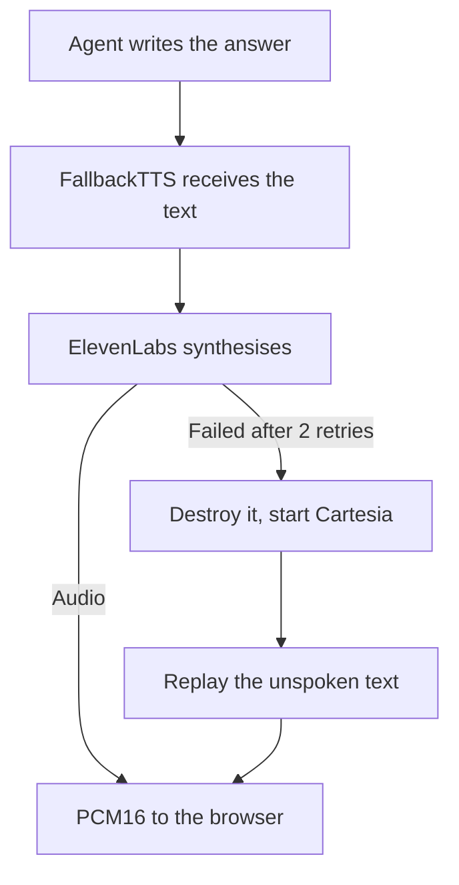

Teams look for an alternative to [ElevenLabs](/docs/ai-integration/provided-integrations/elevenlabs) when the voice engine of their agent starts to limit them: a plan that caps simultaneous calls, a per-character bill that grows with usage, customers who need the audio generated in Europe, or the wish to run the voice on their own servers. No single engine fixes all of that. Cartesia is built for a fast first word at a lower price, Gradium generates the audio in Europe, OpenAI uses the key your agent already has, and Kokoro, Piper, Pocket TTS and Qwen3-TTS run locally with no bill at all.

This article compares these engines on languages, voices, where they run and how they bill, then shows how to switch from ElevenLabs to one of them in a TypeScript voice agent built on Micdrop, where the change fits in one line of code.

## Why teams look for an ElevenLabs alternative

Most teams hit the concurrency ceiling first. Few of them knew it was there. Your plan sets how many syntheses ElevenLabs runs at the same time. The [model documentation](https://elevenlabs.io/docs/models) publishes the limits: 20 concurrent Flash requests on Pro, 30 on Scale, half those numbers on Multilingual v2. A blog reading feature never reaches that ceiling. A voice agent does, because every live call holds a slot for as long as the agent is talking.

ElevenLabs charges a credit per character on Multilingual v2 and half that on Flash. Those credits come in [plans](https://elevenlabs.io/pricing) running from $6 a month for 30,000 credits to $990 for six million. Your bill grows with how much your agent says. To budget calls, compare the [cost per hour of generated audio for each voice provider](/docs/ai-integration) rather than the price of a character.

Every hosted provider has outages. When text to speech fails, your agent goes silent while a caller waits for an answer. Configure a second engine before that happens, especially when the voice is your interface.

Data residency comes up with European buyers. Teams in health, education and the public sector ask where the audio is synthesised.

| Engine                                                              | Runs                         | Languages            | Voice catalog        | Reach for it when                              |
| ------------------------------------------------------------------- | ---------------------------- | -------------------- | -------------------- | ---------------------------------------------- |
| [ElevenLabs](/docs/ai-integration/provided-integrations/elevenlabs) | Hosted API                   | 29+                  | 1000+                | The voice is what sells the product            |
| [Cartesia](/docs/ai-integration/provided-integrations/cartesia)     | Hosted API                   | 15                   | 50+                  | The pause before the first word matters        |
| [Gradium](/docs/ai-integration/provided-integrations/gradium)       | Hosted API, EU endpoint      | 5                    | 150+                 | The audio has to stay in Europe                |
| [OpenAI](/docs/ai-integration/provided-integrations/openai)         | Hosted API                   | The one you write in | 13                   | You already hold an OpenAI key                 |
| [Kokoro](/docs/ai-integration/provided-integrations/kokoro)         | Your Node process            | English              | 28                   | The whole setup has to be one npm install      |
| [Piper](/docs/ai-integration/provided-integrations/piper)           | A subprocess you spawn       | 43                   | 100+, one file each  | The call happens in a language besides English |
| [Pocket TTS](/docs/ai-integration/provided-integrations/pocket-tts) | Your Node process            | English              | Cloned from a sample | A specific voice has to come back              |
| [Qwen3-TTS](/docs/ai-integration/provided-integrations/qwen-tts)    | An mlx-audio server on a Mac | 10                   | 9                    | A local voice takes style instructions         |

OpenAI's speech API takes no language parameter and speaks whatever text you send it. The `gpt-4o-mini-tts` model adds prosody instructions written in plain English, so you can ask it for a slower delivery or a French accent. Listen to OpenAI, ElevenLabs and Gradium back to back and OpenAI sounds the least polished. You stay with one vendor, though, since the same key covers the agent and the speech.

## Cartesia, when latency is the constraint

[Cartesia](https://cartesia.ai) built Sonic around time to first audio. A caller hears the gap between the end of their own sentence and the first syllable of the answer. Once the answer starts, nobody counts how fast the words come.

Cartesia also charges per character, less than ElevenLabs at every tier, with plans from $5 a month to $299 on [its pricing page](https://cartesia.ai/pricing). It covers fifteen languages, against at least twenty-nine at ElevenLabs. Its voice catalog is smaller too.

```typescript
import { CartesiaTTS } from '@micdrop/cartesia'

const tts = new CartesiaTTS({
  apiKey: process.env.CARTESIA_API_KEY || '',
  modelId: 'sonic-turbo',
  voiceId: process.env.CARTESIA_VOICE_ID || '',
  language: 'en',
})
```

Micdrop cuts the agent's answer into sentences and hands them to the engine one at a time, so the caller hears the opening line while the model is still writing the end of the paragraph. The caller waits once, before the first sentence starts, so a fast first syllable matters even more.

## Gradium, when the audio has to stay in Europe

[Gradium](https://gradium.ai) is a French provider covering both transcription and voice. Its API exposes an EU endpoint and a US one. The Micdrop integration sends everything to the EU by default, and the `region` option switches it to the US.

```typescript
import { GradiumTTS } from '@micdrop/gradium'

const tts = new GradiumTTS({
  apiKey: process.env.GRADIUM_API_KEY || '',
  voiceId: process.env.GRADIUM_VOICE_ID || '',
  region: 'eu',
})
```

Voice is one of the three parts of a call, so the residency answer holds only when the agent and the transcription stay in Europe too. [Mistral](/docs/ai-integration/provided-integrations/mistral) drives the agent and transcribes with Voxtral, while Gladia and Gradium both transcribe. With these three providers you can build a [sovereign voice AI pipeline that keeps the audio inside the European Union](/docs/ai-integration/sovereign-voice-ai). Compliance still depends on where you host and on the terms you sign with each provider.

## Kokoro, Piper, Pocket TTS and Qwen3-TTS, when the voice runs on your own machine

These four engines need no API key. The audio stays on your machine. Kokoro installs with one npm command and speaks English. Piper runs a small binary as a subprocess and covers 43 languages, more than the other three put together. Pocket TTS clones a voice from a few seconds of audio and speaks English. Qwen3-TTS goes through an mlx-audio server, which needs a Mac, and handles ten languages plus style instructions.

Run the voice yourself and you drop both the per-character bill and the residency question. In exchange, the first word comes later and you have one more service to keep running. Kokoro, Piper and Pocket TTS differ a lot on [local text to speech latency and memory](/blog/local-tts-node-kokoro-vs-piper), measured on the same laptop.

## Swapping one for another in a TypeScript pipeline

Every engine Micdrop packages extends the same abstract `TTS` class from `@micdrop/server`. The class takes a stream of text and emits PCM16 audio at 16 kHz, the format the browser client plays. Your own code never sees which provider produced the bytes.

A migration looks like this, in full:

```typescript
import { MicdropServer } from '@micdrop/server'
import { OpenaiAgent } from '@micdrop/openai'
import { GladiaSTT } from '@micdrop/gladia'
// Was: import { ElevenLabsTTS } from '@micdrop/elevenlabs'
import { CartesiaTTS } from '@micdrop/cartesia'

new MicdropServer(socket, {
  agent: new OpenaiAgent({
    apiKey: process.env.OPENAI_API_KEY || '',
    systemPrompt: 'You are a helpful assistant',
  }),
  stt: new GladiaSTT({ apiKey: process.env.GLADIA_API_KEY || '' }),
  tts: new CartesiaTTS({
    apiKey: process.env.CARTESIA_API_KEY || '',
    modelId: 'sonic-turbo',
    voiceId: process.env.CARTESIA_VOICE_ID || '',
  }),
})
```

The interruption handling, the sentence splitting, the WebSocket protocol and the browser playback stay untouched, because they were never provider-specific. Every integration implements `cancel()` on the same interface, so cutting the agent off mid-sentence works the same whichever engine is speaking.

One interface also makes A/B testing cheap. Read the provider from an environment variable, hand each call the engine you want to hear, and compare on real conversations rather than on the demo clips a vendor puts on its website.

## Writing your own integration for another provider

Micdrop packages eight engines, so the ninth is yours to write. Deepgram, Azure, Google and Amazon all publish streaming speech endpoints. So does a model you fine-tuned and host yourself.

To write your own, extend `TTS`, implement two methods, `speak(textStream)` and `cancel()`, then emit an `Audio` event per chunk. You can start from [two working custom TTS skeletons](/docs/ai-integration/custom-integrations/custom-tts), one for a WebSocket API that streams as it generates and one for an HTTP API that returns the whole clip. Your class then drops into the same `tts` slot as the packaged ones, and into `FallbackTTS` alongside them.

## Keeping a second engine ready with FallbackTTS

Your replacement engine usually makes the best backup, so configure both at once with [`FallbackTTS`](/docs/ai-integration/fallback-strategies/tts-fallback). It holds a list of factories, uses the first, and moves to the next when the current one gives up after its retries.

```typescript
import { FallbackTTS } from '@micdrop/server'
import { ElevenLabsTTS } from '@micdrop/elevenlabs'
import { CartesiaTTS } from '@micdrop/cartesia'

const tts = new FallbackTTS({
  factories: [
    () =>
      new ElevenLabsTTS({
        apiKey: process.env.ELEVENLABS_API_KEY || '',
        voiceId: process.env.ELEVENLABS_VOICE_ID || '',
        maxRetry: 2, // Give up early so the switch happens fast
      }),
    () =>
      new CartesiaTTS({
        apiKey: process.env.CARTESIA_API_KEY || '',
        modelId: 'sonic-turbo',
        voiceId: process.env.CARTESIA_VOICE_ID || '',
      }),
  ],
})
```

`FallbackTTS` keeps a copy of the text it sends. When a provider fails halfway through a sentence, the next engine picks up the words that never got spoken, so the caller hears the whole answer in a different voice.



Set `maxRetry` low on the first provider so the caller barely notices the switch. The default is three retries a second apart, which leaves the call silent for three seconds before the switch even starts, on top of the time each attempt takes to fail.

<Callout type="tip">
  The list rotates rather than ending, so the last provider hands back to the
  first. Put a local engine last and the call keeps a voice even while every
  hosted API you use is down.
</Callout>

## Which engine to pick

Stay on ElevenLabs when the voice itself is the product and your peak call count fits under your plan's concurrency limit. Cartesia, Gradium, OpenAI and the local engines all have smaller voice catalogs.

Switch to Cartesia when callers complain about the silence before the first word, and when the per-character bill has started to matter.

Pick Gradium when your buyer needs the audio synthesised in Europe. Before you promise anything, check how to [move the agent and the transcription to Europe with the voice](/docs/ai-integration/sovereign-voice-ai).

OpenAI suits a team that would rather keep one vendor for the agent and the voice, when the exact timbre matters less than the number of contracts.

A local engine makes the per-character bill disappear, as long as you have somewhere to run the model.

Whichever you pick, configure two of them. The second engine costs one factory function to write. You get that back the first time your main provider goes down mid-call.

## Frequently asked questions

<FaqList>
  <FaqItem question="What is the best ElevenLabs alternative for a voice agent?">
    It depends on which constraint pushed you off ElevenLabs. Cartesia is the
    closest match, a hosted streaming API billed per character and built around
    time to first audio. Gradium answers the European data residency question.
    Kokoro, Piper, Pocket TTS and Qwen3-TTS remove the bill entirely by running
    on your own hardware. All of them have a smaller voice catalog than
    ElevenLabs, so when your product sells on one specific voice, stay on
    ElevenLabs and add a fallback rather than switch.
  </FaqItem>
  <FaqItem question="Is there a free alternative to ElevenLabs?">
    Yes, if you count the engines you run yourself. Kokoro is Apache 2.0, Pocket
    TTS is MIT, Piper moved to GPL-3.0 when it absorbed espeak-ng, and all three
    generate audio on a laptop CPU with no API key. Qwen3-TTS is free too, and
    it runs through an mlx-audio server on a Mac. Free covers the software and
    the synthesis. You still pay for the machine that runs it and for the memory
    the model holds while your server is up. Hosted APIs offer free tiers
    instead, sized for trying a voice rather than for serving calls.
  </FaqItem>
  <FaqItem question="Which text to speech API has the lowest latency?">
    Cartesia Sonic and ElevenLabs Flash both compete on time to first audio.
    ElevenLabs [publishes around 75 ms of
    inference](https://elevenlabs.io/docs/models) for Flash, excluding the
    network. Treat every published number as a floor, since your own latency
    includes the round trip from your server and the provider's queue at that
    moment. Measure the engines you shortlisted from the region you deploy in,
    on sentences your agent actually says.
  </FaqItem>
  <FaqItem question="Can I use ElevenLabs and another provider at the same time?">
    Yes, and that is what `FallbackTTS` is for. It takes a list of factory
    functions, speaks through the first, and switches to the next when the
    current one fails after its retries, replaying the text that was never
    spoken. Lower `maxRetry` on the primary so the switch starts sooner, since
    every retry adds its delay to the silence. The voice changes mid-answer,
    which callers accept more easily than silence.
  </FaqItem>
  <FaqItem question="Is there a European alternative to ElevenLabs?">
    Gradium is the European voice provider Micdrop integrates. It is French, it
    covers both transcription and voice, and its API has an EU endpoint that the
    integration uses by default. For a whole call to stay in Europe the agent
    and the transcription have to follow. Mistral, Gladia and Gradium cover
    those three parts together in the sovereign voice AI guide. Micdrop makes
    that architecture possible. The compliance claim belongs to your deployment
    and to the contracts you sign with each provider.
  </FaqItem>
  <FaqItem question="How do I switch text to speech provider without rewriting my app?">
    Put the engine behind an interface. Micdrop does that with its abstract
    `TTS` class. Every integration emits PCM16 at 16 kHz and implements
    `cancel()`, so the sentence splitting, the interruption handling, the
    WebSocket and the browser playback stay the same whichever provider speaks.
    To change engine, you replace the object you pass to the `tts` option, for
    example `new ElevenLabsTTS(...)` with `new CartesiaTTS(...)`. For a provider
    with no package, you write your own class, two methods long, following the
    custom TTS guide.
  </FaqItem>
</FaqList>

---

The text-to-speech provider you pick on day one is the part of the stack most likely to change.

[Micdrop](/) keeps that decision reversible. The engines sit behind one interface in your own Node server, `FallbackTTS` keeps a second one ready, and you switch engine by replacing the line that creates it. You can [run a first voice call in about five minutes](/docs/getting-started), then [compare every voice provider side by side](/docs/ai-integration).
