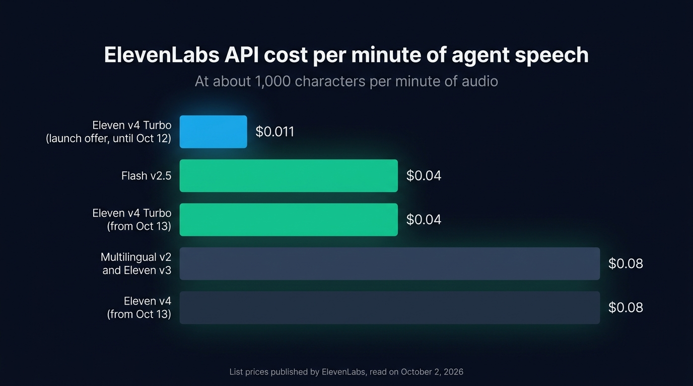
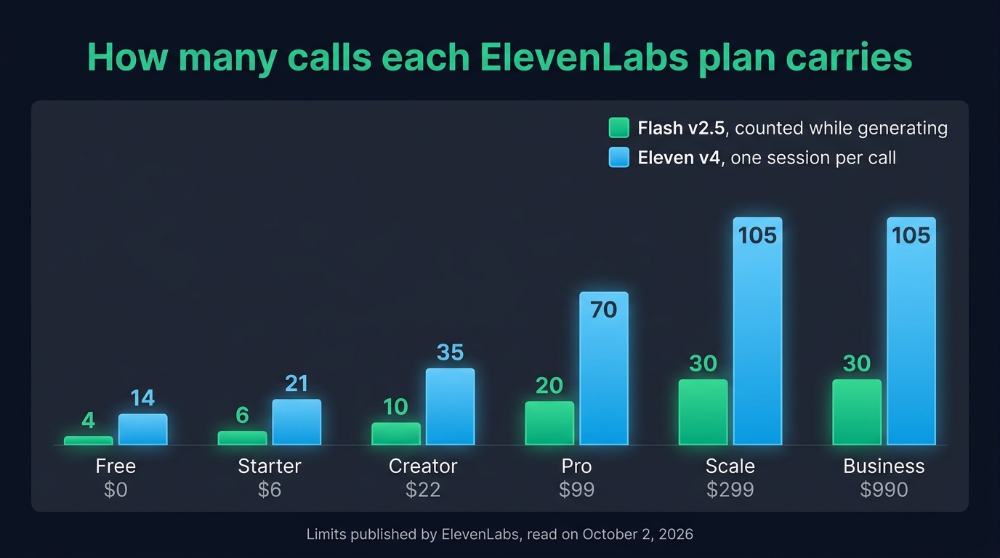
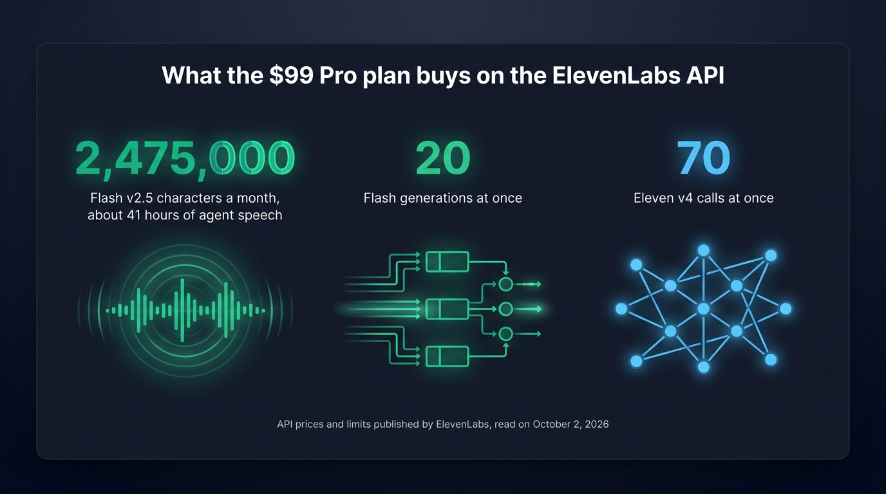

The ElevenLabs API costs $40 per million characters on Flash v2.5, its fastest model, and $80 per million on Multilingual v2, Eleven v3 and Eleven v4, at the list prices published on October 2, 2026. Eleven v4 Turbo lists at $40, like Flash v2.5. ElevenLabs sells Eleven v4 Turbo at $11 and Eleven v4 at $22 until October 12, 2026, as a launch offer. ElevenLabs counts about 1,000 characters per minute of audio, so a voice agent on Flash v2.5 costs about $0.04 for each minute it speaks. ElevenLabs charges the same price per character on every plan, so the plan you pick mostly sets your concurrency limit, from 4 Flash generations at once on the free plan to 30 on Scale.

We turn the ElevenLabs price list into the two numbers a voice agent needs: the cost of a minute of agent speech, model by model, and the number of calls you can run at once on each plan. All prices are the ones ElevenLabs publishes. Your own bill depends on how much your agent talks.

## How much the ElevenLabs API costs

ElevenLabs publishes [one API price per model](https://elevenlabs.io/pricing/api), the same on every plan:

| Model | Model ID | Price per 1,000 characters | Price per million characters |
| --- | --- | --- | --- |
| Flash v2.5 | `eleven_flash_v2_5` | $0.04 | $40 |
| Turbo v2.5 | `eleven_turbo_v2_5` | $0.04 | $40 |
| Multilingual v2 | `eleven_multilingual_v2` | $0.08 | $80 |
| Eleven v3 conversational | `eleven_v3_conversational` | $0.04 | $40 |
| Eleven v3 | `eleven_v3` | $0.08 | $80 |
| Eleven v4 Turbo | `eleven_v4_turbo` | $0.011 until October 12, then $0.04 | $11, then $40 |
| Eleven v4 | `eleven_v4` | $0.022 until October 12, then $0.08 | $22, then $80 |

ElevenLabs bills API usage in dollars rather than credits. Every plan includes a monthly allowance of characters. Once you use it up, you top up prepaid funds at the same price per character. The allowance of each paid plan is worth exactly its monthly fee:

| Plan | Monthly price | Flash v2.5 characters included | Multilingual v2 or Eleven v3 characters included |
| --- | --- | --- | --- |
| Free | $0 | 20,000 | 10,000 |
| Starter | $6 | 150,000 | 75,000 |
| Creator | $22 | 550,000 | 275,000 |
| Pro | $99 | 2,475,000 | 1,238,000 |
| Scale | $299 | 7,475,000 | 3,738,000 |
| Business | $990 | 24,750,000 | 12,375,000 |

ElevenLabs still [sells the same plans in credits](https://elevenlabs.io/pricing), 600,000 on Pro and 1.8 million on Scale. A Flash character sent through the API costs 0.5 to 1 credit. Credits are the unit of the ElevenLabs web app. For a voice agent calling the API, count in dollars, with the price of each model.

A bigger plan gives you more included characters and, up to Scale, a higher concurrency limit. The price of a character stays the same.

## Cost per minute of agent speech, by model

ElevenLabs bills the text your agent sends, while your users hear audio, so you need to convert characters into minutes. ElevenLabs uses about 1,000 characters per minute of audio in its own tables: its [model documentation](https://elevenlabs.io/docs/overview/models#character-limits) puts 40,000 characters of Flash at about 40 minutes. Conversational English runs at about 150 words a minute, which gives 800 to 900 characters once you count the spaces and punctuation. We count 1,000 characters per minute, like ElevenLabs, so the costs per minute in this article run slightly above what your agent actually spends.

| Model | Per minute of agent speech | Per hour of agent speech | 10 minute call, agent speaking half of it |
| --- | --- | --- | --- |
| Flash v2.5 | $0.04 | $2.40 | $0.20 |
| Eleven v3 conversational | $0.04 | $2.40 | $0.20 |
| Eleven v4 Turbo, until October 12 | $0.011 | $0.66 | $0.06 |
| Eleven v4 Turbo, from October 13 | $0.04 | $2.40 | $0.20 |
| Multilingual v2 | $0.08 | $4.80 | $0.40 |
| Eleven v3 | $0.08 | $4.80 | $0.40 |
| Eleven v4, from October 13 | $0.08 | $4.80 | $0.40 |

The 10 minute call is only an example. A minute of call costs less than a minute of agent speech, since the voice API bills only the minutes your agent speaks. An interviewer agent that asks short questions spends far less than a support agent that reads out procedures.

{/* IMAGE regen: api.py image, infographic, 1600x900. Scene: "A horizontal bar chart on a dark surface, five bars read from top to bottom, each with its label on the left and its value at the end of the bar. Bar 1 labelled 'Eleven v4 Turbo (launch offer, until Oct 12)', value '$0.011', the shortest bar, in sky blue. Bar 2 labelled 'Flash v2.5', value '$0.04', in bright emerald. Bar 3 labelled 'Eleven v4 Turbo (from Oct 13)', value '$0.04', in bright emerald. Bar 4 labelled 'Multilingual v2 and Eleven v3', value '$0.08', muted slate. Bar 5 labelled 'Eleven v4 (from Oct 13)', value '$0.08', muted slate. Bar lengths strictly proportional to the values: the $0.08 bars fill the full width, the $0.04 bars half of it, the $0.011 bar about one seventh. Title at the top in a modern clean bold sans-serif: 'ElevenLabs API cost per minute of agent speech'. Subtitle: 'At about 1,000 characters per minute of audio'. Small footer text: 'List prices published by ElevenLabs, read on October 2, 2026'. Flat vector style, generous spacing."
    Infographic only: regenerate if ElevenLabs changes its API prices. Last data sync: 2026-10-02. */}


{/* TODO ANECDOTE: give the average number of characters the agent speaks per call minute in Raconte, to replace the "speaking half of it" example with a measured ratio. */}

## ElevenLabs concurrency limits by plan

The concurrency limit matters more to a voice agent than the included characters, since prepaid funds buy more characters at the same price. Requests past the limit wait in a queue or get refused. ElevenLabs counts concurrency in two different ways, depending on the WebSocket the model streams over.

Flash v2.5, Turbo v2.5 and Multilingual v2 stream over the Text to Speech WebSocket. ElevenLabs counts only the time the model spends generating audio, so an open connection uses none of your limit while it waits. A limit of 20 gives you 20 slots. A slot is busy while the audio of an answer is being generated, then free again while that audio plays, so one slot serves several calls. ElevenLabs estimates in its [concurrency documentation](https://elevenlabs.io/docs/overview/models#concurrency-and-priority) that a limit of 5 serves about 100 simultaneous broadcasts. That makes 20 broadcasts per slot. A voice agent fits fewer calls per slot, since several users often stop talking at the same moment and their answers then wait for a free slot. Each answer that waits adds silence to its call.

Eleven v3 and v4 stream over the Text to Dialogue WebSocket, where ElevenLabs counts [dialogue sessions](https://elevenlabs.io/docs/overview/models#text-to-dialogue-concurrency) from a separate pool. Each open connection holds one session, generating or silent. A call keeps its connection, so it holds its session from the first second to the last.

| Plan | Monthly price | Flash and Turbo v2.5 generations | Multilingual v2 generations | Eleven v3 and v4 calls at once |
| --- | --- | --- | --- | --- |
| Free | $0 | 4 | 2 | 14 |
| Starter | $6 | 6 | 3 | 21 |
| Creator | $22 | 10 | 5 | 35 |
| Pro | $99 | 20 | 10 | 70 |
| Scale | $299 | 30 | 15 | 105 |
| Business | $990 | 30 | 15 | 105 |

These limits come from the ElevenLabs model documentation, read on October 2, 2026. The ElevenLabs pricing page lists 25 concurrent requests for Business, while the documentation gives 30 Flash generations and 15 Multilingual v2 generations, so ask ElevenLabs which figure applies before you choose Business for its concurrency. ElevenLabs raises the limits on request for Enterprise contracts.

{/* IMAGE regen: api.py image, infographic, 1600x900. Scene: "A grouped vertical bar chart on a dark surface. Six groups side by side, each labelled under the group with a plan name and its monthly price: 'Free $0', 'Starter $6', 'Creator $22', 'Pro $99', 'Scale $299', 'Business $990'. Each group has two bars with their value on top in large digits. Emerald bar 'Flash generations at once': 4, 6, 10, 20, 30, 30. Sky blue bar 'Eleven v4 calls at once': 14, 21, 35, 70, 105, 105. Bar heights strictly proportional to the values on one shared axis, the 105 bars being the tallest. Legend at the top right with the two colours: 'Flash v2.5, counted while generating' and 'Eleven v4, one session per call'. Title at the top in a modern clean bold sans-serif: 'How many calls each ElevenLabs plan carries'. Small footer text: 'Limits published by ElevenLabs, read on October 2, 2026'. Flat vector style, generous spacing."
    Infographic only: regenerate if ElevenLabs changes its concurrency or dialogue session limits. Last data sync: 2026-10-02. */}


On Pro, Flash can serve more than 20 calls at once, since a call only holds one of the 20 Flash slots while its answer is being generated. Eleven v4 stops at 70 calls, one per session.

The Text to Dialogue WebSocket refuses new connections past the limit, with `too_many_concurrent_requests`. Extra requests on the Text to Speech WebSocket wait in a queue for about 50 ms, according to the ElevenLabs documentation. The ElevenLabs help center describes an HTTP 429 error instead, so handle both. Every response carries the `current-concurrent-requests` and `maximum-concurrent-requests` headers. Log them during your busiest hour to see how close you run to the limit, then pick the plan whose limit covers that peak.

{/* IMAGE regen: api.py image, infographic, 1600x900. Scene: "A single wide card on a dark surface with a header in a modern clean bold sans-serif: 'What the $99 Pro plan buys on the ElevenLabs API'. Inside, three large figures side by side, each with a small caption under it. Left, in emerald: '2,475,000' with the caption 'Flash v2.5 characters a month, about 41 hours of agent speech'. Middle, in emerald: '20' with the caption 'Flash generations at once'. Right, in sky blue: '70' with the caption 'Eleven v4 calls at once'. Small footer text: 'API prices and limits published by ElevenLabs, read on October 2, 2026'. Flat vector style, generous spacing."
    Infographic only: regenerate if ElevenLabs changes its Pro plan. Last data sync: 2026-10-02. */}


## Lowering the bill

The price of a character is fixed, so your bill depends on the model you pick and on how much your agent says.

- Use Flash v2.5 by default. It costs half as much as Multilingual v2 and Eleven v3, answers the fastest and lets several calls share each slot.
- Keep Eleven v4 Turbo for the agents where expressiveness counts. After October 12, it costs the same as Flash and acts out [audio tags written by the LLM](/blog/elevenlabs-audio-tags-voice-agent), but each call holds one dialogue session for its whole length. We [tested Eleven v4 Turbo in a voice agent](/blog/eleven-v4-turbo-voice-agent) on launch day.
- Ask the LLM for short answers in its system prompt. Two sentences instead of five cut the voice bill of that turn by more than half. Users tend to interrupt long answers anyway.
- Check a second provider. Cartesia charges between $37 and $50 per million characters on its plans, about the price of Flash v2.5, so the cheaper of the two depends on your Cartesia plan. You can [compare Cartesia and ElevenLabs on price and concurrency](/blog/cartesia-vs-elevenlabs) before choosing which one your agent calls first.

A second provider also keeps calls going when you hit the concurrency limit. In [Micdrop](/), an open source TypeScript library for real-time voice conversations with AI, [`FallbackTTS`](/docs/ai-integration/fallback-strategies/tts-fallback) speaks through the first engine and moves to the next when the first one fails after its retries. When ElevenLabs refuses the connection of a v4 Turbo call because your plan has no dialogue session left, the retries fail too, so the call goes on with the backup voice:

```typescript
import { CartesiaTTS } from '@micdrop/cartesia'
import { ElevenLabsTTS } from '@micdrop/elevenlabs'
import { FallbackTTS } from '@micdrop/server'

const tts = new FallbackTTS({
  factories: [
    () =>
      new ElevenLabsTTS({
        apiKey: process.env.ELEVENLABS_API_KEY || '',
        voiceId: process.env.ELEVENLABS_VOICE_ID || '',
        modelId: 'eleven_v4_turbo',
        maxRetry: 1, // Switch fast when ElevenLabs refuses the session
      }),
    () =>
      new CartesiaTTS({
        apiKey: process.env.CARTESIA_API_KEY || '',
        modelId: 'sonic-3.6',
        voiceId: process.env.CARTESIA_VOICE_ID || '',
      }),
  ],
})
```

Each retry waits one second by default, so a low `maxRetry` on the first engine keeps the silence short before the switch. Cartesia reads the audio tags of v4 Turbo out loud, so strip them from the text the backup receives.

## The ElevenLabs API or ElevenLabs Agents

ElevenLabs also sells a hosted voice agent platform. [ElevenLabs Agents](https://elevenlabs.io/pricing/agents) charges $0.08 per minute of call on every plan, with the LLM billed on top (pricing read on October 2, 2026). That price covers every minute of the call, the user's turns and the silences included. The voice API charges only for what your agent says, but you have to build the rest of the call yourself: the microphone in the browser, speech detection, the transcription, the LLM, and a playback that stops when the user talks.

Micdrop handles all of that in TypeScript. `@micdrop/client` runs in the browser, `@micdrop/server` runs the pipeline in Node, and `@micdrop/elevenlabs` streams the voice over either ElevenLabs WebSocket. The two clients in that package take about 400 lines of TypeScript each, most of them spent on interruptions, reconnections and keep-alives. Micdrop is free under the MIT license and runs on your server with your own ElevenLabs key, so ElevenLabs bills you per character. In exchange, you host the server and build the call history and the dashboard a platform would give you. Products such as [Raconte](https://raconte.ai), built by Micdrop's maintainer, and [Cibli](https://cibli.fr) run on Micdrop.

If the concurrency limit or the price per character pushes you off ElevenLabs, look at the [ElevenLabs alternatives for a TypeScript voice agent](/blog/elevenlabs-alternatives-typescript). In Micdrop, each of them uses the same TTS interface as ElevenLabs.

## Frequently asked questions

<FaqList>
  <FaqItem question="Is the ElevenLabs API free?">
    ElevenLabs has a free plan with API access. It includes 10,000 characters a
    month on Multilingual v2 or Eleven v3, or 20,000 on Flash v2.5, about 10
    to 20 minutes of audio. The free plan is limited to non-commercial use,
    requires attribution and excludes voice cloning, so a production
    voice agent needs a paid plan.
  </FaqItem>
  <FaqItem question="How much does ElevenLabs cost per month?">
    The ElevenLabs plans cost $0 (Free), $6 (Starter), $22 (Creator), $99 (Pro),
    $299 (Scale) and $990 (Business) a month, with Enterprise on quote. On the
    API, each fee buys characters at the price of the model, for example
    2,475,000 Flash v2.5 characters on Pro. The plan also sets your
    concurrency limit, the number of calls your agent can run at once.
  </FaqItem>
  <FaqItem question="Which text to speech API is the cheapest?">
    Local engines such as Kokoro or Piper are the cheapest, since they run on
    your own server and cost nothing per character. Among the hosted voice APIs
    built for real-time agents, Eleven v4 Turbo costs $11 per million characters
    until October 12, 2026. After that date, ElevenLabs Flash v2.5 at $40 per
    million and the Cartesia plans at $37 to $50 per million cost about the
    same.
  </FaqItem>
  <FaqItem question="What is the ElevenLabs concurrency limit?">
    It depends on the plan and the model. Flash v2.5 runs 4 generations at once
    on Free, 20 on Pro and 30 on Scale, counted only while audio is being
    generated. Multilingual v2 gets half those numbers. For Eleven v3 and v4,
    ElevenLabs counts dialogue sessions instead, one per open connection: 14 on Free, 70 on Pro
    and 105 on Scale.
  </FaqItem>
  <FaqItem question="How many characters is one minute of ElevenLabs audio?">
    ElevenLabs counts about 1,000 characters per minute of audio in its own
    tables. Conversational English at about 150 words a minute gives 800 to 900
    characters, so 1,000 per minute slightly overestimates what a voice agent
    spends.
  </FaqItem>
</FaqList>

---

For a voice agent, ElevenLabs costs about $0.04 per minute of speech on Flash v2.5 and twice that on Multilingual v2, or on Eleven v4 from October 13. ElevenLabs charges the same price per character on every plan, so choose your plan by the concurrency limit your busiest hour needs.

[Micdrop](/) streams every ElevenLabs model from your own server, with your own key, through its [ElevenLabs integration](/docs/ai-integration/provided-integrations/elevenlabs). Switching between Flash v2.5 and v4 Turbo means changing `modelId`. You can [run a first voice call in about five minutes](/docs/getting-started).
