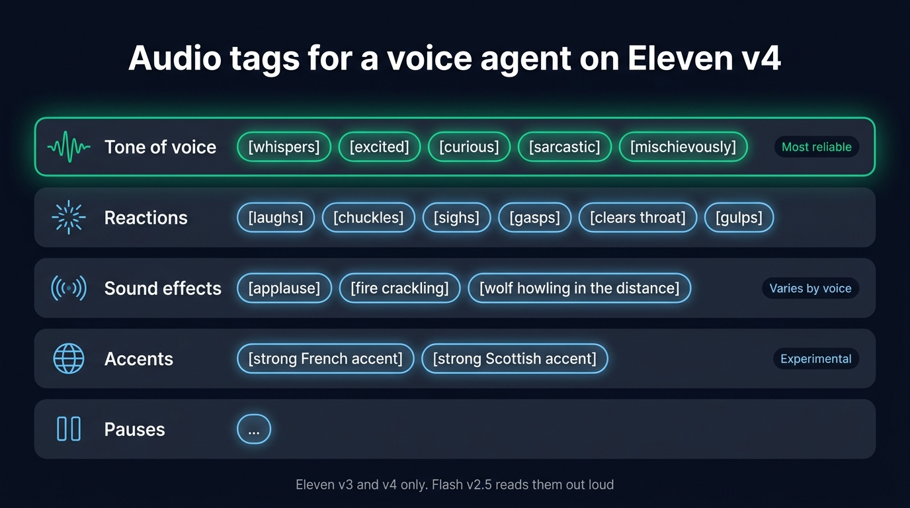
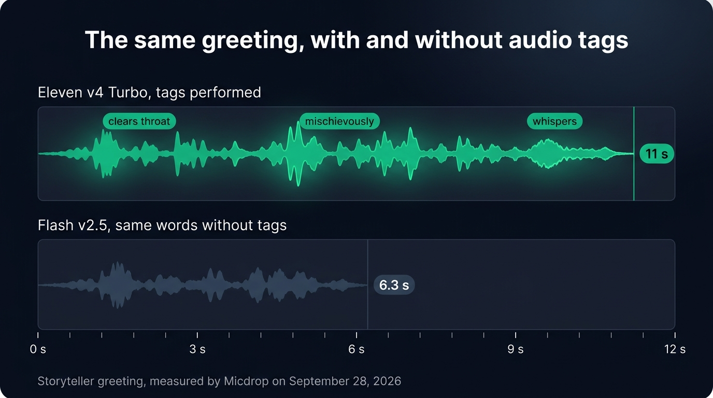
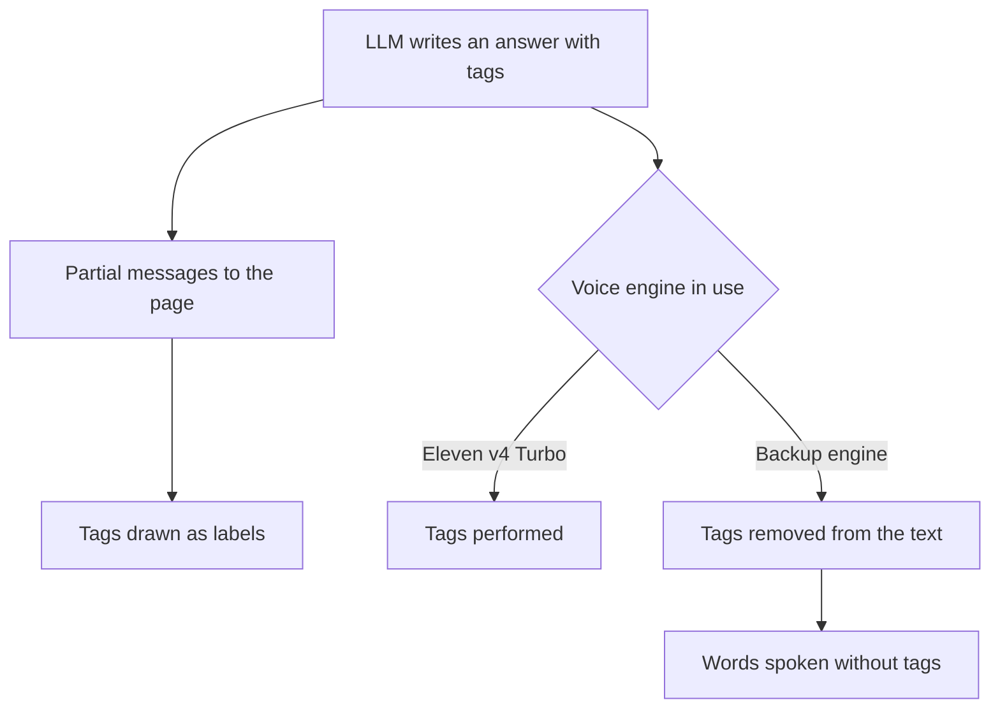

ElevenLabs audio tags are short directions in square brackets, such as `[laughs]`, `[whispers]` or `[sighs]`, that the voice performs instead of reading. Only Eleven v3 and Eleven v4 (v4 Turbo included) perform them. In a real-time voice agent, the LLM writes the tags into its answer as it streams. So list the tags it may use in the system prompt, set them apart from the words on screen, and strip them from the text before a backup voice engine reads them, or the user hears "laughs" in the middle of a sentence. This guide shows each step with code.

We tried everything here with Eleven v4 Turbo on September 28, 2026, in a storyteller agent built on [Micdrop](/), an open source TypeScript library for real-time voice conversations with AI. The [storyteller demo](https://github.com/Godefroy/micdrop/tree/main/examples/demo-storyteller) is on GitHub if you want to hear the result.

## What audio tags are

An audio tag is a word or a short phrase in square brackets, placed next to the words it changes, that tells an expressive text to speech model how to say those words or which sound to add. Tags cover the tone of voice (`[excited]`, `[sarcastic]`), reactions (`[laughs]`, `[gulps]`), sound effects (`[applause]`) and free directions (`[strong French accent]`). The model performs each tag instead of saying its words.

ElevenLabs introduced tags with Eleven v3 and kept them in Eleven v4. The older models read them out loud. We ran a tagged sentence through Flash v2.5 and transcribed its audio with Whisper, which returned "Laughs, oh, that is a good one, whispers, come closer." The transcript of the same sentence spoken by Eleven v4 Turbo contained no tag word at all.

| Model                                | Model ID                                      | What it does with `[laughs]` |
| ------------------------------------ | --------------------------------------------- | ---------------------------- |
| Eleven v4 Turbo                      | `eleven_v4_turbo`                             | Laughs                       |
| Eleven v4                            | `eleven_v4`                                   | Laughs                       |
| Eleven v3 and v3 conversational      | `eleven_v3`, `eleven_v3_conversational`       | Laughs                       |
| Flash v2.5                           | `eleven_flash_v2_5`                           | Says "laughs"                |
| Turbo v2.5 and Multilingual v2       | `eleven_turbo_v2_5`, `eleven_multilingual_v2` | Says "laughs"                |

Eleven v4 Turbo is the model to use with tags in a voice agent, since it [starts speaking far sooner than v4 or v3](/blog/eleven-v4-turbo-voice-agent).

## The tags that work in a live agent

ElevenLabs lists [the tags it tested with Eleven v4](https://elevenlabs.io/docs/overview/capabilities/text-to-speech/best-practices#prompting-eleven-v4). Eleven v4 also follows directions beyond that list, with less predictable results. Here are the tags worth giving a live agent, grouped by family:

| Family          | Tags                                                                                 | How reliably they play                                                    |
| --------------- | ------------------------------------------------------------------------------------ | ------------------------------------------------------------------------- |
| Tone of voice   | `[whispers]`, `[excited]`, `[curious]`, `[sarcastic]`, `[mischievously]`, `[nervously]` | The most reliable, since they describe the voice                          |
| Reactions       | `[laughs]`, `[chuckles]`, `[sighs]`, `[gasps]`, `[clears throat]`, `[gulps]`           | Reliable when the voice was recorded laughing or sighing                  |
| Sound effects   | `[applause]`, `[fire crackling]`, `[wolf howling in the distance]`                    | Less predictable, depending on the voice                                  |
| Accents         | `[strong French accent]`, `[strong Scottish accent]`                                  | ElevenLabs calls them experimental, so test them on your voice            |
| Pauses          | an ellipsis, `...`                                                                    | Plays as a pause, in place of the SSML `<break>` tag that v3 and v4 ignore |

According to ElevenLabs, a tag plays more readily when the voice already has that delivery in its training data, so a voice recorded whispering will whisper on cue. A tag that describes the voice, like `[whispers]` or `[low, gravelly voice]`, also plays more reliably than a sound effect like `[applause]`. Choose the tags first, then pick the voice that performs them best by listening to a few answers from each candidate.

{/* IMAGE regen: api.py image, infographic, 1600x900. Scene: "A cheat sheet laid out as five horizontal rows on a dark surface, each row a rounded panel with a small line icon on the left, a row title, then the tags written as pill-shaped chips. Row 1 icon: a sound wave, title 'Tone of voice', chips '[whispers]' '[excited]' '[curious]' '[sarcastic]' '[mischievously]', the whole row outlined in bright emerald, with a small label on the right 'Most reliable'. Row 2 icon: a small burst, title 'Reactions', chips '[laughs]' '[chuckles]' '[sighs]' '[gasps]' '[clears throat]' '[gulps]'. Row 3 icon: concentric waves, title 'Sound effects', chips '[applause]' '[fire crackling]' '[wolf howling in the distance]', with a small label on the right 'Varies by voice'. Row 4 icon: a globe, title 'Accents', chips '[strong French accent]' '[strong Scottish accent]', with a small label on the right 'Experimental'. Row 5 icon: a pause symbol, title 'Pauses', one chip '...'. Title at the top in a modern clean bold sans-serif: 'Audio tags for a voice agent on Eleven v4'. Small footer text: 'Eleven v3 and v4 only. Flash v2.5 reads them out loud'. Generous spacing, flat vector style."
    Infographic only: regenerate if ElevenLabs changes its tested tags. Last data sync: 2026-09-30. */}


## Prompting the LLM to write tags

The LLM needs three things from the system prompt: the list of tags it may use, how many per answer, and where to put them. Here is the part of the storyteller's prompt that deals with tags:

```text
Your voice performs audio tags: short directions in square brackets, placed right before the words they change. Use one to three in each answer, where they bring the scene to life:
- How you speak: [whispers], [excited], [curious], [mischievously], [nervously], [shouts]
- How you react: [laughs], [chuckles], [sighs], [gasps], [clears throat], [gulps]
- What the traveler hears around the fire: [fire crackling], [wolf howling in the distance], [owl hooting]
Use an ellipsis for a dramatic pause. The words of the story never go inside brackets.
```

Each instruction in that prompt fixes a problem we hit:

- The list keeps the LLM on tags you have heard with your voice. Without a list, it invents tags like `[with a warm smile]` that nobody has tried.
- The limit per answer keeps the acting light. Without a limit, the LLM tags every sentence and the voice overacts. One to three tags in an answer of two to four sentences sounds natural for a storyteller, while a support agent needs one or none.
- The rule on brackets keeps the words audible. An LLM sometimes writes `[whispers come closer]`. The voice then takes the whole bracket as a direction and never says "come closer".

Start the call with a first message that already carries tags. The storyteller opens with `[clears throat] Ah, a traveler! Come, sit by the fire. [mischievously] I know a story or two... Would you like a scary one, or a funny one? [whispers] Choose carefully.` The voice sets the tone from the first second. The LLM also finds that message in its history and writes its answers in the same style.

Tags also make answers last longer. The tagged greeting took 11 seconds on Eleven v4 Turbo, against 6.3 seconds for the same words without tags on Flash v2.5. The throat clearing, the pauses and the whisper account for part of that difference, so ask for shorter answers than you would without tags.

{/* IMAGE regen: api.py image, infographic, 1600x900. Scene: "Two horizontal lanes stacked on a dark surface, sharing one time axis from "0 s" on the left to "12 s" on the right, with ticks at "0 s", "3 s", "6 s", "9 s", "12 s". Lane 1 titled "Eleven v4 Turbo, tags performed": an emerald audio waveform running from 0 to the 11 s mark, with three small emerald pill labels sitting above the wave at the moments they are performed, reading "clears throat", "mischievously" and "whispers", and a value at the end of the wave "11 s". Lane 2 titled "Flash v2.5, same words without tags": a muted slate audio waveform running from 0 to the 6.3 s mark, with the value "6.3 s" at its end. Title at the top in a modern clean bold sans-serif: "The same greeting, with and without audio tags". Small footer text: "Storyteller greeting, measured by Micdrop on September 28, 2026". Flat vector style, generous spacing."
    Infographic only: regenerate if the greeting is measured again. Last data sync: 2026-09-28. */}


## Showing tags in the interface

The tags stay in the text of the answer, so they reach every place that text goes: the conversation the client receives, the transcript you store, and the partial messages that show the answer as it is written. A page that prints the answer unchanged shows `[whispers]` in the middle of the sentence.

You can set each tag apart from the words, so the user sees how the voice says them. The storyteller shows each tag as a small label. Its partial messages reach the page before the audio plays, so each label appears just before the voice performs the tag:

```typescript
// Splits an answer into words and tags, to draw each tag as a label
function renderTags(text: string): Node[] {
  return text
    .replace(/\[[^\]]*$/, '') // A tag still being written
    .split(/(\[[^\]]+\])/)
    .filter(Boolean)
    .map((part) => {
      if (!/^\[[^\]]+\]$/.test(part)) return document.createTextNode(part)
      const tag = document.createElement('span')
      tag.className = 'tag'
      tag.textContent = part.slice(1, -1)
      return tag
    })
}
```

The `replace` call hides a tag still being written. Partial messages arrive a few words at a time, so a tag can show up cut in half, as `[whis`, until its closing bracket comes in.

For a support agent or an interview, remove the tags instead, with `text.replace(/\[[^\]]*\]\s*/g, '')`. Do the same before you store, summarize or search a transcript, since a transcript full of `[sighs]` reads badly.

## When the voice falls back to a model that reads tags

A voice agent in production needs a backup voice engine for the day ElevenLabs fails. The backup gets the same text, tags included. If it is Flash v2.5, the OpenAI voices, or any engine that reads what it is given, the user hears "sighs" in the middle of the answer.

Telling the LLM to stop writing tags when the backup takes over comes too late. The conversation history already holds answers with tags, so the LLM follows those examples and goes on writing tags after the switch. Remove the tags from the text on its way to the backup engine instead.



In Micdrop, a voice engine is a class with a `speak()` method that receives the answer as a stream of text. A wrapper of about 40 lines strips the tags from that stream and hands the words to any engine. It holds back an unclosed bracket, since the LLM streams its answer a few characters at a time and a tag can arrive in two pieces:

```typescript
import { TTS } from '@micdrop/server'
import { Readable, Transform } from 'stream'

const TAG = /\[[^\]]*\]\s*/g

// Removes the audio tags from the answer, even when a tag arrives in pieces
function stripTags() {
  let pending = ''
  return new Transform({
    transform(chunk, _encoding, callback) {
      pending += chunk.toString()
      // Hold back a tag that is still open until its closing bracket arrives
      const open = pending.lastIndexOf('[')
      const end = open > pending.lastIndexOf(']') ? open : pending.length
      const text = pending.slice(0, end).replace(TAG, '')
      pending = pending.slice(end)
      if (text) this.push(text)
      callback()
    },
    flush(callback) {
      callback(null, pending.replace(TAG, ''))
    },
  })
}

// Wraps a voice that reads tags out loud, so it only speaks the words
export class TaglessTTS extends TTS {
  constructor(private readonly tts: TTS) {
    super()
    tts.on('Audio', (audio) => this.emit('Audio', audio))
    tts.on('Failed', (texts) => this.emit('Failed', texts))
  }

  speak(textStream: Readable) {
    this.tts.speak(textStream.pipe(stripTags()))
  }

  cancel() {
    this.tts.cancel()
  }

  destroy() {
    super.destroy()
    this.tts.destroy()
  }
}
```

Then list both engines in [a text to speech fallback](/docs/ai-integration/fallback-strategies/tts-fallback). `FallbackTTS` moves to the next engine when `ElevenLabsTTS` fails after its retries and replays the unspoken text to it. `TaglessTTS` strips the tags from that text too:

```typescript
import { CartesiaTTS } from '@micdrop/cartesia'
import { ElevenLabsTTS } from '@micdrop/elevenlabs'
import { FallbackTTS } from '@micdrop/server'

const tts = new FallbackTTS({
  factories: [
    () =>
      new ElevenLabsTTS({
        apiKey: process.env.ELEVENLABS_API_KEY || '',
        voiceId: process.env.ELEVENLABS_VOICE_ID || '',
        modelId: 'eleven_v4_turbo',
        maxRetry: 2,
      }),
    () =>
      new TaglessTTS(
        new CartesiaTTS({
          apiKey: process.env.CARTESIA_API_KEY || '',
          modelId: 'sonic-3.6',
          voiceId: process.env.CARTESIA_VOICE_ID || '',
        })
      ),
  ],
})
```

A Flash v2.5 backup keeps the same voice, but it only helps when the v4 models fail. Another provider keeps the agent talking through a full ElevenLabs outage. To choose another provider, compare the [alternatives to ElevenLabs](/blog/elevenlabs-alternatives-typescript) and pick the voice closest to your ElevenLabs voice.

## Running a tagged voice agent with Micdrop

Micdrop runs the whole call in TypeScript: `@micdrop/client` handles the microphone, the speech detection and the playback in the browser, and `@micdrop/server` runs the transcription, the LLM and the voice in Node. For audio tags, you write the system prompt and the `TaglessTTS` wrapper. The Micdrop packages already provide:

- the Eleven v4 client in `@micdrop/elevenlabs`, about 400 lines that open the Text to Dialogue WebSocket, make ElevenLabs speak each sentence as soon as it ends, keep an ellipsis inside its sentence as a pause, and reconnect when the user interrupts
- the `partialMessages` option, which sends each answer to the page as it is written, tags included
- the `firstMessage` option, which speaks a tagged greeting and adds it to the LLM's history
- `FallbackTTS`, and a voice engine interface simple enough to wrap in about 40 lines

A hosted platform handles the same work and charges by the minute. ElevenLabs Agents charged $0.08 a minute on every plan, with the LLM billed on top, when we read [its pricing](https://elevenlabs.io/pricing/agents) on September 24, 2026. Micdrop is MIT licensed and runs on your server with your own keys, so for the voice you pay ElevenLabs its price per character, with no Micdrop fee on top. In exchange, you host the server yourself and build the call history and the dashboard a platform would give you.

You can copy a system prompt for tags, and compare the models and their options, when you [set up ElevenLabs in Micdrop](/docs/ai-integration/provided-integrations/elevenlabs).

## Frequently asked questions

<FaqList>
  <FaqItem question="What are audio tags in ElevenLabs?">
    Audio tags are directions in square brackets, such as `[laughs]`,
    `[whispers]` or `[excited]`, placed next to the words they change. Eleven v3
    and Eleven v4 perform them instead of saying them. Flash v2.5,
    Turbo v2.5 and Multilingual v2 read them out loud.
  </FaqItem>
  <FaqItem question="What are some common emotion tags in ElevenLabs v3?">
    The emotion tags ElevenLabs lists for v3 and v4 include `[excited]`,
    `[curious]`, `[sarcastic]`, `[mischievously]`, `[whispers]` and `[crying]`,
    along with reactions such as `[laughs]` and `[sighs]`. Tags that describe
    the voice play more reliably than sound effects such as `[applause]`.
  </FaqItem>
  <FaqItem question="How do you make ElevenLabs sigh?">
    Write `[sighs]` right before the words said with a sigh, and use Eleven v3
    or v4. For a longer breath, `[exhales]` also works. A voice recorded
    sighing performs it more readily. Lowering the stability setting gives the
    voice more room to act.
  </FaqItem>
  <FaqItem question="Is there a full list of ElevenLabs audio tags?">
    ElevenLabs publishes only the tags it tested, in its guide to prompting
    Eleven v4. Eleven v4 also follows free directions such as
    `[strong French accent]` or `[low, gravelly voice]`. In a voice agent, list
    in the system prompt only the tags you have heard work with your voice.
  </FaqItem>
  <FaqItem question="How do you add expression in ElevenLabs?">
    On Eleven v3 and v4, add audio tags and lower the stability setting, which
    widens the emotional range of the voice. Use an ellipsis for a pause. On
    Flash v2.5 and the other v2 models, which read tags aloud, express the emotion
    with punctuation and the choice of words.
  </FaqItem>
</FaqList>

---

Audio tags give a voice agent a laugh, a whisper and a pause. To make them work, list them in the system prompt, set them apart from the words on screen, and strip them before any engine that reads them out loud.

[Micdrop](/) connects to Eleven v4 Turbo, streams the partial messages and runs the fallback on your own Node server, while its client handles the microphone in the browser. You can [run a first voice call in about five minutes](/docs/getting-started), then set `modelId: 'eleven_v4_turbo'` and give the LLM its tags.
