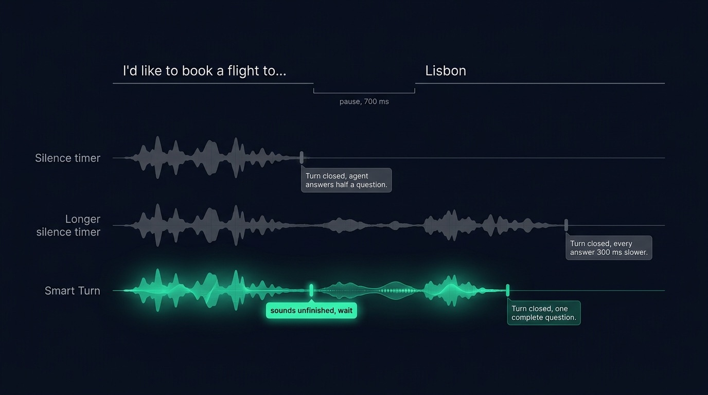
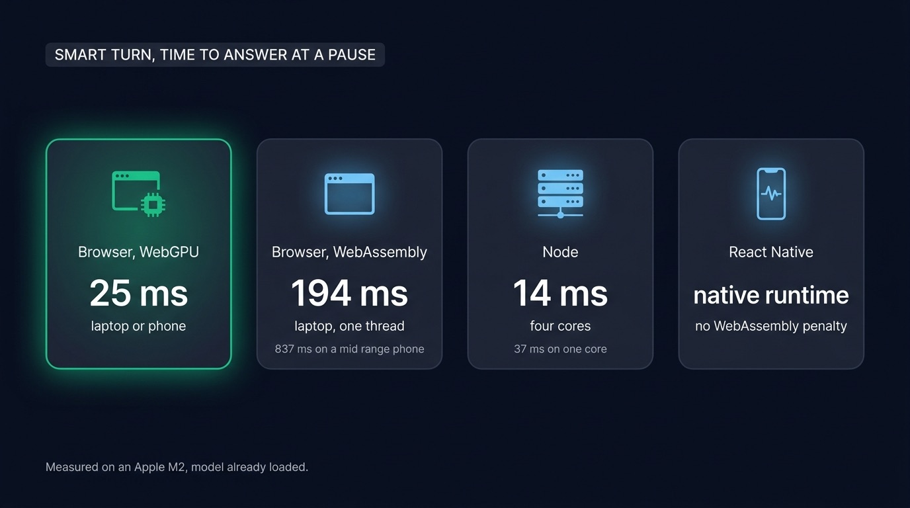
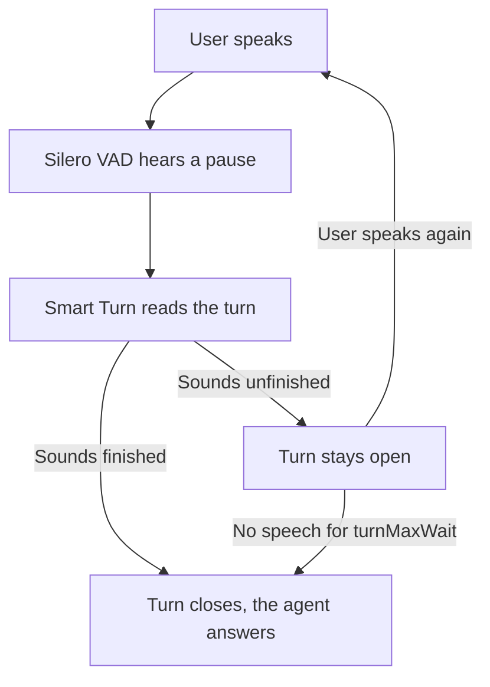

Most voice agents decide that you stopped talking when they hear a set length of silence after your last word. A timer cannot tell the end of a question from a speaker who pauses mid sentence to find a word. End of turn detection checks each pause before the agent answers. A model listens to the sound of the sentence, like Smart Turn or the detector in LiveKit's agent framework, or a language model reads the transcript and judges whether the thought is complete. Listening to the sound is the faster of the two. Smart Turn, an open model that listens this way, now also runs in TypeScript, in a browser, on a phone or in Node.

## A silence timer cuts people off or slows every answer

"I'd like to book a flight to..." The speaker stops to remember the city. A [voice activity detector](/blog/voice-activity-detection-browser) hears only silence there and starts counting. When the count reaches its limit, the turn closes and the agent answers half a question. The user then has to talk over it or start again.

A longer wait fixes the cut and costs time on every exchange. [Micdrop](/), our open source TypeScript library for voice agents, can run the Silero voice detector in the browser and close a turn after a set number of Silero windows of silence. The default used to be twenty windows, which closed turns about 1060 ms after the last word. It is eight today, which closes them in 760 ms. We measured both on a MacBook Pro M2, in Chromium, over the French half of the Smart Turn test set. Three hundred milliseconds look small on paper, yet users hear them on every single answer.

No silence length suits every speaker. A fast talker in a quiet office wants the short one, while someone dictating an address on a phone needs the long one. The way out is to judge the end of the sentence from something other than silence.

## Three signals can end a turn

| Signal | What it reads | Examples | Cost at each pause | Where it fails |
|---|---|---|---|---|
| Silence | How long nobody has spoken | Any VAD alone | Nothing | Cuts off hesitations, or slows every answer |
| Sound of the sentence | Intonation, rhythm and the trailing words, in the audio | Smart Turn, LiveKit's audio turn detector | 10 to 40 ms on a processor | A sentence that is complete yet announces more |
| Words of the sentence | The transcript | A language model asked through a tool | A round trip to the model, and its tokens | Waits for the transcript, so it adds latency |

The audio model and the language model both work on top of the voice detector. Each of them runs when the VAD hears a pause, and decides whether that pause ends the turn.

{/* IMAGE regen: api.py image, infographic, 1600x900. Scene: "Three horizontal timelines stacked vertically on the dark background, all aligned on the same time axis that runs left to right. All labels in English, rendered exactly as written. Above the three timelines, a single line of spoken text spans the width, split in two parts by a gap: on the left, I'd like to book a flight to..., then a gap of empty space, then on the right, Lisbon. Under the gap, a small bracket labelled: pause, 700 ms. Timeline 1, labelled on its left: Silence timer. Its audio waveform stops at the start of the gap, and a dim grey marker sits inside the gap with the caption: Turn closed, agent answers half a question. Timeline 2, labelled on its left: Longer silence timer. Its marker sits far to the right, after Lisbon, with the caption: Turn closed, every answer 300 ms slower. Timeline 3, labelled on its left: Smart Turn, and drawn brighter than the other two, the focal point, with an emerald waveform. At the start of the gap a small emerald badge reads: sounds unfinished, wait. Its marker sits right after Lisbon with the caption: Turn closed, one complete question. Flat vector geometric rendering, straight-on frontal view, generous dark margins, all typography perfectly legible."
    Regenerate if the example sentence or the measured delays change. Last data sync: 2026-10-03. */}


## Smart Turn listens to whether the sentence sounds finished

[Smart Turn](https://huggingface.co/pipecat-ai/smart-turn-v3) is an open turn detection model published by Daily, the company behind the Pipecat voice agent framework, under the BSD 2 clause licence. It is a Whisper Tiny audio encoder with a small classifier on top, 8 million parameters in all. It reads up to the last eight seconds of a turn and answers with one probability that the speaker has finished. The current checkpoints cover 23 languages and weigh about 8 MB quantised for a processor, 31 MB at full precision.

The audio holds what a transcript loses. A "to..." spoken with a voice that stays up and trails off sounds unfinished in any language. The model hears it straight from the audio, without waiting for a transcript. It also answers fast enough to run at every pause. Pipecat itself uses Smart Turn as its default way of ending a turn.

We checked the two checkpoints on 240 turns of the model's own test set, half French and half English:

| Checkpoint | Size | French | English |
|---|---|---|---|
| Full precision | 31 MB | 95.8% | 99.2% |
| Quantised | 8.3 MB | 93.3% | 96.7% |

LiveKit went the same way. Its newer turn detector also reads the audio, covers 14 languages, and works from both its Python and Node SDKs. The full model runs on LiveKit Inference, the company's hosted service, while a smaller version runs locally on the processor. Both ship under the LiveKit Model License. The older LiveKit detector, built on a small Qwen language model, read the transcript in 50 to 160 ms per turn. LiveKit now marks it as deprecated.

The OpenAI Realtime API has its own version, called semantic VAD. A turn detection model scores the end of the sentence. The API turns that score into a wait capped at 2, 4 or 8 seconds depending on an `eagerness` setting. It only exists inside that API.

## Asking the language model whether the thought is complete

A language model reading the transcript catches the sentences that sound finished and are not. "There are two things I want to change." The voice drops at the end and the grammar is complete, yet the user is obviously about to list them.

Micdrop's server can put that question to the agent. `autoSemanticTurn` gives the language model a tool it calls when the last message is an incomplete thought. The server then [holds the answer back and waits for the rest](/docs/server/semantic-turn-detection), which arrives as a second user message.

```typescript
const agent = new OpenaiAgent({
  apiKey: process.env.OPENAI_API_KEY || '',
  systemPrompt: 'You are a helpful assistant',
  autoSemanticTurn: true,
})
```

The option costs a full round trip to the model and its tokens on every pause. That cost matters little when the agent already takes time to think between turns, which makes those calls the right place for it. When Smart Turn runs in the browser, start without this option and add it once you meet sentences the audio model gets wrong.

## Running Smart Turn in the browser and in Node

Pipecat runs Smart Turn from Python. Micdrop publishes `@micdrop/smart-turn`, which runs the same model in TypeScript, on the ONNX runtime of the browser, of React Native and of Node. The package computes the Whisper audio features itself, eighty frequency bands every ten milliseconds, and depends on no other Micdrop package.

In a Micdrop call, hand it to the client:

```typescript
import { Micdrop } from '@micdrop/web'
import { SmartTurn } from '@micdrop/smart-turn'
import '@micdrop/smart-turn/web'

await Micdrop.start({
  url: 'wss://your-app.com/call',
  vad: 'silero',
  turnDetector: new SmartTurn(),
})
```

Any other voice application can call it directly. Feed it the audio while the user speaks, ask it at each pause, and reset it for the next turn:

```typescript
const smartTurn = new SmartTurn()
await smartTurn.load()

smartTurn.push(samples, 48000) // every chunk of microphone audio
const { complete, probability } = await smartTurn.predict() // at a pause
smartTurn.reset() // once the turn is over
```

The browser runtime picks WebGPU when the browser offers it, and falls back to WebAssembly otherwise. We timed how long the model takes to answer once the speaker pauses, on an Apple M2 in Chromium, and emulated phones with a processor four and six times slower:

| Where | Backend | Laptop | Mid range phone | Slow phone |
|---|---|---|---|---|
| Browser | WebGPU | 25 ms | 26 ms | 27 ms |
| Browser | WebAssembly, one thread | 194 ms | 837 ms | 1244 ms |
| Browser | WebAssembly, four threads | 68 ms | 232 ms | 345 ms |
| Node | One core | 37 ms | | |
| Node | Four cores | 14 ms | | |

On WebGPU the time barely changes from one device to the next, since the graphics card does the work. Chrome, Edge, Safari on iOS 26 and Samsung Internet all offer it. On a phone without WebGPU, the WebAssembly path takes between a quarter of a second and more than a second. Two options work better there. A React Native app runs the model on the [native ONNX runtime of the phone](/docs/react-native/turn-detection). A web app can run the same `SmartTurn` object on its server instead:

```typescript
new MicdropServer(socket, { agent, stt, tts, turnDetector: new SmartTurn() })
```

The server only hears the pause after the browser has already closed its turn, so it can only decide to wait longer. Prefer the [client side detector](/docs/client/turn-detection) wherever the browser offers WebGPU.

{/* IMAGE regen: api.py image, infographic, 1600x900. Scene: "A clean comparison board of four modular cards in a single row on the dark background, each card a rounded rectangle with a small glyph at the top, a title, and one large number. All labels in English, rendered exactly as written. A heading strip at the top left reads: SMART TURN, TIME TO ANSWER AT A PAUSE. Card 1, glyph of a browser window with a small chip, title: Browser, WebGPU, large number: 25 ms, caption under it: laptop or phone. This card glows emerald and is the focal point. Card 2, glyph of a browser window, title: Browser, WebAssembly, large number: 194 ms, caption: laptop, one thread. Under it a smaller line: 837 ms on a mid range phone. Card 3, glyph of a server rack, title: Node, large number: 14 ms, caption: four cores. Under it a smaller line: 37 ms on one core. Card 4, glyph of a phone, title: React Native, large number: native runtime, caption: no WebAssembly penalty. Cards 2 to 4 use sky blue accents, softer than card 1. Footer line at the bottom left in small text: Measured on an Apple M2, model already loaded. Flat vector geometric rendering, straight-on frontal view, even spacing, generous dark margins, all typography perfectly legible."
    Regenerate if the measurements in the @micdrop/smart-turn README change. Last data sync: 2026-10-03. */}


## Combining Smart Turn with Silero VAD

The two models split the work. [Voice activity detection](/docs/client/vad) decides which audio is worth sending, so silences stay out of the stream and the speech to text bill stays the same. Smart Turn decides when the server is told to answer. During a pause in the middle of a sentence, the client sends nothing and the stream on the server stays open, so the agent receives one user message instead of two.



A VAD reports a pause only after a stretch of silence. If Smart Turn heard that silence, it would take it for a finished sentence, even in the middle of a hesitation. So `@micdrop/smart-turn` gives the model the audio only up to shortly after the last word. On the test set, the model flagged 94% of the unfinished sentences with that trimmed audio, against 82% when it also heard half a second of silence and 78% with a second and a half.

Since the model handles hesitations, the VAD can stop covering for them. That is why Micdrop's Silero default came down from twenty windows of silence to eight, which closes each turn 300 ms sooner. When you turn the detector off, put the longer wait back:

```typescript
import { Micdrop, SileroVAD } from '@micdrop/web'

// Without turn detection, the silence has to cover the hesitations alone
await Micdrop.start({
  url: 'wss://your-app.com/call',
  vad: new SileroVAD({ redemptionFrames: 20, minSpeechFrames: 8 }),
})
```

## Tuning the threshold and the wait limit

A turn held too long only delays the answer. A turn closed too soon cuts the speaker off, which users remember. When in doubt, let the detector wait.

`SmartTurn` takes a `threshold`, 0.5 by default, the value the model's own benchmarks use. Any threshold between 0.3 and 0.7 came within half a point of its accuracy in our runs, so change it only to favour one side. A lower threshold answers sooner and cuts people off more often, a higher one lets hesitations run longer.

`turnMaxWait` limits how long a wrong verdict can hold the call. Once the model asks to wait, the turn closes on its own after four seconds by default and the agent answers. The clock only runs while nobody speaks, so a long answer full of hesitations never runs out of time. With the defaults, a sentence the model wrongly holds gets its answer just under five seconds after the last word, the 760 ms of silence plus the four seconds. Lower it if your users ask short questions, raise it for interviews and dictation.

A lone "hmm" is speech that sounds finished, so turn detection closes the turn and the agent answers a noise. With [noise filtering](/docs/server/noise-filtering) turned on, the agent recognises those interjections and ignores them.

Background noise is the VAD's job rather than the turn model's. In a noisy room, run the volume detector and Silero together, so a turn only opens when both hear a voice.

## Frequently asked questions

<FaqList>
  <FaqItem question="What is end of turn detection?">
    End of turn detection decides when a user has finished speaking, so a voice agent can answer. The simplest version waits for a fixed amount of silence. Better versions add a model that listens to the sound of the sentence, like Smart Turn, or a language model that reads the transcript, and keep the turn open while the sentence is unfinished.
  </FaqItem>
  <FaqItem question="What is Pipecat Smart Turn?">
    Smart Turn is an open turn detection model from the Pipecat team at Daily, under the BSD 2 clause licence. It is a Whisper Tiny encoder with a classifier, 8 million parameters, that reads up to eight seconds of audio and returns the probability that the speaker has finished. It covers 23 languages and runs in a few tens of milliseconds on a processor.
  </FaqItem>
  <FaqItem question="Can Smart Turn run in JavaScript?">
    Yes. The `@micdrop/smart-turn` package runs Smart Turn in TypeScript, in a browser on WebGPU or WebAssembly, in React Native on the native ONNX runtime, and in Node. It works with any voice application, Micdrop or not.
  </FaqItem>
  <FaqItem question="What is the difference between VAD and turn detection?">
    Voice activity detection answers "is someone speaking right now", frame by frame. Turn detection answers "has this person finished", once per pause. A voice agent with turn detection runs both: the VAD finds the pauses, and the turn detector decides which of them end the turn.
  </FaqItem>
  <FaqItem question="What is semantic VAD?">
    Semantic VAD is the name OpenAI gives to turn detection in its Realtime API. The API turns a model's score of whether the user has finished into a wait of up to 2, 4 or 8 seconds, depending on the `eagerness` setting. It only works inside that API, while Smart Turn runs next to any speech to text and any language model.
  </FaqItem>
  <FaqItem question="Should turn detection run on the client or on the server?">
    On the client when the device can run it, since the client is what closes the turn and only it can answer sooner. On a browser without WebGPU, run the same model on the server. It costs a round trip and can only make the agent wait longer, but it spares slow phones the work.
  </FaqItem>
</FaqList>

## Getting started

A silence timer forces you to pick between cutting people off and slowing every answer. Smart Turn takes that choice away for about 25 ms per pause on WebGPU, and the language model stays available for the sentences that sound complete and are not.

Install the model next to the browser package:

```bash
npm install @micdrop/web @micdrop/smart-turn
```

Then [set up turn detection in the browser](/docs/client/turn-detection), and add [semantic turn detection on the server](/docs/server/semantic-turn-detection) for browsers without WebGPU. If Micdrop is new to you, [run a first voice call in about five minutes](/docs/getting-started).
