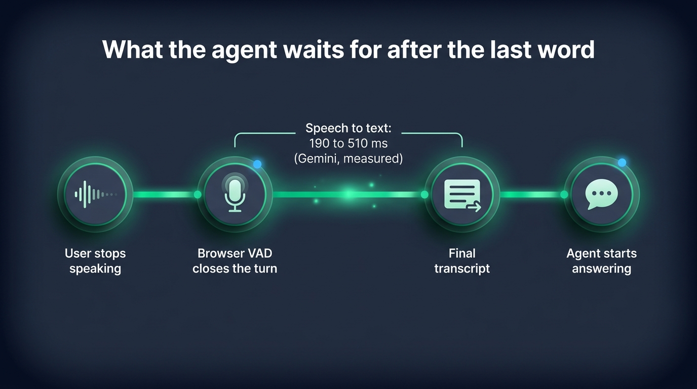
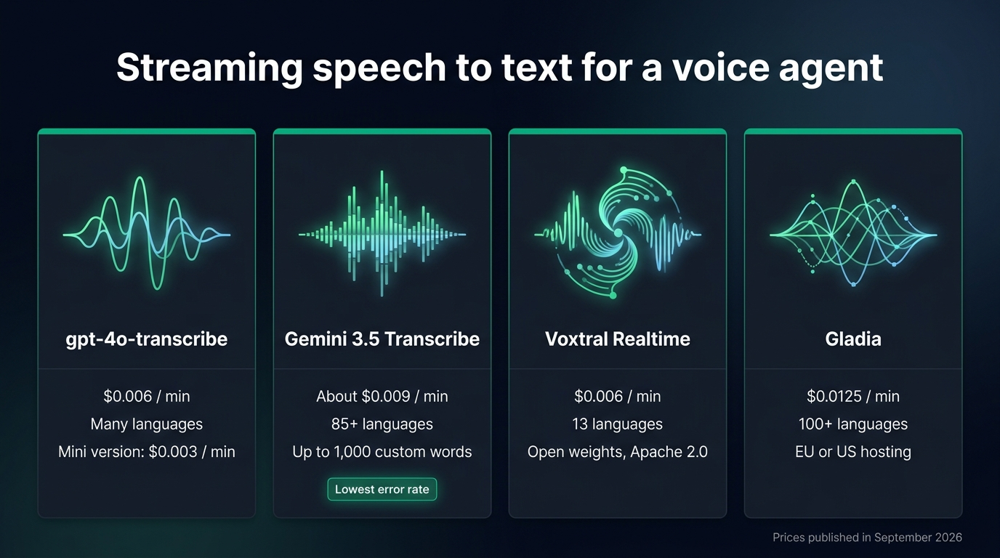

To transcribe a live call for a voice agent in 2026, start with Gemini 3.5 Transcribe: it has the lowest published error rate of the streaming models, understands more than 85 languages, takes up to 1,000 custom words and costs about $0.009 a minute. Pick gpt-4o-mini-transcribe when price comes first, at $0.003 a minute. Voxtral Realtime suits a team that wants to run the model on its own GPU later. Gladia suits calls that switch languages, and calls in a language Voxtral lacks when the data must stay in Europe. This article compares the four providers, with the prices published in September 2026 and the delays we measured on Gemini and Gladia, and shows how to switch from one to another in a TypeScript server.

## What a voice agent needs from speech to text

A voice agent answers a sentence only once it has read it. It needs the **final transcript** of each sentence as soon as the user stops talking. After the last word, the user waits for three delays in a row: the final transcript, the agent's thinking time and the first syllable of the voice.

Partial transcripts, the words that appear while the user is still speaking, matter less in a conversation than in a captioning tool. They help to display what the user says, or to start the language model early and throw its work away when the sentence changes. Either way, the agent answers only after the last word.

Four properties decide whether a model fits a conversation:

- the time between the end of speech and the final transcript
- the languages it recognises, and whether one call can switch between them
- the custom words it accepts, for product names, people and places
- the price per minute of streamed audio, which is usually higher than the price of a recording

Every provider below can decide on its own when the sentence is over. [Micdrop](/), an open source TypeScript library for real-time voice conversations, leaves that decision to the browser: the [voice activity detection in the client](/docs/client/vad) closes the turn, the server tells the model the sentence is complete, and the model returns its final text. Every model below receives that signal at the same moment, which makes their delays comparable. Gladia also keeps its own silence threshold on top of that signal. When that threshold is too short, Gladia cuts a sentence in two.

{/* IMAGE regen: api.py image, infographic, 1600x900. Scene: "A horizontal timeline read from left to right, on four stations connected by a glowing emerald line. Station 1 labelled 'User stops speaking', with a small audio waveform fading out. Station 2 labelled 'Browser VAD closes the turn', with a small microphone icon. Station 3 labelled 'Final transcript', with a short text block icon, and above the segment between station 2 and station 3 a bracket labelled 'Speech to text: 190 to 510 ms (Gemini, measured)'. Station 4 labelled 'Agent starts answering', with a small speech bubble icon. Title at the top in a modern clean bold sans-serif: 'What the agent waits for after the last word'. Generous spacing, flat vector style."
    Infographic only: regenerate if the Gemini measurement is redone. Last data sync: 2026-09-28. */}


## gpt-4o-transcribe, gpt-4o-mini-transcribe and gpt-live-transcribe

OpenAI offers three models that stream over its Realtime API.

`gpt-4o-transcribe` costs $0.006 a minute. It is the default of the [OpenAI speech to text integration](/docs/ai-integration/provided-integrations/openai) in Micdrop and a safe first choice in English. `gpt-4o-mini-transcribe` costs half as much, $0.003 a minute, for a slightly higher error rate. gpt-4o-transcribe gets 4.0% of the words wrong on the Artificial Analysis benchmark of recorded files, and the mini version 4.5%.

`gpt-live-transcribe`, released in July 2026, is the one OpenAI built for streaming. It sends words as the user speaks, takes a `delay` setting that trades speed for accuracy, and accepts a list of keywords. It costs $0.017 a minute, nearly three times gpt-4o-transcribe. The extra cost buys partial transcripts, which a voice agent that only reads the final text barely uses.

```typescript
import { OpenaiSTT } from '@micdrop/openai'

const stt = new OpenaiSTT({
  apiKey: process.env.OPENAI_API_KEY || '',
  model: 'gpt-4o-transcribe', // or 'gpt-4o-mini-transcribe', 'gpt-live-transcribe'
  language: 'fr', // English when left out
  prompt: 'A customer calls to move an appointment at the Lyon clinic.',
})
```

`OpenaiSTT` transcribes in English unless you pass `language`, so set it on every call in another language. The `prompt` gives the model context, which helps with names and jargon. The OpenAI API also expects 24 kHz audio, so the integration resamples the 16 kHz stream of the browser before sending it.

{/* TODO VERIFY: gpt-live-transcribe documents a `languages` array and a `delay` setting that OpenaiSTT does not pass yet. Check that `model: 'gpt-live-transcribe'` accepts the `language` option OpenaiSTT sends, as the advanced example assumes. */}

## Gemini 3.5 Transcribe

Google released Gemini 3.5 Transcribe in August 2026 in two versions, `gemini-3.5-transcribe` for files and `gemini-3.5-transcribe-live` for streaming. The live version runs over the Gemini Live API and recognises more than 85 languages, even when a call switches between them. It costs $3.50 per million audio tokens in and $21 per million tokens out, which comes to about $0.009 a minute.

Google reports a 4.0% error rate in streaming on the Artificial Analysis benchmark, and 2.6% on recorded files. Google also reports 5.5% in streaming on FLEURS, the benchmark Mistral publishes for Voxtral, against 8.72% for Voxtral Realtime. Gemini 3.5 Transcribe accepts the longest list of custom words, up to 1,000, although Google recommends about a hundred for the best results.

```typescript
import { GeminiSTT } from '@micdrop/gemini'

const stt = new GeminiSTT({
  apiKey: process.env.GEMINI_API_KEY || '',
  language: 'en-US', // Detected when left out
  vocabulary: ['Micdrop', 'Lonestone'],
  mode: 'VERBATIM', // or 'SMART', which drops hesitations
})
```

`SMART` mode drops the "um"s and false starts before the agent reads the sentence, so the transcript is easier to read. Keep `VERBATIM` if you analyse how people speak. A Live session lasts ten minutes at most. [The Gemini integration](/docs/ai-integration/provided-integrations/gemini#gemini-stt-speech-to-text) opens the next one between two sentences, so a long call carries on without a break.

## Voxtral Realtime through Mistral's API

Mistral released Voxtral Realtime in February 2026, as `voxtral-mini-transcribe-realtime-2602`. It costs $0.006 a minute, the same as gpt-4o-transcribe, and recognises 13 languages, among them English, French, German, Spanish, Arabic, Hindi and Chinese.

Mistral publishes the weights of this 4 billion parameter model under the Apache 2.0 license. A team can start on the API and move the same model onto its own GPU later. It is the only model in this comparison with open weights.

Voxtral makes you choose how long it waits before writing a word, from 80 ms to 2.4 s. At the recommended 480 ms, Mistral measures an 8.72% error rate on the FLEURS benchmark, against 5.90% for its model that reads recorded files. At 2.4 s, Voxtral Realtime matches that recorded quality, according to Mistral.

```typescript
import { MistralSTT } from '@micdrop/mistral'

const stt = new MistralSTT({
  apiKey: process.env.MISTRAL_API_KEY || '',
  targetStreamingDelayMs: 480,
})
```

The [Mistral integration](/docs/ai-integration/provided-integrations/mistral) sends the 16 kHz audio of the browser without resampling it.

## Gladia, for calls that switch languages

Gladia is a French company whose real-time API recognises more than 100 languages, switches between them within a call and accepts a custom vocabulary. It stores the data in Europe or in the United States, as you choose, which makes it one of the building blocks of a [voice pipeline hosted in Europe](/docs/ai-integration/sovereign-voice-ai), with Mistral and Gradium, a French provider of voices and transcription.

Gladia charges $0.75 an hour on the Starter plan, about $0.0125 a minute, down to $0.25 an hour with volume. Only gpt-live-transcribe costs more per minute in this comparison. A new account gets €50 of credit.

The [Gladia integration](/docs/ai-integration/provided-integrations/gladia) passes any session setting through `settings`. In a conversation, code switching and `endpointing` matter most.

```typescript
import { GladiaSTT } from '@micdrop/gladia'

const stt = new GladiaSTT({
  apiKey: process.env.GLADIA_API_KEY || '',
  settings: {
    language_config: { languages: ['fr', 'en'], code_switching: true },
    endpointing: 0.5, // Seconds of silence before Gladia closes a sentence
    realtime_processing: {
      custom_vocabulary: true,
      custom_vocabulary_config: { vocabulary: ['Lonestone'] },
    },
  },
})
```

Gladia closes a sentence after `endpointing` seconds of silence, 50 ms by default. With that default, our French test sentence "je voudrais décaler mon rendez-vous de mardi à jeudi, dix-sept heures trente" came back cut at the comma, so the agent received it in two pieces. Setting `endpointing` to half a second kept the sentence whole.

## Whisper as the baseline

OpenAI's `whisper-1` costs $0.006 a minute, the same as gpt-4o-transcribe, but it only reads recorded files. gpt-4o-transcribe makes fewer errors for the same price, according to OpenAI, so it replaces Whisper in a hosted pipeline.

Whisper keeps its place on your own server, where it costs nothing per minute and no audio leaves the machine. We compared it with Parakeet, Moonshine and Vosk when [running speech to text locally in Node](/blog/local-speech-to-text-node).

## Other streaming speech to text APIs

Micdrop integrates the providers above, plus Gradium for transcription. Several other APIs stream transcription and are worth knowing:

- Deepgram, whose Nova and Flux models are built for voice agents, with end of turn detection in the model
- AssemblyAI and its Universal Streaming model
- Speechmatics, which also deploys on your own servers
- ElevenLabs Scribe, from the voice provider

You can plug any of them into Micdrop by writing a [custom speech to text class](/docs/ai-integration/custom-integrations/custom-stt) with a single `transcribe()` method.

## Price, languages and accuracy side by side

| Model | Price per minute | Languages | Custom words | Open weights | Streaming error rate |
|---|---|---|---|---|---|
| gpt-4o-mini-transcribe | $0.003 | Many, set per call | Prompt | No | Not published |
| gpt-4o-transcribe | $0.006 | Many, set per call | Prompt | No | Not published |
| gpt-live-transcribe | $0.017 | Many | Prompt and keywords | No | 19.7% Common Voice, reported by OpenAI |
| Gemini 3.5 Transcribe live | About $0.009 | 85+, code switching | Up to 1,000 | No | 4.0% Artificial Analysis, 5.5% FLEURS, reported by Google |
| Voxtral Realtime | $0.006 | 13 | Up to 100, not exposed in Micdrop | Apache 2.0 | 8.72% FLEURS at 480 ms |
| Gladia real time | $0.0125, less with volume | 100+, code switching | Yes | No | Not published |

Prices come from each provider's pricing page in September 2026. The error rates come from different benchmarks, so compare two rows only when they share a benchmark.

## Time to the final transcript, measured

We timed Gemini and Gladia on 28 September 2026. We generated four sentences with the macOS text to speech voice, three in English and one in French, and streamed each one three times in real time through the Micdrop integration, from a laptop in France. We measured from the last chunk of audio to the final transcript.

| Model | Time to final transcript | "Lonestone", without a custom word |
|---|---|---|
| Gemini 3.5 Transcribe live | 190 to 510 ms, about 320 ms median | Written right every time |
| Gladia real time | 100 to 600 ms in English, about 480 ms median | "Launiston", "Launast", "Lonest" |

Both models wrote the times and order numbers of our sentences in digits, ready for the agent to use. The synthetic voice speaks more clearly than a real caller, so treat the figures as a comparison between the two, measured on one day, rather than a guarantee.

{/* TODO ANECDOTE: run the same four sentences through gpt-4o-transcribe, gpt-4o-mini-transcribe, gpt-live-transcribe and Voxtral Realtime (OPENAI_API_KEY and MISTRAL_API_KEY were missing from examples/advanced/.env), and add their rows to this table. Method: macOS `say` (Samantha, Thomas) converted to 16 kHz PCM, streamed in 20 ms chunks at real pace, timed from stream end to the Transcript event. */}

{/* IMAGE regen: api.py image, infographic, 1600x900. Scene: "Four vertical cards side by side on a dark surface, one per model, each with a thin emerald top border and a single simple abstract audio waveform glyph at the top of the card, with no text inside the glyph. Under the glyph, each card shows its title then exactly three lines of text, each written once and only once, with nothing else on the card. Card 1 titled 'gpt-4o-transcribe', lines '$0.006 / min', 'Many languages', 'Mini version: $0.003 / min'. Card 2 titled 'Gemini 3.5 Transcribe', lines 'About $0.009 / min', '85+ languages', 'Up to 1,000 custom words', plus a small emerald badge at the bottom of the card reading 'Lowest error rate'. Card 3 titled 'Voxtral Realtime', lines '$0.006 / min', '13 languages', 'Open weights, Apache 2.0'. Card 4 titled 'Gladia', lines '$0.0125 / min', '100+ languages', 'EU or US hosting'. Title at the top in a modern clean bold sans-serif: 'Streaming speech to text for a voice agent'. Small footer text: 'Prices published in September 2026'."
    Infographic only: regenerate if a provider changes its price, its language count or its models. Last data sync: 2026-09-28. */}


## Swapping one for another, and FallbackSTT

Every integration implements the same speech to text interface, so switching providers means replacing one class. The agent, the voice and the browser code stay as they are.

```typescript
import { MicdropServer } from '@micdrop/server'
import { GeminiSTT } from '@micdrop/gemini'

new MicdropServer(socket, {
  stt: new GeminiSTT({ apiKey: process.env.GEMINI_API_KEY || '' }),
  agent,
  tts,
})
```

The same interface makes an outage easy to plan for. [`FallbackSTT`](/docs/ai-integration/fallback-strategies/stt-fallback) takes a list of providers, moves to the next one when a provider gives up after its retries, and sends it the audio of the sentence in progress, so the user repeats nothing.

```typescript
import { FallbackSTT } from '@micdrop/server'
import { GeminiSTT } from '@micdrop/gemini'
import { OpenaiSTT } from '@micdrop/openai'

const stt = new FallbackSTT({
  factories: [
    () => new GeminiSTT({ apiKey: process.env.GEMINI_API_KEY || '', maxRetry: 2 }),
    () => new OpenaiSTT({ apiKey: process.env.OPENAI_API_KEY || '' }),
  ],
})
```

Two providers from different companies rarely go down on the same day. Pair Mistral with Gladia to keep the backup in Europe.

## Which one to pick

- Start with Gemini 3.5 Transcribe for a new voice agent. It has the best published accuracy, many languages and the longest vocabulary list, for about $0.009 a minute.
- Take gpt-4o-mini-transcribe when the volume is high and the calls are in English. At $0.003 a minute, a thousand hours of calls costs $180.
- Keep gpt-4o-transcribe if the rest of your stack already runs on OpenAI and you want a single bill.
- Pick Voxtral Realtime if you plan to host transcription yourself, or want a European provider at $0.006 a minute.
- Pick Gladia for calls that switch languages, or when the data has to stay in Europe and the language is outside Voxtral's 13.
- Reserve gpt-live-transcribe for an interface that shows the words as the user speaks, such as [a dictation tool](/docs/server/dictation).

You can [compare every transcription, agent and voice integration](/docs/ai-integration) and plug the one you chose into a Node server, or [start a first voice call in about five minutes](/docs/getting-started).

## Frequently asked questions

<FaqList>
  <FaqItem question="Which is better, Whisper-1 or GPT-4o-Transcribe?">
    gpt-4o-transcribe is better, for the same price of $0.006 a minute. OpenAI reports fewer
    errors than Whisper across languages. gpt-4o-transcribe also streams over the Realtime API,
    while whisper-1 only reads recorded files. Whisper stays useful when you run it on your own
    server.
  </FaqItem>
  <FaqItem question="How much does GPT-4o Transcribe cost?">
    gpt-4o-transcribe costs $0.006 a minute of audio, or $0.36 an hour, billed as $2.50 per
    million audio tokens in and $10 per million text tokens out. gpt-4o-mini-transcribe costs
    $0.003 a minute and gpt-live-transcribe $0.017, according to OpenAI's pricing in
    September 2026.
  </FaqItem>
  <FaqItem question="Can Gemini perform real-time transcription?">
    Yes. gemini-3.5-transcribe-live streams audio over the Gemini Live API and returns the text
    as the user speaks, then a final transcript when the sentence ends. A session lasts ten
    minutes at most, so a longer call has to open a new one, which the Micdrop integration does
    between two sentences.
  </FaqItem>
  <FaqItem question="Is Voxtral open source?">
    Mistral publishes the weights of Voxtral Realtime under the Apache 2.0 license, so you can
    run it on your own GPU and use it commercially. The hosted API costs $0.006 a minute.
  </FaqItem>
  <FaqItem question="Which speech to text model has the lowest latency for a voice agent?">
    Gemini 3.5 Transcribe returned its final transcript in about 320 ms median in our test, against
    about 480 ms for Gladia. Voxtral lets you set its delay from 80 ms to 2.4 s, and gpt-live-transcribe
    has a delay setting of its own. Network distance to the provider changes these figures, so
    measure from where your server runs.
  </FaqItem>
</FaqList>
