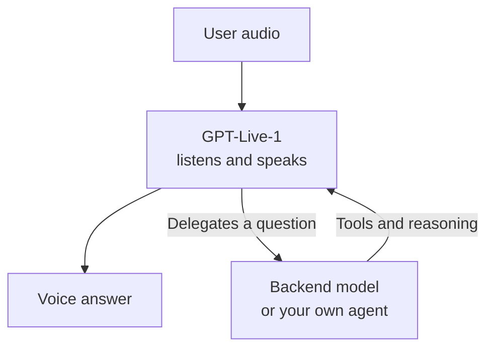
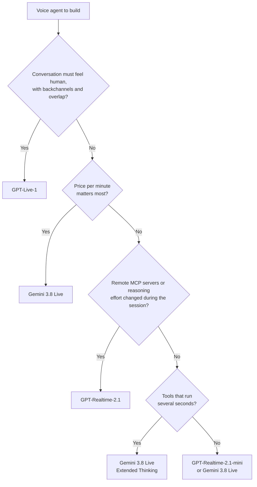

A dozen models now hear a user and answer with a voice, from OpenAI, Google, AWS, Alibaba, SpaceXAI and a handful of open-weight projects. Three of them get the detailed comparison here: OpenAI's GPT-Live-1, OpenAI's GPT-Realtime-2.1 and Google's Gemini 3.8 Live. They are the reference points, since several competitors copy OpenAI's API and say less about their prices than these two providers do. These three differ in where the reasoning happens, in price and in how long a call can last. GPT-Live-1 is built for natural turn-taking and hands the thinking to another model. GPT-Realtime-2.1 reasons and calls tools inside the same session. Gemini 3.8 Live costs about a quarter of GPT-Realtime-2.1 per minute and keeps long calls going by resuming the session on a new connection. Pick GPT-Live-1 for the most human conversation, GPT-Realtime-2.1 for tool-heavy agents in a single session, and Gemini 3.8 Live when the price per minute matters most. The other models get a shorter section of their own.

This comparison is for developers and CTOs choosing the model behind a voice feature. The prices come from the providers' own pages, read on September 17, 2026. The other figures come from the providers' announcements and documentation, unless the text names another source.

## OpenAI and Google shipped three model families between May and September 2026

| Date | Release | What it brought |
|---|---|---|
| May 7, 2026 | GPT-Realtime-2 | Reasoning with five effort levels, preambles such as "let me check that", parallel tool calls, a context window raised from 32K to 128K tokens |
| July 6, 2026 | GPT-Realtime-2.1 and GPT-Realtime-2.1-mini | Better recognition of letters and numbers, better handling of silence, noise and interruptions, and a cheaper distilled mini |
| July 8, 2026 | GPT-Live in ChatGPT | A full-duplex voice mode that replaced Advanced Voice Mode |
| September 10, 2026 | GPT-Live-1 in the API | The same model for developers, on its own endpoint |
| September 15, 2026 | Gemini 3.8 Live and Gemini 3.8 Live Extended Thinking | Two generally available Live models, one fast and one that reasons in the background |

OpenAI announced [GPT-Realtime-2](https://openai.com/index/advancing-voice-intelligence-with-new-models-in-the-api/) and then [GPT-Live-1 in the API](https://openai.com/index/introducing-gpt-live-1-in-the-api/). Google announced [Gemini 3.8 Live](https://blog.google/innovation-and-ai/models-and-research/gemini-models/gemini-3-8-live-gemini-3-8-live-extended-thinking/) with its thinking variant.

Tutorials written before May point to the previous generations, which are still online. Google now lists Gemini 3.1 Flash Live, the model often called Gemini Flash Live, as a legacy preview and recommends moving to 3.8 Live. The `gemini-2.5-flash-native-audio` previews have the same replacement. At OpenAI, `gpt-realtime-mini` still points to its December 2025 snapshot, limited to 32K tokens of context and without reasoning.

## GPT-Live-1 handles the conversation and delegates the reasoning

GPT-Live-1 listens and speaks at the same time. OpenAI describes a model that decides many times per second whether to speak, keep listening, pause, interrupt or call a tool, and that can say "mhmm" while the user talks. The Realtime API, by contrast, works turn by turn: the user speaks, the turn ends, the model answers.

GPT-Live-1 [delegates the thinking and the tools](https://developers.openai.com/api/docs/guides/live-delegation) to a backend, either a hosted OpenAI model that you pick or your own agent from any provider. When the user interrupts, the voice stops while the backend keeps working.



GPT-Live-1 also has its own API, on `v1/live/sessions`, with events that differ from the Realtime API's. To [migrate from the Realtime API](https://developers.openai.com/api/docs/guides/live-migration), OpenAI tells you to stream audio continuously, remove manual audio commits and let the model decide when to speak. Moving from GPT-Realtime-2.1 to GPT-Live-1 means rewriting the session code.

When you [build a voice agent](https://developers.openai.com/api/docs/guides/voice-agents), OpenAI recommends GPT-Live for full-duplex conversations with a separate backend, and the Realtime API for speech, reasoning and tool use in one session.

## Voices, context, session length and tools compared

| | GPT-Live-1 | GPT-Realtime-2.1 | Gemini 3.8 Live |
|---|---|---|---|
| API | `v1/live/sessions` | `v1/realtime` | Live API, WebSocket |
| Voices | 13, `marin` by default | 10, `marin` and `cedar` recommended | 30 prebuilt voices |
| Languages | No published list | No published list | 97, according to Google's launch post |
| Context | 128K tokens | 128K tokens | 131K input tokens |
| Session length | Capped at an unpublished length | 60 minutes | About 10 minutes per connection, extended by resumption |
| Tools | Delegated to the backend | Functions, remote MCP servers, parallel calls | Asynchronous functions, Google Search |
| Images | Sent to the backend | Accepted | Images and video, one frame per second at most |

You can add remote MCP servers to a GPT-Realtime-2.1 session. OpenAI calls those MCP servers itself, so the tool calls bypass your server. Gemini 3.8 Live calls functions without blocking by default, so the model keeps talking while your tool runs. It can also ground an answer in Google Search.

A long call on Gemini hits two limits, about ten minutes per connection and fifteen minutes per audio session without compression. You can [keep a Live session going longer](https://ai.google.dev/gemini-api/docs/live-api/session-management) with two settings. Context window compression keeps a sliding window of the conversation and lifts the fifteen-minute limit. Session resumption gives you a handle, valid for two hours, to reopen the session on a new connection. OpenAI caps a Realtime session at sixty minutes. Past that, you open a new session and send the conversation again.

Two Gemini features changed with 3.8. Affective dialog is gone from the API. Proactive audio, where the model can choose to stay silent, is now always on.

## Latency and turn-taking

- OpenAI says GPT-Live-1 scores 30 percentage points higher than GPT-Realtime-2.1 on Full Duplex Bench, a benchmark of turn-taking in spoken conversation. The tech news site [TechRepublic](https://www.techrepublic.com/article/news-openai-gpt-live-1-real-time-voice-agents/) puts GPT-Live-1's turn-taking latency at 0.798 seconds, a figure read off OpenAI's chart.
- OpenAI cut the p95 latency of its Realtime models by at least 25% with the 2.1 release, through better caching.
- Artificial Analysis, an independent benchmarking company, measured GPT-Realtime-2 at 1.12 seconds to first audio at minimal reasoning and 2.33 seconds at high reasoning.
- Google gives no latency figure for Gemini 3.8 Live. Its model page only promises "ultra-low latency" and responses "without reasoning-induced delays".

The GPT-Realtime-2 measurements show what reasoning costs: the first word comes about 1.2 seconds later at high effort than at minimal effort. Keep the effort low for small talk and raise it for the turns that need it.

Latency in production also depends on where your server sits, on the user's network and on how quickly your application closes a turn. Measure on your own calls before trusting a published figure, since every source uses its own test.

## Prices per minute of conversation

The prices assume a minute split evenly: the user speaks for thirty seconds and the agent answers for thirty. OpenAI counts one audio token per 100 ms heard and one per 50 ms spoken. Google publishes its own estimates per minute of audio.

| Model | Audio heard | Audio spoken | One minute of conversation |
|---|---|---|---|
| GPT-Live-1 | $0.05 per minute of session | Included | $0.05, plus the backend model |
| GPT-Realtime-2.1 | $32 per 1M tokens | $64 per 1M tokens | $0.048 |
| GPT-Realtime-2.1-mini | $10 per 1M tokens | $20 per 1M tokens | $0.015 |
| Gemini 3.8 Live | $0.005 per minute | $0.018 per minute | $0.012 |

The rates come from [OpenAI API pricing](https://developers.openai.com/api/docs/pricing) and [Gemini API pricing](https://ai.google.dev/gemini-api/docs/pricing). On GPT-Realtime-2.1, the 300 tokens heard cost $0.0096 and the 600 tokens spoken $0.0384. On Gemini 3.8 Live, half a minute at each rate gives $0.0025 and $0.009, for $0.0115 in total, rounded to $0.012. Gemini 3.8 Live Extended Thinking has the same rates.

OpenAI bills GPT-Live-1 per second of session, whoever is speaking. The backend model is billed on top at its own rate. OpenAI's example is a 90-second session at $0.075 plus $0.02 of backend usage, $0.095 in total.

Every model except GPT-Live-1 is billed per token. Reasoning tokens are billed as output. OpenAI also bills the conversation so far again on each turn, as cached audio at $0.40 per million tokens. Google documents the same for Gemini on Vertex AI, where every turn is billed for all the tokens in the session context. The history grows with the call, so wherever it is billed again on each turn, a thirty-minute call costs more than thirty separate one-minute calls.

Gemini also has a free tier for the Live API, where Google uses your data to improve its products. Keep it for prototypes.

## Deeper reasoning is a setting on GPT-Realtime-2.1 and a separate model on Gemini

GPT-Realtime-2 introduced a `reasoning.effort` setting with five levels: `minimal`, `low`, `medium`, `high` and `xhigh`. Low is the default. You keep the same model for the whole session and move the effort up or down.

Google ships two models instead. `gemini-3.8-live` reasons in short steps between its words, with a fixed latency profile and no setting. `gemini-3.8-live-extended-thinking` reasons in the background and takes a `thinkingLevel` of `low`, `medium` or `high`. Google recommends it for [tools that take several seconds to run](https://ai.google.dev/gemini-api/docs/live-api/thinking), since the model keeps the user informed in the meantime. With this model, `turnComplete` no longer means the model is idle. Function calls are also always asynchronous.

Google reports that Gemini 3.8 Live Extended Thinking ranks first on Artificial Analysis' Speech to Speech Quality Index, with a score of 82.6.

GPT-Live-1 leaves reasoning to its backend. The depth of thinking depends on the model you delegate to and on the effort you set for that model.

## Speech-to-speech models beyond OpenAI and Google

Other providers ship a model that hears audio and speaks its answer. Several of them accept the same events as the OpenAI Realtime API, so a client written for OpenAI reaches them by changing the base URL.

| Model | Access | What stands out |
| --- | --- | --- |
| Amazon Nova 2 Sonic | Bedrock bidirectional streaming | $3 per million tokens heard and $12 per million spoken, seven languages, and an integration with Amazon Connect for phone calls |
| Grok Voice Think Fast 2.0 | WebSocket, drop-in for the OpenAI Realtime API | $0.08 per minute. SpaceXAI runs its own Starlink phone sales on it |
| Hume EVI 3 and EVI 4-mini | Hume API | $0.04 to $0.07 per minute, built around prosody. EVI 3 answers on its own in English. EVI 4-mini takes the text model you give it |
| Azure Voice Live API | One WebSocket on Azure | An orchestration layer rather than a model, with one interface for the OpenAI realtime models and for pipelines |
| Qwen Audio 3.0 Realtime | Alibaba Model Studio | Eleven languages plus about twenty Chinese dialects, with an Omni line that also takes video |
| StepAudio 3 Realtime | StepFun platform | Reasoning while it speaks, hosted only, with no published price |
| Higgs Realtime | Drop-in for the OpenAI Realtime API | $0.014 per minute, the lowest published rate outside OpenAI and Google |
| Deepslate Opal | REST, WebSocket, SIP, or self-hosted | European data residency, 27 languages and regional accents |

Four models run on your own GPU. Moshi, from the Kyutai lab, came first in September 2024 and is still the reference, with weights under CC BY 4.0. Step-Audio-R1.1, 33.5 billion parameters under Apache 2.0, reasons before it answers. NVIDIA's Nemotron VoiceChat 11B calls tools in the middle of a conversation. Qwen3-Omni-30B-A3B, also Apache 2.0, listens to audio and video and answers in a voice. You supply the GPU, the monitoring and the support that a hosted provider sells with its API.

Watch the naming. ElevenLabs sells a feature called Speech to Speech, which converts one voice into another for dubbing. ElevenLabs Agents, Deepgram's Voice Agent API and Kyutai's Unmute assemble transcription, a text model and a voice behind one connection, which is the pipeline architecture rather than a single model. Mistral's Voxtral models transcribe and speak without holding a conversation, while Ultravox hears audio and answers in text. Read what comes out of the model before counting it as an alternative.

## Micdrop runs GPT-Realtime-2.1 and Gemini 3.8 Live behind the same client

To compare two voice models on your own use case, you need an application where only the model changes. [Micdrop](/) is an open source TypeScript library that handles the microphone, the playback, the socket and the turns of a voice conversation. You pass a [realtime model](/docs/server/realtime) to `MicdropServer` in place of speech to text, an agent and a text to speech, while the browser client and the Node server stay the same.

```typescript
import { GeminiLive } from '@micdrop/gemini'
import { OpenaiRealtime } from '@micdrop/openai'
import { MicdropServer } from '@micdrop/server'

const systemPrompt = 'You are a helpful assistant'

const realtime =
  process.env.VOICE_MODEL === 'gemini'
    ? new GeminiLive({
        apiKey: process.env.GEMINI_API_KEY || '',
        model: 'gemini-3.8-live',
        systemPrompt,
      })
    : new OpenaiRealtime({
        apiKey: process.env.OPENAI_API_KEY || '',
        model: 'gpt-realtime-2.1',
        systemPrompt,
      })

new MicdropServer(socket, { realtime, generateFirstMessage: true })
```

The comparison stays fair because the client decides when the user starts and stops speaking, for both models. Micdrop turns off the voice detection of each provider, so both models answer the same turns. The [tools](/docs/server/tools) you add with `realtime.addTool()` run on your server with either model. Micdrop returns the conversation in the same message format, whichever provider wrote the transcripts.

[`OpenaiRealtime`](/docs/ai-integration/provided-integrations/openai#openai-realtime) passes its `model` option to the Realtime endpoint, so `gpt-realtime-2.1-mini` works the same way. It leaves the reasoning effort at OpenAI's default, `low`. [`GeminiLive`](/docs/ai-integration/provided-integrations/gemini#gemini-live) runs `gemini-3.8-live-extended-thinking` when you set it as `model` along with a `thinkingLevel` such as `'low'`. It also reconnects with the resumption handle when Gemini closes a connection.

The [`Realtime` base class](/docs/server/realtime#writing-your-own) holds what every provider shares: the turn boundaries, the interruptions and the order of the transcripts. To run a model Micdrop does not ship, such as Nova 2 Sonic or Hume EVI 3, extend it with the calls to that provider's API.

Micdrop does not run GPT-Live-1. The model needs its own endpoint and events, while `OpenaiRealtime` connects to the Realtime endpoint. GPT-Live-1 also decides when each turn ends, a decision Micdrop leaves to its client.

When you need more choice than a realtime model gives, the same server runs a pipeline where transcription, the agent and the voice each come from a provider you choose. Weigh the [Realtime API against a pipeline](/blog/openai-realtime-api-vs-pipeline) before you pick one.

## Which one to pick



Take GPT-Live-1 for a companion, a coach or an interviewer, where the quality of the conversation is the product. Plan for a backend model and for session code written for the `v1/live/sessions` API.

Take GPT-Realtime-2.1 for an agent that books, searches and updates records during the call. Tools, MCP servers and reasoning share one session, whose sixty-minute limit covers most calls.

Take Gemini 3.8 Live for high volumes and long calls. It costs about a quarter of GPT-Realtime-2.1 per minute and resumes a session on a new connection when the previous one closes. Google also lists 97 languages for it.

Keep your prompt and your tools in your own code, whichever model you start with. To test two models on your own conversations, [get a first voice call running in five minutes](/docs/getting-started), then swap the realtime model.

## Frequently asked questions

<FaqList>
  <FaqItem question="What is GPT-Live-1?">
    GPT-Live-1 is OpenAI's full-duplex voice model. It came to ChatGPT on July 8, 2026, replacing Advanced Voice Mode, and to the API on September 10, 2026. It hears the user while it speaks, decides when to talk, and hands reasoning and tools to a backend model. In the API, it uses the `v1/live/sessions` endpoint rather than the Realtime API.
  </FaqItem>
  <FaqItem question="How do I use GPT-Live in my own application?">
    Open a session on `wss://api.openai.com/v1/live/sessions`, or over WebRTC or SIP, and stream the user's audio continuously. Configure a backend for reasoning and tools, either a hosted OpenAI model or your own agent. The API model id is `gpt-live-1`. A mini version exists in ChatGPT only.
  </FaqItem>
  <FaqItem question="Is GPT-Realtime-2 good?">
    GPT-Realtime-2 added reasoning, parallel tool calls and a 128K context to the Realtime API. OpenAI also reports gains over GPT-Realtime-1.5 on audio reasoning benchmarks. Developers on OpenAI's forum found its speech clearer and better paced, while others reported function-calling failures on GPT-Realtime-2.1-mini. Use GPT-Realtime-2.1, the July 2026 update, which handles noise, silence and interruptions better.
  </FaqItem>
  <FaqItem question="How much does GPT-Realtime-2 cost?">
    GPT-Realtime-2 and 2.1 cost $32 per million audio input tokens and $64 per million audio output tokens, with cached audio input at $0.40 per million. A minute where the user and the agent each speak for thirty seconds comes to about $0.048, before reasoning tokens and the history sent again on each turn. GPT-Realtime-2.1-mini costs $10 and $20 per million tokens, about $0.015 for the same minute.
  </FaqItem>
  <FaqItem question="How much does the Gemini Live API cost?">
    Gemini 3.8 Live costs $3 per million audio input tokens and $12 per million audio output tokens, which Google estimates at $0.005 per minute heard and $0.018 per minute spoken. The extended thinking model has the same rates, with thinking tokens billed as output. Google also offers a free tier, where it uses your data to improve its products.
  </FaqItem>
  <FaqItem question="Which speech-to-speech models exist besides OpenAI and Google?">
    Amazon Nova 2 Sonic on Bedrock, Grok Voice Think Fast 2.0 from SpaceXAI, Hume EVI 3 and EVI 4-mini, Qwen Audio 3.0 Realtime from Alibaba, StepAudio 3 Realtime from StepFun, Higgs Realtime from Boson AI and Deepslate Opal all hear audio and answer in a voice. Azure Voice Live API puts one interface over several of them. Moshi, Step-Audio-R1.1, NVIDIA Nemotron VoiceChat and Qwen3-Omni have open weights and run on your own GPU. Products named Voice Agent or Speech to Speech often turn out to be a pipeline of transcription, a text model and a voice, so check what the model itself outputs.
  </FaqItem>
  <FaqItem question="What are the key differences between Gemini Live and the OpenAI Realtime API?">
    Gemini 3.8 Live costs about a quarter of GPT-Realtime-2.1 per minute, supports 97 languages according to Google, and has 30 voices. Resumption keeps a call going across connections that last about ten minutes each. The OpenAI Realtime API holds a session for up to sixty minutes, accepts remote MCP servers and lets you set the reasoning effort. Gemini offers deeper reasoning in a separate extended thinking model.
  </FaqItem>
</FaqList>
