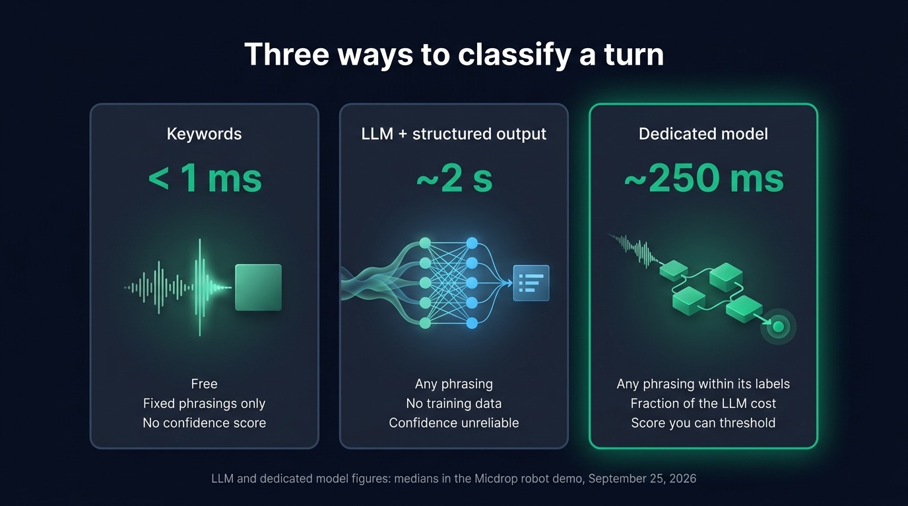
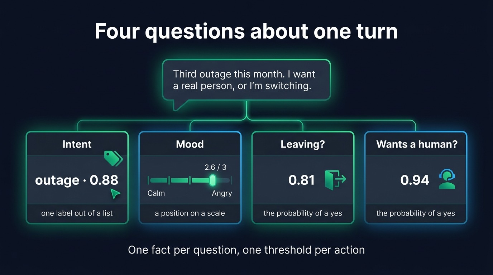
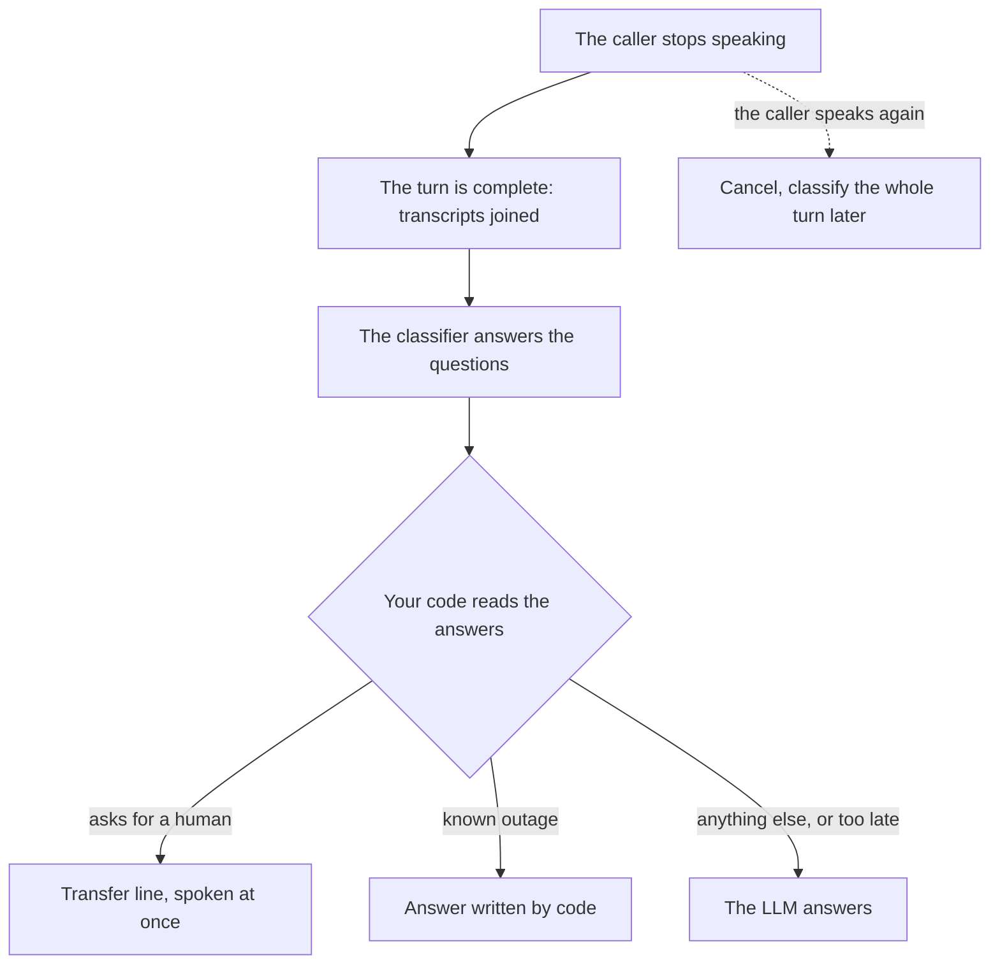

Intent classification in a voice agent means reading each turn of the caller and deciding what they want before anything answers them: a refund, a human, an outage report, a cancellation. The classification has to arrive within a few hundred milliseconds, while the caller waits in silence, so that your code can pick what answers the turn: a scripted line, a transfer, an answer written by code, or the LLM. You can classify a turn three ways: match keywords, ask an LLM for structured output, or call a dedicated classification model. This guide compares them on latency and accuracy, lists the questions worth asking about each turn, and shows where the classification fits in the timing of a call, with TypeScript code at the end.

The examples come from voice agents built with [Micdrop](/), an open source TypeScript library for real-time voice conversations, whose server takes a classifier next to its speech to text, its agent and its voice.

## Why a voice agent needs the intent before the answer

In a text chat, the LLM can decide everything on its own. It reads the message, calls a tool if needed, and writes. A few seconds of wait go unnoticed in a chat window. On the phone, the caller hears every one of those seconds as silence.

A voice agent that leaves every decision to its LLM pays for it in three ways:

- The caller who says "get me a human" waits for a full LLM completion to hear "I am transferring you". A transfer line known in advance could play at once.
- The LLM improvises on turns your team has already answered: a known outage, opening hours, the status of an order. The answer varies from one call to the next, and sometimes it is wrong.
- Everything the caller says reaches the model, including the turn that tries a prompt injection or asks for a refund the agent has no right to grant.

A classifier takes these decisions out of the LLM. It reads the turn and returns typed answers such as `intent: 'billing'` or `wantsHuman: 0.93`. Your code then reads them and picks who answers the turn. The LLM keeps the turns that need writing and reasoning.

The same answers serve the interface too. A support page can show the intent and the mood of the caller during the call, and a supervisor can see which calls are going badly.

## Three ways to classify a turn

You can classify a turn of a voice call in three ways:

1. Match the turn against keywords and rules. A regular expression or a list of phrases flags the turn. It runs in under a millisecond, costs nothing, and misses every sentence phrased another way.
2. Ask an LLM for structured output. You describe the labels in a prompt and ask for JSON that fits a schema. It understands any phrasing and needs no training data, but a full completion often takes more than a second.
3. Call a dedicated classification model, such as an embedding model with a router, a fine-tuned classifier, or Jev, a model that answers each question with a label, a score or a probability. It answers in tens to a few hundred milliseconds, at a fraction of the cost of an LLM.

### Keywords and rules

Keywords take the least work of the three methods. `/\b(human|agent|manager|real person)\b/i` catches most requests for a human in English, instantly. They fail on every phrasing missing from the list: "can I talk to someone who actually works there?" matches nothing. They also match what they should not, as in "I'm not asking for a manager". Use them for the few commands that people phrase the same way every time, or as a stand-in while you set up an LLM or a dedicated model.

### An LLM with structured output

To classify a turn with an LLM, you give the model the list of intents with a description of each, pass it the turn with the turn before, and ask for a JSON object that matches a schema. Structured outputs in the OpenAI, Anthropic and Gemini APIs, or the `Output.object()` helper of the AI SDK, hold the model to that schema, so you get back one of your labels rather than a sentence to parse.

It is the fastest way to start, since you need no examples and can change the labels by editing a prompt. The cost is time. The model still writes its answer token by token, after a network round trip. In the Micdrop robot demo, measured on September 25, 2026, Claude Haiku 4.5 took 1,971 ms at the median to answer a set of questions about a spoken command through structured outputs. On a phone call, that is two seconds of silence before the answer even starts. An LLM asked how sure it is also writes a number that sounds plausible, with nothing tying it to how often it is right.

### A dedicated classification model

A dedicated model only classifies, which makes it faster and cheaper. There are several kinds:

- An embedding router, such as [semantic-router](https://github.com/aurelio-labs/semantic-router), an MIT-licensed Python library by Aurelio AI. You write a few example sentences per route, the library embeds them, and each turn goes to the closest route above a similarity threshold.
- A zero-shot model from Hugging Face, such as the natural language inference models behind the `zero-shot-classification` pipeline, which [Transformers.js](https://huggingface.co/docs/transformers.js) also runs in Node. You give it labels at runtime, without training.
- A small classifier fine-tuned on your own transcripts, with a library like [SetFit](https://github.com/huggingface/setfit) that needs only a few examples per label. This is usually the most accurate option on your domain once you have the data, and the most work to maintain.
- A System One model, like [Jev](/blog/what-is-jev) from TypeSafe AI. Jev reads a text or a JSON object and answers typed questions about it (a label, a score, the probability of a yes) with calibrated probabilities. In the same robot demo, Jev answered in 233 ms at the median against 1,971 ms for Claude Haiku 4.5. Jev costs $0.042 per million input tokens, with output free of charge.

Jev is faster than Claude and less accurate on some commands. In the robot demo, the two models agreed on the command in 65 of 90 answers. Where they differed, Jev made more of the mistakes, mostly on commands that pack two steps into one verb, like "bring the ball to the dog". An embedding router has a different limit: it knows only the routes you wrote examples for.

| | Keywords | LLM with structured output | Dedicated model |
| --- | --- | --- | --- |
| Latency per turn | Under 1 ms | Often over 1 s (1,971 ms median in the robot demo) | Tens to a few hundred ms (233 ms median for Jev) |
| Handles new phrasings | No | Yes | Yes, within the labels it knows |
| Confidence you can threshold | No | Unreliable | Similarity score, or calibrated probability for Jev |
| Setup | A list of phrases | A prompt and a schema | Labels, questions, or examples to train on |
| Best for | Fixed commands, a first layer | Prototypes, rare and complex turns | Classifying every turn of every call |

{/* IMAGE regen: api.py image, infographic, 1600x900. Scene: "Three tall cards side by side on a dark background, each with a title, a latency figure in large digits, and three short lines. Title at the top in modern clean bold sans-serif: "Three ways to classify a turn". Card 1 titled "Keywords", large figure "< 1 ms", lines "Free", "Fixed phrasings only", "No confidence score". Card 2 titled "LLM + structured output", large figure "~2 s", lines "Any phrasing", "No training data", "Confidence unreliable". Card 3 titled "Dedicated model", large figure "~250 ms", lines "Any phrasing within its labels", "Fraction of the LLM cost", "Score you can threshold". The third card is outlined in bright emerald, the first two in muted slate. Footer line centered: "LLM and dedicated model figures: medians in the Micdrop robot demo, September 25, 2026"."
    Infographic: regenerate if examples/demo-robot/measurements gets a newer file. Last data sync: 2026-09-25. */}


You can combine the three. Keywords catch the obvious commands for free, a dedicated model classifies every other turn, and the LLM answers what falls below your confidence threshold.

## What to ask about each turn: intent, mood, yes or no, a human

"What is the intent?" is only the first question. A support call raises several questions at once. Each one is easier to answer, and to act on, when you ask it separately:

- The intent, as one label out of a list you define: billing, outage, cancellation, moving, other. Keep a catch-all label, or the classifier forces the turns that fit nowhere into a wrong one.
- The mood, as a position on a scale that goes from calm through frustrated to angry. A scale lets you act on "closer to angry than to frustrated" rather than on a yes or no.
- Yes or no questions about facts that matter to your code: is it urgent, is the caller thinking of leaving, are they trying to manipulate the assistant.
- A request for a human, as a separate yes or no, because it overrides everything else.

Keep one fact per question. "Is the caller angry and about to leave?" merges two answers into one, so your code can no longer tell which one was true. Ask both, then combine them in code with a threshold per action. A threshold works only when the probabilities match how often the answers are right. With calibrated probabilities, answers rated 0.8 are right about eight times out of ten, so you can ask for 0.9 before a refund and accept 0.6 before a read-only lookup.

{/* IMAGE regen: api.py image, infographic, 1600x900. Scene: "One spoken sentence in a speech bubble at the top of a dark background: "Third outage this month. I want a real person, or I'm switching." Below it, four answer cards in a row, each joined to the bubble by a thin emerald line. Title above the bubble in modern clean bold sans-serif: "Four questions about one turn". Card 1 titled "Intent", value "outage · 0.88", caption "one label out of a list". Card 2 titled "Mood", a small horizontal scale "Calm" to "Angry" with a marker near "Angry", value "2.6 / 3", caption "a position on a scale". Card 3 titled "Leaving?", value "0.81", caption "the probability of a yes". Card 4 titled "Wants a human?", value "0.94", caption "the probability of a yes". Footer line centered: "One fact per question, one threshold per action"." */}


### Detecting emotion from the voice or from the words

Speech emotion recognition models read the audio itself: pitch, pace, loudness. [Hume AI](https://www.hume.ai/expression-measurement)'s speech prosody model, for example, returns 48 dimensions of emotional expression from the sound of the voice, and can stream them during a conversation. A text classifier gets the tone from the words alone, so it can take a sarcastic "Great, just great" for praise.

In practice, callers who are frustrated usually say so. A text classifier reads each turn in the transcript you already have, with the turn before it, and catches enough of that frustration to route a support call. Add an audio model when the tone itself is what you measure, as in coaching or the analysis of sales calls.

Sentiment analysis APIs belong to a third category. [AssemblyAI](https://www.assemblyai.com/docs/speech-understanding/sentiment-analysis) returns a positive, neutral or negative label with a confidence for each sentence of a recording, once the file is transcribed. It suits the analysis of past calls. During a live call, the decision has to come from a classifier that answers within the turn.

## When to classify: at the end of the turn, or on partial transcripts

To route the answer, the classification has to arrive before the answer starts. The gap between the caller's last word and the first word of the answer is already full: the server finishes the transcript, starts the LLM and starts the voice. The caller hears everything you add to that gap as more silence.

Classify at the end of the turn. A turn can hold several transcripts, since the speech to text sends one at each pause, and [semantic turn detection](/docs/server/semantic-turn-detection) can hold the turn open while the caller finishes a sentence. Classifying the first fragment of "I want to cancel... the extra TV package, not my internet" gets the intent wrong. Join the transcripts of the turn and classify the whole of it.

Classifying partial transcripts while the caller is still speaking looks faster on paper. In practice you pay for several classifications per turn and still wait for the last one, on the complete sentence. Classifying partial transcripts makes sense for a live display on screen, where a label that changes while the caller speaks does no harm.

When the caller speaks again before the answer, cancel the classification in progress along with the answer, and classify the whole turn again once it ends. Set a time limit on the wait, too. When a classification takes too long, let the LLM answer that turn rather than leave the caller in silence.



## Intent classification in TypeScript with Micdrop

The Micdrop server applies these timing rules for you. It classifies each turn when it ends, cancels the classification when the user speaks again, and keeps the result with the turn. With `waitBeforeAnswer`, it holds the answer until the classification is done, one second at most by default. The agent then calls `onBeforeAnswer`, where a returned string is spoken as the answer without the LLM:

```typescript
import { OpenaiAgent } from '@micdrop/openai'
import { getTurnClassification, MicdropServer } from '@micdrop/server'
import { choice, noul, TypesafeClassifier } from '@micdrop/typesafe'

const classifier = new TypesafeClassifier({
  apiKey: process.env.TYPESAFE_API_KEY || '',
  questions: {
    intent: choice('What does the user in `turn` want?', {
      billing: 'A charge, an invoice, a refund',
      outage: 'The service is down or slow',
      other: null,
    }),
    wantsHuman: noul('Does the user in `turn` ask for a human?'),
  },
})

const agent = new OpenaiAgent({
  apiKey: process.env.OPENAI_API_KEY || '',
  systemPrompt: 'You are the support assistant of Nova Fiber.',

  onBeforeAnswer() {
    const classification = getTurnClassification(this.conversation)
    // The LLM answers when the classification came too late
    if (!classification) return

    const { answers } = classification.result
    if (answers.wantsHuman.noul > 0.8) {
      return 'I am transferring you to a colleague right away.'
    }
  },
})

new MicdropServer(socket, {
  stt,
  agent,
  tts,
  classifier,
  classifierOptions: { waitBeforeAnswer: true, sendToClient: true },
})
```

`TypesafeClassifier` runs [Jev through its Micdrop integration](/docs/ai-integration/provided-integrations/typesafe). You can use any of the other methods with the same `classifierOptions` by [writing your own classifier](/docs/ai-integration/custom-integrations/custom-classifier): you implement a single `evaluate()` method, whether it calls an LLM with a zod schema or matches keywords. With `sendToClient`, each classification also reaches the browser, where the `useMicdropClassification` React hook reads it.

You can also [set how long the server waits for the classification and how many earlier turns the classifier reads](/docs/server/classifier). To go further, you can [build a support agent that routes each turn five ways](/blog/jev-voice-agent-typescript): a block on manipulation attempts, a transfer to a human, an answer written by code, an LLM answer with a retention hint, and a plain LLM answer. That agent comes from the support demo, listed with the other [Micdrop demos that run on a classifier](/docs/examples#classifier-demos).

## With a speech to speech model

Speech to speech models, such as the OpenAI Realtime API and Gemini Live, hear the caller and answer in one connection, with no separate LLM call to hold back. You can still classify their turns. In Micdrop, a [realtime model](/docs/server/realtime) takes the same `classifier` option: the server classifies each user transcript as it arrives and can send the result to the client.

The routing works differently, though. The model starts answering on its own, so the classification cannot decide who speaks first. The classifier's answers still reach the interface and your code. Your code can then end the call or hand it to a human. If routing each turn before the answer matters more to you than the lowest latency, a pipeline of speech to text, LLM and voice keeps that control. The [choice between the Realtime API and a pipeline](/blog/openai-realtime-api-vs-pipeline) also depends on the providers, the voices and the cost.

## Frequently asked questions

<FaqList>
  <FaqItem question="How can LLMs be used for intent classification?">
    Give the LLM the list of intents with a description of each, pass it the user's message with the turn before it, and ask for a JSON object that matches a schema. Structured output features in the OpenAI, Anthropic and Gemini APIs keep the answer to one of your labels. It needs no training data, but a completion often takes over a second, which is slow for a voice call.
  </FaqItem>
  <FaqItem question="What is the difference between intent classification and intent detection?">
    Both terms name the same task: reading a user's message and deciding what they want, out of a list of intents you define. Intent recognition is a third name for it, more common in older chatbot and voice assistant frameworks.
  </FaqItem>
  <FaqItem question="Can I detect frustration in a voice call?">
    Yes. A text classifier can read the transcript and place each turn on a scale from calm to angry, with the turn before it for context. A speech emotion recognition model such as Hume AI's prosody model reads the sound of the voice instead. For routing a support call, the transcript is usually enough.
  </FaqItem>
  <FaqItem question="How fast must intent detection be in a voice agent?">
    It has to arrive before the answer starts, since the caller hears every millisecond of the wait as silence. A dedicated model answering in a few hundred milliseconds fits, while an LLM often takes over a second. Set a time limit, and let the LLM answer the turn when the classification comes too late.
  </FaqItem>
  <FaqItem question="Can a classifier replace the LLM entirely?">
    It can for an app that runs on voice commands. A speech to text model and a classifier are enough when every command maps to a label, as in the Micdrop robot demo. You need an LLM when the answer has to be written.
  </FaqItem>
</FaqList>

## Route your voice agent before the LLM answers

Start with the decisions your agent gets wrong or makes slowly today: the transfer to a human, the known outage, the caller about to leave. Write one question per decision, pick a threshold for each, and route those turns in code. A dedicated model answers in a few hundred milliseconds, so routing adds little to the wait. The LLM keeps the turns that need writing. To try it on a real call, [add a classifier to a Micdrop server](/docs/server/classifier), or [start with a first voice call in five minutes](/docs/getting-started) if Micdrop is new to you.
