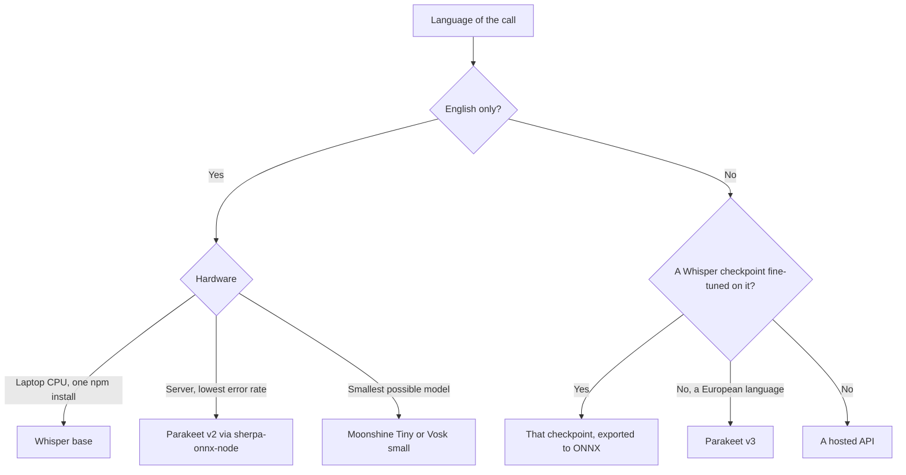

To transcribe speech locally in a Node server, with no API key, no bill per minute and no audio leaving the machine, start with Whisper. It installs with one npm command and is accurate enough for a voice call on a laptop CPU. It is slow on short sentences, though, because it reads thirty seconds of audio whatever the length of the sentence. Outside English, a Whisper checkpoint fine-tuned on the language of the call is more accurate than a bigger generic one. Parakeet, Moonshine and Vosk read only the audio the user spoke. Pick Parakeet for the lowest error rate in English, and Moonshine or Vosk for the smallest model.

We measured every `@micdrop/whisper` latency on CPU, with the model already loaded, on a MacBook Pro M2 with 24 GB of memory. The [benchmark of a fully local voice pipeline](/docs/ai-integration/local-models) ran on the same machine.

## Whisper in Node takes 320 ms to 3.8 s on a short sentence

[`@micdrop/whisper`](/docs/ai-integration/provided-integrations/whisper) runs Whisper inside the Node process through Transformers.js and ONNX Runtime. The weights download on first use, in `q8` by default, then every call in the process shares them.

| Checkpoint | Parameters | Download in `q8` | On a 3 second sentence | Word errors in French |
| ---------- | ---------- | ---------------- | ---------------------- | --------------------- |
| `tiny`     | 39M        | ~45 MB           | ~320 ms                | Not measured          |
| `base`     | 74M        | ~85 MB           | ~440 ms                | 25%                   |
| `small`    | 244M       | ~250 MB          | ~1000 ms               | 22%                   |
| `turbo`    | 809M       | ~850 MB          | ~3800 ms               | 17%                   |
| `french`   | 244M       | ~390 MB          | ~1100 ms               | 2%                    |

Word errors were counted on five French sentences with proper nouns, numbers and homophones. `turbo` is OpenAI's large-v3-turbo, which keeps the large-v3 encoder and cuts the decoder from 32 layers to 4. OpenAI's code and weights are MIT and the `french` fine-tune is Apache 2.0, so every checkpoint can be used commercially.

```typescript
import { WhisperSTT } from '@micdrop/whisper'
import { createReadStream } from 'fs'

const stt = new WhisperSTT({ model: 'base', language: 'en' })

stt.on('Transcript', (text) => console.log(text))

// Raw PCM, 16 bits, 16 kHz, mono
stt.transcribe(createReadStream('speech.pcm'))
```

The class works on its own, without a server or a WebSocket, so you can measure a checkpoint on your own hardware. Pass it to [`MicdropServer`](/docs/server) and it transcribes each sentence of a live call. Run the server without an agent or a voice and you get a [dictation server](/docs/server/dictation).

## Whisper pads every sentence to thirty seconds

Whisper was trained on thirty second windows, so its encoder always receives thirty seconds of audio. A two second sentence gets 28 seconds of silence appended before the encoder runs. The encoder therefore does the same work for every sentence. Only the decoder, which writes the words, takes longer when more was said.

Because of that padding, even `tiny` takes around 320 ms on a three second sentence, and `small` about a second. A voice call is mostly short answers such as "yes", "Thursday works" or "can you repeat that". Whisper still encodes each of them as thirty seconds of audio.

The LLM starts its answer once the transcript is ready, so the time Whisper spends adds to the user's wait for a reply. With Whisper `base`, a local LLM and a local voice, the [first word reaches the user after 0.8 to 1.9 seconds](/docs/ai-integration/local-models/performance), about 440 ms of it spent transcribing.

You can still save time with two settings. Set `language` and Whisper skips language detection. A short sentence then also comes out in the right language. The `warmup` option saves more and is on by default. With it, `@micdrop/whisper` loads the weights when you construct the class and runs one inference on silence while the call is being set up, so the slow first run is over before the user speaks.

## faster-whisper and whisper.cpp run the same weights on a faster runtime

Both projects run OpenAI's weights, so they transcribe as accurately as the original while using less compute and memory.

[faster-whisper](https://github.com/SYSTRAN/faster-whisper), from SYSTRAN, runs Whisper on CTranslate2. Its README reports a benchmark of the `small` checkpoint on an Intel i7-12700K with 8 threads over 13 minutes of audio. The OpenAI implementation takes 6 min 58 s and 2335 MB of memory. faster-whisper takes 2 min 37 s in `fp32`, and 1 min 42 s with 1477 MB in `int8`. On a GPU with large-v2, OpenAI's code takes 2 min 23 s and faster-whisper 59 s. faster-whisper is under MIT, with Silero VAD built in. Since it is a Python library, you run it from Node as a separate service and send it audio over HTTP or a WebSocket.

[whisper.cpp](https://github.com/ggml-org/whisper.cpp), also under MIT, rewrites Whisper in C and C++ with no dependency. Its model files weigh 75 MiB for `tiny`, 142 MiB for `base` and 466 MiB for `small`, and use around 273, 388 and 852 MB of memory once loaded. You can call whisper.cpp from Node directly, in three ways:

- The repository ships a Node addon under `examples/addon.node`, built with cmake-js and meant as a reference rather than a published package.
- `nodejs-whisper` on npm wraps whisper.cpp for Node and was last published in August 2026.
- `@kutalia/whisper-node-addon` ships prebuilt binaries with GPU support.

Both runtimes pad to thirty seconds by default, like the original, so a short sentence still costs a full window. They make each of those thirty seconds cheaper to encode. A server transcribing many calls at once gains the most. Micdrop already runs ONNX weights quantized to `q8`, so on a laptop expect a smaller gain than the one faster-whisper measured against OpenAI's Python code.

## Vosk, Moonshine, Parakeet and Kyutai STT read audio at its real length

[Vosk](https://alphacephei.com/vosk/), from Alpha Cephei, is the oldest of the four. It is built on Kaldi and streams words while the user is speaking. Its small English model weighs 40 MB and makes 9.85% word errors on LibriSpeech test-clean, against 5.69% for the 1.8 GB large one. The library is Apache 2.0, while a few models carry AGPL or non-commercial licenses. Its npm package `vosk` was last published in May 2022 and depends on `ffi-napi`, so expect some work to build it on a recent Node.

[Moonshine](https://github.com/moonshine-ai/moonshine), from Moonshine AI, was trained without the thirty second padding. Its paper reports five times less compute than Whisper `tiny.en` on a ten second segment, at the same word error rate. The current streaming models also cache the encoder and decoder state between chunks. The English model comes in three sizes, Tiny at 34M parameters, Small at 123M and Medium at 245M. Streaming models cover Arabic, German, Japanese, Mandarin, Spanish, Tagalog and Vietnamese. Moonshine publishes the English and streaming models under MIT, and the older non-English models under a non-commercial community license.

[NVIDIA Parakeet](https://huggingface.co/nvidia/parakeet-tdt-0.6b-v3) is the most accurate open model of the four in English. `parakeet-tdt-0.6b-v2` covers English and `v3` covers 25 European languages with automatic detection. Both have 600M parameters and are published under CC-BY 4.0. `v2` averages 4.70% word errors on the Hugging Face Open ASR leaderboard, against 5.78% for Whisper large-v3, and processes audio more than ten times faster on the leaderboard's GPU.

[Kyutai STT](https://github.com/kyutai-labs/delayed-streams-modeling), from the Kyutai lab, was designed for streaming from the start. `stt-1b-en_fr` handles English and French with half a second of delay. The larger `stt-2.6b-en` handles English alone, with 2.5 seconds of delay. Kyutai publishes the weights of both under CC-BY 4.0.

All four take more work to set up in Node than Whisper, which installs with one npm command:

- Moonshine and Parakeet run through [`sherpa-onnx-node`](https://github.com/k2-fsa/sherpa-onnx), a native addon under Apache 2.0 with examples for both, Silero VAD included. Transformers.js lists both architectures too, with an ONNX export of Moonshine published on Hugging Face.
- Vosk runs through its `vosk` npm package, once you get `ffi-napi` to build.
- Kyutai STT has no ONNX export, so it runs outside Node, on PyTorch, on MLX on Apple Silicon, or in Kyutai's Rust `moshi-server`. Your Node server talks to `moshi-server` over a WebSocket.

Whisper is the only model here with a latency measured on a laptop CPU. To use Vosk, Moonshine, Parakeet or Kyutai STT in a call, wrap its runtime in a class that implements the [speech to text interface](/docs/ai-integration/custom-integrations/custom-stt), with a `transcribe()` method that receives the audio stream and emits a `Transcript` event.



## A checkpoint fine-tuned on one language is more accurate than a heavier generic one

The generic Whisper checkpoints learned around a hundred languages at once, so they are less accurate outside English. Over the same five French sentences, on the same machine:

| Checkpoint | Latency  | Word errors |
| ---------- | -------- | ----------- |
| `base`     | ~440 ms  | 25%         |
| `small`    | ~1000 ms | 22%         |
| `turbo`    | ~3800 ms | 17%         |
| `french`   | ~1100 ms | 2%          |

`french` is `whisper-small` fine-tuned on French Common Voice. It runs about as fast as `small` and makes fewer errors in French than `turbo`, which downloads twice as much and takes more than three times as long. Part of the gap comes from numbers. The generic checkpoints write "17h30" where the French one writes "dix-sept heures trente".

```typescript
const stt = new WhisperSTT({ model: 'french', language: 'fr' })
```

For another language, search the Hugging Face hub for a `whisper-small` fine-tuned on it and exported to ONNX, then pass its repository id as `model`. Try that before a larger generic checkpoint, which slows down every sentence, short ones included.

## Hosted transcription costs $0.18 to $0.75 per hour of audio

Use a hosted API when the server is short on CPU, or when the call switches between languages no local checkpoint covers. A hosted API also saves you from setting up Vosk, Moonshine or Kyutai STT when you need words to appear while the user is still speaking. Micdrop ships integrations for Mistral, OpenAI and Gladia. You can put any of them in place of `WhisperSTT` and keep the same agent and voice.

| Provider                                                         | Model                    | Price per hour of audio                              |
| ---------------------------------------------------------------- | ------------------------ | ---------------------------------------------------- |
| [Mistral](/docs/ai-integration/provided-integrations/mistral)    | Voxtral Mini Transcribe  | $0.18, on recorded files                             |
| Mistral                                                          | Voxtral Realtime         | $0.36                                                |
| [OpenAI](/docs/ai-integration/provided-integrations/openai)      | gpt-4o-mini-transcribe   | $0.18                                                |
| OpenAI                                                           | gpt-4o-transcribe        | $0.36                                                |
| [Gladia](/docs/ai-integration/provided-integrations/gladia)      | Real time                | $0.75 on Starter, from $0.25 with volume             |

Prices come from each provider's pricing page in September 2026. Gladia gives a new account a one-time €50 credit. Mistral publishes the weights of Voxtral Realtime under Apache 2.0, so a team that starts on the API can move the same model onto its own GPU later. Mistral and Gladia both process the audio in Europe, so either one fits a [sovereign voice pipeline](/docs/ai-integration/sovereign-voice-ai).

A thousand hours of calls a month comes to $180 at $0.18 per hour, so a hosted API stays cheap for most early products. Local transcription is worth it for privacy, for offline use, and on a server you already run with CPU to spare.

## The models compared on latency, size, license and Node support

| Model                  | Languages                   | Latency on a 3 s sentence | Size                 | License                         | From Node                         |
| ---------------------- | --------------------------- | ------------------------- | -------------------- | ------------------------------- | --------------------------------- |
| Whisper `base`         | ~100                        | ~440 ms                   | 85 MB in `q8`        | MIT                             | `@micdrop/whisper`                |
| Whisper `french`       | French                      | ~1100 ms                  | 390 MB in `q8`       | Apache 2.0                      | `@micdrop/whisper`                |
| faster-whisper         | Same as Whisper             | Not measured here         | Same as Whisper      | MIT                             | Python service                    |
| whisper.cpp            | Same as Whisper             | Not measured here         | 142 MiB for `base`   | MIT                             | Addon or `nodejs-whisper`         |
| Vosk small             | 20+, one model per language | Not measured here         | 40 MB in English     | Apache 2.0, most models         | `vosk`, last published in 2022    |
| Moonshine              | English and 7 others        | Not measured here         | 34M to 245M params   | MIT, community license for some | `sherpa-onnx-node`                |
| Parakeet TDT 0.6B      | English (v2), 25 (v3)       | Not measured here         | 600M params          | CC-BY 4.0                       | `sherpa-onnx-node`                |
| Kyutai STT             | English and French (1B)     | Not measured here         | 1B and 2.6B params   | CC-BY 4.0                       | `moshi-server` over a WebSocket   |

Start with Whisper `base` for an English call, since it is the only English option here that installs with one npm command and has a measured latency on a laptop. For a call in another language, move to a checkpoint fine-tuned on that language. Look at Parakeet once transcription runs on a server and the English error rate matters more than setup time. Pick Moonshine Tiny or Vosk when the model has to stay as small as possible.

To switch models, replace the transcription class. The agent and the voice stay as they are. The voice can run on the same machine too, with a [local text to speech model](/blog/local-tts-node-kokoro-vs-piper). You can [compare every transcription and voice provider](/docs/ai-integration) or [start a first voice call in about five minutes](/docs/getting-started).

## Frequently asked questions

<FaqList>
  <FaqItem question="What is the best local speech-to-text model?">
    It depends on the language and the hardware. On a laptop CPU in Node,
    Whisper `base` is the simplest start in English, at around 440 ms on a three
    second sentence with one npm install. For another language, a Whisper
    checkpoint fine-tuned on it is more accurate than a larger generic one: the
    French `whisper-small` makes 2% word errors where large-v3-turbo makes 17%.
    On a server, pick NVIDIA Parakeet TDT 0.6B v2, which averages 4.70% word errors
    in English on the Open ASR leaderboard, against 5.78% for Whisper large-v3.
  </FaqItem>
  <FaqItem question="Is there a free alternative to Whisper?">
    Yes, four models run on your own hardware at no cost per minute. Vosk and
    most of its models are Apache 2.0, Moonshine's English and streaming models are MIT, and NVIDIA
    and Kyutai publish the weights of Parakeet and Kyutai STT under CC-BY 4.0.
    faster-whisper and whisper.cpp are free too. They keep the Whisper model and
    run it on a faster runtime.
  </FaqItem>
  <FaqItem question="Is there a free speech-to-text?">
    Every model you run yourself is free to use: Whisper, faster-whisper,
    whisper.cpp, Vosk, Moonshine, Parakeet and Kyutai STT. You pay for the
    machine instead. Check the license of the weights too, since some Vosk and
    Moonshine models forbid commercial use. Among hosted APIs, Gladia gives a
    new account a one-time €50 credit. Paid transcription starts at $0.18 per
    hour of audio with Mistral and OpenAI.
  </FaqItem>
  <FaqItem question="Can Whisper do live transcription?">
    Yes, through a wrapper. Whisper reads a fixed thirty second window and
    keeps nothing between calls, so a live wrapper re-runs it on overlapping chunks.
    whisper.cpp ships a `whisper-stream` example that re-transcribes every half
    second, WhisperLive wraps faster-whisper in a WebSocket server, and
    whisper_streaming reports about 3.3 seconds of latency on long speech. A
    voice call needs no wrapper, since voice activity detection cuts the audio
    into sentences and Whisper transcribes each one when the user stops
    speaking.
  </FaqItem>
  <FaqItem question="Is whisper.cpp faster than faster-whisper?">
    They are two runtimes for the same Whisper weights, built for different
    platforms. faster-whisper is a Python library on CTranslate2. Its README
    reports the `small` checkpoint running four times faster than OpenAI's code
    on a CPU in `int8`. whisper.cpp is written in C and C++ with no dependency, runs on almost any device
    and reaches Node through an addon. Both keep Whisper's thirty second window by
    default, so pick by where your code runs: faster-whisper for a Python
    service, whisper.cpp to stay inside a Node or native process.
  </FaqItem>
</FaqList>
