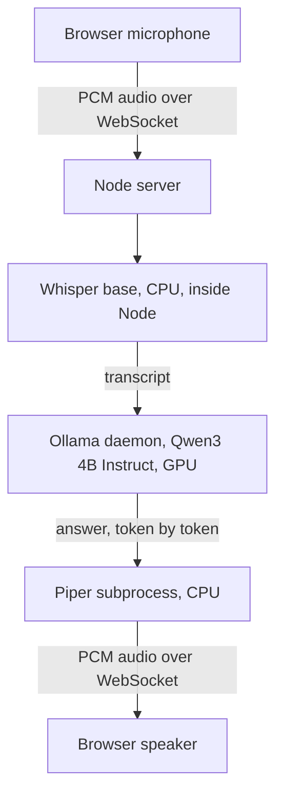
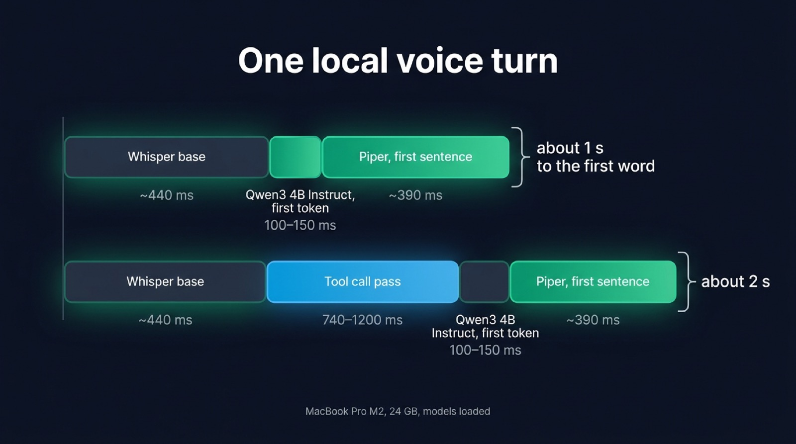
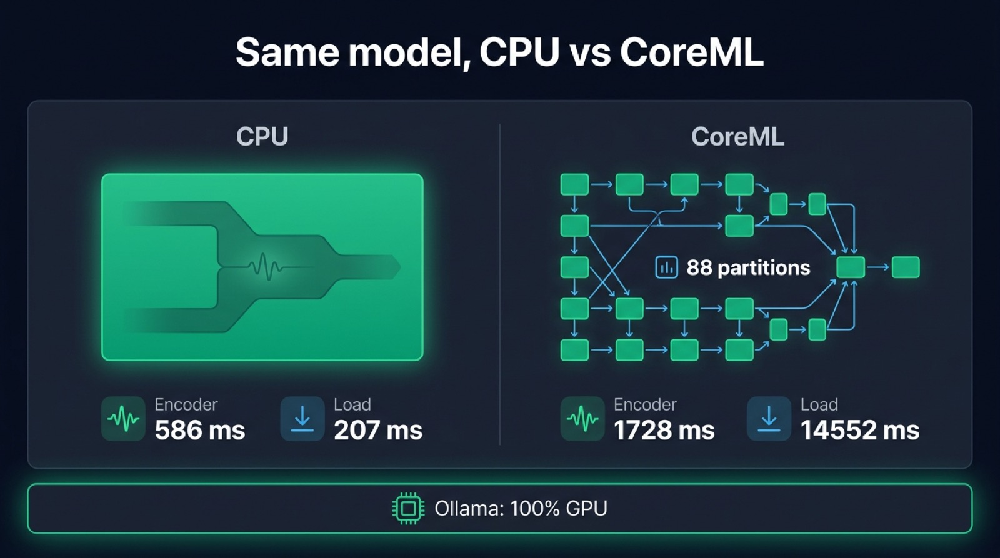

A voice agent can run entirely on a laptop, with Whisper transcribing, a small LLM served by [Ollama](https://ollama.com) writing the answer and Piper speaking it, and no audio or text ever leaving the machine. On a MacBook Pro M2, that stack answers about one second after the user stops talking and holds around 4 GB of memory. This post sets it up from a Node server, gives the latency of each step, and covers the traps we hit while building it.

Most guides for an offline voice assistant assemble the same three parts in Python, with a loop around the microphone. Here the loop runs in a web page and a Node server, with [Micdrop](/), an open source TypeScript library for real-time voice conversations with AI, handling the microphone, the WebSocket and the interruptions. Every figure comes from our [measurements of local models](/docs/ai-integration/local-models), all taken on that one machine.

## What the three parts become when they run locally

A voice call chains three models. Speech to text turns the user's sentence into text, the LLM writes the answer, and text to speech reads it back. Each one has a local counterpart that a Node server can drive:

| Part           | Local choice                                                     | Where it runs                       | Download     |
| -------------- | ---------------------------------------------------------------- | ----------------------------------- | ------------ |
| Speech to text | [Whisper](/docs/ai-integration/provided-integrations/whisper) `base` | Inside the Node process, on the CPU | ~85 MB       |
| LLM            | Qwen3 4B Instruct, served by Ollama                              | The Ollama daemon, on the GPU       | 2.5 GB in Q4 |
| Text to speech | [Piper](/docs/ai-integration/provided-integrations/piper)        | A subprocess, on the CPU            | A few dozen MB per voice |

We picked Piper over the other local voices because it speaks around forty languages and runs well on any CPU. In English, Kokoro installs with a single npm command and Pocket TTS starts speaking a little sooner. We measured all three side by side for [local text to speech in Node](/blog/local-tts-node-kokoro-vs-piper). Whisper has faster rivals for [local speech to text in Node](/blog/local-speech-to-text-node), but it is the one you install with npm and nothing else.

Micdrop drives the LLM through its [AI SDK integration](/docs/ai-integration/provided-integrations/ai-sdk). Ollama serves the OpenAI protocol on `/v1`, like LM Studio and `llama-server`, so either one can replace it on another port.



## Setting up Ollama, Whisper and Piper

Start with the LLM. The Ollama daemon has to be running before `ollama pull` can reach it:

```bash
brew install ollama
brew services start ollama
ollama pull qwen3:4b-instruct
```

Then install the Piper binary and download one voice, which comes as two files kept side by side:

```bash
pip install piper-tts
mkdir -p voices && cd voices
BASE=https://huggingface.co/rhasspy/piper-voices/resolve/main/en/en_GB/alba/medium
curl -LO $BASE/en_GB-alba-medium.onnx
curl -LO $BASE/en_GB-alba-medium.onnx.json
```

Then install the Node packages. Whisper downloads its weights on first use:

```bash
npm install @micdrop/server @micdrop/ai-sdk @micdrop/whisper @micdrop/piper @ai-sdk/openai ws
```

The server creates one `MicdropServer` per WebSocket connection:

```typescript
import { createOpenAI } from '@ai-sdk/openai'
import { AiSdkAgent } from '@micdrop/ai-sdk'
import { PiperTTS } from '@micdrop/piper'
import { MicdropServer } from '@micdrop/server'
import { WhisperSTT } from '@micdrop/whisper'
import { WebSocketServer } from 'ws'

// Ollama serves the OpenAI protocol on /v1
const ollama = createOpenAI({
  baseURL: 'http://localhost:11434/v1',
  apiKey: 'ollama', // Unused, the SDK refuses to start without one
})

const wss = new WebSocketServer({ port: 8081 })

wss.on('connection', (socket) => {
  new MicdropServer(socket, {
    firstMessage: 'Hello, how can I help?',

    agent: new AiSdkAgent({
      // .chat() targets the chat completions route, which Ollama serves
      model: ollama.chat('qwen3:4b-instruct'),
      systemPrompt:
        'You are a voice assistant. Answer in English, in one or two short sentences. Write numbers in words.',
      providerOptions: { openai: { reasoningEffort: 'none' } },
    }),

    stt: new WhisperSTT({ model: 'base', language: 'en' }),

    tts: new PiperTTS({ modelPath: './voices/en_GB-alba-medium.onnx' }),
  })
})
```

The browser side is the same as with hosted providers:

```typescript
import { Micdrop } from '@micdrop/web'

Micdrop.start({ url: 'ws://localhost:8081' })
```

Run one call before showing the agent to anyone. The first call downloads the Whisper weights and loads every model. After that, Micdrop keeps each model loaded between turns and shares it between calls.

Ollama has its own timer. It unloads a model after five minutes without a request, so the next call waits several seconds while the model reloads. On a machine dedicated to the agent, start the daemon with `OLLAMA_KEEP_ALIVE=-1` to keep the model in memory.

## The latency you get

The user hears the first word once Whisper has transcribed the sentence, the LLM has written its first tokens and Piper has synthesized the first sentence of the answer:

| Step                                  | Time on a MacBook Pro M2 |
| ------------------------------------- | ------------------------ |
| Whisper `base` on a 3 second sentence | ~440 ms                  |
| First token from Qwen3 4B Instruct    | 100 to 150 ms            |
| First sentence from Piper             | ~390 ms                  |
| Total, end of speech to first audio   | about 1 s                |

We measured each step with the model already loaded. We also measured one call end to end in the demo app, with the assistant speaking first so that nothing needed transcribing. The first audio reached the browser 1.66 seconds after the call opened.

A French call takes longer. The generic `base` checkpoint gets a quarter of the words of a French sentence wrong, so switch to the `french` checkpoint, which gets 2% of the words wrong and takes about 1.1 s on the same 3 second sentence. The first word then arrives after about 1.6 s.

Tool calls cost more than any of these steps. Every tool you declare, and each of Micdrop's automatic prompts (ending the call, semantic turn detection, ignoring noise), asks the model to decide on a tool call before it answers. That extra pass takes 740 to 1200 ms, about as long as transcription and the voice put together. Turn on only the ones you need.

{/* IMAGE regen: api.py image, infographic, 1600x900. Scene: "A horizontal timeline bar chart titled 'One local voice turn' showing where the time goes between the end of the user's sentence and the first audio. Three consecutive segments on one bar, left to right, with widths proportional to time: 'Whisper base' labeled '~440 ms', 'Qwen3 4B Instruct, first token' labeled '100–150 ms', 'Piper, first sentence' labeled '~390 ms'. At the end of the bar, a bracket labeled 'about 1 s to the first word'. Below it, a second bar starting at the same point, made of the same three segments plus an extra segment inserted after Whisper, labeled 'Tool call pass' and '740–1200 ms', drawn in the secondary accent color, with a bracket labeled 'about 2 s'. Small caption at the bottom: 'MacBook Pro M2, 24 GB, models loaded'. Clean flat bars, generous spacing, labels in a modern clean bold sans-serif. Render only the text labels written in this scene, nothing else: the brand description is style guidance and never text to display." Regenerate if the latency figures in the local models documentation change. Last data sync: 2026-10-07. */}


Memory is less of a problem than latency. Qwen3 4B in Q4, Whisper `base` and a voice take around 4 GB, which leaves room on a 16 GB machine. Spend spare memory on a larger LLM rather than on a larger Whisper checkpoint, since a larger checkpoint makes every sentence slower.

## What a small model gets wrong

### The reasoning variant takes up to two minutes per turn

`qwen3:4b`, the default tag, is the reasoning variant. It writes 900 to 1500 tokens of reasoning before answering, which takes 90 to 120 seconds per turn on this machine. Adding `/no_think` to the prompt leaves the reasoning in place, and so does Ollama's `think` flag. With that flag, Ollama only stops separating the reasoning from the answer, so Piper reads the reasoning aloud.

Pull the tag ending in `-instruct`, which answers directly. Keep `reasoningEffort: 'none'` in the agent options anyway. Ollama maps it to its `think` flag, which does switch reasoning off on models that use the same weights with and without reasoning, such as MiniCPM5-2B. A model without reasoning, like Qwen3 4B Instruct, ignores it.

### The call never ends on goodbye

Micdrop's `autoEndCall` option asks the model to call an end-of-call tool when the user wants to hang up. None of the small models without reasoning triggered it in our tests. When the user said "Merci, au revoir !", Qwen3 4B and MiniCPM5-2B both said goodbye and left the line open. Mistral 7B thanked the user for "the instructions". Only the reasoning variant of Qwen3 4B ended the call, at the cost of up to two minutes per turn.

So leave `autoEndCall` off and end the call from the browser. A hang-up button covers the user who wants to leave, and an idle timer covers the one who stops talking:

```typescript
import { Micdrop } from '@micdrop/web'

let idle: ReturnType<typeof setTimeout> | undefined

// Hangs up after 30 seconds with nobody speaking
Micdrop.on('StateChange', (state) => {
  clearTimeout(idle)
  if (state.isStarted && !state.isUserSpeaking && !state.isAssistantSpeaking) {
    idle = setTimeout(() => Micdrop.stop(), 30_000)
  }
})

hangUpButton.addEventListener('click', () => Micdrop.stop())
```

Other tool calls hold up better. When we asked the time with a `get_time` tool available, Qwen3 4B called it and answered in 1.1 to 1.3 s, while Mistral 7B made up a time without calling anything. With `autoIgnoreUserNoise` on, Qwen3 4B skipped a meaningless "uh" three times out of four. You can compare [how the three local LLMs handle tool calls](/docs/ai-integration/local-models/agent#tool-calls), MiniCPM5-2B included.

### Numbers come out in digits

Qwen3 4B sometimes writes "3" even though the system prompt asks for numbers in words. The voice then reads those digits inconsistently. Keep that instruction in the prompt anyway, then listen to the sentences your product says most often.

### The GPU made transcription three times slower

On a Mac, the obvious move is to put Whisper on the GPU, so we tried it. Transformers.js declares no GPU device on macOS, and WebGPU does not exist in Node, but the ONNX Runtime package for Node includes the CoreML provider. We ran the encoder of the `french` Whisper checkpoint on the CPU and on CoreML:

| Provider  | Encoder | Session load |
| --------- | ------- | ------------ |
| CPU       | 586 ms  | 207 ms       |
| CoreML    | 1728 ms | 14552 ms     |

CoreML ran the encoder three times slower, and took 14 seconds to compile the model when the session opened. Its log shows why: CoreML handles 577 of the 873 nodes and splits the graph into 88 partitions, so most of the time goes into copying tensors between partitions. With the `MLProgram` format it got slower still, at 2975 ms.

Keep Whisper on the CPU, with the quantized `q8` weights it uses by default. Piper has a `--cuda` flag and no Metal equivalent. It runs fast enough on the CPU anyway. On Linux with an NVIDIA card, `device: 'cuda'` is worth measuring on your own server.

{/* IMAGE regen: api.py image, infographic, 1600x900. Scene: "Side-by-side comparison of two execution paths for the same Whisper encoder on a Mac, titled 'Same model, CPU vs CoreML'. Left panel labeled 'CPU': one solid block representing the whole graph, with two figures underneath, 'Encoder 586 ms' and 'Load 207 ms'. Right panel labeled 'CoreML': the same graph broken into many small separate blocks with arrows shuttling data between them, a counter reading '88 partitions', and two figures underneath, 'Encoder 1728 ms' and 'Load 14552 ms'. A thin strip across the bottom reads 'Ollama: 100% GPU' next to a small chip icon, to show the LLM already uses the GPU. Clean flat vector blocks, labels in a modern clean bold sans-serif. Render only the text labels written in this scene, nothing else: the brand description is style guidance and never text to display." Regenerate if the CoreML benchmark in the latency and memory documentation changes. Last data sync: 2026-10-07. */}


### Ollama already uses the GPU

The Mac's GPU stays busy during the call anyway. Ollama runs the LLM, by far the heaviest model in the call, on Metal on a Mac and on CUDA on a machine with an NVIDIA card. `ollama ps` shows `100% GPU` while a call is in progress. So the split on a Mac is the right one: the LLM on the GPU, transcription and the voice on the CPU, each on the hardware where it runs fastest.

## When local is the right answer

A local stack makes sense for a product whose health or legal conversations must stay on the machine, for a demo on a network you do not control, or for a development setup where nobody wants to share API keys. It costs nothing per minute, since Micdrop is MIT-licensed and the recommended models carry permissive licenses. Piper's engine is GPL-3.0. Micdrop runs it as a separate process, so the GPL terms come into play when you redistribute the Piper binary yourself.

A local stack makes less sense when the agent has to follow a long script, call several tools reliably or hang up on its own. A 4B model handles a short exchange well and falls behind a hosted model as soon as the conversation needs judgment. The voice is the other limit. Piper sounds less natural than a hosted voice from ElevenLabs or Cartesia. The local voices that sound better either speak only English, like Kokoro and Pocket TTS, or need a GPU and a server next to your app, like Qwen3-TTS.

You can mix the two. Each part is one line in the server, so a product can keep transcription local and send the text to a hosted LLM, or run everything locally in development and switch to [a European hosted stack](/docs/ai-integration/sovereign-voice-ai) in production. The browser code stays the same either way.

Micdrop handles what you would otherwise write around the three models: microphone capture and voice activity detection in the browser, audio streaming over the WebSocket, cutting the voice when the user interrupts, restarting the Piper process so it is ready for the next answer, and the warm-up that moves the first inference to call setup. A hosted platform such as Vapi charged $0.05 a minute in September 2026 for that orchestration, before any model bill. You still build what a platform adds on top, such as hosting, call history and a dashboard.

The fastest way to hear the stack is to [run a first voice call in five minutes](/docs/getting-started), then swap the providers for the local ones above.
