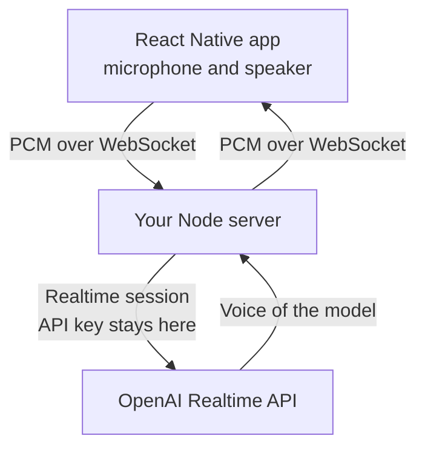

You want a voice agent in a React Native app, running on OpenAI's Realtime API, but the browser examples rely on APIs the phone lacks. The official SDK expects browser WebRTC, the raw WebSocket makes you write audio capture and playback yourself, and the API key must stay out of the app bundle. The short answer is to keep the phone away from OpenAI entirely. The app streams microphone audio over a WebSocket to your own server, which holds the Realtime session. This article explains why the direct route is hard, what the usual workarounds cost, and how to build the server route in TypeScript.

## What the Realtime SDK needs to run in React Native

OpenAI offers two ways into a Realtime session from a client. WebRTC is the one it recommends for a browser or a mobile device, with a short-lived key minted by your backend. The WebSocket is meant for servers and expects you to send and receive base64 PCM at 24 kHz yourself.

React Native lacks both `RTCPeerConnection` and `navigator.mediaDevices`. The OpenAI Agents SDK for JavaScript was also built on Node and browser modules that Metro cannot bundle. Developers traded workarounds for a year in [a GitHub issue about React Native support](https://github.com/openai/openai-agents-js/issues/133), opened in June 2025, until a fix was merged in August 2026. Since version 0.15, the SDK loads in React Native and runs its `RealtimeSession` on a transport you provide.

The fix only makes the SDK load. According to the pull request that merged it, the built-in WebRTC transport stays browser only and the React Native transport is example code. Your app still handles the microphone permission, the native audio session, the audio routing and background audio. It also needs a development build, since `react-native-webrtc` does not run in Expo Go.

## Each workaround adds native code, a key server or a vendor

Forum threads and example repositories describe three routes.

- To run WebRTC on the phone, you add `react-native-webrtc` and its Expo config plugin, write or copy a transport for the SDK, and deploy a small backend that mints ephemeral keys. In OpenAI's own example, the answer can play through the earpiece on a physical iPhone. Fixing the route takes native code in `AppDelegate`, which `expo prebuild` can overwrite. A forum thread from December 2024 describes the model hearing its own voice on the loudspeaker and answering itself in a loop.
- A raw WebSocket from the phone connects fine, since React Native's `WebSocket` accepts headers. You then record the microphone, resample to 24 kHz, encode base64 chunks, decode and queue the answer for playback, cut playback when the user interrupts, and configure echo cancellation. That is a voice client written from scratch. You still need a backend that mints ephemeral keys, since a standard key cannot ship in an app.
- A hosted media layer such as [Stream](https://getstream.io/video/sdk/react-native/tutorial/ai-voice-assistant/) puts its own WebRTC servers between the phone and a backend that calls OpenAI. It works, at the price of one more vendor and a per-minute bill.

| | WebRTC on the phone | Raw WebSocket on the phone | Session on your server |
|---|---|---|---|
| Native modules | `react-native-webrtc`, plus audio routing code | An audio library | An audio library |
| API key | Ephemeral key minted by a backend | Ephemeral key minted by a backend | Stays on the server |
| Audio code in the app | Transport and audio session | Capture, resampling, playback, interruption | Handled by the client library |
| Network hops | Phone to OpenAI | Phone to OpenAI | Phone to your server to OpenAI |
| Tools and prompt | In the app, or relayed to a backend | In the app | On the server |

## Move the session to your server

The phone opens one WebSocket to a server you run and sends raw PCM while the user speaks. The server opens the Realtime session with OpenAI, forwards the audio, and streams the model's voice back to the phone. The app never sees an OpenAI key or a WebRTC peer.



You handle the session, the resampling and the interruptions on the server instead, where they are ordinary Node code. You keep the system prompt and the tools next to your database. Authentication is whatever your API already uses, a session cookie or a JWT sent with the first message. You also get one implementation for every client: a browser and a phone connect to the same endpoint.

Going through your server adds a network hop, since the audio reaches your server before OpenAI. Host the server close to OpenAI's region to keep that hop short. OpenAI also recommends WebRTC to mobile clients because it handles packet loss better than a WebSocket over a weak cellular link. For most apps, both costs are small next to calls that work the same way on iOS, Android and the web.

## The server can run the Realtime model or a pipeline

Once the server holds the session, you choose what runs behind it. You can keep the Realtime model, which hears the user's tone and answers in its own voice. You can also split the call into three services, speech to text, a language model and text to speech, to pick a voice from ElevenLabs or Cartesia, keep the data in Europe, or add a fallback provider.

The app stays the same in both modes, since it only sends and plays PCM. Choosing between [a Realtime session and a swappable pipeline](/blog/openai-realtime-api-vs-pipeline) comes down to cost, voices and resilience. In a mobile app, you can start on the Realtime model and switch later without shipping a new version to the stores.

## Micdrop provides the server and the React Native client

[Micdrop](/) is an open source TypeScript library for real-time voice conversations with AI agents. It handles the microphone, the playback, voice activity detection, interruptions and the WebSocket on the client, and the orchestration on a Node server. Its React Native package, `@micdrop/react-native`, runs the same client as the browser one.

On the server, `OpenaiRealtime` holds the Realtime session. You pass it to `MicdropServer` as `realtime`:

```typescript
import { OpenaiRealtime } from '@micdrop/openai'
import { MicdropServer, waitForParams } from '@micdrop/server'
import { WebSocketServer } from 'ws'
import { z } from 'zod'

const wss = new WebSocketServer({ port: 8087, host: '0.0.0.0' })

wss.on('connection', async (socket) => {
  // Check the user before opening a paid session (verifyToken is your own auth check)
  const { token } = await waitForParams(
    socket,
    z.object({ token: z.string() }).parse
  )
  await verifyToken(token)

  new MicdropServer(socket, {
    realtime: new OpenaiRealtime({
      apiKey: process.env.OPENAI_API_KEY || '',
      systemPrompt:
        'You are a friendly assistant on a phone. Keep your answers short.',
    }),
    generateFirstMessage: true,
  })
})
```

`OpenaiRealtime` resamples the phone's 16 kHz audio to the 24 kHz the API expects and back. It turns off OpenAI's own turn detection, since the client already detects when the user speaks. When the user interrupts, it cancels the answer and trims the model's memory of it to the point the user most likely stopped hearing. Tools you add with `addTool()` run on the server, in the middle of an answer. You can tune `OpenaiRealtime` further with its [OpenAI Realtime options](/docs/ai-integration/provided-integrations/openai#openai-realtime). The server [handles turns and interruptions](/docs/server/realtime) the same way for every speech-to-speech model.

In the app, one button starts and ends the call:

```tsx
import { useMicdropState } from '@micdrop/react'
import { Micdrop } from '@micdrop/react-native'
import { Button } from 'react-native'

export default function Call({ token }: { token: string }) {
  const state = useMicdropState()

  const handlePress = () =>
    state.isStarted
      ? Micdrop.stop()
      : Micdrop.start({ url: 'wss://api.example.com/call', params: { token } })

  return (
    <Button title={state.isStarted ? 'Hang up' : 'Talk'} onPress={handlePress} />
  )
}
```

`Micdrop.start()` asks for the microphone permission, configures the audio session as a phone call, which turns on the platform's echo cancellation, and opens the socket. The user can switch between the loudspeaker and the earpiece during the call. When the network drops, the client reconnects. Audio goes through `react-native-audio-api`, so the app needs a development build, like any route that records the microphone. Add the microphone permissions and the Expo config plugin when you [install the React Native client](/docs/react-native/installation).

To run the same app on a pipeline, replace `realtime` with `stt`, `agent` and `tts` on the server. The [Micdrop server](/docs/server) can also save the messages and resume a conversation.

## Frequently asked questions

<FaqList>
  <FaqItem question="Does the OpenAI Realtime SDK work in React Native?">
    Since version 0.15 of the OpenAI Agents SDK, released in August 2026, the SDK loads in React Native and its RealtimeSession runs on a transport you provide. The built-in WebRTC transport remains browser only, so you bring react-native-webrtc, an example transport, and your own code for the microphone permission, the audio session and the speaker routing. It needs a development build, since Expo Go is unsupported.
  </FaqItem>
  <FaqItem question="Can I use the Realtime API over WebSocket in Expo?">
    Yes, React Native's WebSocket accepts the headers the API needs. You then write the audio side yourself: capture the microphone, resample to 24 kHz, send base64 PCM, queue the answer for playback and stop it when the user interrupts. Hold the session on your own server to skip that work in the app and keep the API key off the phone.
  </FaqItem>
  <FaqItem question="Do I need WebRTC to use the OpenAI Realtime API on mobile?">
    No. OpenAI recommends WebRTC for a client that connects directly. When the phone talks to your own server instead, it only needs a WebSocket to that server. Your server then connects to OpenAI over a WebSocket of its own.
  </FaqItem>
  <FaqItem question="Where should the OpenAI API key live in a React Native app?">
    Keep it out of the app bundle. A direct connection needs an ephemeral key, minted by your backend for each session through the client secrets endpoint. When your server holds the session, the standard key stays there and the app authenticates against your own API.
  </FaqItem>
  <FaqItem question="Why does the model hear its own voice on the phone's loudspeaker?">
    The microphone picks up the answer when echo cancellation is off. Configure the native audio session as a voice call to turn on the platform's echo cancellation. Micdrop's React Native client does this when the call starts.
  </FaqItem>
</FaqList>

## Getting started

Micdrop's repository has [a complete React Native call screen](https://github.com/Godefroy/micdrop/tree/main/examples/react-native), with the Node server it talks to. Swap its three OpenAI providers for `OpenaiRealtime` to run it on the Realtime model. To start from an empty project, [install the React Native client](/docs/react-native/installation), then [set up the server](/docs/getting-started) with the quick start, which gets a first call running in about five minutes.
