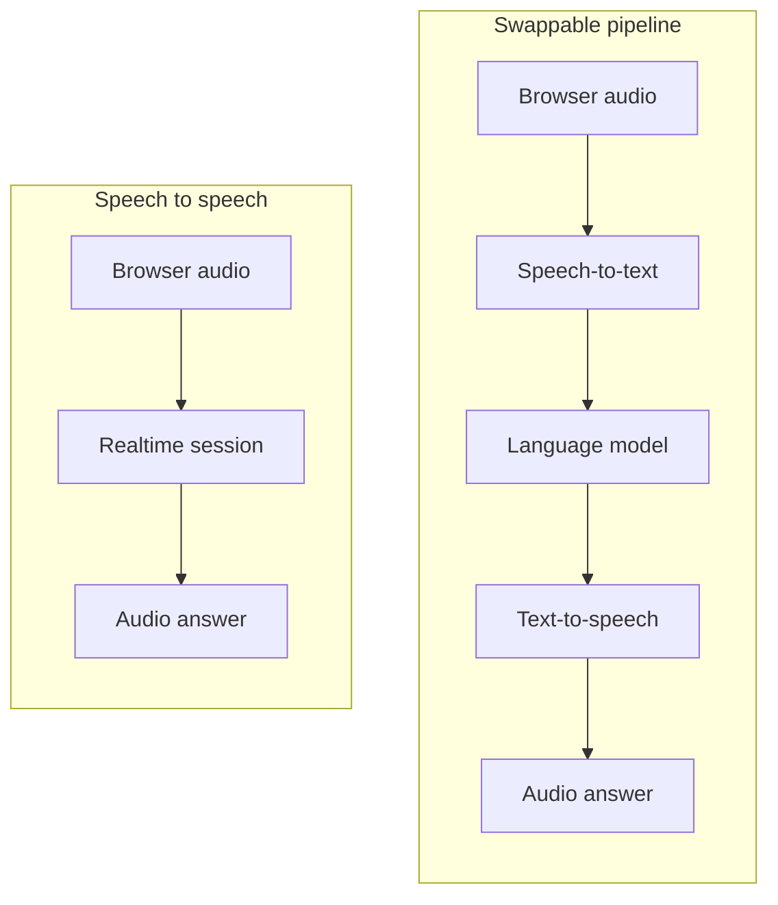
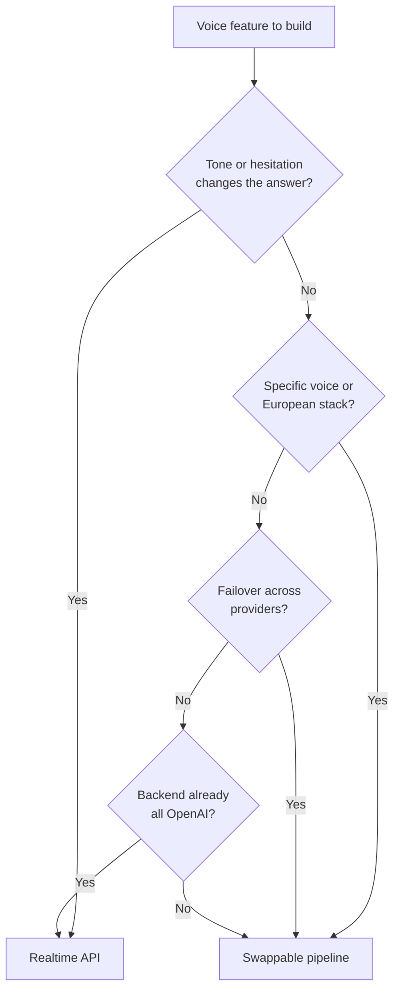

You are adding a voice mode to a web application, and the first architecture decision splits in two. Either you open a single connection to a speech-to-speech model and let it hear and answer, or you assemble three services: speech-to-text, a language model, text-to-speech. OpenAI's Realtime API made speech to speech easy enough that plenty of teams take it without weighing the pipeline. Both are good answers, to different products.

[Micdrop](/), an open source TypeScript library for real-time voice conversations, runs both architectures behind the same browser client and Node server. The question is then which one fits a given call, knowing you can switch later.

## What the Realtime API gives you in one connection

You open one session, stream audio in as the microphone captures it, and receive audio frames back for playback. The model hears the user, generates the answer and speaks it, with no orchestration code handing text between services.

You can open that session over three transports. WebRTC suits browser and mobile clients that capture and play audio directly. WebSocket suits a server that already receives raw audio from a media pipeline or a call system. SIP connects the model to a phone number. Function calling and remote MCP servers work inside the session, so the model can query your database mid-sentence. A transcription-only session type also exists, for applications that want the text without a spoken answer.

OpenAI's current model on this endpoint is GPT-Realtime-2.1, with a cheaper mini version, and both reason and call tools inside the session. GPT-Live-1 is a separate full-duplex model on its own endpoint. It hears the user while it speaks and hands reasoning and tools to a backend model. GPT-Realtime-2.1, GPT-Live-1 and Gemini Live [differ in turn-taking, price and reasoning](/blog/gpt-live-vs-gpt-realtime-vs-gemini-live).

Prosody stays intact. A hesitation, a laugh, a sarcastic lilt, someone trailing off before finishing a thought: the model receives all of it as sound. A pipeline transcribes first, and "um, I think, no wait, actually yes" reaches the model as a flat string with every acoustic clue removed. For a language tutor correcting pronunciation, or an interview agent reading how confident someone sounds, hearing the audio is the feature itself.



## What one connection costs you

Provider choice collapses to one. Hearing, reasoning and speaking come from the same provider, on the same bill, in the same regions. A price change, a quality regression on a new model snapshot or an incident hits all three functions at once, and you have no second path to route around it.

The voice list is short. The realtime models ship ten voices, and OpenAI recommends two of them, `marin` and `cedar`. [ElevenLabs](https://elevenlabs.io) publishes a library of more than ten thousand community voices and [Cartesia](https://cartesia.ai) around five hundred, both with cloning. If your product needs a recognisable brand voice, or a specific accent in a language OpenAI's voices pronounce unnaturally, you need a text-to-speech provider of your own.

Everything is billed as audio. OpenAI's [pricing page](https://developers.openai.com/api/docs/pricing) lists the full-size realtime models at $32 per million audio input tokens and $64 per million audio output tokens, with a mini tier at $10 and $20, as of September 2026.

Data residency gets harder. OpenAI offers regional processing in Europe for eligible projects, with zero data retention, and its own data controls guide notes that tracing is not currently EU data residency compliant for the realtime endpoint. Beyond the endpoint itself, a single-provider architecture rules out a fully European stack, transcription, model and voice included.

The transcript is a byproduct. In a pipeline the text is the substrate, already there for your logs, your evaluations, your compliance archive and your prompt iteration. Speech to speech gives you audio, and you collect the text from the session events.

## When speech to speech wins

Pick the Realtime API when the acoustics carry meaning. Language learning, accent coaching, roleplay and emotional register all need the model to hear how something was said rather than what was said.

Pick it when your latency budget is the product. Each stage of a pipeline adds a wait, and the model cannot start reasoning until the transcription of the turn is final. A single session removes those waits.

Take it when you want the fewest moving parts. A browser connecting over WebRTC with an ephemeral key needs almost no backend, and a phone agent over SIP needs no telephony stack of your own. For a prototype that has to exist by Friday, that is the whole argument.

It also fits a team already committed to OpenAI everywhere else. If your product runs on their models, their embeddings and their infrastructure, the provider diversity a pipeline buys you is a benefit you were never going to use.

## When a swappable pipeline wins

One of the three stages usually turns out to have a requirement of its own. A specific voice is the most common. Outside English, a dedicated transcription provider is often more accurate than a general-purpose one.

Cost is the largest difference, and OpenAI publishes every rate it needs. Audio counts as one token per 100 ms it hears and one token per 50 ms it speaks, so a minute of conversation shared evenly between the user and the agent is 300 tokens in and 600 tokens out.

| One minute of conversation | Realtime, `gpt-realtime-2.1` | Pipeline, small models | Pipeline, European providers |
|---|---|---|---|
| Hearing 30 seconds | $0.010 | $0.009, `gpt-live-transcribe` | $0.006, Gladia |
| Reasoning | Included in the audio tokens | $0.0004, `gpt-5-nano` | $0.003, Mistral Large |
| Speaking 30 seconds | $0.038 | $0.007, `gpt-4o-mini-tts` | $0.018, Gradium |
| **Total** | **$0.048** | **$0.016** | **$0.027** |

Those figures come from audio at $32 and $64 per million tokens on `gpt-realtime-2.1`, $0.017 a minute on `gpt-live-transcribe`, $12 per million on `gpt-4o-mini-tts`, $0.05 and $0.40 per million on `gpt-5-nano` over four turns of 1,500 tokens, $0.75 an hour on Gladia streaming, $0.50 and $1.50 per million on Mistral Large, and Gradium's S plan at $43 for 900,000 characters, which its own count of 45,000 characters an hour puts at 375 characters for that half minute.

Speech billed as audio costs several times the same content billed as text, and one rate applies to every turn, however trivial. A pipeline prices each stage on its own, so you buy each one from whoever fits the requirement. On small OpenAI models that lands about three times below the realtime session. The European stack costs more than that and still undercuts the single session, because a premium voice is the expensive stage and Gradium charges for it. Paying more on one stage while staying cheaper overall is the whole point of pricing them separately. Live transcription bills by audio duration and costs more than transcribing a recording afterwards, so a batch price list makes a pipeline look cheaper than it is.

Both architectures re-send the conversation history on every turn, and they pay for it differently. The pipeline pays in text tokens, which the reasoning figure already includes. A realtime session pays in audio tokens, cached at a discount but still added on top, which is what makes long calls diverge. The mini realtime tier also closes part of the difference on its own, at $10 and $20 per million.

Regulation leads to a pipeline too. A European deployment can run [Mistral for the model, Gladia for transcription and Gradium for the voice](/docs/ai-integration/sovereign-voice-ai), where the data stays in the EU and every company in the chain is European. Regional processing on a US endpoint moves the servers, and the chain stays American.

Resilience is the argument teams discover last and care about most. When the three services are separate, one of them failing takes down one stage instead of the conversation. Micdrop's [FallbackAgent](/docs/ai-integration/fallback-strategies/agent-fallback) switches to a second model mid-conversation, from the same history, and `FallbackSTT` and `FallbackTTS` do the same for transcription and voice. A single session has nowhere to fall back to.

| | Realtime API | Swappable pipeline |
|---|---|---|
| Providers | One | One per stage, mixable |
| Voices | The model's list | Any TTS provider, cloning included |
| Tone and hesitation | Reach the model | Lost at transcription |
| Billing | Audio tokens throughout | Per stage, each at its own rate |
| Failover | Retry the same session | Second provider per stage |
| European stack | Regional processing, single provider | Fully European if you pick European providers |
| Transcript | Emitted alongside the audio | The primary output |
| Moving parts | One session | Three services to wire together |

## Driving the Realtime API from TypeScript with Micdrop

Micdrop runs a full speech-to-speech session on the Realtime API. `OpenaiRealtime` takes the place of transcription, the agent and the voice, and you pass it to the server as `realtime`:

```typescript
import { MicdropServer } from '@micdrop/server'
import { OpenaiRealtime } from '@micdrop/openai'

new MicdropServer(socket, {
  realtime: new OpenaiRealtime({
    apiKey: process.env.OPENAI_API_KEY || '',
    systemPrompt: 'You are a helpful assistant',
  }),
})
```

It runs `gpt-realtime-2.1` with the `marin` voice by default, and its `model` option takes `gpt-realtime-2.1-mini` for a cheaper call. The browser talks to your Node server over Micdrop's socket, and only the server holds your API key and talks to OpenAI.

The same OpenAI models also run as a pipeline, with three arguments:

```typescript
import { MicdropServer } from '@micdrop/server'
import { OpenaiAgent, OpenaiSTT, OpenaiTTS } from '@micdrop/openai'

new MicdropServer(socket, {
  stt: new OpenaiSTT({ apiKey: process.env.OPENAI_API_KEY, language: 'en' }),
  agent: new OpenaiAgent({
    apiKey: process.env.OPENAI_API_KEY,
    systemPrompt: 'You are a helpful assistant',
  }),
  tts: new OpenaiTTS({ apiKey: process.env.OPENAI_API_KEY, voice: 'alloy' }),
})
```

`OpenaiSTT` streams the browser's audio to the Realtime endpoint in transcription mode, so the pipeline keeps OpenAI's realtime transcription and lets you change the agent or the voice one at a time. Each of the four OpenAI classes takes [its own options, from the model to the voice](/docs/ai-integration/provided-integrations/openai).

Most of the call works the same way in both modes. The client decides when the user starts and stops speaking, since Micdrop turns off the provider's own voice detection. When the user speaks over the answer, the model stops, and `OpenaiRealtime` also truncates the answer in the session history at the point the user most likely stopped hearing it. [Tools](/docs/server/tools) added with `addTool()` run on your server. Your code receives the conversation as the same messages in both modes, ready to save.

Three things change in realtime mode. The voice is one of OpenAI's, and the system prompt is the only place to shape its tone and pace. The transcript of the answer comes from OpenAI alongside the audio and can differ slightly from the words the user heard. A Realtime session lasts sixty minutes at most, after which `OpenaiRealtime` opens a new one and sends it the conversation so far. You can follow [each step of a turn on a realtime model](/docs/server/realtime), from the first chunk of audio to the transcripts.

### The same trade-off on Gemini Live

Google's Gemini Live takes the same place in the server. Replace `OpenaiRealtime` with [`GeminiLive`](/docs/ai-integration/provided-integrations/gemini#gemini-live) from `@micdrop/gemini`, which runs `gemini-3.8-live` by default, or `gemini-3.8-live-extended-thinking` for tools that take several seconds to answer. Gemini 3.8 Live costs about a quarter of GPT-Realtime-2.1 per minute. `GeminiLive` resumes the session on a new connection whenever Gemini closes one, so long calls go on. The trade-off with a pipeline stays the same, since one provider still hears, reasons and speaks.

## Switching providers without rewriting the orchestration

The reason to keep the three stages separate shows up the day one of them disappoints you. Changing a provider is one import and one constructor, and everything around it stays as it was:

```typescript
import { GladiaSTT } from '@micdrop/gladia'
import { ElevenLabsTTS } from '@micdrop/elevenlabs'

new MicdropServer(socket, {
  stt: new GladiaSTT({ apiKey: process.env.GLADIA_API_KEY }),
  agent, // unchanged
  tts: new ElevenLabsTTS({
    apiKey: process.env.ELEVENLABS_API_KEY,
    voiceId: 'your-voice-id',
  }),
})
```

Your voice activity detection, your interruption handling, your tools and your UI keep working. Micdrop ships [ready-made provider integrations](/docs/ai-integration). When your provider is missing, the abstract classes behind them let you write your own.

Moving between the two architectures is the same kind of edit. Replace `stt`, `agent` and `tts` with `realtime`, or the reverse, and the browser keeps the same code.

## Picking an architecture



If you are still unsure, build the first version on whichever architecture you can get running this week, and keep your prompt and your tool logic in your own repository rather than in a session configuration. Both architectures read the same prompt and call the same functions. On Micdrop, changing your mind later means changing the arguments you pass to `MicdropServer`.

You can [get a browser talking to a Node server in about five minutes](/docs/getting-started). From there, [OpenAI's classes in Micdrop](/docs/ai-integration/provided-integrations/openai) run either architecture: `OpenaiRealtime` for speech to speech, or the agent, transcription and voice classes for a pipeline where each stage can move to another provider later.

## Frequently asked questions

<FaqList>
  <FaqItem question="What is the OpenAI Realtime API?">
    It is a speech-to-speech endpoint. You open a session, stream audio in as the user speaks, and receive audio back for immediate playback, with JSON events for function calls and session control. The model hears the audio directly instead of reading a transcript, and it answers in a synthesised voice instead of returning text. It also supports a transcription-only session for applications that want text without a spoken answer.
  </FaqItem>
  <FaqItem question="How much does the OpenAI Realtime API cost?">
    Billing is per token, with audio priced separately from text. OpenAI's pricing page lists the full-size realtime models at $32 per million audio input tokens and $64 per million audio output tokens, with a mini tier at $10 and $20, and cached audio input far cheaper. Since audio tokens track duration, a talkative agent costs more than a listening one. Those figures move with each model generation, so check the page before you budget.
  </FaqItem>
  <FaqItem question="What is the difference between GPT-Realtime and GPT-Realtime-2?">
    GPT-Realtime-2, released in May 2026, added reasoning with five effort levels from `minimal` to `xhigh`, parallel tool calls, and a context window of 128K tokens instead of 32K. GPT-Realtime-2.1 followed in July with better recognition of letters and numbers and better handling of silence, noise and interruptions. The full-size models have the same audio prices, $32 and $64 per million tokens, and reasoning tokens are billed on top as output.
  </FaqItem>
  <FaqItem question="Should I use WebRTC or WebSocket with the Realtime API?">
    Use WebRTC when the audio comes from a browser or a mobile client, because it handles jitter, packet loss and echo cancellation for you. Use WebSocket when your server already holds the raw audio, from a media pipeline, a call system or a worker. SIP connects the model to a phone number. React Native lacks the browser's WebRTC, so [running the Realtime API from React Native](/blog/openai-realtime-api-react-native) usually means holding the session on your server.
  </FaqItem>
  <FaqItem question="Can I use the Realtime API only for transcription?">
    Yes. A transcription session streams text back without generating a spoken answer, which is what a speech-to-text stage needs. Micdrop's `OpenaiSTT` works this way: it opens a WebSocket to the realtime endpoint, streams the browser's audio into it, and passes the transcripts to whichever agent you configured.
  </FaqItem>
  <FaqItem question="Is there an OpenAI SDK for TypeScript?">
    Yes. OpenAI publishes an official Node and TypeScript package on npm, with generated types for the API. `@micdrop/openai` builds `OpenaiAgent` and `OpenaiTTS` on that package. The SDK stops at the model. The microphone, the playback, the interruptions and the turn-taking are still yours to write, or [Micdrop's OpenAI integration can handle them](/docs/ai-integration/provided-integrations/openai).
  </FaqItem>
  <FaqItem question="Is the Realtime API available on Azure?">
    Yes, Azure exposes the realtime models through its own resource and deployment model, over WebRTC and WebSocket. Authentication and endpoints follow Azure conventions, so the calling code differs from OpenAI's own API, and the billing and the regional controls come from your Azure subscription.
  </FaqItem>
  <FaqItem question="Does Micdrop support the OpenAI Realtime API?">
    Yes, for speech to speech and for transcription. `OpenaiRealtime` runs a Realtime session that hears the user and answers in its own voice, passed to `MicdropServer` as `realtime` in place of transcription, an agent and a voice. `OpenaiSTT` uses the same endpoint in transcription mode, inside a pipeline where the agent and the voice can come from any provider. The browser client stays the same in both cases, and you can see [what a realtime model changes in a Micdrop call](/docs/server/realtime).
  </FaqItem>
  <FaqItem question="Does Micdrop support Gemini Live?">
    Yes. `GeminiLive`, from `@micdrop/gemini`, runs Gemini 3.8 Live or its Extended Thinking variant as a realtime model, with the same client, tools and conversation messages as `OpenaiRealtime`. Gemini closes a Live connection after about ten minutes, and `GeminiLive` resumes the session on a new one so the call goes on.
  </FaqItem>
</FaqList>
