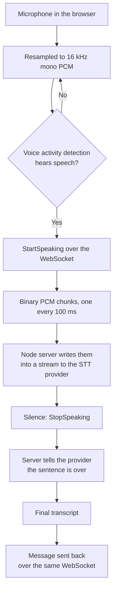
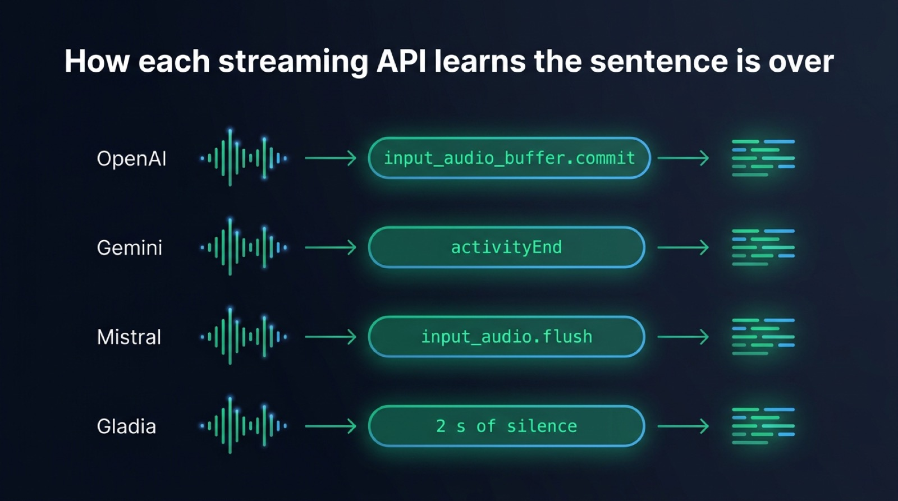
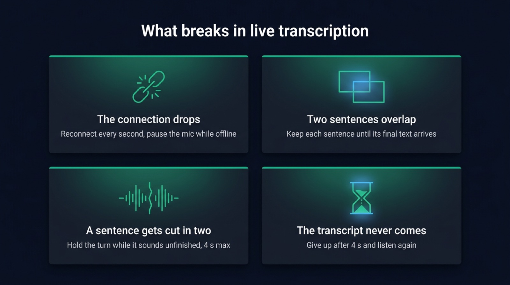

Real-time transcription in TypeScript works by streaming small chunks of microphone audio over a WebSocket to a Node server, which forwards them to a streaming speech to text model and sends the text back as soon as each sentence ends. The browser runs voice detection, so only speech travels. The server then tells the model the sentence is complete and gets the final text back a few hundred milliseconds later. This article follows that path from the microphone to the transcript, shows the five messages that carry it, explains why Whisper needs extra work to stream, and lists what breaks once real users connect.

## Real-time transcription works on audio with no end yet

A transcription API you call with a file receives a beginning, a middle and an end. It can read the whole recording, look ahead, correct itself, and return the text when it is done.

A live call has no file. The audio is still being spoken when the first chunk leaves the browser, and nobody knows yet how long the sentence will last. So the system has to answer three questions that a file answers by itself: when a sentence starts, what to send while it lasts, and when it is over.

The usual mistake is to record a few seconds, upload them, and call that streaming. The cut often falls in the middle of a word, the model sees half a sentence, and the user waits for the next batch to see the end of it.

## The path of the audio, from the microphone to the transcript

The browser captures the microphone, resamples the audio to 16 kHz mono PCM, and runs voice activity detection on it. When the detector hears speech, the page sends `StartSpeaking`, then a binary chunk every 100 ms. When the detector hears enough silence, the page sends `StopSpeaking`. The server opens a stream to the speech to text provider on the first message, writes each chunk into it, closes it on the last one, and sends the final transcript back over the same socket.



Most speech models were trained on 16 kHz audio. At 16 bit per sample, that rate weighs 32 KB per second, so one 100 ms chunk is 3.2 KB. A WebSocket carries that easily, even on a mobile connection. The server resamples the audio for a provider that expects another rate, such as OpenAI's Realtime API at 24 kHz.

## The browser's voice detector sets the latency you feel

The voice activity detector decides when a sentence opens and when it closes. When it runs in the browser, silence stays on the page. The provider receives only the moments when someone talks, which keeps the bandwidth down, and the bill too when the model is billed per minute of audio.

The detector also ends the sentence before the audio reaches the server. It cannot know a sentence is finished, so it waits for a stretch of silence. A turn opens about 280 ms after the first word and closes about 760 ms after the last one, on our measurements with the default settings of [Micdrop](/), an open source TypeScript library for real-time voice conversations. You can tune both numbers with the detector settings, since [each setting adds a known delay to the turn](/docs/client/latency).

Those 760 ms of silence usually take longer than the transcription itself. A streaming model that already holds the whole sentence needs a few hundred milliseconds to return its final text once told the sentence is over. Shortening the silence speeds up the transcript more than switching models does, but it also cuts people off when they hesitate. A [turn detector](/docs/client/turn-detection) lets the silence stay short: this small model listens to the end of the sentence and keeps the turn open when it sounds unfinished.

The detector also clips the start of a sentence. It needs a few windows of audio to be sure it heard a voice, by which time the first syllable is already gone. Micdrop keeps the most recent audio in reserve and sends it with the first chunks, so the transcript starts on the first word. Read how [Silero, WebRTC VAD and a volume threshold compare in the browser](/blog/voice-activity-detection-browser) to pick a detector.

## Five messages carry the whole protocol

The page sends two text commands and binary audio. The server sends text messages back.

| Direction | Message | Meaning |
| --- | --- | --- |
| Browser to server | `StartSpeaking` | A sentence begins, open a stream to the provider |
| Browser to server | Binary frame | 100 ms of 16 bit PCM at 16 kHz |
| Browser to server | `StopSpeaking` | The sentence is over, ask for the final text |
| Server to browser | `Message` with JSON | The final transcript of one sentence |
| Server to browser | `SkipAnswer` | Nothing to wait for, listen again |

The WebSocket itself tells text frames from binary frames, so commands and audio share one connection with no header or envelope. Calls with an agent and a voice add [a few more messages to the protocol](/docs/server/protocol), which a transcription server can skip.

Micdrop implements both ends. `MicdropServer` works as a [dictation server](/docs/server/dictation) when you give it a speech to text provider and nothing else:

```typescript
import { MicdropServer } from '@micdrop/server'
import { GeminiSTT } from '@micdrop/gemini'
import { WebSocketServer } from 'ws'

const wss = new WebSocketServer({ port: 8088 })

wss.on('connection', (socket) => {
  new MicdropServer(socket, {
    stt: new GeminiSTT({ apiKey: process.env.GEMINI_API_KEY || '' }),
  })
})
```

In the page, `@micdrop/web` asks for the microphone, runs the detector, resamples the audio, cuts it into chunks and sends them:

```typescript
import { Micdrop } from '@micdrop/web'
import '@micdrop/web/silero'

await Micdrop.start({ url: 'ws://localhost:8088', vad: ['volume', 'silero'] })

Micdrop.on('Message', (message) => {
  if (message.role !== 'user') return
  textarea.value += (textarea.value ? ' ' : '') + message.content
})
```

With a microphone button and a language picker around them, these two files make [a complete dictation app](https://github.com/Godefroy/micdrop/tree/main/examples/dictation). Both sides are TypeScript, so the page and the server import the same message types, whereas a Python backend and a JavaScript page each keep their own copy.

## Streaming Whisper from Node

Whisper was trained on thirty second windows, so its encoder always reads thirty seconds of audio. A two second sentence gets padded with silence before the encoder runs. Whisper was built for recordings. OpenAI's `whisper-1` API, for instance, accepts files only.

The best known streaming projects are written in Python and work around the window in two ways:

- [whisper_streaming](https://github.com/ufal/whisper_streaming), from the Institute of Formal and Applied Linguistics at Charles University in Prague, re-runs Whisper on a growing buffer and confirms the words that two consecutive runs agree on. Its authors report 3.3 seconds of latency on long unsegmented speech and now point to its successor, SimulStreaming.
- [WhisperLive](https://github.com/collabora/WhisperLive), from Collabora, runs a WebSocket server in front of faster-whisper, TensorRT or OpenVINO and sends segments back as they are transcribed.

Both re-transcribe the same audio several times to show words while the user speaks. That suits captions, where a person reads along. A dictation box or a voice agent mostly needs the final sentence, and needs it fast.

Cut the audio into sentences in the browser, and Whisper gets the kind of input it was built for, one short recording at a time. Each utterance arrives as one stream, the server waits for its end, and Whisper reads it once. [`@micdrop/whisper`](/docs/ai-integration/provided-integrations/whisper) runs Whisper in the Node process through Transformers.js and ONNX Runtime, with no Python and no API key:

```typescript
import { MicdropServer } from '@micdrop/server'
import { WhisperSTT } from '@micdrop/whisper'

new MicdropServer(socket, {
  stt: new WhisperSTT({ model: 'base', language: 'en' }),
})
```

`base` returns a three second sentence in about 440 ms and `tiny` in about 320 ms, on the CPU of a MacBook Pro M2. The encoder spends most of that time on the thirty second window, so a short sentence costs nearly as much as a long one. Moonshine and Parakeet read audio at its real length. See how they [compare with Whisper and its faster runtimes for local speech to text in Node](/blog/local-speech-to-text-node).

## What each streaming API sends back over its WebSocket

Hosted streaming models transcribe while the audio arrives, so the final text is nearly ready when the sentence ends. Each one still needs a signal that the sentence is over, under a different name at each provider. Micdrop turns off the provider's own speech detection wherever it can, since the browser already decided where the sentence ends.

| Provider | Audio sent as | End of sentence signal | What comes back |
| --- | --- | --- | --- |
| OpenAI, `gpt-4o-transcribe`, `gpt-4o-mini-transcribe`, `gpt-live-transcribe` | Base64 PCM at 24 kHz in JSON | `input_audio_buffer.commit`, with server detection off | Deltas while speaking, then `conversation.item.input_audio_transcription.completed` |
| Gemini, `gemini-3.5-transcribe-live` | Base64 PCM at 16 kHz in JSON | `activityEnd`, with automatic detection off | Pieces of `inputTranscription` as the user speaks |
| Mistral, `voxtral-mini-transcribe-realtime-2602` | Base64 PCM at 16 kHz in JSON | `input_audio.flush`, which keeps the session open | `transcription.text.delta`, then `transcription.done` |
| Gladia | Raw binary PCM at 16 kHz | Two seconds of silence | `transcript` messages, the last one marked `is_final` |

Mistral also accepts `input_audio.end`, which closes the whole session, so the next sentence would have to open a new connection. A flush ends the sentence and keeps the connection for the next one. Gladia has no end of sentence message, so the integration sends silence to make it close the sentence.

These models also differ on [price per minute, languages and accuracy](/blog/gpt-4o-transcribe-vs-gemini-vs-voxtral). Any other provider fits behind the same interface: a [custom speech to text class](/docs/ai-integration/custom-integrations/custom-stt) has a single `transcribe()` method that receives one stream per sentence and emits a `Transcript` event.

{/* IMAGE regen: api.py image, infographic, 1600x900. Scene: "Four horizontal rows stacked on a dark surface, one per provider, each row reading from left to right as a small pipeline: a simple abstract audio waveform glyph on the left, a thin emerald arrow, then a rounded pill holding the end of sentence signal in monospace text, a thin emerald arrow, then a short text block icon on the right. Row 1 labelled 'OpenAI' on its left edge, pill text 'input_audio_buffer.commit'. Row 2 labelled 'Gemini', pill text 'activityEnd'. Row 3 labelled 'Mistral', pill text 'input_audio.flush'. Row 4 labelled 'Gladia', pill text '2 s of silence'. Each label and each pill text is written once and only once. Title at the top in a modern clean bold sans-serif: 'How each streaming API learns the sentence is over'. Generous spacing, flat vector style."
    Infographic only: regenerate if a provider changes the message that ends an utterance. Last data sync: 2026-10-06. */}


## What breaks in production

A demo runs on one laptop with a good connection. Once real users connect from real networks, four things go wrong.

### The connection drops

A train enters a tunnel, the laptop changes networks, a proxy closes idle connections. The page has to reconnect on its own and pause recording while it is offline. Micdrop's client reconnects every second by default, with a five second timeout per attempt, and pauses the voice detector while it is offline. The transcript already on the page stays there. The server closes the provider connection along with the socket and starts a fresh call on the new one. For a call with an agent, [resume the conversation](/docs/server/resume-conversation) by replaying the saved messages into it.

Provider connections drop too. Each integration reconnects to its provider. Gemini Live also caps a session at ten minutes, so the Gemini integration opens the next session between two sentences. When every retry to a provider fails, [`FallbackSTT`](/docs/ai-integration/fallback-strategies/stt-fallback) sends the audio of the sentence in progress to the next provider.

### Two sentences overlap

WebSocket runs over TCP, so the chunks arrive in order. On the server, though, the final text of one sentence can still be on its way when the next sentence starts. If the integration resets its buffer as soon as a new stream opens, the late transcript is attached to the wrong sentence or lost. The Mistral integration clears its text only once the next sentence carries audio, since the detector opens many streams on noise that hold no speech. The Gemini integration closes a sentence still waiting for its text before it opens the next one.

### A sentence gets cut in two

A user pauses to find a word, the detector hears silence, and the sentence arrives in two pieces. In dictation that only adds a space. In a voice agent it means an answer to half a question. A turn detector keeps the turn open when the sentence sounds unfinished, for four seconds at most by default. A provider can also split a sentence on its own. Gladia closes a sentence after 50 ms of silence by default, which split our French test sentence at the comma until we raised `endpointing` to half a second.

### The final transcript never comes

A provider hangs, or the stream carried only a cough. Without a deadline the page waits forever with a spinner. Every Micdrop integration gives the provider four seconds after the end of the sentence, then emits what it has, possibly an empty string. The server answers an empty transcript with `SkipAnswer`, which sends the page back to listening.

{/* IMAGE regen: api.py image, infographic, 1600x900. Scene: "A two by two grid of four cards on a dark surface, each card with a thin emerald top border, a single simple line icon at the top, a title and exactly one line of text under it, each written once and only once. Card 1 with a broken link icon, title 'The connection drops', line 'Reconnect every second, pause the mic while offline'. Card 2 with two overlapping rectangles icon, title 'Two sentences overlap', line 'Keep each sentence until its final text arrives'. Card 3 with a waveform split in two icon, title 'A sentence gets cut in two', line 'Hold the turn while it sounds unfinished, 4 s max'. Card 4 with an hourglass icon, title 'The transcript never comes', line 'Give up after 4 s and listen again'. Title at the top in a modern clean bold sans-serif: 'What breaks in live transcription'."
    Infographic only: regenerate if the reconnection delay, the turn wait or the transcription timeout defaults change. Last data sync: 2026-10-06. */}


## Frequently asked questions

<FaqList>
  <FaqItem question="Can Whisper do live transcription?">
    Yes, with a layer of code around it. Whisper reads a recording in thirty second windows.
    OpenAI's whisper-1 API accepts files only. Projects like whisper_streaming re-run it on a
    growing buffer to show words as they are spoken, at around 3.3 seconds of latency. For
    dictation or a voice agent, cut the audio into sentences with voice activity detection and
    transcribe each one when it ends. Whisper then returns the text a few hundred milliseconds
    after the sentence closes. For words shown while the user is still speaking, use a streaming
    model such as gpt-4o-transcribe or Gemini Transcribe.
  </FaqItem>
  <FaqItem question="Should I use WebSocket or WebRTC for real-time transcription?">
    WebSocket is enough when the audio goes from a browser to your own server. It carries text and
    binary frames on one connection, works through most proxies, and needs no media server. With
    voice detection in the browser, only speech travels, so the bandwidth stays low. WebRTC fits
    peer to peer calls and lossy networks, at the cost of a signalling server and more setup.
  </FaqItem>
  <FaqItem question="What audio format should I stream to a speech to text API?">
    Raw 16 bit PCM, mono, at 16 kHz suits most streaming models and weighs 32 KB per second.
    Send it in chunks of 20 to 100 ms. OpenAI's Realtime API expects 24 kHz, so keep the browser at
    16 kHz and resample on the server for that provider.
  </FaqItem>
  <FaqItem question="Can I transcribe audio in Node.js without Python?">
    Yes. Hosted models stream over a WebSocket from Node. Whisper itself runs in the Node process
    through Transformers.js and ONNX Runtime, with the @micdrop/whisper package. whisper.cpp also
    has Node bindings.
  </FaqItem>
</FaqList>

## Getting started

A live transcription server comes down to a voice detector in the page, one WebSocket, five messages and a streaming model told when each sentence ends. Micdrop ships the browser client, the Node server and the provider integrations in TypeScript, so you can [run the server in Node](/docs/server) with a single speech to text option, then add an agent and a voice to the same call when you need it to answer.
