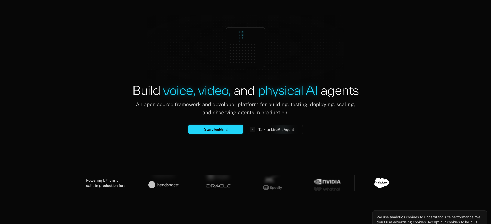
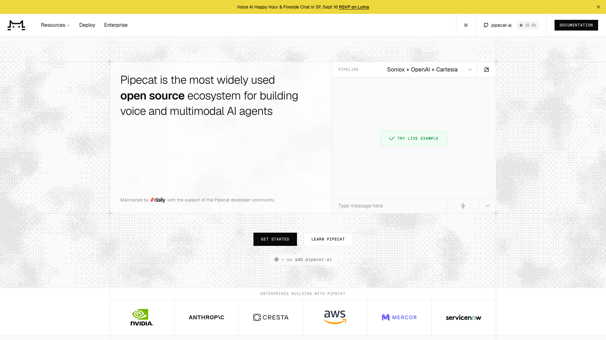
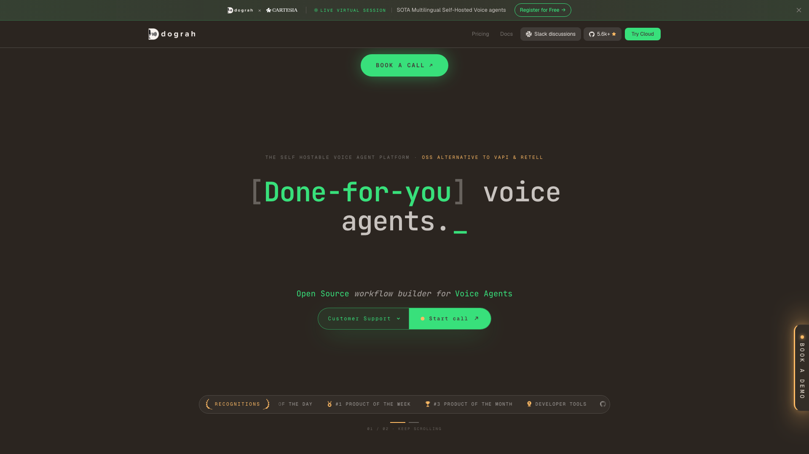
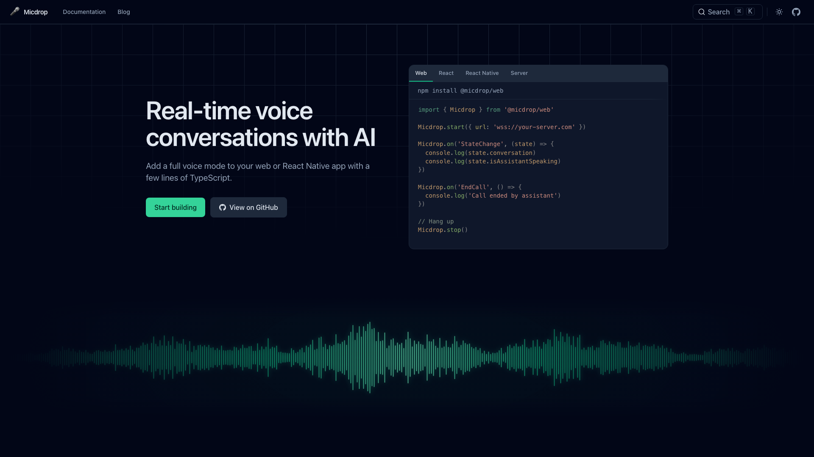
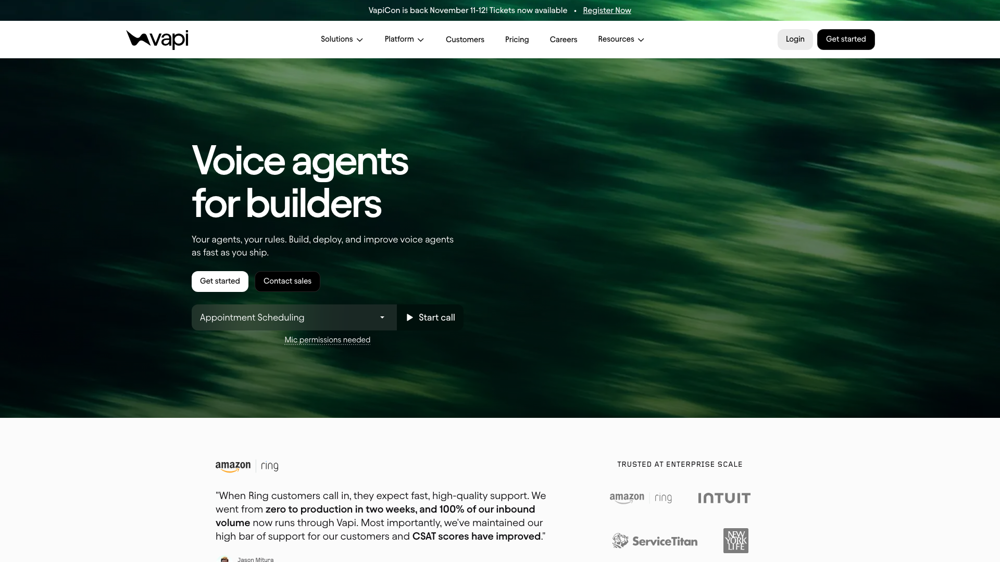
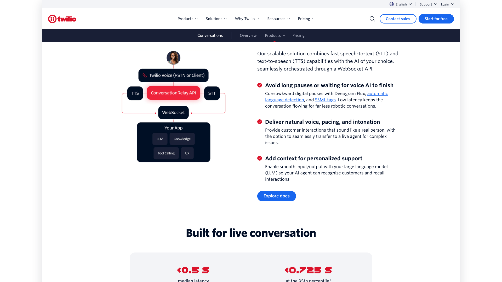
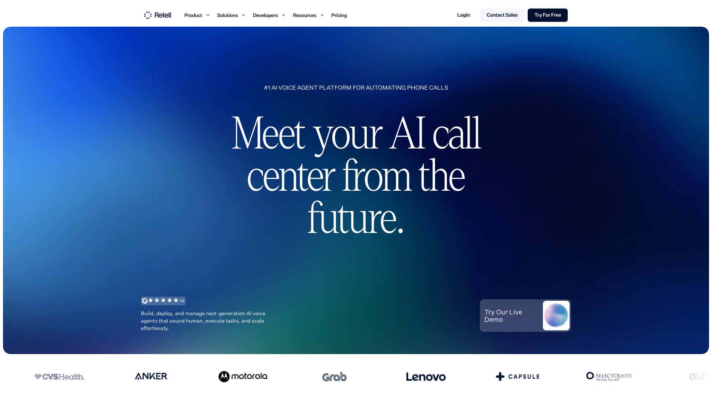
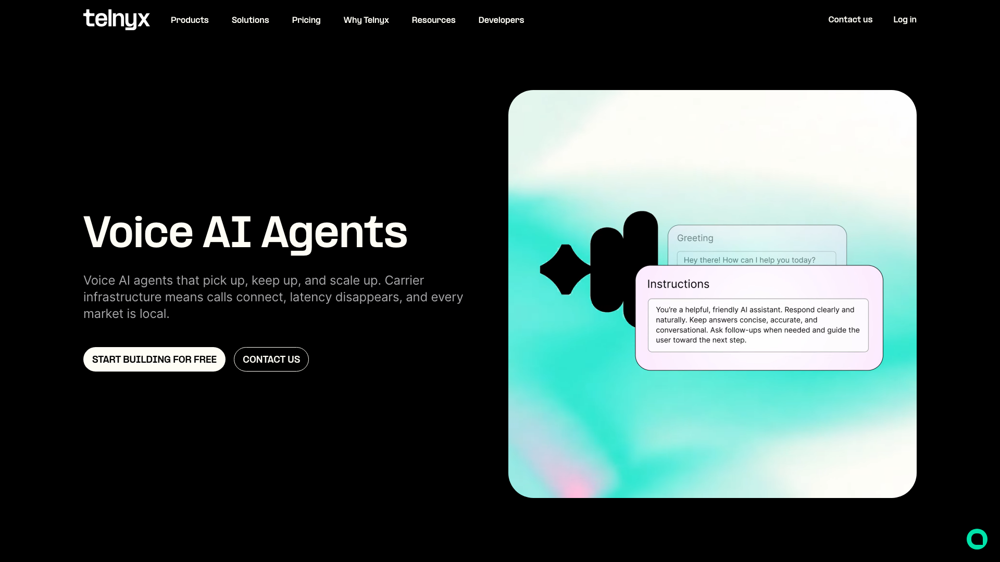
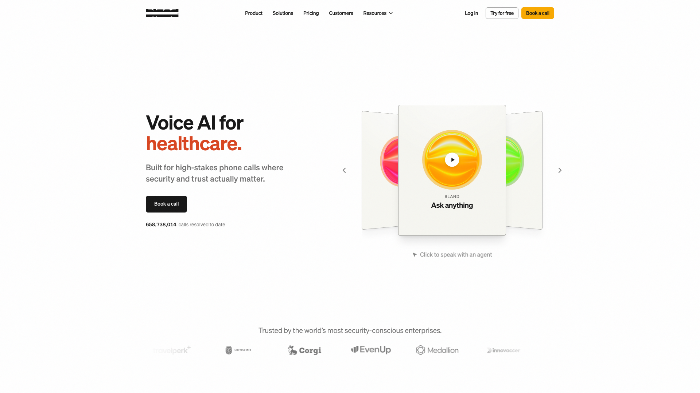
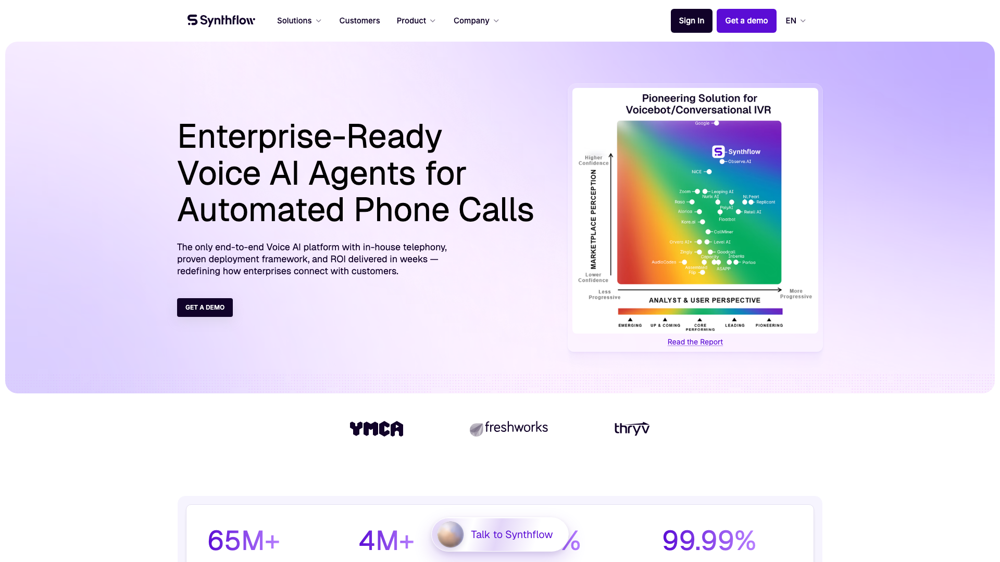

An AI voice agent platform runs the conversation between a caller and a language model: it listens, transcribes, asks the model, speaks the answer and handles interruptions. In 2026 the choice comes down to how much of that loop you want to rent. Vapi, Retell AI, Bland and the other hosted platforms run everything for a price per minute. LiveKit, Pipecat and Dograh give you the same loop as open source code, with a managed cloud on top if you want one. This ranking puts the open source options first, with LiveKit at the top.

Micdrop publishes this ranking and sits fourth in it, so keep that in mind as you read. Each ranked platform links to its own site. Every price comes from the vendor's pricing page unless it is marked as a third-party estimate. Micdrop's limits appear in its entry, in the takeaways and in the FAQ.

Ten platforms are ranked in two groups: four open source options that run on infrastructure you control, then six hosted services you rent. All figures were collected on 13 September 2026. Prices in this market change every quarter, so check them again before you sign.

## How the platforms were ranked

Each platform was compared on six points:

- what you have to operate, which can be nothing at all, a media server or a Docker stack
- telephony, meaning phone numbers, SIP trunks and contact centre integrations
- provider choice, meaning whether speech-to-text, the model and text-to-speech can come from vendors you pick, on your own keys
- the price, as published on the vendor's own pricing page, with third-party figures marked as such
- where the data can stay, including a European region
- public evidence, meaning named customers, GitHub stars and compliance certifications stated on a first-party page

Each entry covers the points where that platform stands out. The order is a judgement call, with no weighted score of those six points behind it. The open source group comes first, because a team building voice into its own product keeps the code, the providers and the data location, and can still buy a managed cloud later. That choice favours the publisher of this ranking, whose product is open source. Inside the group, the platforms that suit more kinds of voice agent project rank higher. LiveKit and Pipecat fit almost any project, Dograh fits teams that want a complete phone agent platform on their own machines, and Micdrop fits the narrower case of voice inside a TypeScript application.

Micdrop is a library rather than a platform. It is ranked because a team adding voice to its own app installs it in place of a platform.

The hosted group follows, ordered by how much of the stack you control on self-serve terms: first how many providers you can pick on your own keys, then how much of the agent runs in your own code. Vapi comes first, since you can use your own key for every provider. Twilio ConversationRelay, Retell AI and Telnyx each let you bring your own model, so they are ordered by where the agent runs. Twilio always leaves the agent in your code. Retell leaves it in your code only when you connect your own model. Telnyx always runs it on its own infrastructure. Bland runs only its own models, so it follows Telnyx. Synthflow sells only annual enterprise contracts, so it comes last.

A ranking by call volume or funding would look very different. Retell AI and Bland would sit near the top, while Micdrop, a young project with 83 GitHub stars and no customer page, would come last. The entries give you the figures to build that ranking instead.

## The comparison at a glance

| Platform | Type | You operate | Telephony | Provider choice | Price | EU hosting |
|---|---|---|---|---|---|---|
| **LiveKit** | Framework and managed cloud | Media server and worker, or nothing on Cloud | SIP | Any provider | Free, $50 or $500 a month, then $0.01/min | Region pinning on Scale |
| **Pipecat Cloud** | Framework and managed cloud | Python service, or nothing on Cloud | Twilio, Telnyx, Plivo, Exotel | Any provider | $0.01 to $0.03/min plus transport | Frankfurt region |
| **Dograh** | Self-hosted platform and cloud | Docker stack, or nothing on cloud | Seven telephony integrations | Any provider | Free self-hosted, $0.01/min cloud | Wherever you deploy |
| **Micdrop** | Library in your Node server | Your existing server | None | Any provider | Free, MIT | Wherever you deploy |
| **Vapi** | Hosted API | Nothing | Yes | Every provider, own keys | $0.05/min plus providers | Frozen until 2027 |
| **Twilio ConversationRelay** | Hosted speech relay | Your model server | Twilio | Your own model, speech from a list | $0.07/min plus call minutes and model | Deepgram in the US only |
| **Retell AI** | Hosted platform | Nothing | Seven SIP integrations | Model from a list, or your own | $0.07 to $0.31/min | None |
| **Telnyx** | Hosted on its own carrier | Nothing | Own carrier network | Speech from a list, any compatible model | $0.05/min plus model | Paris edge |
| **Bland** | Hosted, own models | Nothing | Yes | Bland models only | $0.14/min, or $0.12 on $299 a month | US, EU, APAC |
| **Synthflow** | Hosted enterprise platform | Nothing | Own carrier, SIP | Chosen by Synthflow | From $30,000 a year | EU region |

## Open source platforms you can run yourself

### 1. LiveKit



[LiveKit](https://livekit.com) is an open source WebRTC media server with an agent framework on top, and a managed cloud that runs both. The server, the Agents framework and the SIP gateway are Apache 2.0. Agents are written in Python or Node, and the Python repository alone carries 14,161 stars. The company raised a $100M Series C at a $1B valuation in January 2026, led by Index Ventures.

LiveKit has the strongest public evidence in this ranking. Its customer page names SAP, SpaceX, Salesforce, Nvidia and Spotify, and states that OpenAI uses LiveKit to deliver voice to millions of ChatGPT users. Client SDKs cover the web, iOS, Android, Flutter, React Native, Unity and embedded devices.

[LiveKit Cloud](https://livekit.com/pricing) starts free with 1,000 agent minutes a month and 5 concurrent sessions, then costs $50 a month for 5,000 minutes or $500 for 50,000, with extra minutes at $0.01. It carries SOC 2 Type II, promises 99.99% uptime on paid plans, and pins sessions to the US, the EU or India from the Scale plan. The HIPAA agreement is reserved for Enterprise.

The JavaScript agents repository has 925 stars against the Python one's 14,161, so most of the community writes Python. The semantic turn-detection models ship under a LiveKit licence that restricts their use to the LiveKit Agents framework.

### 2. Pipecat Cloud



[Pipecat](https://pipecat.ai) is the most starred open source framework built for voice agents, at 15,476 stars, under a BSD 2-Clause licence that also covers its smart-turn model. [Daily](https://www.daily.co), the company behind it, made Pipecat Cloud generally available on 8 January 2026. More than 1,000 teams used the beta. The launch announcement named NVIDIA, Mercor, Descript, Epic, Vapi and Tavus as users.

The cloud bills [$0.01 to $0.03 per active agent minute](https://www.daily.co/pricing/pipecat-cloud/) depending on the instance size, with unlimited concurrency. One-to-one WebRTC voice through Daily is free, SIP costs $0.003 to $0.02 a minute and PSTN $0.018. Telephony works with Twilio, Telnyx, Plivo and Exotel, plus WhatsApp. Regions include Frankfurt. Pipecat Cloud can also run as a single-tenant deployment inside your own VPC.

Pipecat itself is Python only, while the client SDKs cover JavaScript, React, React Native, iOS, Android and C++. Daily holds SOC 2 Type 2 and offers HIPAA, though at the January launch SOC 2 for Pipecat Cloud itself was still on the roadmap. The pricing page states no SLA.

### 3. Dograh



[Dograh](https://www.dograh.com) is a full voice agent platform published as open source. It is BSD 2-Clause, carries 5,638 stars on GitHub, and starts on your own server with a single `docker compose up`. Dograh presents itself as the open source alternative to Vapi and Retell. It is the only entry here that gives you a workflow builder, a dashboard and telephony on your own machines.

Telephony is broad, with Twilio, Vonage, Telnyx, Plivo, Vobiz and Cloudonix integrations plus Asterisk for teams running their own PBX. You bring your own keys for speech-to-text, the model, text-to-speech and the carrier. A web widget embeds the agent in a site in floating, inline or headless mode. Python and Node SDKs create agents and place outbound calls. Teams that would rather not host it can use the [managed cloud](https://www.dograh.com/pricing), which charges a platform fee of one cent a minute with 10 concurrent calls. Enterprise plans add custom SLAs.

The backend is Python and builds on Pipecat, so the stack you operate includes a Python service and its storage. Dograh holds no compliance certification of its own. Its site instead lists HIPAA, GDPR, SOC 2 and ISO 27001 as frameworks that a deployment inside your own perimeter can support. No named customer appears on its site or repository.

### 4. Micdrop



[Micdrop](https://micdrop.dev) is a set of MIT-licensed TypeScript packages that run a voice agent inside a web application and the Node server behind it. The browser package handles the microphone, voice activity detection and playback. The server package talks to the browser over a WebSocket and runs either speech-to-text, the model and text-to-speech, or a single [speech-to-speech model](/docs/server/realtime), OpenAI Realtime or Gemini Live. A React Native package brings the same client to iOS and Android. The code runs on your own servers with your own provider keys, so you pay for those servers and for what OpenAI, Google, Mistral, ElevenLabs, Cartesia, Gladia or Gradium bill you. Kokoro, Piper, Pocket TTS, Qwen TTS and Whisper run on your own hardware instead, with no provider bill.

Micdrop also offers [provider fallback](/docs/ai-integration/fallback-strategies/tts-fallback), which switches to a second vendor when the first one fails, and semantic turn detection, which asks the model whether the user has finished speaking. A [fully European stack](/docs/ai-integration/sovereign-voice-ai) runs on Mistral, Gladia and Gradium with the same orchestration code.

The browser and server packages run in production in products such as [Cibli](https://cibli.fr), a recruitment platform where candidates answer out loud, and [Raconte](https://raconte.ai), which runs voice interviews led by an AI. Cibli comes from an independent team, while Micdrop's maintainer also builds Raconte. Neither product publishes usage figures.

Micdrop comes without phone numbers, SIP, a dashboard, call analytics or managed hosting. One maintainer writes it, the first public release dates from 2025, the repository has 83 stars, and the React Native package is still at 0.1. Micdrop holds no compliance certification, so compliance depends on where you host it and which providers you pick.

## Hosted platforms you rent

### 5. Vapi



[Vapi](https://vapi.ai) is the developer-first hosted platform, and the one that leaves the most of the stack in your hands. It charges a [$0.05 platform fee per minute](https://vapi.ai/pricing), then passes speech and model costs through at cost, or at zero when you supply your own keys for every provider. Ten concurrent lines are included, with each extra line at $10 a month. Pricing guides published by [CloudTalk](https://www.cloudtalk.io/blog/vapi-ai-pricing/) and Telnyx put a realistic all-in cost between $0.23 and $0.33 a minute.

Vapi reports more than a billion calls and more than a million developers. It names Intuit, ServiceTitan, New York Life and Kavak as customers, along with Amazon Ring, which routes all of its inbound calls through Vapi. Vapi raised a $50M Series B in May 2026 led by Peak XV. SDKs cover the web, Flutter, React Native, iOS and Python. The trust centre lists SOC 2, GDPR and PCI DSS, with a 99.9% uptime commitment on Enterprise.

Compliance options are paid add-ons, with HIPAA at $2,000 a month and zero data retention at $1,000. Vapi's own data flow documentation states that its EU support and self-serve growth are frozen until 2027. Call history is kept 14 days on the entry plan.

### 6. Twilio ConversationRelay



[Twilio ConversationRelay](https://www.twilio.com/en-us/products/conversational-ai/conversationrelay) splits the voice agent in two. Twilio handles the call, the speech-to-text and the text-to-speech, and sends the transcribed text over a WebSocket to a server you write, where your own model and logic answer. The prompt and the tools therefore live in your code, which can call any model you like. ConversationRelay became generally available on 14 May 2025.

The [price](https://www.twilio.com/en-us/voice/pricing/us) is $0.07 a minute, on top of Twilio call minutes and your model bill. Speech-to-text runs on Deepgram by default, or on Google. Text-to-speech runs on ElevenLabs by default, or on Google or Amazon. Calls arrive from the phone network, SIP or a browser through the Twilio Voice JavaScript SDK. ConversationRelay is HIPAA eligible and PCI compliant, with a median latency that Twilio quotes at under half a second. The company as a whole reported more than 400,000 active customer accounts in September 2025.

You pick speech vendors from Twilio's short list only, with no documented option to use your own keys for them. Deepgram runs in Twilio's US region only, which limits in-region processing for European calls.

### 7. Retell AI



[Retell AI](https://www.retellai.com) is built for phone agents in call centres. It has the deepest contact centre integrations of the hosted group, with verified SIP guides for Twilio, Telnyx, Vonage, Avaya, Genesys Cloud, Five9 and Amazon Connect. It also includes a flow builder, batch calling, PII removal and a web SDK for browser calls. You can pick a model from Retell's list or connect your own through a WebSocket that Retell opens to your server.

Retell AI [charges $0.07 to $0.31 a minute](https://www.retellai.com/pricing) and breaks that price into lines: $0.055 of voice infrastructure, $0.015 to $0.04 of text-to-speech, $0.015 of telephony, and $0.045 to $0.16 for the listed models. Those lines add up to $0.13 to $0.27 a minute for a phone call on a listed model, a narrower range than the one Retell advertises. The pricing page leaves the difference unexplained. Twenty concurrent calls are included, with each extra one at $8 a month. Retell reports more than 3,000 businesses, shows logos including CVS Health, Lenovo, Grab and Anker, and states more than 40 million calls a month. The research firm [Sacra](https://sacra.com/research/retell-ai-60m-yr-up-650-yoy/) estimated its annualised revenue at $60M in April 2026, while Retell had raised a $4.6M seed round.

Its compliance documentation lists HIPAA, SOC 2 Type 1 and 2, and GDPR, and states that Retell does not currently operate services within the European Union. No SLA figure is published.

### 8. Telnyx Voice AI Agents



[Telnyx](https://telnyx.com/products/voice-ai-agents) is a licensed carrier in more than 45 countries. Its voice agents run on its own network and GPUs, so the phone line, the speech models and the orchestration come from one company under one SLA. The [price](https://telnyx.com/pricing/voice-ai) is $0.05 a minute for orchestration, speech-to-text and text-to-speech together, with model tokens billed separately. Telnyx's own worked example comes to about $0.056 a minute including inbound US telephony.

You still choose the providers inside that bundle. Speech-to-text runs on Deepgram, Whisper, AssemblyAI, Speechmatics or Soniox, text-to-speech on ElevenLabs, MiniMax, Resemble, AWS or Azure, and the model on any OpenAI-compatible endpoint. A Paris point of presence has run speech-to-text, orchestration and text-to-speech for European calls since July 2025. HIPAA is included on every plan, alongside SOC 2, GDPR and PCI DSS. A web widget and a React library put the same agent in a browser.

The agent logic runs on Telnyx rather than in your code. You get the lowest latency and the bundled price only while the call stays on Telnyx infrastructure. Telnyx publishes few named voice AI customers.

### 9. Bland



[Bland](https://www.bland.ai) runs its own speech-to-text, model and text-to-speech on its own infrastructure, so no third-party AI provider touches a call. That makes it the most vertically integrated platform here and a strong fit for regulated enterprises. It offers US, EU or APAC data residency. Enterprise customers get dedicated infrastructure plus self-hosted and on-premises deployment. Bland lists SOC 2 Type II, HIPAA and PCI DSS, and is the only platform here with FedRAMP 20X Class A.

[Pricing](https://www.bland.ai/pricing) includes every model: $0.14 a minute with no platform fee, or $0.12 on the $299 monthly Build plan. Bland raised a $50M Series C in June 2026 led by Dell Technologies Capital, taking its funding past $100M. It reports more than 250 enterprise customers, naming Samsara, Kin Insurance, CNO Financial Group, Mutual of Omaha and TravelPerk.

Running everything on Bland means using Bland's models and voices, with no option to bring your own keys. The entry plan caps you at 100 calls a day and 10 concurrent calls.

### 10. Synthflow



[Synthflow](https://synthflow.ai) is the Berlin-based enterprise platform, registered as AgentFlow AI GmbH, with 70 employees and $30M raised including a $20M Series A led by Accel. It runs its own telephony stack with session border controllers and media servers, accepts your own carrier over SIP, and integrates with contact centre platforms such as Genesys, Avaya and 8x8. New accounts choose a US or EU region.

Its published guarantees are the strongest of the group on paper: a 99.99% SLA, SOC 2 Type II, HIPAA, PCI DSS, GDPR and ISO 27001. Launches come with managed support. Named customers include Thryv, the YMCA and Freshworks. Freshworks reports automating 65% of its routine calls on Synthflow.

[Pricing](https://synthflow.ai/pricing) starts at $30,000 a year on an enterprise contract. The older pay-as-you-go option is gone. Browser calls use a raw WebSocket protocol with code samples in seven languages rather than a packaged SDK. Synthflow's own pages disagree on its volume, with more than 10 million calls a month on the newsroom and more than 65 million on the pricing page.

## Not ranked, and why

Speech and model vendors now sell voice agent products of their own. [ElevenLabs Agents](https://elevenlabs.io/pricing/agents) costs $0.08 a minute plus the model, the [Deepgram Voice Agent API](https://deepgram.com/pricing) $0.075 a minute at its standard rate, [Cartesia Line](https://cartesia.ai/pricing) $0.06 a minute, and xAI's Grok voice API $0.08 a minute. The [OpenAI Realtime API](https://developers.openai.com/api/docs/pricing) and the Gemini Live API bill a speech-to-speech model per token, and Gemini Live is still in preview. Each of them locks you into its own speech stack or its own model. Several are also providers that the ranked platforms plug in, which is why they appear here without a rank. You can also compare [one realtime model against an assembled pipeline](/blog/openai-realtime-api-vs-pipeline).

Enterprise customer experience suites are left out too. [PolyAI](https://poly.ai), [Sierra](https://sierra.ai) and [Parloa](https://www.parloa.com) sell voice alongside chat through sales-led contracts with no public price, to buyers such as Marriott, Hyatt and Allianz. They suit a company buying a finished service through procurement, while this ranking covers the tools a team builds its own agent with.

Three names from older rankings have left this market. Layercode pivoted to another product in February 2026, Lindy has removed its phone agents, and the voice product sold as Air AI is defunct after a settlement with the US Federal Trade Commission in March 2026.

## How to choose between them

Start with what the voice agent is for, because that removes half the list.

If the product is phone calls, the hosted group is the shorter path. Vapi suits a developer team that wants to keep its own provider contracts and pay a visible platform fee. A team that needs to plug into Genesys, Five9 or Amazon Connect this quarter should look at Retell AI. Bland suits a regulated enterprise that wants on-premises deployment and FedRAMP, as long as it accepts Bland's own models. A buyer with a $30,000 budget gets EU hosting, a 99.99% SLA and managed launch support from Synthflow. Test Telnyx when you want the carrier and the models from a single company, with European calls processed in Paris. Twilio ConversationRelay fits a team already on Twilio that wants the model and the prompt in its own code.

If you want a phone agent platform without renting one, Dograh gives you the builder, the dashboard and the telephony integrations as a Docker stack you run yourself, for the price of operating a Python service.

If voice is a feature inside your own application, the open source group fits better. LiveKit and Pipecat cover almost any project, phone, video and mobile included. Both also sell a managed cloud for teams that would rather not run the servers themselves. LiveKit brings its own WebRTC infrastructure and the larger production record. Pipecat runs as a Python service under a more permissive licence, which also covers its turn-detection model. Micdrop is the narrower option, for a TypeScript web or React Native app whose team wants the conversation to run inside its existing Node server. It has no telephony and a much smaller community, two trade-offs compared in detail [against Vapi](/blog/alternative-to-vapi) and [against Retell AI](/blog/alternative-to-retell-ai).

Many teams narrow their shortlist by where the data lives. Retell AI operates no EU services, Vapi has frozen its EU support, and Twilio runs its default speech-to-text in the US only. Bland, Synthflow and Telnyx host in Europe. Every open source option runs wherever you deploy it.

Before you sign, run a pilot on real calls. Put the agent in front of callers who interrupt and pause mid-sentence, and ask the vendor what happens to a live call when one of its speech providers has an outage.

## Frequently asked questions

<FaqList>
  <FaqItem question="What is the best AI voice agent platform?">
    It depends on what the agent is for. For phone agents built by developers, Vapi is the most flexible hosted option, with a $0.05 platform fee and your own provider keys. Retell AI has the deepest contact centre integrations. Bland and Synthflow suit enterprises with strict compliance needs. Among open source options, LiveKit and Pipecat are the broadest, Dograh is a complete phone platform you host yourself, and Micdrop is a smaller TypeScript library for web and React Native apps, maintained by one person.
  </FaqItem>
  <FaqItem question="How much do AI voice agents cost per minute?">
    On hosted platforms, Vapi charges a $0.05 platform fee plus your providers, for a total that third-party estimates put at $0.23 to $0.33 a minute. Telnyx charges $0.05 with speech included plus the model, Twilio ConversationRelay $0.07 plus call minutes and the model, Retell AI $0.07 to $0.31 depending on the model and telephony, and Bland $0.14 with every model included, or $0.12 on a $299 monthly plan. Synthflow starts at $30,000 a year. Managed clouds for open source frameworks start at $0.01 an agent minute, and self-hosted options cost your speech and model bills plus the servers.
  </FaqItem>
  <FaqItem question="Is there a free AI voice agent platform?">
    LiveKit, Pipecat, Dograh and Micdrop are open source, so they cost nothing in licence fees. You pay your speech and model providers directly. LiveKit Cloud, a managed service, includes 1,000 agent minutes a month on its free plan. The conversation itself is rarely free, because hosted speech-to-text, models and text-to-speech all bill by usage, and local models need hardware to run on.
  </FaqItem>
  <FaqItem question="What is the difference between a voice agent platform and a voice agent framework?">
    A platform runs the conversation for you on its own infrastructure and bills per minute, usually with phone numbers, a dashboard and compliance certifications included. A framework is code you run yourself, where you choose the providers and operate the servers. LiveKit, Pipecat and Dograh sit in between, as open source code with an optional managed cloud. Micdrop is a library only.
  </FaqItem>
  <FaqItem question="Which voice agent platforms can keep data in the EU?">
    Bland offers EU data residency, Synthflow lets new accounts choose an EU region, Telnyx processes European calls at its Paris point of presence, LiveKit Cloud pins sessions to the EU from its Scale plan, and Pipecat Cloud has a Frankfurt region. Retell AI states that it operates no services in the European Union, Vapi has frozen its EU support until 2027, and Twilio ConversationRelay runs its default speech-to-text in the US only. Self-hosted options such as Dograh and Micdrop run wherever you deploy them, with providers you choose.
  </FaqItem>
  <FaqItem question="Can I bring my own LLM and voice provider?">
    Vapi accepts your own keys for every provider, which drops its provider charges to zero. Retell AI lets you connect your own model, Telnyx accepts any OpenAI-compatible model, and Twilio ConversationRelay hands the model entirely to your code while keeping speech on its own vendor list. Bland runs only its own models. Every open source option in this ranking lets you choose each provider.
  </FaqItem>
  <FaqItem question="Are ElevenLabs Agents and the OpenAI Realtime API voice agent platforms?">
    They are agent products sold by a speech vendor and a model vendor. ElevenLabs Agents costs $0.08 a minute plus the model and keeps speech on ElevenLabs. The OpenAI Realtime API bills one speech-to-speech model per token. Both are quick to start with, but each ties the voice, or the whole model, to one vendor. Platforms and frameworks often plug them in as providers, which is why this ranking lists them without a rank.
  </FaqItem>
  <FaqItem question="Do I need a voice agent platform to add voice to my web app?">
    No. A hosted platform earns its fee with phone numbers, contact centre integrations and certifications. For a voice mode inside a web application, connect an open source framework or library such as LiveKit, Pipecat or Micdrop to your own server. The framework or library then handles the microphone, streaming and interruptions. You pay your providers and your servers.
  </FaqItem>
</FaqList>

## Getting started

A phone agent that has to go live this quarter is a job for a hosted platform, so try Vapi and Retell AI first. A voice feature inside a product you already ship calls for open source, where LiveKit and Pipecat cover the widest range of projects.

Micdrop covers the narrower case of a TypeScript web or React Native app talking to your own Node server:

```bash
npm install @micdrop/server @micdrop/web @micdrop/openai @micdrop/gladia @micdrop/elevenlabs
```

You can [run a first voice call in about five minutes](/docs/getting-started), then swap any provider for another without touching the rest of the pipeline.

<RankingJsonLd
  name="Best AI voice agent platforms in 2026"
  description="AI voice agent platforms, open source and hosted, ranked in September 2026."
>
  <RankingEntry name="LiveKit" url="https://livekit.com" />
  <RankingEntry name="Pipecat Cloud" url="https://pipecat.ai" />
  <RankingEntry name="Dograh" url="https://www.dograh.com" />
  <RankingEntry name="Micdrop" url="https://micdrop.dev" />
  <RankingEntry name="Vapi" url="https://vapi.ai" />
  <RankingEntry name="Twilio ConversationRelay" url="https://www.twilio.com/en-us/products/conversational-ai/conversationrelay" />
  <RankingEntry name="Retell AI" url="https://www.retellai.com" />
  <RankingEntry name="Telnyx Voice AI Agents" url="https://telnyx.com/products/voice-ai-agents" />
  <RankingEntry name="Bland" url="https://www.bland.ai" />
  <RankingEntry name="Synthflow" url="https://synthflow.ai" />
</RankingJsonLd>
