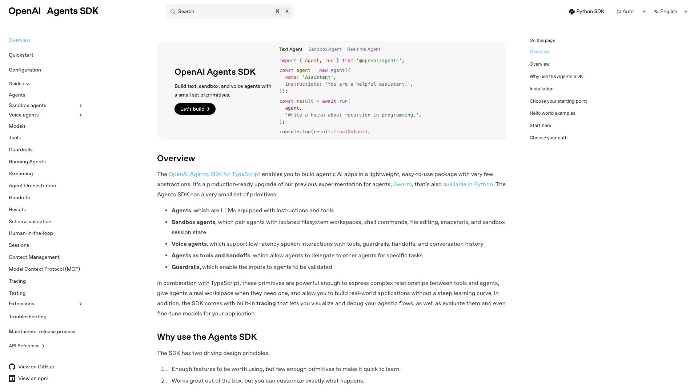
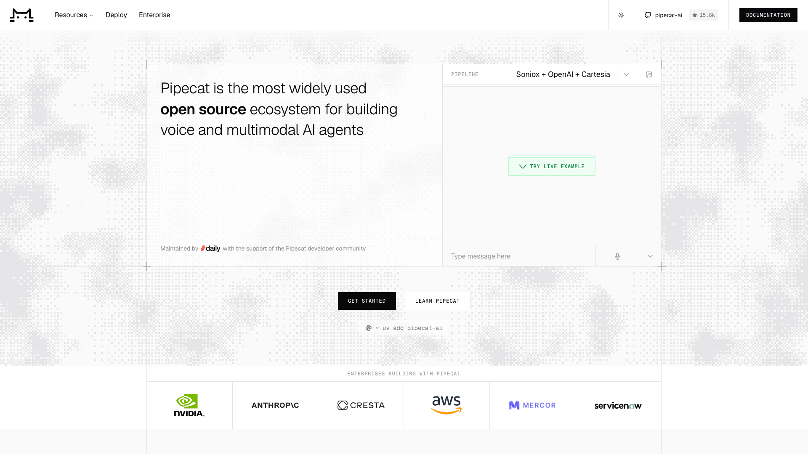
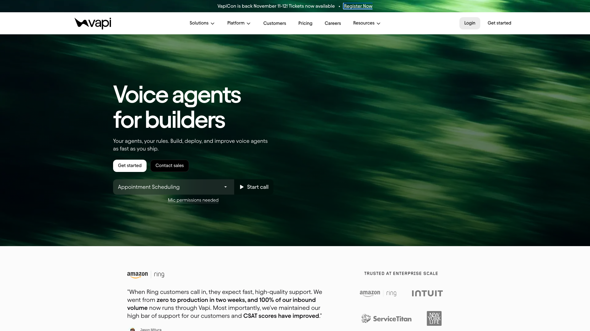
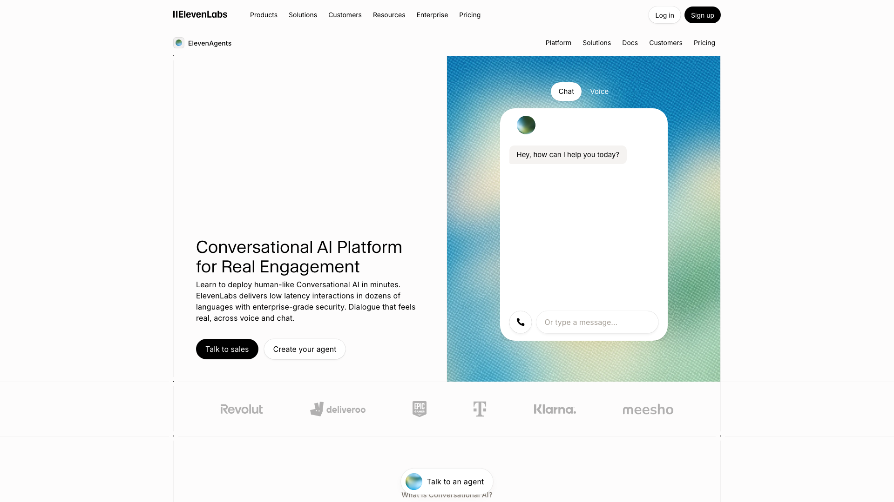
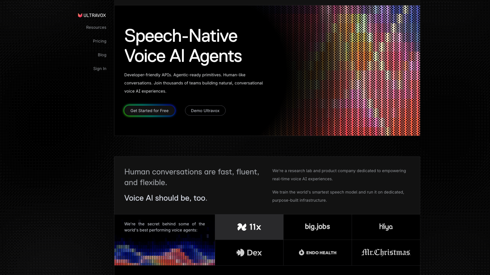
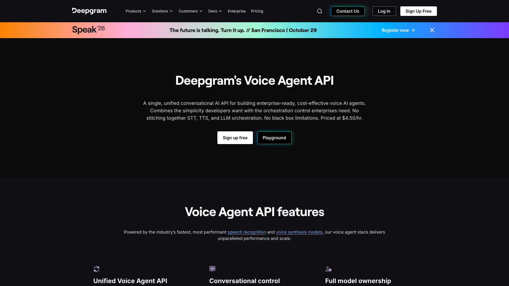
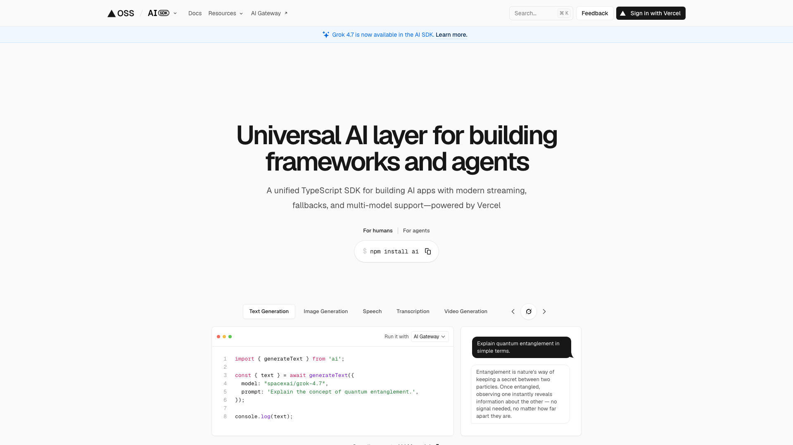
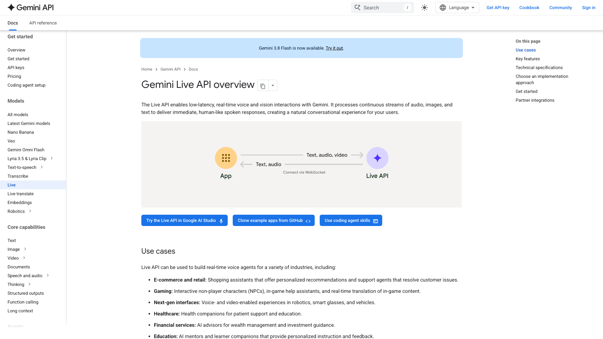

A voice AI SDK is the code that lets a user talk to an AI inside your app: it captures the microphone, streams the audio, plays the answer and stops the assistant when the user interrupts. For a JavaScript team in 2026, the choice comes down to where the conversation runs. Four open source SDKs keep it in your own code: LiveKit, Micdrop, the OpenAI Agents SDK and Pipecat. Seven SDKs connect your app to a hosted voice service that runs it for a fee. Among them, Vapi and ElevenLabs Agents ship the most complete web and React Native clients. This ranking puts LiveKit first.

Micdrop publishes this ranking and sits second in it, so keep that in mind as you read. Each ranked SDK links to its own site, prices come from each vendor's pricing page unless the entry names another source, and Micdrop's limits appear in its entry, in the takeaways and in the FAQ.

Eleven SDKs are ranked, in two groups. Figures were read on 24 September 2026: GitHub stars from each repository, weekly npm downloads for the week of 15 to 21 September. Voice SDKs ship a release most weeks, so check the figures again before you choose.

## How the SDKs were ranked

The ranking covers SDKs that put a real-time voice conversation with an AI inside a web or React Native app. Each one was compared on six points:

- the platforms with a packaged client, among the browser, React and React Native
- what runs on the server side, and in which language
- provider choice, meaning whether the speech recognition, the model and the voice can come from vendors you pick
- the price, as published by the vendor
- the licence
- public evidence, meaning GitHub stars, npm downloads and named customers on a first-party page

This site already compares [open source voice agent frameworks](/blog/open-source-voice-agent-frameworks) on what you operate and on telephony, and [hosted voice agent platforms](/blog/top-ai-voice-agent-platforms) on phone calls and price per minute. This ranking looks at how well each SDK fits a JavaScript app, on the client and on the server.

The open source group comes first, because a team that keeps the conversation in its own code keeps its providers and its data location, and can still buy a managed service later. That choice favours the publisher of this ranking, whose product is open source. Inside that group, the SDKs are ordered by three questions, in this order:

- whether a JavaScript team can write both the app and the server in TypeScript
- whether you pick every provider yourself
- public evidence

LiveKit and Micdrop both run TypeScript on the app and the server and let you pick every provider. LiveKit comes first because its public record is far larger. The OpenAI Agents SDK is TypeScript on both sides but runs OpenAI models only. Pipecat covers any provider, but its server is Python. Putting evidence first would drop Micdrop to fourth, behind the OpenAI Agents SDK and Pipecat. The publisher of this ranking chose the order of these questions.

The hosted group is ordered first by whether the vendor ships packaged clients for both the browser and React Native, then by how many providers you can pick. Vapi, ElevenLabs and Ultravox cover both platforms. Vapi lets you pick every provider, ElevenLabs lets you pick the model, and Ultravox runs its own model only. Deepgram, Hume, the Vercel AI SDK and the Gemini Live API ship a packaged client for the browser only. Deepgram lets you bring your own model and voice, Hume accepts any text model you give it, the Vercel AI SDK offers models from two vendors, and Gemini runs Google's model only.

A ranking by adoption would look very different. Micdrop's server package gets 365 downloads a week, against 410,339 for LiveKit's Node agents package and 725,205 for the ElevenLabs client. Each entry lists its downloads and stars, so you can build that ranking yourself.

## The comparison at a glance

| SDK | Browser, React, React Native | Server side | Providers | Price | Licence |
|---|---|---|---|---|---|
| **LiveKit** | Yes, yes, yes | Node or Python agent, plus a WebRTC media server | Any | Free, or LiveKit Cloud at $0, $50 or $500 a month plus $0.01/min | Apache 2.0 |
| **Micdrop** | Yes, yes, yes (0.1) | Your Node server | Any | Free | MIT |
| **OpenAI Agents SDK** | Yes, no hooks, transport to write | Node | OpenAI only | OpenAI Realtime API tokens | MIT |
| **Pipecat** | Yes, yes, yes | Python service | Any | Free, or Pipecat Cloud from $0.01/min | BSD 2-Clause |
| **Vapi** | Yes, through the web client, yes | Hosted | Every provider, your own keys | $0.05/min plus providers | No licence stated |
| **ElevenLabs Agents** | Yes, yes, yes | Hosted | Model from a list or your own, ElevenLabs voices | $0.08/min plus the model | MIT clients |
| **Ultravox** | Yes, through the JS client, yes | Hosted | Ultravox model | $0.05/min | Apache 2.0 client |
| **Deepgram Voice Agent API** | Yes, yes, no | Hosted | Deepgram speech recognition, your own model and voice | $0.05 to $0.075/min | MIT clients |
| **Hume EVI** | Yes, yes, example app only | Hosted | Hume voice, your own text model | $0.04 to $0.07/min | MIT client |
| **Vercel AI SDK** | Yes, yes, no | Vercel AI Gateway, beta | OpenAI and xAI realtime models | Model tokens | Apache 2.0 |
| **Gemini Live API** | Yes, no hooks, no | Google API | Gemini only | About $0.012/min | Apache 2.0 SDK |

## Open source SDKs that keep the agent in your code

### 1. LiveKit


[LiveKit](https://livekit.com) is an open source WebRTC media server with an agent framework on top. `livekit-client` runs in the browser with 2,543,879 downloads a week, `@livekit/components-react` adds React components, and `@livekit/react-native` gets 229,119 weekly downloads. On the server, `@livekit/agents` runs the agent in Node, with 410,339 downloads a week. The SDKs are Apache 2.0.

LiveKit has the strongest public record in this ranking. Its customer page names SAP, Salesforce, Nvidia and Spotify, and states that OpenAI uses LiveKit for voice in ChatGPT. The company raised a $100M Series C at a $1B valuation in January 2026, led by Index Ventures. LiveKit also has Swift, Android and Flutter SDKs, SIP telephony and video.

A LiveKit call joins a WebRTC room, so the stack includes a media server next to the agent worker. You run it yourself, or you rent [LiveKit Cloud](https://livekit.com/pricing), which starts free with 1,000 agent minutes a month, then costs $50 or $500 a month, with extra minutes at $0.01. The Node agents repository has 934 stars against 14,340 for the Python one, so most of the community and its examples are in Python. LiveKit's turn detection models ship under a licence that binds them to the LiveKit Agents framework.

### 2. Micdrop


[Micdrop](https://micdrop.dev) is a set of MIT-licensed TypeScript packages that run a voice conversation between an app and the Node server behind it, over a WebSocket. The [browser client](/docs/client) captures the microphone, detects speech, plays the answer and stops it when the user interrupts. The same client runs on iOS and Android through [`@micdrop/react-native`](/docs/react-native), and [one set of React hooks](/docs/client/react-hooks) reads the call state on both. On the [server](/docs/server), `MicdropServer` takes over an existing socket and chains speech-to-text, the model and text-to-speech. OpenAI, Gemini, Mistral, ElevenLabs, Cartesia, Gladia and Gradium are integrated, local engines such as Whisper and Kokoro run with no API key, and [an interface per role](/docs/ai-integration) lets you plug in any other provider. A [`realtime` option](/docs/server/realtime) swaps the chain for OpenAI Realtime or Gemini Live without changing the client.

According to its maintainer, products such as [Raconte](https://raconte.ai), which runs voice interviews led by an AI, and [Cibli](https://cibli.fr), a recruitment platform where candidates answer out loud, run the browser and server packages in production. Cibli comes from an independent team, while Micdrop's maintainer also builds Raconte.

One maintainer writes Micdrop. The project started in 2025 and has 85 GitHub stars, `@micdrop/server` gets 365 downloads a week, and the React Native package is at version 0.1. In exchange, the whole code is MIT and public on GitHub, the conversation runs in the Node server you already deploy, and there is no media server or per-minute fee between your app and your providers. Micdrop has no telephony, video or managed hosting, since it is built for voice inside an app. It holds no compliance certification either. The audio only travels between your app, your server and the providers you pick, so compliance depends on your hosting and on those providers.

### 3. OpenAI Agents SDK



The [OpenAI Agents SDK](https://openai.github.io/openai-agents-js/) is OpenAI's MIT-licensed agent framework for TypeScript. Its `RealtimeAgent` and `RealtimeSession` run a voice conversation with tools, handoffs, guardrails, interruptions and conversation history. In the browser, a WebRTC transport connects the user straight to OpenAI. On a Node server, a WebSocket transport keeps the session in your own code. `@openai/agents` gets 1,291,899 downloads a week, and its repository has 3,857 stars.

React Native support was merged on 7 August 2026. The SDK now runs in an app with a transport the app provides, since the built-in WebRTC transport stays browser only. An Expo example shows it with `react-native-webrtc`. The app still handles the microphone permission, the audio session and the audio routing.

Every realtime transport targets OpenAI's API, so the model, the voice and the bill come from OpenAI. GPT-Realtime-2.1 costs $32 per million audio input tokens and $64 per million output tokens, about [$0.048 for a minute split evenly between the user and the agent](/blog/gpt-live-vs-gpt-realtime-vs-gemini-live). A Twilio transport in the extensions package covers phone calls.

### 4. Pipecat



[Pipecat](https://pipecat.ai) is the most starred open source framework built for voice agents, at 15,826 stars, under a BSD 2-Clause licence that also covers its Smart Turn detection model. [Daily](https://www.daily.co), the company behind it, publishes official clients for JavaScript, React and React Native, plus iOS, Android and C++. `@pipecat-ai/client-js` gets 56,165 downloads a week and `@pipecat-ai/client-react` 20,996. The clients use RTVI, an open protocol for voice sessions.

Pipecat has the widest provider catalogue in this ranking and covers telephony, video and WebSocket or WebRTC transports. [Pipecat Cloud](https://www.daily.co/pricing/pipecat-cloud/) runs the server for $0.01 to $0.03 per active agent minute, with one-to-one WebRTC voice through Daily included at no cost.

The server is Python only, as the first line of the project's README says. A JavaScript team therefore writes its agent in Python and deploys it as a second service. The React Native client is less used than the JavaScript and React ones, with 20 stars on its repository and 1,222 weekly downloads for its Daily transport.

## Client SDKs for hosted voice services

### 5. Vapi



[Vapi](https://vapi.ai) is a hosted voice platform built for developers, and the one in this group that leaves you the most providers. `@vapi-ai/web` brings a call into the browser and any React app, with 147,429 downloads a week, and `@vapi-ai/react-native` covers iOS and Android. A server SDK configures assistants from Node.

Vapi charges a [$0.05 platform fee per minute](https://vapi.ai/pricing), then passes speech and model costs through at cost, or at zero when you supply your own key for every provider. Its customers include Intuit, ServiceTitan, New York Life and Kavak, according to its site. The platform is built phone-first, with numbers, SIP and a dashboard included.

The React Native SDK is much less used than the web one, with 1,525 downloads a week. The conversation runs on Vapi's servers, so the agent's configuration lives in Vapi rather than in your repository. Pricing guides published by [CloudTalk](https://www.cloudtalk.io/blog/vapi-ai-pricing/) and Telnyx put a realistic all-in cost between $0.23 and $0.33 a minute once providers are added.

### 6. ElevenLabs Agents



[ElevenLabs Agents](https://elevenlabs.io/conversational-ai) runs voice agents on ElevenLabs' speech stack. Its client packages are the most used in the hosted group, with `@elevenlabs/client` at 725,205 downloads a week, `@elevenlabs/react` 547,727 and `@elevenlabs/react-native` 83,205. The packages are MIT.

The platform handles turn-taking, tool calls and telephony, and comes with a dashboard. The model comes from ElevenLabs' list or from your own endpoint. The homepage shows Revolut, Deliveroo, Epic Games, Deutsche Telekom and Klarna. ElevenLabs raised a $500M Series D at an $11B valuation in February 2026.

The [price](https://elevenlabs.io/pricing/agents) is $0.08 a minute on every plan, or $0.16 in burst mode, with the model billed on top. The voices stay on ElevenLabs, so moving to another speech vendor means leaving the platform.

### 7. Ultravox



[Ultravox](https://www.ultravox.ai) runs its own speech-native model, which listens to the audio directly instead of reading a transcript. The model's weights are open, in a repository with 4,568 stars. `ultravox-client` brings calls to the browser and works inside React, and clients also exist for React Native, Flutter, iOS and Kotlin.

[Pay as you go](https://www.ultravox.ai/pricing) costs $0.05 a minute with up to five concurrent calls, and the $100 Pro plan removes the concurrency cap. The homepage shows 11x, Hiya and Dex among its customers.

The client packages are little used. `ultravox-client` gets 9,761 downloads a week and `ultravox-react-native` 17. The only model available is Ultravox's own.

### 8. Deepgram Voice Agent API



The [Deepgram Voice Agent API](https://deepgram.com/product/voice-agent-api) runs speech recognition, the model and the voice behind one WebSocket. Speech recognition runs on Deepgram's own models, and so does the voice unless you bring yours. Its [browser SDK](https://deepgram.com/learn/browser-agent-sdk), published in April 2026 under MIT, comes as three packages. `@deepgram/agents` handles the connection, the microphone, playback and optional Silero voice activity detection in any framework, `@deepgram/react` adds hooks for the call state, and `@deepgram/ui` adds ready-made components. A server endpoint mints a short-lived token, so the API key stays on your server.

The [price](https://deepgram.com/pricing) is $0.075 a minute at the standard rate, $0.065 when you bring your own voice, and $0.05 when you bring both the model and the voice. Deepgram lets you pick more providers than any other service in this group except Vapi.

The browser packages are new and little used. `@deepgram/agents` is at version 0.1 with 1,782 weekly downloads, and `@deepgram/react` at version 0.2 with 635. The announcement does not cover React Native.

### 9. Hume EVI


[Hume's Empathic Voice Interface](https://www.hume.ai/empathic-voice-interface) is a speech-to-speech service built around the tone of the voice: it reads emotion in what the user says and adjusts how it answers. `@humeai/voice-react` handles the microphone and playback in a React app, with 8,892 downloads a week. EVI 4-mini takes the text model you give it and keeps Hume's voice.

The [price](https://www.hume.ai/pricing) runs from $0.07 a minute on the Starter plan down to $0.04 on Business, with five free minutes.

React Native comes as an example app with its own native audio module rather than as a package, so a mobile team maintains that module itself.

### 10. Vercel AI SDK



The [Vercel AI SDK](https://ai-sdk.dev) is the most used TypeScript library for calling language models, with 26,927 GitHub stars under Apache 2.0. Realtime voice arrived in AI SDK 7 on 29 June 2026, in beta. The server mints a short-lived token, and a React hook opens the connection, captures the microphone and plays the answer. The model detects the end of a turn, the user can talk over it, and the model calls tools in the middle of a reply.

Every realtime call goes through [Vercel AI Gateway](https://vercel.com/blog/realtime-voice-agents-on-ai-gateway) with the same API key as text requests. The models on offer are OpenAI's realtime models and xAI's. The announcement does not cover React Native.

The `ai` package gets 17,883,737 downloads a week, a figure that covers every use of the library, text first.

### 11. Gemini Live API



The [Gemini Live API](https://ai.google.dev/gemini-api/docs/live) is Google's speech-to-speech model, reached from JavaScript through the Apache 2.0 `@google/genai` SDK. A browser connects to it directly with an ephemeral token, and the model handles voice activity, interruptions and function calls. Gemini 3.8 Live costs $0.005 a minute heard and $0.018 a minute spoken, about $0.012 for a minute split evenly, the lowest rate in this ranking.

The SDK opens the session, and you write the microphone capture, the audio playback and the React state yourself. Google publishes no React Native client. The model is Gemini only. The `@google/genai` package gets 16,531,581 downloads a week, which covers every Gemini use.

## Not ranked, and why

[Retell AI](https://www.retellai.com) is built for phone agents and appears in the ranking of [hosted voice agent platforms](/blog/top-ai-voice-agent-platforms). Its web client gets 85,998 downloads a week, but its documentation states that React Native is not supported. [Agora's Conversational AI Engine](https://docs.agora.io/en/conversational-ai/overview/pricing) runs only over Agora's own real-time network, at $0.10 a minute even with your own provider keys. Its web toolkit with React hooks gets 951 downloads a week.

[Mastra](https://mastra.ai) connects its TypeScript agents to realtime voice providers on a Node server, with no browser or React Native client for the conversation. The TEN Framework publishes no npm package for apps.

Two free building blocks each handle one part of the job. The browser's [Web Speech API](/blog/web-speech-api) transcribes speech with no SDK at all, and [ricky0123/vad](https://github.com/ricky0123/vad) detects speech in the browser with the Silero model, at 216,064 weekly downloads. Neither runs a conversation with an AI.

## How to choose between them

Start with whether the conversation should run in your code or at a vendor.

If a vendor can run it, pick by platform, providers and price. Vapi suits a team that wants its own provider keys and phone numbers, with a React Native SDK next to the web one. ElevenLabs Agents has the most used React and React Native packages and the best known voices, at $0.08 a minute plus the model. Ultravox and Hume each run their own speech model, at $0.05 and $0.04 to $0.07 a minute. Deepgram suits a web app that brings its own model and voice, at $0.05 a minute. A team that already uses the Vercel AI SDK can try its realtime hook, in beta and web only. The Gemini Live API is the cheapest per minute, but you write the microphone capture and the audio playback yourself.

If the conversation should run in your code, look first at which language your server is written in. LiveKit covers every platform in TypeScript, with the largest production record, and asks you to run or rent a WebRTC media server. Micdrop fits a TypeScript web or React Native app whose team wants the conversation inside its existing Node server, and accepts a young project with one maintainer. The OpenAI Agents SDK fits a team committed to OpenAI's models. Pipecat fits a team comfortable running a Python service, in exchange for the widest provider catalogue. You can compare Micdrop in more detail with [LiveKit Agents](/blog/alternative-to-livekit-agents), [Pipecat](/blog/alternative-to-pipecat) and [Vapi](/blog/alternative-to-vapi).

For a React Native app, six SDKs ship a mobile package: LiveKit, Pipecat, Vapi, ElevenLabs, Ultravox and Micdrop. The OpenAI Agents SDK needs a transport you write. To use OpenAI's models from a phone, you can also [reach the OpenAI Realtime API through your own server](/blog/openai-realtime-api-react-native).

Before you commit, build the same short conversation with two SDKs, on a real phone and a real laptop. Interrupt the assistant mid-sentence, switch from the speaker to headphones, and put the app in the background during a call.

## Frequently asked questions

<FaqList>
  <FaqItem question="What is the best voice AI SDK for JavaScript?">
    It depends on where the conversation should run. LiveKit is the broadest open source SDK, with TypeScript on the browser, React Native and the server, and the largest production record. Micdrop is a smaller MIT library that runs the conversation inside your own Node server, maintained by one person, with no telephony or compliance certification. Among hosted services, Vapi and ElevenLabs Agents ship the most complete web and React Native clients.
  </FaqItem>
  <FaqItem question="Which voice AI SDKs support React Native?">
    LiveKit, Pipecat, Vapi, ElevenLabs Agents, Ultravox and Micdrop publish a React Native package. Micdrop's is at version 0.1 and shares its API and hooks with the web client. The OpenAI Agents SDK has run in React Native since August 2026, with a transport the app writes itself. Hume offers an example app. Retell AI, Deepgram, the Vercel AI SDK and the Gemini Live API have no React Native client.
  </FaqItem>
  <FaqItem question="Is there a free voice AI SDK?">
    LiveKit, Micdrop, the OpenAI Agents SDK and Pipecat are open source, so they cost nothing in licence fees. You still pay for the speech recognition, the model and the voice you use, or you run local models on your own hardware. The Vercel AI SDK and Google's `@google/genai` are open source too, but their voice calls go through a paid service. Hosted services such as Vapi, ElevenLabs, Ultravox, Deepgram and Hume bill by the minute.
  </FaqItem>
  <FaqItem question="Can I build a voice agent entirely in TypeScript?">
    Yes, with LiveKit, Micdrop or the OpenAI Agents SDK, which all run both the app and the server in TypeScript. Pipecat's clients are TypeScript but its server is Python. Hosted services run the server side for you, so your code only holds the client.
  </FaqItem>
  <FaqItem question="How much does a voice AI SDK cost per minute?">
    Vapi charges $0.05 a minute plus your providers, ElevenLabs Agents $0.08 plus the model, Ultravox $0.05, Deepgram $0.05 to $0.075 depending on the providers you bring, and Hume EVI $0.04 to $0.07 depending on the plan. A minute split evenly costs about $0.048 on OpenAI's GPT-Realtime-2.1 and about $0.012 on Gemini 3.8 Live. LiveKit Cloud and Pipecat Cloud add $0.01 or more per agent minute when you rent their hosting, while self-hosting costs only your servers and providers.
  </FaqItem>
  <FaqItem question="Do I need WebRTC to add voice AI to a web app?">
    No. LiveKit and the browser mode of the OpenAI Agents SDK use WebRTC, while Micdrop, the OpenAI Agents SDK on a server and the Gemini Live API stream audio over a WebSocket. Pipecat supports both. WebRTC handles poor networks better, and a WebSocket needs no media server.
  </FaqItem>
  <FaqItem question="Can I switch voice providers without rewriting my app?">
    With LiveKit, Pipecat and Micdrop, the providers are server-side settings, so the app stays the same. Vapi lets you change providers in its configuration. Deepgram also lets you swap the model and the voice. ElevenLabs Agents, Ultravox, Hume and the Gemini Live API tie the voice or the whole model to one vendor.
  </FaqItem>
</FaqList>

## Getting started

For a voice agent that a vendor can run, try Vapi or ElevenLabs Agents first, since both cover the browser and React Native. For a voice feature that stays in your own code, LiveKit covers the widest range of projects.

Micdrop covers the narrower case of a TypeScript web or React Native app talking to your own Node server:

```bash
npm install @micdrop/server @micdrop/web @micdrop/react @micdrop/openai @micdrop/gladia @micdrop/elevenlabs
```

You can [run a first voice call in about five minutes](/docs/getting-started), then move the same client to a phone with `@micdrop/react-native`.

<RankingJsonLd
  name="Best voice AI SDKs for JavaScript, web and React Native apps in 2026"
  description="Voice AI SDKs for web and React Native apps, open source and hosted, ranked in September 2026."
>
  <RankingEntry name="LiveKit" url="https://livekit.com" />
  <RankingEntry name="Micdrop" url="https://micdrop.dev" />
  <RankingEntry name="OpenAI Agents SDK" url="https://openai.github.io/openai-agents-js/" />
  <RankingEntry name="Pipecat" url="https://pipecat.ai" />
  <RankingEntry name="Vapi" url="https://vapi.ai" />
  <RankingEntry name="ElevenLabs Agents" url="https://elevenlabs.io/conversational-ai" />
  <RankingEntry name="Ultravox" url="https://www.ultravox.ai" />
  <RankingEntry name="Deepgram Voice Agent API" url="https://deepgram.com/product/voice-agent-api" />
  <RankingEntry name="Hume EVI" url="https://www.hume.ai/empathic-voice-interface" />
  <RankingEntry name="Vercel AI SDK" url="https://ai-sdk.dev" />
  <RankingEntry name="Gemini Live API" url="https://ai.google.dev/gemini-api/docs/live" />
</RankingJsonLd>
