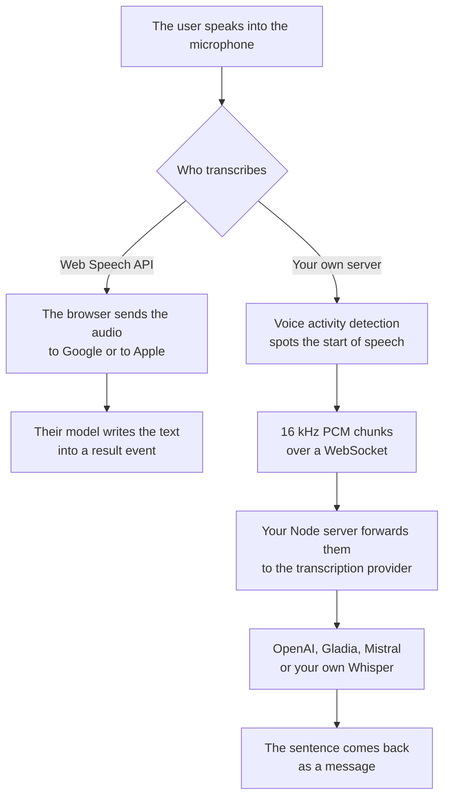

Adding dictation to your app takes a few lines of code with `webkitSpeechRecognition`. That part is easy. The result is far from perfect: the audio goes to Google or to Apple, Firefox users get nothing by default, and the same spoken sentence comes back written one way in Chrome and another one in Safari.

## What the Web Speech API is

The Web Speech API is a browser interface with two halves. `SpeechSynthesis` reads text out loud, and `SpeechRecognition` turns the microphone into text. This post is about `SpeechRecognition`.

```js
const SpeechRecognition =
  window.SpeechRecognition || window.webkitSpeechRecognition

const recognition = new SpeechRecognition()
recognition.lang = 'en-US'
recognition.continuous = true
recognition.interimResults = true

recognition.onresult = (event) => {
  const result = event.results[event.results.length - 1]
  if (result.isFinal) {
    textarea.value += result[0].transcript
  }
}

recognition.onerror = (event) => console.error(event.error)
recognition.start()
```

That is the whole integration. There is nothing to install and no API key to create.

The browser gives you the interface, then usually sends the audio elsewhere to be transcribed. MDN puts it plainly: "your audio is sent to a web service for recognition processing, so it won't work offline". Chrome sends it to Google, Safari to the recogniser Apple ships. Google and Apple each choose the model that writes your text.

Chrome 139 added an on-device mode in August 2025. Set `processLocally` to `true` before `start()` and the audio stays on the device, as long as the browser has already downloaded a language pack for the language you ask for.

```js
const status = await SpeechRecognition.available({
  langs: ['en-US'],
  processLocally: true,
})

if (status === 'downloadable') {
  await SpeechRecognition.install({ langs: ['en-US'], processLocally: true })
}

recognition.processLocally = true
```

`available()` returns `available`, `downloadable` or `unavailable`. When it comes back `downloadable`, `install()` prompts the download. Call `start()` without the pack and it fails with a `language-not-supported` error. `processLocally` defaults to `false`, so a page that never sets it keeps sending audio to a server.

The specification is still a Draft Community Group Report rather than a W3C standard, which is part of why browser support has stayed uneven for more than a decade.

## Which browsers support it

| Browser | Speech recognition |
| --- | --- |
| Chrome, desktop and Android | Since Chrome 25, under `webkitSpeechRecognition` |
| Safari 14.1 on macOS, 14.5 on iOS | Under `webkitSpeechRecognition` |
| Edge | Ships the Chromium interface, though recognition broke in Edge 134 |
| Firefox | Since Firefox 142, off behind `media.webspeech.recognition.enable` in about:config |

Caniuse puts global coverage at about 88% and marks every browser as partial rather than full support.

Firefox had no speech recognition for web pages at all until version 142, released in August 2025. Mozilla had carried the engine in Gecko since 2019 behind an about:config preference, wired to the browser's own interface rather than to the pages it displays. Version 142 opened it to pages, behind that same preference and still off, so a Firefox user reaches it only by editing a setting almost nobody knows is there. Recognition also failed with a network error in Edge 134 until a patch release fixed it.

Safari runs recognition on iPhone and iPad. `continuous` keeps the microphone open on iPhone without ever returning the final text. WebKit's own documentation tracker still has an open question about what `interimResults` does on iOS. So you test on iOS what already works in Chrome, then test it again after each Safari release.

You can set `lang`, `continuous`, `interimResults` and `maxAlternatives`. Everything else belongs to the browser: the model, the vocabulary, the punctuation and the way numbers and acronyms are written.

## Four limits you will hit

### The browser picks the model

You get whatever model Google and Apple are running that month. They swap it on their own schedule, so the same sentence can come back written differently next week. The API takes no vocabulary hints, so the model guesses how to write medical terms, part numbers and street names.

### The browser picks where the audio goes

A team writing a data protection notice has to name Google and Apple as processors of every user's voice. Chrome's on-device mode keeps the audio on the device for anyone who downloaded the language pack. The audio still goes to a server for everyone else, including Chrome users without the pack.

### The transcript differs from one browser to the next

Two people dictating the same sentence, one in Chrome and one in Safari, get two different strings. Your code then searches or compares that text and gets a different answer depending on the browser. The mismatch shows up in the browser you tested least.

### Everything after the transcript is yours to build

`SpeechRecognition` hands you text in the page and stops there. An assistant that answers out loud needs a language model, a voice, a way to stream partial answers back and a way to cut the voice off when the user starts talking again. All of that runs on a server.

## Stream the microphone to your own server instead

The page captures the microphone, a [voice activity detector](/blog/voice-activity-detection-browser) decides when someone is talking, the audio goes over a WebSocket, and your server transcribes it with the provider you chose. One model then writes the text for every browser, so it comes out the same everywhere.



[Micdrop](/) covers the page and the server, both in TypeScript. `MicdropServer` takes an agent, a voice and a speech to text. Only the speech to text is required, so a [dictation server](/docs/server/dictation) leaves the agent and the voice out:

```ts
import { OpenaiSTT } from '@micdrop/openai'
import { MicdropServer } from '@micdrop/server'
import { WebSocketServer } from 'ws'

const server = new WebSocketServer({ port: 8088 })

server.on('connection', (socket) => {
  new MicdropServer(socket, {
    stt: new OpenaiSTT({
      apiKey: process.env.OPENAI_API_KEY || '',
      language: 'en',
    }),
  })
})
```

That server transcribes and stays quiet. In the page, `@micdrop/web` asks for the microphone, runs the voice activity detection locally, resamples to 16 kHz PCM and streams only the parts where someone is talking:

```ts
import { Micdrop } from '@micdrop/web'

await Micdrop.start({ url: 'ws://localhost:8088' })

Micdrop.on('Message', (message) => {
  if (message.role !== 'user') return
  textarea.value += (textarea.value ? ' ' : '') + message.content
})
```

Each sentence goes out as its own stream, so the provider starts transcribing while the user is still talking and the text arrives as soon as they pause. The [dictation example](https://github.com/Godefroy/micdrop/tree/main/examples/dictation) puts those two snippets behind a microphone button, with a language picker and a text area, in 180 lines of TypeScript.

| | Web Speech API | Your own transcription server |
| --- | --- | --- |
| Browsers covered | Chrome, Edge and Safari, plus a Firefox with the preference on | Every browser |
| Where the audio goes | Google or Apple, or the device on Chrome 139 | Your server, then the provider you picked |
| Who picks the model | The browser | You |
| Same transcript everywhere | Only within the same browser | Yes |
| Vocabulary and language control | `lang` and nothing else | Whatever the provider exposes |
| Running cost | Free | Per minute, or the machine you run it on |
| Setup | A few lines in the page | A Node server and a WebSocket |
| Adding an agent that answers | Write the agent and the voice yourself | Two more options on the same server |

## Dictation in a React component

`useMicdropState` from [`@micdrop/react`](/docs/client/react-hooks) subscribes to the call and re-renders on every change, so the component reads the transcript straight out of the state:

```tsx
import { useMicdropState } from '@micdrop/react'
import { Micdrop } from '@micdrop/web'

export function Dictation() {
  const state = useMicdropState()

  const text = state.conversation
    .filter((message) => message.role === 'user')
    .map((message) => message.content)
    .join(' ')

  const handleClick = () =>
    state.isStarted
      ? Micdrop.stop()
      : Micdrop.start({ url: 'ws://localhost:8088' })

  return (
    <div>
      <button onClick={handleClick}>
        {state.isStarted ? 'Stop' : 'Start dictation'}
      </button>
      <p>{state.isUserSpeaking ? 'Listening' : 'Waiting for you to speak'}</p>
      <textarea value={text} readOnly />
    </div>
  )
}
```

The server stays exactly as it is. `state.isUserSpeaking` comes from the [voice activity detection](/docs/client/vad) running in the tab, which also keeps silence off the socket. The [client documentation](/docs/client) covers the rest of the call state, the devices, the errors and the pause controls.

## Choosing the transcription provider

Every integration implements the same `STT` interface, so you switch provider by changing one constructor. OpenAI and Gladia stream over a WebSocket and return partial text while the sentence is still being spoken. Mistral runs Voxtral in Europe, which matters when the audio has to stay there. `WhisperSTT` runs Whisper inside your Node process through ONNX Runtime, with no API key and no per-minute bill:

```ts
import { WhisperSTT } from '@micdrop/whisper'

const stt = new WhisperSTT({ model: 'base', language: 'en' })
```

The weights download on first use and every call in the process then shares them. The [AI integration guide](/docs/ai-integration) compares the options on language coverage, latency and where the audio is processed.

## Frequently asked questions

<FaqList>
  <FaqItem question="Is the Web Speech API free?">
    Yes. The recognition runs on infrastructure the browser vendor pays for, so there is no key to create and no bill at the end of the month. In exchange, Chrome and Safari decide which model runs, which words it knows and where the audio goes.
  </FaqItem>
  <FaqItem question="What is the Google Web Speech API?">
    Two different things go by that name. In a browser it usually means Chrome's implementation of the Web Speech API, reached through `webkitSpeechRecognition`, which sends the audio to Google's speech service. Google also sells Cloud Speech-to-Text, a paid API you call from your own server with a key.
  </FaqItem>
  <FaqItem question="How does the Web Speech API work?">
    You create a `SpeechRecognition` object, set `lang`, `continuous` and `interimResults`, and call `start()`. The browser asks for microphone permission, captures the audio and sends it to its recognition service, or keeps it on the device when `processLocally` is `true` and the language pack is installed. Results come back through the `result` event, where `isFinal` marks the settled ones.
  </FaqItem>
  <FaqItem question="Does the Web Speech API work in Safari?">
    Yes, it has worked since Safari 14.1 on macOS and 14.5 on iOS and iPadOS, under the `webkitSpeechRecognition` prefix. Expect behaviour differences from Chrome. `continuous` keeps the microphone open on iPhone without returning the final text. WebKit's documentation tracker still has an open question about `interimResults`.
  </FaqItem>
  <FaqItem question="Does the Web Speech API work offline?">
    It works offline on Chrome 139 and later, with `processLocally` set to `true` and the matching language pack installed. Everywhere else the audio goes to a remote service, so dictation stops with the network.
  </FaqItem>
</FaqList>

## The browser or your own server

The Web Speech API is exactly right for a search field or a note-taking box that Chrome and Safari users dictate into, since a few lines of JavaScript are less work than running a server. Run the transcription through a server you own when you have to answer for what the transcript says, choose where the audio goes, or reach Firefox users.

Add an agent and a voice to that same `MicdropServer` to turn the call into a conversation. The page keeps the code it already has. [Getting started](/docs/getting-started) gets a first voice call running in five minutes, while [dictation and text-only calls](/docs/server/dictation) covers what changes when you leave the agent or the voice out. For a phone rather than a browser, read [speech to text in React Native](/blog/speech-to-text-react-native).
