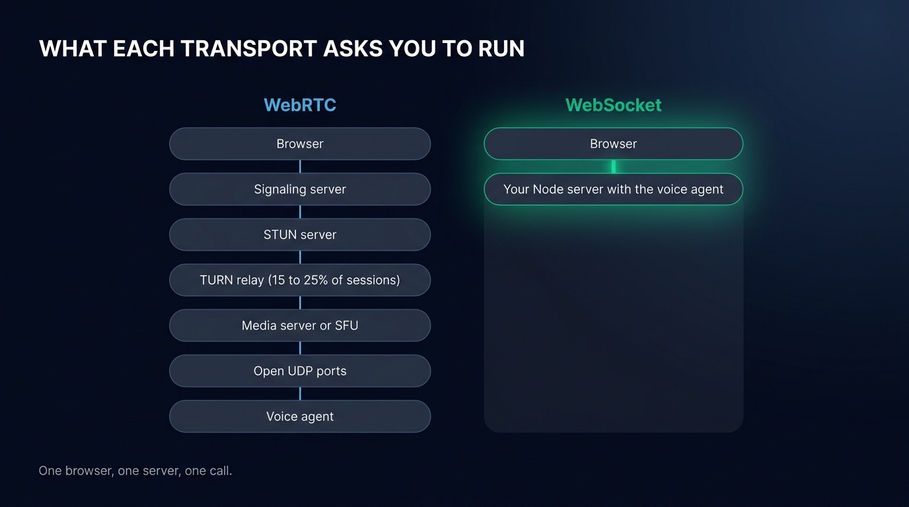
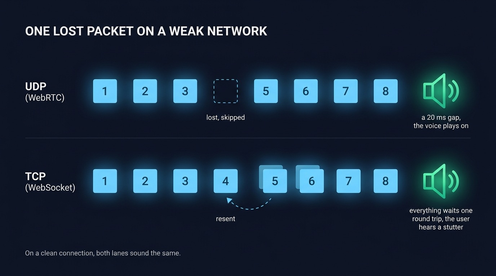
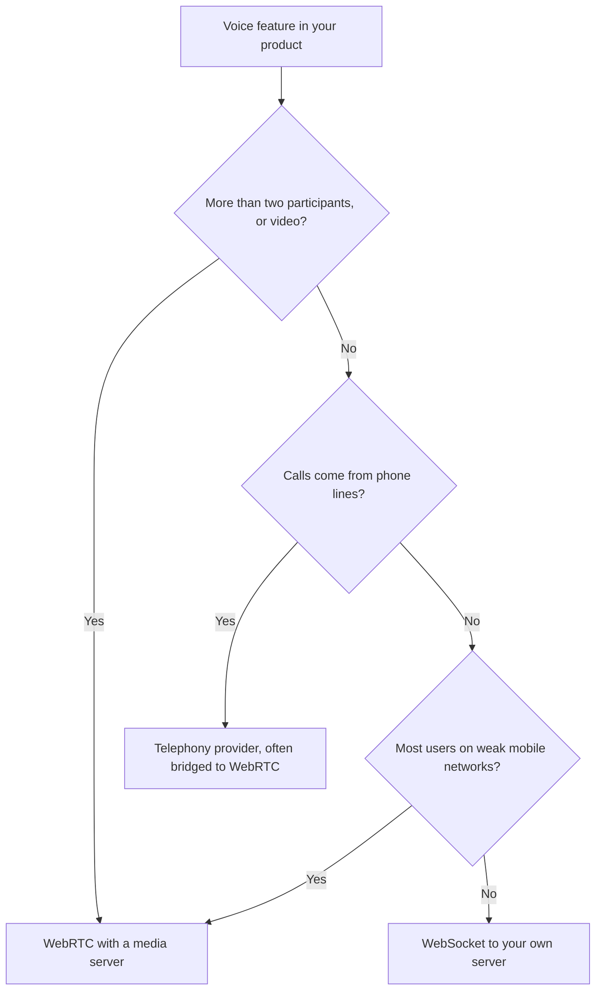

A voice agent inside a web app needs the user's microphone audio streamed to your server and the agent's voice streamed back, over either WebRTC or a WebSocket. WebRTC is the protocol browsers ship for live audio, the one frameworks like Pipecat and LiveKit Agents run on. A WebSocket is the plain two-way connection you may already use for chat or notifications. For one browser talking to one server you control, a WebSocket carries the conversation well and leaves you with no media infrastructure to operate. WebRTC earns its cost when the call has several participants, reaches a phone line, or has to hold up on a weak mobile network. This post goes through what each one costs to run, where the delay before an answer really comes from, and the cases where WebRTC is the right call.

## What WebRTC buys you and what it costs to operate

WebRTC sends audio over UDP, compressed with the Opus codec, and smooths it with a jitter buffer on arrival. When a packet is lost, the receiver skips it and the sound keeps playing. That design comes from video calls, where a missed 20 ms of audio matters less than a frozen stream. WebRTC also finds a path between two machines behind routers and firewalls, a process called NAT traversal.

Finding that path takes a setup step. Before a single audio packet flows, the two sides have to swap a description of their media and a list of network addresses they might be reached on. The WebRTC standard leaves that exchange, the signaling, to you. Most teams write a small signaling server for it, usually over a WebSocket. So most WebRTC voice agents keep a WebSocket in their stack anyway, and add network and media servers on top.

The rest of the bill comes from the infrastructure WebRTC needs:

- STUN servers tell a browser its public address. They cost little, since Google runs free ones and your own are cheap to host.
- TURN servers relay the audio when no direct path exists. Fora Soft, a studio that builds WebRTC products, puts the share of relayed sessions at [15 to 25%](https://www.forasoft.com/learn/video-streaming/articles-streaming/turn-bandwidth-calculator) in consumer apps. For some AI voice agent products, it warns, every session goes through the relay. Relayed audio goes into the relay and out again, so you pay for both legs as bandwidth. You either host [coturn](https://github.com/coturn/coturn) in several regions or pay a provider per gigabyte.
- A media server sits between the browser and the agent in most voice frameworks. LiveKit Agents joins a room on a LiveKit SFU, a server that forwards each participant's media to the others. Pipecat's production transports go through Daily or a self-hosted WebRTC endpoint.
- UDP ports have to stay open on your servers, which fits poorly with containers and load balancers built for HTTP.

OpenAI described the UDP port problem in May 2026, in an engineering post on how it serves voice to ChatGPT. Opening one UDP port per session would have meant tens of thousands of public ports per service, which its engineers found hard to manage safely on Kubernetes. They split the stack into a thin relay that forwards packets and a transceiver that holds all the WebRTC state. They also skipped the SFU, because their traffic is mostly one user talking to one model, and an SFU is built for group calls. OpenAI could afford a custom media layer for hundreds of millions of users. A team adding a voice mode to its product usually rents its media servers instead.

{/* IMAGE regen: api.py image, infographic, 1600x900. Scene: "Two vertical stacks of rounded modular blocks side by side on the dark background, each stack showing what has to run between a browser at the top and a voice agent at the bottom. All labels in English, rendered exactly as written. Heading at the top left in a modern clean bold sans-serif: WHAT EACH TRANSPORT ASKS YOU TO RUN. Left column title: WebRTC. Its blocks from top to bottom, connected by thin sky blue lines: Browser, Signaling server, STUN server, TURN relay (15 to 25% of sessions), Media server or SFU, Open UDP ports, Voice agent. Right column title: WebSocket, drawn brighter with an emerald glow, the focal point. Its blocks from top to bottom, connected by one thick emerald line: Browser, Your Node server with the voice agent. The right column is visibly much shorter, leaving empty dark space below it. Footer in small text at the bottom left: One browser, one server, one call. Flat vector geometric rendering, straight-on frontal view, generous dark margins, all typography perfectly legible."
    Regenerate if the list of WebRTC components or the TURN estimate changes. Last data sync: 2026-10-09. */}


## What a WebSocket audio stream actually covers

A WebSocket is one TCP connection that starts as an HTTP request and stays open in both directions. It carries text and binary messages, so audio chunks and control messages travel on the same connection.

For a browser talking to your own backend, that covers what a voice call needs:

- The connection reaches your server through the load balancers, reverse proxies and corporate firewalls that already let your HTTPS traffic through, with no TURN relay and no address exchange.
- Your server identifies the user from a cookie or a token in the connection parameters, as in the rest of your app, and checks it before the call starts.
- Every message shows up in the Network tab of the browser's DevTools, which is where most transport bugs get found.
- The voice agent runs in the server you already deploy. The Node process that serves your API can accept the connection and run speech to text, the model and text to speech beside it.

A WebSocket has two costs. TCP delivers every byte in order, so a lost packet holds back everything behind it until it is resent. On a clean connection the delay is too short to hear. On a weak cellular link the user hears it as a stutter in the agent's voice. The second cost is bandwidth. Raw 16-bit audio at 16 kHz takes 256 kbit/s, several times what Opus needs. To keep the bandwidth down, send audio only while the user speaks. A voice detector in the browser opens the stream when speech starts and closes it at the end of the turn, so the browser sends nothing while the agent talks or the user thinks.

## Where the milliseconds really go

People often argue for WebRTC on latency. The argument holds for the transport itself, but the transport is a small share of what the user waits for. Seven steps separate the user's last word from the agent's first one.

| Step | What sets its duration | Does the transport change it? |
| --- | --- | --- |
| Waiting for silence | How long the voice detector waits before deciding the turn is over | No |
| Deciding the turn is over | A [turn detection](/blog/end-of-turn-detection-voice-agents) model, if you run one | No |
| Audio reaching the server | Network round trip, with chunks already sent while the user spoke | Slightly, and mostly on lossy networks |
| Transcription | Batch or streaming speech to text | No |
| The model's first sentence | The model, the prompt length, the tools it calls | No |
| The voice's first audio | The text to speech provider | No |
| Audio reaching the browser | Network round trip and the player's buffer | Slightly |

On a healthy connection, a round trip to a server on the same continent takes tens of milliseconds, over TCP or UDP alike. The wait for silence alone usually costs several times that, and so do transcription and the model. You can [measure each step and tune the settings that shorten it](/docs/client/latency). You save more time by switching to a streaming speech to text, or by having the agent speak its first sentence before the answer is complete, than by any change of transport.

The transport starts to matter on a bad network. Packet loss turns into retransmissions on TCP, each one costing at least a round trip. That is the real argument for WebRTC: the call holds up better on a bad link.

{/* IMAGE regen: api.py image, infographic, 1600x900. Scene: "Two horizontal lanes stacked vertically on the dark background, each showing a row of eight small square audio packets numbered 1 to 8 travelling from left to right toward a speaker glyph on the right. All labels in English, rendered exactly as written. Heading at the top left in a modern clean bold sans-serif: ONE LOST PACKET ON A WEAK NETWORK. Top lane, labelled on its left: UDP (WebRTC). Packet 4 is drawn as an empty dashed outline with a small caption under it: lost, skipped. Packets 5 to 8 keep moving evenly. Caption at the right end of the lane: a 20 ms gap, the voice plays on. Bottom lane, labelled on its left: TCP (WebSocket). Packet 4 is drawn returning along a small curved arrow labelled: resent. Packets 5 to 8 are bunched up and waiting behind it. Caption at the right end of the lane: everything waits one round trip, the user hears a stutter. Both lanes use sky blue packets, the speaker glyphs glow emerald. Footer in small text at the bottom left: On a clean connection, both lanes sound the same. Flat vector geometric rendering, straight-on frontal view, generous dark margins, all typography perfectly legible."
    Regenerate if the packet duration in the text changes. Last data sync: 2026-10-09. */}


## When you need WebRTC

WebRTC is the right tool in four situations:

- Calls with more than two participants need a media server to mix or forward the streams, for example when a person, an agent and a colleague all hear each other. LiveKit is an SFU built for that job.
- Calls from the phone network arrive over SIP and RTP, which media servers like LiveKit and providers like Daily or Twilio bridge to WebRTC. A WebSocket server can receive phone audio through a provider's media stream, but the telephony layer still runs at that provider.
- A video agent sends far more data than a voice agent. Viewers barely notice a skipped frame and see a frozen picture at once, so skipping late packets, as WebRTC does over UDP, suits video.
- Users on weak mobile networks, such as field workers, drivers or people calling from trains, lose packets often. For them, a skipped 20 ms of sound is less noticeable than the stutter TCP causes while it resends.

A fifth case is a browser that talks straight to a provider's speech to speech model with no backend in the audio path. OpenAI recommends WebRTC for browser clients of its [Realtime API](/blog/openai-realtime-api-vs-pipeline), with a short-lived key minted by your server. Once your own server sits in the middle, to run tools, keep the transcript or switch providers, you are back to one browser talking to one server.



## How Micdrop streams audio over WebSocket

[Micdrop](/) is an open source TypeScript library for real-time voice conversations with AI agents. It streams each call over a WebSocket. A browser package handles the microphone, the speaker and voice detection. A Node package runs the call on your server, with the speech to text, agent and text to speech providers you pick.

The server is a `MicdropServer` attached to each incoming socket:

```typescript
import { MicdropServer } from '@micdrop/server'
import { OpenaiAgent } from '@micdrop/openai'
import { GladiaSTT } from '@micdrop/gladia'
import { ElevenLabsTTS } from '@micdrop/elevenlabs'
import { WebSocketServer } from 'ws'

const wss = new WebSocketServer({ port: 8081 })

wss.on('connection', (socket) => {
  new MicdropServer(socket, {
    firstMessage: 'How can I help you today?',
    agent: new OpenaiAgent({
      apiKey: process.env.OPENAI_API_KEY,
      systemPrompt: 'You are a helpful assistant',
    }),
    stt: new GladiaSTT({ apiKey: process.env.GLADIA_API_KEY }),
    tts: new ElevenLabsTTS({
      apiKey: process.env.ELEVENLABS_API_KEY,
      voiceId: process.env.ELEVENLABS_VOICE_ID,
    }),
  })
})
```

The browser opens the call with the URL of that server:

```typescript
import { Micdrop } from '@micdrop/web'

await Micdrop.start({
  url: 'wss://example.com/call',
  params: { token: userToken },
  vad: ['volume', 'silero'],
})
```

On that connection, the [Micdrop protocol](/docs/server/protocol) works like this:

- The browser runs a volume detector and the Silero model to tell speech from noise, and only sends audio once someone is speaking.
- While the user talks, it sends 16 kHz PCM chunks every 100 ms. By the time the turn ends, the server already holds everything but the last chunk.
- Control messages share the socket. `StartSpeaking` and `StopSpeaking` frame each turn, and the server answers with transcripts, the agent's messages and the voice as binary chunks.
- The browser buffers 100 ms of the agent's voice before playing it, to absorb the uneven pace at which text to speech providers deliver audio.
- If the user speaks over the agent, the server cancels the answer and the browser stops playing it.
- When the connection drops, the client reconnects on its own and exposes an `isReconnecting` state for your interface.

The same `MicdropServer` handles calls from the [browser client](/docs/client) and the React Native client, and runs inside the [Node server](/docs/server) you already deploy. Products like [Raconte](https://raconte.ai), built by the maintainer of Micdrop, and [Cibli](https://cibli.fr) run their voice calls this way in production.

Micdrop covers calls between one browser and your server, and leaves group calls, video and phone numbers to WebRTC frameworks. If your users call from trains or your agent joins a phone line, [LiveKit Agents](/blog/alternative-to-livekit-agents) or [Pipecat](/blog/alternative-to-pipecat) are the better fit.

<FaqList>
  <FaqItem question="Is WebSocket fast enough for a voice agent?">
    Yes, for a browser talking to your own server on a reasonable connection. A round trip to a server on the same continent takes tens of milliseconds over TCP or UDP alike, which is small next to the wait for silence, transcription, the model and the voice. WebSocket falls behind on networks that lose packets, because TCP resends each lost packet before delivering what follows it.
  </FaqItem>
  <FaqItem question="What is a WebRTC signaling server?">
    A signaling server passes the setup messages two WebRTC peers need before their audio can flow: a description of each side's media and the network addresses each side might be reached on. The WebRTC standard leaves this exchange to each application, which most often runs a small server speaking WebSocket for it. The signaling server carries no audio, yet every call depends on it to start.
  </FaqItem>
  <FaqItem question="What are the alternatives to WebRTC for streaming voice?">
    A WebSocket is the most common alternative for a browser talking to a server, carrying audio as binary messages over one TCP connection. WebTransport, built on HTTP/3, adds unreliable datagrams closer to what UDP offers, though browser support is still uneven. For phone calls, SIP with RTP remains the standard, usually reached through a telephony provider.
  </FaqItem>
  <FaqItem question="Should I use WebRTC with the OpenAI Realtime API?">
    OpenAI recommends WebRTC when the browser connects straight to its Realtime API, and WebSocket when your server holds the connection. If your backend needs to run tools, store the transcript or switch providers, put it in the middle: the browser talks to your server, and your server talks to OpenAI. Micdrop runs the Realtime API that way, through its [realtime option](/docs/server/realtime).
  </FaqItem>
</FaqList>

## Pick the transport your call actually needs

For a voice mode inside a web app, the call has two ends and one of them is yours, so a WebSocket to the server you already deploy carries it. Keep WebRTC for group calls, video, phone lines and users on weak mobile networks, where it pays for its infrastructure. If you go with a WebSocket, you can read [every message Micdrop sends on the wire](/docs/server/protocol) and [run a first voice call in five minutes](/docs/getting-started).
