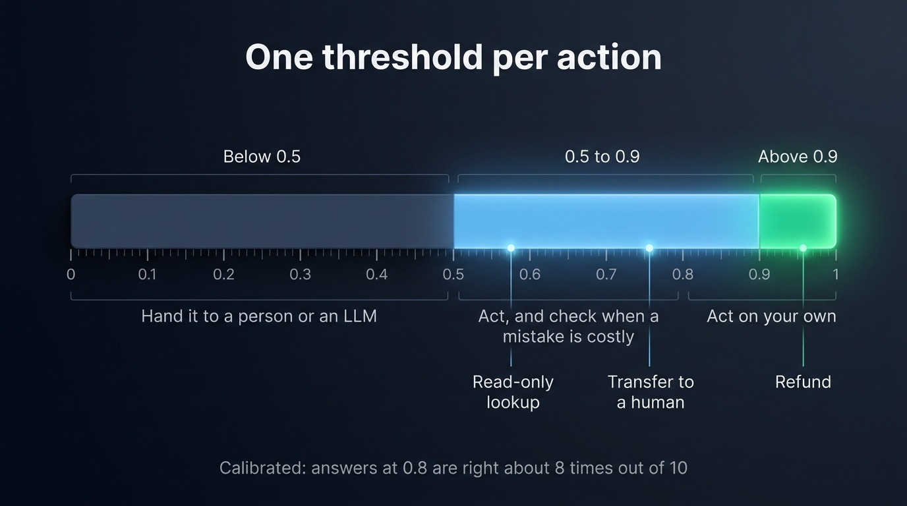
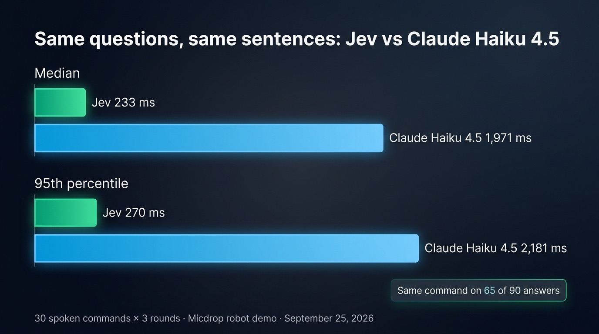
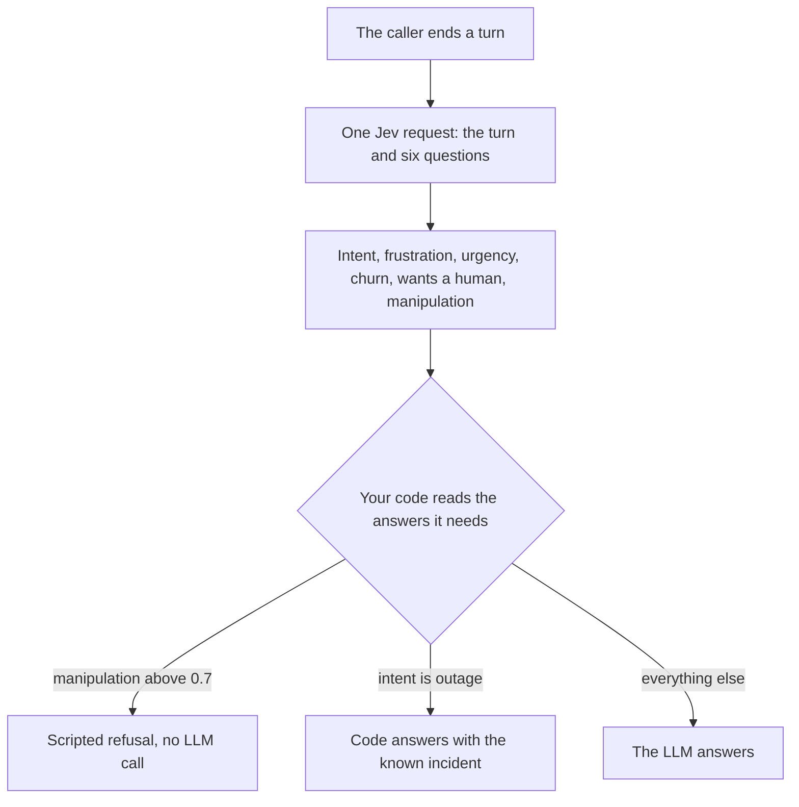

Jev is the first System One model of TypeSafe AI: a model that answers typed questions about a piece of text instead of writing a reply. You send it a state, which is a string or a JSON object, along with your questions. One response answers every question with a label, a score or the probability of a yes, and the probabilities it returns are calibrated. TypeSafe announces 70 to 500 ms per request and bills input tokens only, at $0.042 per million.

This page is for TypeScript developers deciding whether Jev belongs in their stack. It covers what the model answers, where it is faster than an LLM and where it falls short, the fan-out pattern TypeSafe builds around it, and how to call it from Node. The examples come from voice agents, where [Micdrop](/), an open source TypeScript library for real-time voice conversations, uses Jev to decide who answers a caller before the LLM starts.

## Jev returns typed answers instead of writing text

An LLM writes its answer one token at a time. To classify a message with one, you ask for JSON, wait for every token, parse the result and check that the label it wrote is one of yours. Jev returns typed values by construction, since you define the answers it can give. TypeSafe says the model generates all its outputs in a single query rather than token by token.

TypeSafe took the term System One from the psychologist Daniel Kahneman, whose book *Thinking, Fast and Slow* describes System 1 as fast, intuitive judgment and System 2 as slow, deliberate reasoning. An LLM reasoning step by step plays System 2. Jev plays System 1 for software: it recognises what a message is about and says how sure it is. Reasoning, writing and arithmetic stay with an LLM or with your code.

The training differs too. Reinforcement learning from human feedback (RLHF), the method behind ChatGPT, trains a model to write answers people prefer. TypeSafe credits its cofounder Diogo Almeida with co-inventing it. Jev comes out of what TypeSafe calls reinforcement learning for calibrated decisions (RLCD), which trains the model to put the right probability on each possible answer.

Jev reads natural language like an LLM, but it returns only the answers you defined. It writes no text, so TypeSafe says plainly that it cannot power a coding agent such as Claude Code or Cursor. Jev belongs inside the software you write, as one more call your code makes.

## What a System One model answers: a choice, a score or the probability of a yes

Jev takes three question types, which TypeSafe calls primitives:

- A **choice** picks one option out of a list you define. The answer holds the option, the probability of every option and a confidence.
- A **score** places the state on an ordered rubric you describe level by level. The answer is the expected level, so it can land between two of them, like 1.4 on a scale from calm (0) through frustrated (1) to very frustrated (2).
- A **noul** gives the probability that a statement is true, between 0 and 1.

Here is what the answers look like once the SDK has typed them from your questions:

```typescript
answers.intent.choice // 'billing', typed as one of your labels
answers.intent.probabilities // { billing: 0.92, outage: 0.03, cancel: 0.04, other: 0.01 }
answers.intent.confidence // 0.92
answers.frustration.score // 1.4, between "frustrated" and "very frustrated"
answers.wantsHuman.noul // 0.07, the probability of a yes
```

A calibrated probability matches how often the answer turns out right. Across many predictions, the answers Jev gives a probability of 0.8 should be right about 80% of the time, and those at 0.2 about 20% of the time. The rate holds over groups of answers, so a single answer at 0.8 can still be wrong. An LLM asked to rate its own confidence writes a number that sounds plausible, with nothing tying it to how often it is right.

With calibrated probabilities, the answers above a threshold of 0.9 are right at least nine times out of ten, so you can set a different threshold for each action according to what a mistake costs. For a high-stakes action, TypeSafe suggests handing the case to a person below a confidence of 0.5, acting with a check between 0.5 and 0.9, and acting alone above 0.9. A refund calls for those thresholds, while a read-only lookup can go ahead at a lower confidence.

{/* IMAGE regen: api.py image, infographic, 1600x900. Scene: "A horizontal confidence scale from 0 to 1 on a dark background, split into three bands, each band with a short label above and one line of guidance below. Title at the top in modern clean bold sans-serif: "One threshold per action". Band 1, from 0 to 0.5, muted slate: label "Below 0.5", guidance "Hand it to a person or an LLM". Band 2, from 0.5 to 0.9, sky blue: label "0.5 to 0.9", guidance "Act, and check when a mistake is costly". Band 3, from 0.9 to 1, bright emerald: label "Above 0.9", guidance "Act on your own". Under the scale, three small markers with a thin line pointing to their position: "Read-only lookup" near 0.6, "Transfer to a human" near 0.75, "Refund" near 0.95. Footer line centered: "Calibrated: answers at 0.8 are right about 8 times out of 10"." */}


## Where Jev is faster than an LLM, and where it falls short

TypeSafe announces an end-to-end response time of 70 to 500 ms, depending on the length of the state and the number of questions. Two Micdrop demos give figures close to that range:

- In the [robot demo](https://github.com/Godefroy/micdrop/tree/main/examples/demo-robot#race-jev-against-claude), a voice command goes to Jev and to Claude Haiku 4.5, Anthropic's fastest model, at the same moment, with the same questions. Claude answers through structured outputs, which hold it to a JSON schema. On 30 commands over 3 rounds, measured on September 25, 2026 over the public APIs, Jev answered in 233 ms at the median and 270 ms at the 95th percentile. Claude took 1,971 ms and 2,181 ms, about eight times longer. `pnpm measure` in the demo runs the same measurement on your own network.
- In the [support demo](https://github.com/Godefroy/micdrop/tree/main/examples/demo-support), where Jev reads a turn with the one before it and answers six questions, each request took 250 to 700 ms, slightly above the announced range.

Jev also costs little. Input tokens cost $0.042 per million and output is free, so a request of a thousand tokens costs about $0.00004. Classifying all 30 turns of a long call at that size comes to about a tenth of a cent.

{/* IMAGE regen: api.py image, infographic, 1600x900. Scene: "A bar chart on a dark background, read from top to bottom. Title at the top in modern clean bold sans-serif: "Same questions, same sentences: Jev vs Claude Haiku 4.5". Four horizontal bars stacked vertically, all starting from the same left edge, their lengths strictly proportional to their values, the longest bar (2,181 ms) spanning about 80% of the width and the Jev bars about one ninth of it. Group label "Median" above the first two bars: an emerald bar labelled "Jev 233 ms", then a sky blue bar labelled "Claude Haiku 4.5 1,971 ms". Group label "95th percentile" above the next two bars: an emerald bar labelled "Jev 270 ms", then a sky blue bar labelled "Claude Haiku 4.5 2,181 ms". Each label sits just right of the end of its bar. No axis, no gridlines, no tick numbers. In the bottom right corner, a small callout card: "Same command on 65 of 90 answers". Footer line: "30 spoken commands × 3 rounds · Micdrop robot demo · September 25, 2026"."
    Infographic: regenerate if examples/demo-robot/measurements gets a newer file. Last data sync: 2026-09-25. */}


Jev understands some commands less well than Claude. In the robot demo, the two models agreed on the command in 65 of 90 answers. Where they differed, Jev was more often the one that got it wrong: "Bring the ball to the dog" became a drop at the dog with no pickup of the ball, and "Go right four times" became three steps with no direction. Claude made mistakes as well, turning "take the wood to the house" into a drop at the house without picking up the wood. Commands that pack two steps into one verb, like "bring", gave Jev the most trouble. TypeSafe lists these indirect commands among the known weaknesses of the current version.

The other limits come from TypeSafe's documentation:

- English is Jev's main training language. Other languages work with lower accuracy.
- It reads text only. In a voice agent it reads the transcript, so it picks up the caller's tone from the words alone.
- A request holds 64k tokens, and the state plus the longest question must fit in 32k.
- Counting, comparing dates and arithmetic stay unreliable, so TypeSafe advises doing them in code.
- Generating text, extracting a free-form value or reasoning over several steps belong to an LLM.
- Jev is in early access, with rate limits of 1,200 requests per minute and 250,000 tokens per second that TypeSafe says may change.

| | Jev | LLM with structured output |
| --- | --- | --- |
| Output | A label, a score or a probability, typed from your questions | Text constrained to a JSON schema |
| Latency | 70 to 500 ms announced, 233 ms median in the robot demo | 1,971 ms median for Claude Haiku 4.5 in the same demo |
| Price | $0.042 per million input tokens, output free | Input and output tokens, output priced higher |
| Probabilities | Calibrated, one per option | A confidence number the model writes itself, if you ask for one |
| Text generation, extraction, multi-step reasoning | Left to an LLM or to your code | Supported |

## Speculative fan-out sends every question in every request

Speculative fan-out is the pattern TypeSafe recommends around Jev: send every question in one call, including the ones that only matter in some cases, and let your code decide which answers to read. It works because Jev evaluates each question against the state in parallel and in isolation, so an extra question barely changes the response time.

Fan-out also saves money, since TypeSafe bills the state once per request, however many questions it carries. TypeSafe's cookbook asks 13 questions about one Wikipedia article. One batched call came out 12.2 times cheaper than 13 separate calls, and 10 times faster when those calls run one after another, with the same answers.

A voice agent can fan out on every turn. The support demo asks whether the caller is trying to manipulate the assistant, a question whose answer stays near zero on almost every turn. Asking it each time adds little to the bill and catches the rare turn that tries a prompt injection before the LLM sees it.



The robot demo goes further. A sentence like "take the bucket and water the flower" holds two actions, while a choice returns a single label. So the demo asks for a first, a second and a third action on every turn, plus how many actions the sentence holds, and the code reads as many actions as that count says.

## Calling Jev from TypeScript

TypeSafe publishes an official SDK for Node 20 or newer, which infers the type of each answer from your questions:

```bash
npm install @typesafe-ai/sdk
```

```typescript
import { choice, noul, TypeSafeClient } from '@typesafe-ai/sdk'

// Reads TYPESAFE_API_KEY from the environment
const client = new TypeSafeClient()

const response = await client.systemOne({
  state: { message: 'I was charged twice this month, I want my money back.' },
  questions: {
    category: choice('What is this message about?', {
      billing: 'A charge, an invoice, a refund',
      technical: null,
      other: null,
    }),
    refund: noul('Does the user in `message` ask for a refund?'),
  },
})

response.answers.category.choice // 'billing' | 'technical' | 'other'
response.answers.refund.noul // a number between 0 and 1
```

Questions point at the fields of the state by name, between backticks. Keep one fact per question: "is the customer angry and about to leave?" merges two answers into one probability, while two nouls let your code tell them apart.

Micdrop wraps this SDK in the `@micdrop/typesafe` package. Its `TypesafeClassifier` works outside a voice call too: pass a text or any JSON to `classify()`, which resolves with Jev's answers and the time the request took.

```bash
npm install @micdrop/typesafe
```

```typescript
import { noul, score, TypesafeClassifier } from '@micdrop/typesafe'

// Reads TYPESAFE_API_KEY from the environment
const classifier = new TypesafeClassifier({
  questions: {
    urgent: noul('Does this message sound urgent?'),
    frustration: score('How frustrated does this message sound?', [
      'Calm',
      'Annoyed',
      'Angry',
    ]),
  },
})

const classification = await classifier.classify(
  'My internet has been down since yesterday, and nobody answers the phone!'
)

classification?.result.answers.urgent.noul // the probability of a yes
classification?.result.answers.frustration.score // between 0 (calm) and 2 (angry)
classification?.duration // in ms
```

`classify()` resolves with `undefined` when the request fails or gets cancelled, hence the `?.`.

In a call, you pass the classifier to the Micdrop server. At the end of each turn, the server sends Jev an object with two fields: `turn` holds what the caller just said, and `history` holds the turn before it with the reply it got. Questions written for a call therefore point at `turn`, as in "Does the caller in `turn` sound urgent?". The server keeps the answers with the turn, where your agent reads them, and sends them to the browser too when you turn on `sendToClient`:

```typescript
import { MicdropServer } from '@micdrop/server'

new MicdropServer(socket, { stt, agent, tts, classifier })
```

You can also build a support line that [routes each turn of a call five ways with Jev](/blog/jev-voice-agent-typescript), step by step, from the first classification to the page that shows it.

## Where a voice agent uses Jev

A voice agent built on the [classifier of the Micdrop server](/docs/server/classifier) uses Jev in three ways:

- Your agent routes each turn with Jev's answers. With `waitBeforeAnswer` on, the server waits for them, one second at most by default, before your agent decides who answers. A scripted line, a transfer to a human or an answer written by code reaches the caller at once and costs no LLM call. A median of 233 ms fits well within that second.
- Your web interface can show Jev's answers. The server can forward each classification to the browser, so the interface displays the intent or the mood of the caller while they speak.
- For voice commands, Jev can replace the LLM entirely. A server with a speech to text model and a classifier is enough: the [robot](https://github.com/Godefroy/micdrop/tree/main/examples/demo-robot) and [twenty questions](https://github.com/Godefroy/micdrop/tree/main/examples/demo-twenty-questions) demos run that way, without an agent or a synthetic voice.

You can try all three in the [Micdrop demos that run on Jev](/docs/examples#classifier-demos).

## Frequently asked questions

<FaqList>
  <FaqItem question="What is Jev?">
    Jev is the first System One model of TypeSafe AI. It reads a text or a JSON state and answers typed questions about it: a choice among labels, a score on a rubric or the probability of a yes. Every probability it returns is calibrated. It writes no text. TypeSafe announces 70 to 500 ms per request.
  </FaqItem>
  <FaqItem question="Is Jev an LLM?">
    No. Jev reads natural language like an LLM, but it returns only the answers you define, with calibrated probabilities. That makes it a tool for decisions inside software. Chat, writing and code stay with an LLM.
  </FaqItem>
  <FaqItem question="How fast is Jev?">
    TypeSafe announces 70 to 500 ms end to end, depending on the size of the state and the number of questions. In the Micdrop robot demo, on September 25, 2026, Jev answered in 233 ms at the median, against 1,971 ms for Claude Haiku 4.5 on the same questions.
  </FaqItem>
  <FaqItem question="What does a calibrated probability mean?">
    Across many answers, those given a probability of 0.8 turn out right about 80% of the time. The rate holds over groups of predictions, so a single answer can still be wrong. Calibration lets you set a threshold per action according to what a mistake costs.
  </FaqItem>
  <FaqItem question="How much does Jev cost?">
    Jev costs $0.042 per million input tokens, and output tokens are free. A request of a thousand tokens costs about $0.00004.
  </FaqItem>
</FaqList>

## Try Jev on your own calls

Jev is worth adding where your code makes quick, repeated decisions about text, and where an LLM is too slow or too costly for them: routing, triage, guardrails, voice commands. Leave the writing and the multi-step reasoning to the LLM. To try it in a voice agent, [add Jev to a Micdrop server](/docs/ai-integration/provided-integrations/typesafe) with your TypeSafe key, then look up [every question type and pattern Jev supports](https://docs.typesafe.ai).
