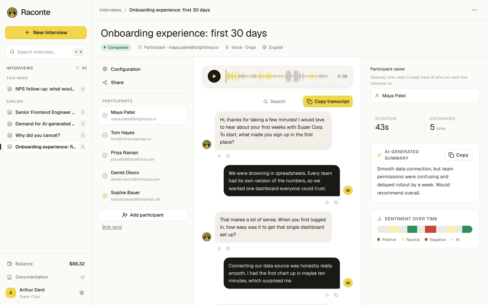

<HomeHeader
  title="Let your users talk to your app"
  description="Micdrop streams your users’ speech to your Node server and plays the answer from the AI models you choose."
  primaryLabel="Start building"
  primaryHref="/docs/getting-started"
  secondaryLabel="View on GitHub"
/>

<HomeMain>

<VideoShowcase
  title="Hear Micdrop hold a conversation"
  intro="Every demo is open source in the repository, ready to run with your own API keys."
>

<VideoCard
  title="A voice assistant on OpenAI Realtime"
  description="One speech to speech model hears and answers, and Micdrop still handles the turns, the interruptions and the transcript."
  videoId="_50KMNZfFDw"
  href="https://github.com/Godefroy/micdrop/tree/main/examples/advanced"
/>

<VideoCard
  title="A voice assistant on French models"
  description="The call speaks French, on French providers from the transcription to the voice."
  videoId="CYvU0B6mMZ8"
  href="https://github.com/Godefroy/micdrop/tree/main/examples/advanced"
/>

<VideoCard
  title="A voice assistant on your own machine"
  description="Transcription, agent and voice run locally, with no API key, and the audio stays on the laptop."
  videoId="iVbsAlBMOSo"
  href="https://github.com/Godefroy/micdrop/tree/main/examples/advanced"
/>

<VideoCard
  title="A robot that obeys your voice"
  description="Two robots hear the same sentence. One reads it with Jev, the other with Claude, and a clock under each shows which one moves first."
  videoId="7GVhmaC7Qgo"
  href="https://github.com/Godefroy/micdrop/tree/main/examples/demo-robot"
/>

<VideoCard
  title="A game that plays a famous person"
  description="Ask yes or no questions out loud to find who the game is playing. It answers in the first person, and Jev reads each question in a few hundred milliseconds."
  videoId="85QmRuGO9qg"
  href="https://github.com/Godefroy/micdrop/tree/main/examples/demo-twenty-questions"
/>

<VideoCard
  title="A word to find by asking questions"
  description="The game thinks of something and answers each question with yes, probably, I don’t know, probably not or no."
  videoId="QBb7TRJNQJ4"
  href="https://github.com/Godefroy/micdrop/tree/main/examples/demo-twenty-questions"
/>

</VideoShowcase>

<TurnSection
  title="Micdrop handles what happens between two sentences"
  intro="A voice agent feels slow or rude when it cuts you off mid-thought, waits too long to answer, or talks over you."
>

<TurnLine slot="lines" who="user" from="2" to="20" text="Can you move my dentist appointment to…" />
<TurnLine slot="lines" who="user" from="25" to="31" text="Thursday?" />
<TurnLine slot="lines" who="tool" from="33" to="43" text="moveAppointment()" />
<TurnLine slot="lines" who="assistant" from="45" to="64" text="Done, it’s now Thursday at 10. Do you want me to…" cut />
<TurnLine slot="lines" who="user" from="62" to="72" text="Make it 11." />
<TurnLine slot="lines" who="assistant" from="77" to="94" text="Sure, Thursday at 11 it is." />

<TurnStep
  at="2"
  title="The browser hears you"
  text="Voice activity detection runs in the browser, which streams the audio to your server while you are still talking."
/>
<TurnStep
  at="22"
  title="The agent waits through a pause"
  text="Turn detection sees that the sentence is unfinished, so the agent waits for you to say the day."
/>
<TurnStep
  at="33"
  title="The agent runs your code"
  text="Before it answers, the agent calls a tool you wrote, which runs in your Node server next to your database."
/>
<TurnStep
  at="45"
  title="The voice starts early"
  text="Text to speech reads the first words of the answer while the model is still writing the rest."
/>
<TurnStep
  at="63"
  title="You can interrupt the assistant"
  text="Playback stops as soon as you talk. Echo cancellation keeps the assistant’s voice out of your microphone."
/>

</TurnSection>

<StackSection
  title="Your app code stays the same whichever models answer"
>

<StackOption
  label="Best of each provider"
  summary="Gladia, OpenAI and ElevenLabs"
  stt="Gladia"
  agent="OpenAI"
  tts="ElevenLabs"
  note="Each stage streams into the next. To swap a provider, you change its line."
  href="/docs/ai-integration"
>

```typescript wrap hangingIndent=2
import { MicdropServer } from '@micdrop/server'
import { GladiaSTT } from '@micdrop/gladia'
import { OpenaiAgent } from '@micdrop/openai'
import { ElevenLabsTTS } from '@micdrop/elevenlabs'

new MicdropServer(socket, {
  stt: new GladiaSTT({ apiKey: GLADIA_KEY }),
  agent: new OpenaiAgent({ apiKey: OPENAI_KEY, systemPrompt }),
  tts: new ElevenLabsTTS({ apiKey: ELEVENLABS_KEY, voiceId }),
})
```

</StackOption>

<StackOption
  label="Speech to speech"
  summary="Gemini Live or the OpenAI Realtime API"
  realtime="Gemini Live"
  note="One model hears the audio and answers in audio. Micdrop still handles the turns, the interruptions and the order of the transcript."
  href="/docs/server/realtime"
>

```typescript wrap hangingIndent=2
import { MicdropServer } from '@micdrop/server'
import { GeminiLive } from '@micdrop/gemini'

new MicdropServer(socket, {
  realtime: new GeminiLive({
    apiKey: GEMINI_KEY,
    systemPrompt,
  }),
})
```

</StackOption>

<StackOption
  label="Made in Europe"
  summary="Gladia, Mistral and Gradium"
  stt="Gladia"
  agent="Mistral"
  tts="Gradium"
  note="Three European providers keep the audio and the conversation inside the EU. They handle French and 90 other languages."
  href="/docs/ai-integration/sovereign-voice-ai"
>

```typescript wrap hangingIndent=2
import { MicdropServer } from '@micdrop/server'
import { GladiaSTT } from '@micdrop/gladia'
import { MistralAgent } from '@micdrop/mistral'
import { GradiumTTS } from '@micdrop/gradium'

new MicdropServer(socket, {
  stt: new GladiaSTT({ apiKey: GLADIA_KEY }),
  agent: new MistralAgent({ apiKey: MISTRAL_KEY, systemPrompt }),
  tts: new GradiumTTS({ apiKey: GRADIUM_KEY, voiceId, region: 'eu' }),
})
```

</StackOption>

<StackOption
  label="On your own machine"
  summary="Whisper, Ollama and Kokoro"
  stt="Whisper"
  agent="Ollama"
  tts="Kokoro"
  server="Your machine"
  note="Whisper and Kokoro run inside your Node process while Ollama runs the agent. The call works offline and needs no API key. The audio stays on your machine."
  href="/docs/ai-integration/local-models"
>

```typescript wrap hangingIndent=2
import { MicdropServer } from '@micdrop/server'
import { WhisperSTT } from '@micdrop/whisper'
import { AiSdkAgent } from '@micdrop/ai-sdk'
import { KokoroTTS } from '@micdrop/kokoro'
import { createOpenAI } from '@ai-sdk/openai'

// Ollama serves the OpenAI protocol on /v1
const ollama = createOpenAI({ baseURL: 'http://localhost:11434/v1', apiKey: 'ollama' })

new MicdropServer(socket, {
  stt: new WhisperSTT({ model: 'base' }),
  agent: new AiSdkAgent({ model: ollama.chat('qwen3:4b-instruct'), systemPrompt }),
  tts: new KokoroTTS({ voice: 'britishFemale' }),
})
```

</StackOption>

</StackSection>

<CompareSection
  title="Micdrop is a library that runs inside your server"
  us="Micdrop"
  platforms="Hosted platforms"
  platformsNote="Vapi, Retell AI"
  frameworks="Agent frameworks"
  frameworksNote="Pipecat, LiveKit Agents"
  linksLabel="Read the detailed comparisons with"
>

<CompareRow
  label="Where the call runs"
  us="In the Node server you already deploy"
  platforms="On the vendor’s servers"
  frameworks="In an agent service next to your app, often behind a WebRTC server"
/>
<CompareRow
  label="Languages"
  us="TypeScript, from the browser and the phone to the server"
  platforms="Any, through a REST API and webhooks"
  frameworks="Python first. LiveKit Agents also has a Node SDK."
/>
<CompareRow
  label="Your agent logic"
  us="A class in your codebase, next to your database and your auth"
  platforms="A public endpoint that the platform calls"
  frameworks="Code in the agent process, apart from your app"
/>
<CompareRow
  label="Cost"
  us="Free under the MIT license. You pay each AI provider directly."
  platforms="A fee per minute on top of the providers, $0.05 on Vapi"
  frameworks="Free and open source. You pay for the servers that carry the audio, or for a cloud plan."
/>
<CompareRow
  label="Phone numbers and dashboard"
  us="You add them yourself. Micdrop covers calls in web and mobile apps."
  platforms="Included, with compliance certifications and an SLA"
  frameworks="Telephony through SIP or Twilio"
/>

<CompareLink slot="links" label="Vapi" href="/blog/alternative-to-vapi" />
<CompareLink slot="links" label="Retell AI" href="/blog/alternative-to-retell-ai" />
<CompareLink slot="links" label="Pipecat" href="/blog/alternative-to-pipecat" />
<CompareLink slot="links" label="LiveKit Agents" href="/blog/alternative-to-livekit-agents" />

</CompareSection>

<ProofSection
  title="Raconte runs its voice interviews on Micdrop"
  text="With Raconte, a team sends a link, an AI interviews each person by voice, and the team gets back transcripts, sentiment and insights."
  detail="Each interview runs on Micdrop in the browser, with Gladia, Mistral, Gradium, OpenAI and ElevenLabs on the server. Raconte and Micdrop have the same author."
  linkLabel="Visit raconte.ai"
  href="https://raconte.ai"
>



</ProofSection>

<CapabilitiesSection
  title="Micdrop also handles the rest of the call"
>

<CapabilityGroup
  title="In the browser and on the phone"
  variant="accent"
>
  <CapabilityLink label="Voice activity detection" href="/docs/client/vad" />
  <CapabilityLink label="Turn detection" href="/docs/client/turn-detection" />
  <CapabilityLink label="Call state" href="/docs/client/call-state" />
  <CapabilityLink label="Live transcript" href="/docs/client/display-conversation-messages" />
  <CapabilityLink label="Microphone and speaker selection" href="/docs/client/devices-management" />
  <CapabilityLink label="Mute" href="/docs/client/mute-unmute-call" />
  <CapabilityLink label="Pause and resume" href="/docs/client/pause-resume-call" />
  <CapabilityLink label="React hooks" href="/docs/client/react-hooks" />
  <CapabilityLink label="Latency settings" href="/docs/client/latency" />
</CapabilityGroup>

<CapabilityGroup
  title="On the server"
  variant="plain"
>
  <CapabilityLink label="Tool calls" href="/docs/server/tools" />
  <CapabilityLink label="Intent classification" href="/docs/server/classifier" />
  <CapabilityLink label="Data extraction" href="/docs/server/extract" />
  <CapabilityLink label="Dictation" href="/docs/server/dictation" />
  <CapabilityLink label="First message" href="/docs/server/first-message" />
  <CapabilityLink label="Automatic hang up" href="/docs/server/auto-end-call" />
  <CapabilityLink label="Authentication and parameters" href="/docs/server/auth-and-parameters" />
  <CapabilityLink label="Noise filtering" href="/docs/server/noise-filtering" />
  <CapabilityLink label="Audio recording" href="/docs/server/recording-audio" />
  <CapabilityLink label="Resumed conversations" href="/docs/server/resume-conversation" />
</CapabilityGroup>

<CapabilityGroup
  title="Any provider, with a fallback"
  description="Micdrop ships integrations for OpenAI, Gemini, Mistral, Gladia, ElevenLabs, Cartesia, Gradium and local models. You can plug any other provider into the same interfaces. When a provider fails, a fallback takes over."
  variant="grid"
>
  <CapabilityLink label="Provided integrations" href="/docs/ai-integration" />
  <CapabilityLink label="Local models" href="/docs/ai-integration/local-models" />
  <CapabilityLink label="Sovereign voice AI" href="/docs/ai-integration/sovereign-voice-ai" />
  <CapabilityLink label="Custom agent" href="/docs/ai-integration/custom-integrations/custom-agent" />
  <CapabilityLink label="Custom speech to text" href="/docs/ai-integration/custom-integrations/custom-stt" />
  <CapabilityLink label="Custom text to speech" href="/docs/ai-integration/custom-integrations/custom-tts" />
  <CapabilityLink label="Agent fallback" href="/docs/ai-integration/fallback-strategies/agent-fallback" />
  <CapabilityLink label="Speech to text fallback" href="/docs/ai-integration/fallback-strategies/stt-fallback" />
  <CapabilityLink label="Text to speech fallback" href="/docs/ai-integration/fallback-strategies/tts-fallback" />
</CapabilityGroup>

</CapabilitiesSection>

<ClosingSection
  before="Just call"
  code="Micdrop.start()"
  after="and your app holds a conversation."
  note="Micdrop is free and open source under the MIT license. Bring your own API keys, or run the models on your own machine."
  ctaLabel="Start building"
  ctaHref="/docs/getting-started"
/>

<SiteJsonLd />

</HomeMain>
